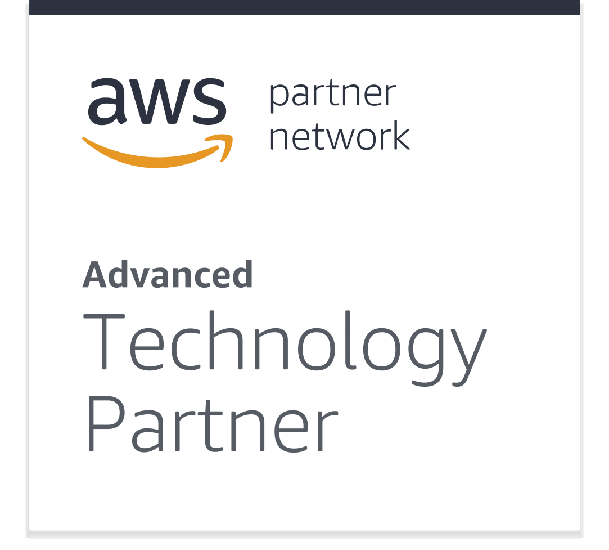

<!-- Links -->
[Reference docs]: ../reference/aws.html
[Example code]: https://github.com/pulumi/examples/tree/master/cloud-js-thumbnailer
[Github @pulumi/aws]: https://github.com/pulumi/pulumi-aws 
[Configure AWS]: ../install/aws.html

Pulumi helps you get your code to the AWS cloud faster than ever before: from high-level multi-cloud libraries, to low-level fine grained control of AWS-specific resources. 

<div class="row">
<div class="col-md-9" markdown="1">

## Pulumi and AWS



Pulumi is an AWS Advanced Technology Partner providing everything you need to get code to the AWS cloud. Pulumi provides a cloud development platform enabling Development and DevOps teams to code, deploy, any cloud app: from serverless functions, to container apps, to data services and infrastructure.

</div>
<div class="col-md-3 find-out-more" markdown="1">

### Find out more

* [Reference docs]
* [Example code]
* [GitHub @pulumi/aws]
* [Configure AWS]

</div>
</div>

## Coding and deploying apps for AWS with Pulumi

Pulumi supports all AWS services available for deployment. The `{{ page.library }}` library enables fine-grained control over chosen resources meaning so your app can be optimized for AWS.  

Example services include:

<div class="row">
<div class="col-md-4" markdown="1">

* [Amazon Athena](../aws/athena.html)
* [Amazon Cloudwatch](../aws/cloudwatch.html)
* [Amazon DynamoDB](../aws/dynamodb.html)

</div>
<div class="col-md-4" markdown="1">

* [Amazon EC2](../aws/ec2.html)
* [Amazon ECR](../aws/ecr.html)
* [Amazon IAM](../aws/iam.html)
* [Amazon Kinesis](../aws/kinesis.html)

</div>
<div class="col-md-4" markdown="1">

* [Amazon S3](../aws/s3.html)
* [Amazon SNS](../aws/sns.html)
* [Amazon SQS](../aws/sqs.html)

</div>
</div>

## Multi-cloud development with `@pulumi\cloud`

For a higher-level abstraction, and greater portability, the [`@pulumi\cloud-aws`](../reference/cloud.html) library provides a set of classes that enable productive development for any cloud. When instantiated for AWS, code is adapted to use the available services in AWS, and the supporting services necessary to deploy them (e.g. IAM roles).

```javascript
var cloud = require("@pulumi/cloud-aws");

// Create RestAPI and Lambda Functions
const myLambda = new cloud.API("nameLambda");

// Create an S3 Bucket
const myBucket = new cloud.Bucket("nameBucket");

// Create container infrastructure using AWS Fargate
const myContainer = new cloud.Task("nameContainer");

// Create container infrastructure using AWS ECS
const myService = new cloud.Service("nameService");

// Create DynamoDB table
const myDatabase = new cloud.Table("nameTable");

// Create AWS Cloudwatch event rule
const myTimer = new cloud.Timer("nameTimer";)
```