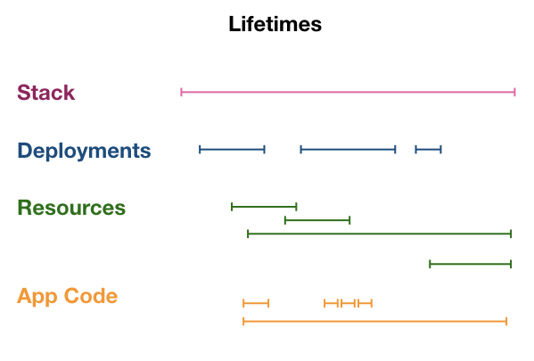

<!-- Convention for the Concepts section: 
- Use Colada to refer to the programming model
- Use "Pulumi Enterprise" is used for the Service+PPC, currently hosted at beta.pulumi.com

To find-and-replace later:
- Replace lowercase "pulumi" with new CLI name
- Replace Pulumi.yaml with new filename
-->

## What is Colada?

<Short, high-level summary of Colada.>

## Programs and config

A Colada program is authored in JavaScript/TypeScript or Python, with more languages supported in the future. The configuration is defined in `Pulumi.yaml`, 

- Tiny AWS+Javascript example

- Link to AWS, Azure, Kubernetes.

A Colada program has configuration, defined in `Pulumi.yaml`, which can be accessed within your code. Link to config.


## Stacks, deployments, and resources

A Colada program is **deployed** to a **stack**. A stack is a target in which programs will run and typically denotes an environment (such as "staging" or "production"). A program becomes a running application by **deploying** it through `pulumi update` [LINK]. A deployment may be previewed before it is executed, via `pulumi preview` [LINK].

A deployment results in the creation, update, or deletion of one or more **resources**. A resource is typically an infrastructure component, such as a virtual machine, network security group, or AWS IAM role. Essentially, a Colada program "runs" through these interconnected cloud resources. 

A Colada program can also define application runtime code in addition to deployment-time code, when it uses the  higher-level `@pulumi/cloud` programming model (LINK). This means that there is a mixing of *phases*, part of the program runs at deployment time, and part at runtime.

It is helpful to consider the lifetimes of the concepts just described. A stack exists for a particular duration, during which time it can have a number of deployments. Deployments create and delete resources, generally with an overlap between creation of a new resource and creation of a new one. The final line in the diagram illustrates the running "application code," which is part of the Colada program, but not the program itself. Application code is either deployed through a mechanism outside of Colada (such as creating a custom Amazon Machine Image) or using  `@pulumi/cloud` components such as `cloud.Service` and `cloud.HttpEndpoint`. 

In particular, a resource like `cloud.HttpEndpoint` is implemented as serverless functions (such as AWS Lambda). So, an individual execution could just be a part of the underlying resource lifetime, such as the Lambda function definition itself.

{:width="500px"}

## The Colada engine

Let's describe what happens when a Colada program is run via `pulumi update`. Your program essentially runs within a language host process which observes the running program, known as the **language host**. The host interacts with the Colada **engine**; this is the part of the CLI that determines which resource changes to make (if any). Any resource changes are then executed via an underlying **provider**, such as [AWS](./aws.html), [Azure](./azure.html), [Kubernetes](./kubernetes.html), and so on. The engine uses a **checkpoint file** to store the last known state of provisioned resources. 

During program execution, whenever there is a resource creation statement (via `new Resource()` in JavaScript or TODO in Python), the resource is registered with the engine. This does not necessarily mean that a new resource should be created, it simply means that the program intends for the resource to exist. Using the last state in the checkpoint file, the engine then determines which requests it should make to the underlying **provider** in order to create, delete, or replace the resource. At the end the program execution, if a particular resource **R** is never registered, the engine will make a delete request to the resource provider. The following diagram illustrates the interaction between these parts of the system.

{:width="500px"}

For instance, suppose we have the following Colada program, which creates one security group and one EC2 instance:

```javascript
let group = new aws.ec2.SecurityGroup("web-secgrp", { /* ... */ });

let size = "t2.micro";

let server = new aws.ec2.Instance("web-server-www", {
    instanceType: size,
    securityGroups: [ group.name ],
    ami: getLinuxAMI(size)
});
```

Now, we run `pulumi stack init mystack`. Since `mystack` is a new stack, the stack checkpoint file is empty. 

Next, we run `pulumi update`. When the program runs to completion, it encounters two statements that create resources, `new aws.ec2.SecurityGroup()` and `new aws.ec2.Instance()`. So, the language host registers the following with the engine: a resource corresponding to `group` and a resource corresponding to `server`, using a naming scheme TODO. (TODO: need to explain how the program name corresponds to a URN that the language host/program and engine both understand.)

The engine consults the checkpoint file, and sees that these two resources do not already exist. So, the engine calls the AWS resource provider, requesting that it create a security group. Once the operation succeeds, this state is written to the checkpoint file, including the value of the security group `name` property. Next, an EC2 instance is created, referencing this same `name` property. So, the resource graph will look like the following:

```
stack mystack
   - aws.ec2.SecurityGroup "web-secgrp"
   - aws.ec2.Instance "web-server-www" size: "t2.micro"
```

Now, suppose that we change the instance size from `t2.micro` to `t2.nano`. This time, the engine will not create another security group, because it exists in the checkpoint file. The engine then makes a "replace" call to the AWS provider. Since changing the instance size requires recreating the EC2 instance, a new instance of size `t2.nano` is created. Once the creation is successful, the original `t2.micro` instance is deleted.

TODO: consider diagrams showing the changes in resource state