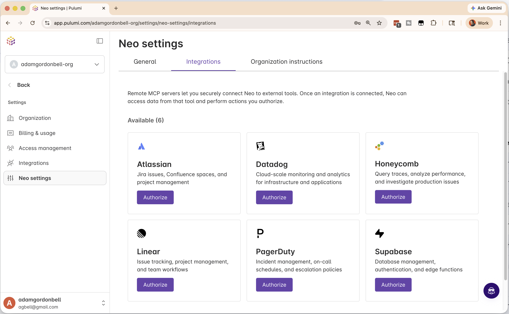
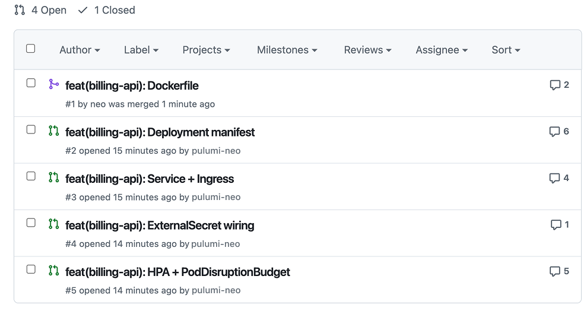
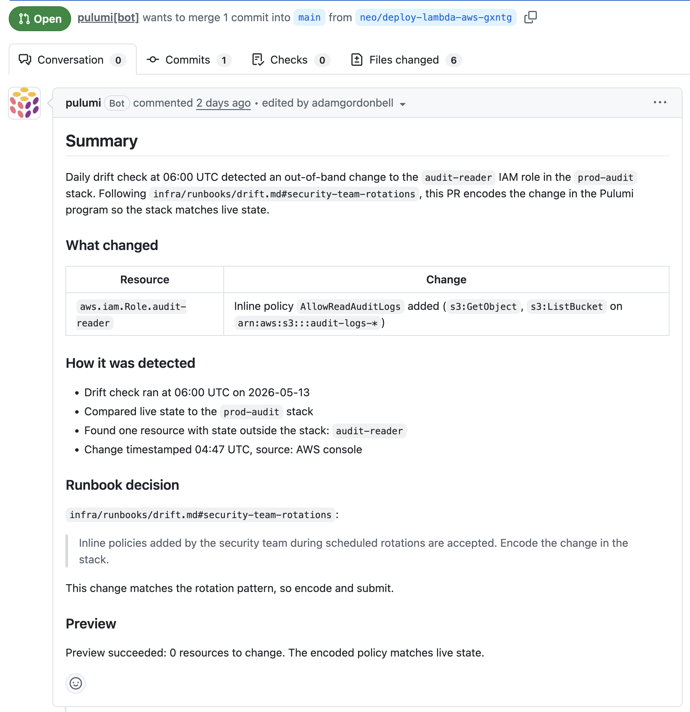

Last fall, after launching [Pulumi Neo](/neo/), we wrote up [10 things you could do with it](/blog/10-things-you-can-do-with-neo/). In the months that followed, as platform teams handed Neo more real work, we watched and listened, shipping a steady stream of features like [plan mode](/blog/neo-plan-mode/), [read-only mode](/blog/neo-read-only-mode/), [AGENTS.md](/blog/pulumi-neo-now-supports-agentsmd/), an [integration catalog](/blog/neo-integration-catalog/), [cross-cloud migration](/blog/neo-migration/), and [task sharing](/blog/neo-task-sharing/). With [today's release](/releases/agentic-infrastructure-era/), Neo extends beyond the Pulumi Cloud console into the Pulumi CLI, GitHub, and Slack.

So here are **10 more** things you can do with Neo.

<!--more-->

## 1. Deploy your app to AWS without writing IaC

*Hand Neo a repo. Neo picks the right services — ECS, AWS Fargate, ALB — writes the Pulumi, and opens a PR.*

The cloud infrastructure part of getting a new service running, especially one in a new language, is always a few hours of boilerplate: a VPC and subnets, an IAM role, security groups, a load balancer, DNS, and a TLS cert.

With Neo, that work collapses into a prompt. Point Neo at a repo and ask:

> Deploy this app to AWS as a publicly accessible service.

[Plan mode](/blog/neo-plan-mode/) comes back with the resources Neo will create, named and sized: ECS running on AWS Fargate, an ALB, and the VPC wiring. Approve, and Neo writes the Pulumi program, runs a preview, and opens a PR. You, the human in the loop, merge it after review.


Neo planning a PR and deploying an app to AWS.



## 2. Diagnose a slow API from metrics, logs, and code

*Slow endpoints live at the seam between runtime metrics and the stack that runs them. Neo reads both and proposes a fix with the metric evidence as the rationale.*

Production incidents often involve multiple tools. When the `checkout` endpoint's p95 latency climbs from 200ms to 1.2s, the metric is in Datadog, but the cause might be somewhere in your AWS account: maybe RDS is out of IOPS, maybe the connection pool is too small, maybe the autoscaler isn't keeping up. Connecting "this metric looks bad" to a recent backend change and then to a one-line fix in your Pulumi program is an exercise in detective work.

Neo's [integration catalog](/blog/neo-integration-catalog/) bridges this gap. With built-in Datadog APM, PagerDuty, and Honeycomb integrations sitting alongside your Pulumi state, Neo can read traces and metrics from the tools your team already uses and take action.

Ask Neo:

> Find the scaling bottleneck on `/checkout` from the last 7 days of metrics and propose a fix.

Neo pulls the metric history, matches the Datadog tag `db.cluster=checkout-rds` to the RDS instance in your `prod-checkout` Pulumi stack, and opens a PR with a Pulumi diff that bumps the storage IOPS and raises the connection-pool ceiling. You review and roll out the fix.


Toggle on the Honeycomb integration so Neo can read traces and metrics alongside your Pulumi stacks.

## 3. Triage a PagerDuty alert from Slack

*A page comes in. You paste it into your on-call channel and tag Neo, and Neo replies with the cross-system view you'd otherwise spend the first 20 minutes assembling.*

On-call triage is often about getting up to speed quickly. You get paged because something is in the red, and you don't know why.

You mention Neo in the on-call Slack channel:

> @neo, what's going on with this alert?

Neo starts querying metrics and traces. With PagerDuty and Datadog in the integration catalog, it correlates the alert with every deploy and stack change tagged with the alert's service in the last hour, and finds the change that lines up:

> Two deploys in the last hour touched services tagged `service:checkout`: `checkout-api@a3f9c2` (12 min ago, app-layer deploy) and Pulumi stack `prod-checkout-rds` (45 min ago, decreased `max_connections` from 200 → 100). p99 latency inflection at 14:03 lines up with the stack change. Likely cause: the connection-pool reduction is starving the API under current load.

You ask a couple of clarifying questions in-thread, then ask Neo to open a rollback PR against the Pulumi stack.


Authorize PagerDuty and Datadog in Neo's settings. Neo can then read alerts in your on-call Slack channel, find the change that correlates, and open a PR when you ask.

## 4. Implement a Linear ticket end-to-end

*Hand Neo a ticket number from Linear, Jira, or GitHub Issues. Neo reads the description and acceptance criteria, plans against your stack, and opens a PR.*

Tickets often pile up not because they're unimportant, but because they're not urgent. Ongoing maintenance quietly accumulates. Bumping a provider version, centralizing secret management, working through small policy violations: each one matters, but none of them ever moves to the top of the queue. Explaining each one to an agent is its own overhead.

The fix is letting Neo read the ticket itself. Connect Linear integration or Jira automation through the integration catalog (GitHub Issues works too), and Neo pulls the ticket the same way an engineer would: title, description, acceptance criteria.

Ask Neo:

> Implement CAD-1234 in our payments stack.

Neo reads the ticket, plans against your existing stack, opens a PR, and drops a comment back on the ticket. The ticket and the PR end up linked, and your backlog shrinks.


Neo running locally in the Pulumi CLI: fielding a Linear issue, analyzing the codebase, and producing a PR that upgrades multiple projects to the latest Pulumi and AWS provider versions.



## 5. Audit and tighten over-privileged IAM roles

*Neo audits each role against what your stack code actually does, and proposes scoped policies that improve your security posture.*

IAM cleanup is the kind of work nobody has the time to prioritize. Production has 40 roles. Half of them started with `s3:*` because nobody had time to scope them, and the cleanup slips quarter to quarter.

Ask Neo:

> Audit IAM permissions across my accounts and propose narrower policies for over-privileged stack-managed roles.

Neo cross-references each role's policy against what the stack code actually calls, and opens a PR per role. The PR body lists the API calls Neo found in the stack code, like `s3:GetObject` on `audit-logs-*` and `s3:PutObject` on `audit-logs-staging`, as the justification for the scoped policy. The evidence sits next to the diff.

If you're unclear about which roles count as in-scope or what your team considers over-privileged, start in [plan mode](/blog/neo-plan-mode/) and agree on that with Neo first.


Neo auditing an over-privileged IAM role and proposing a narrower policy, with the actually-used permissions as evidence.



## 6. Migrate from AWS CDK onto your platform's golden paths

*Neo reads your existing AWS CDK app and lands a PR that swaps AWS's defaults for your team's published components.*

CDK's L2 constructs encode AWS's defaults. `s3.Bucket` with `encryption: BucketEncryption.S3_MANAGED` is a sane choice, but it's AWS's idea of sane, not yours. A platform team that's published its own components to the [Pulumi Private Registry](/docs/idp/concepts/private-registry/) has already decided what *your* bucket defaults look like: encryption with the right KMS key, tagging by cost center.

Ask Neo:

> Migrate the `payments-vpc` CDK stack to Pulumi using our published components.[^6-original]

Neo reads the source CDK app and your registry side by side. It maps each CDK construct to its closest team-published equivalent, clarifying with you where the mapping is ambiguous.

```typescript
// Before (AWS CDK, AWS's defaults)
const bucket = new s3.Bucket(this, "Assets", {
  bucketName: "payments-assets",
  encryption: s3.BucketEncryption.S3_MANAGED,
  versioned: true,
});
```

```typescript
// After (Pulumi, your team's published component)
import * as platform from "@payments/platform";

const bucket = new platform.Bucket("assets", {
    bucketName: "payments-assets",
    classification: "internal",
});
```



## 7. Containerize a service and migrate it to Kubernetes from a runbook

*Write the containerization pattern down once. Every service after that is a prompt away.*

Containerizing an application and moving it to Kubernetes involves several small decisions: which Docker image, what labels go on deployments, how ingress is wired, and how secrets reach the pod. But after a team has moved two or three services, the pattern is set. The decisions get written down in a runbook, and every subsequent migration is mostly the same shape.

Ask Neo:

> Containerize the `billing-api` service and write its Kubernetes manifests, following our K8s migration runbook in Confluence.

Neo reads the source repo and the runbook in Confluence via the [integration catalog](/blog/neo-integration-catalog/) and starts working on your request.

You can save this as a Neo skill that splits the work into multiple PRs — Dockerfile first, ECR config next, Deployment/Service/Ingress manifests after — and link back to each runbook convention for ease of review. The output reflects your conventions: the labels you actually use, the ingress class you've standardized on, and the External Secrets Operator config your team prefers.

You're still the one reviewing the PRs and deciding what the cutover looks like in production. Neo follows your internal standards, so the new service ends up shaped like the last one you migrated.


Neo migrating a VM-based service to Kubernetes step by step, following the team's Confluence runbook.

Once you've delegated something a few times, the next move is to automate it. The remaining three tasks are the kind Neo doesn't need to be asked for. Drift, deps, compliance: they're the operations you put on a schedule.

## 8. Schedule daily configuration drift checks across your cloud infrastructure

*Schedule a daily drift check across your cloud. Wake up to PRs that fix what changed overnight.*

Configuration drift is an ongoing challenge. The security team rotated an IAM role at 04:47 UTC. Someone changed a security group in the AWS console three weeks ago. Left alone, drift turns into security gaps, into compliance issues, and into the kind of "wait, who changed that?" confusion nobody wants to chase down.

Pulumi Cloud is already good at configuration drift detection. Neo takes it a step further.

Ask Neo:

> Every morning at 6 AM, check all production infrastructure for drift and create PRs to fix any issues you find.

From then on, the task runs on its own, and you wake up to a PR per drifted resource. The description spells out what happened (`iam_role.audit-reader` had inline policy `AllowReadAuditLogs` added at 04:47 UTC) and cites the section of `infra/runbooks/drift.md` Neo followed.

Some drift gets encoded into the Pulumi program, like the IAM rotation above. Some gets reverted, like the security group rule added from the console. Some gets ignored entirely, like autoscaler-managed Lambda concurrency reservations the runbook tells Neo to skip. You write the runbook once; Neo follows it every morning to decide what to do.


Neo's morning drift PR. The body names the resource, the change, when it happened, and the section of the runbook Neo followed to decide what to do.



## 9. Schedule weekly upgrades for outdated Lambda runtimes and providers

*Lambda runtimes and container base images age out. Schedule the upgrade pass; review the PRs Neo opens.*

AWS Lambda end-of-life notices come out months ahead. Node 20 stopped receiving updates as an AWS Lambda runtime at the end of April. Python 3.9 reached end-of-support last December. After the deadline, AWS blocks new deploys and eventually stops invoking the function. Each one needs to move to a supported runtime before the cutoff.[^9-original]

Schedule it:

> Every Sunday night at 10 PM, check our Lambda functions for runtimes nearing end-of-support and open PRs to upgrade them.

Neo reads the AWS Lambda runtime deprecation page, matches the end-of-support runtimes against every Lambda function in your stacks, and opens one PR per stack.

If Python 3.9 is reaching end-of-support, the upgrade is to Python 3.12, and `datetime.utcnow()` calls need to move to `datetime.now(datetime.UTC)`. Neo can make all of those replacements in the same PR.

The same task can catch container base images with critical CVEs and bump them too.


Setting up a weekly task in the Scheduled Tasks UI. Once saved, Neo runs the prompt every Sunday night and opens PRs you review on Monday.



## 10. Fix AWS CIS Benchmark failures with daily PRs

*Run the benchmark on a schedule. Wake up to PRs that fix what failed.*

The [CIS AWS Foundations Benchmark](https://docs.aws.amazon.com/securityhub/latest/userguide/cis-aws-foundations-benchmark.html), available through AWS Security Hub, is something every team should be keeping an eye on. The benchmark finds issues like S3 buckets that allow public read access (`S3.1`), root user access keys that shouldn't exist (`IAM.4`), or CloudTrail not being enabled (`CloudTrail.1`). Scanning for these issues is a solved problem, but closing and addressing them is not. They pile up between audits because each one is a code change in a different stack, and nobody owns the cross-stack cleanup.[^10-original]

Schedule the cleanup:

> Every morning, read CIS Benchmark failures from Security Hub. For every failure on an IaC-managed resource, open a PR with the fix.

Neo opens one PR per failure. A bucket failing `S3.1` arrives as a Pulumi diff that adds `blockPublicAccess` to the bucket in your `prod-checkout` stack. The PR body lists the CIS rule number, the resource ID, the diff, and a clean `pulumi preview` against the live infrastructure.

The runbook is where your security team writes down what each control means for your stacks. Block public S3 buckets, except the ones tagged `public-content=true` for CloudFront origins. Don't auto-touch the break-glass IAM roles; page a human instead. Multi-region CloudTrail stays on, no exceptions. Neo reads that file, checks each Security Hub finding against it, and only opens a PR for the ones you've said are safe to fix. The rest get routed or ignored, the way your team already handles them.


A PR raised by Neo to fix a CIS Benchmark failure, with the failing rule, the resource, and the runbook decision laid out in the body.



## Neo: your newest platform engineer

Over the past year, many product teams have stopped treating AI as a request-by-request assistant and started delegating to it outright.[^compostable] Agents open pull requests, investigate issues, and iterate on review feedback.

But platform engineers have held back because a bad infrastructure change doesn't just fail, it can take production down. Coding agents benefit from fast, forgiving feedback loops, but infrastructure recovery is rarely as simple as reverting a commit.

What was missing wasn't the appetite. It was an agent with enough organizational context and [grounding](/blog/grounded-ai-why-neo-knows-your-infrastructure/) to plan reliably, enough guardrails to feel safe and contain mistakes, and enough discipline to keep working without being asked.

The theme across these tasks is clear. A thing platform engineers used to keep in their heads becomes a task you delegate, then becomes work that runs without you. Neo isn't generating infrastructure from a template. It's a teammate who knows your code, your providers, your conventions, your production metrics, and can raise PRs for you to review.

Neo now lives in your terminal, in your pull requests, in your Slack workspace, and in Pulumi Cloud. Pick one of these workflows and [give it a try](/docs/pulumi-cloud/neo/).

[^compostable]: For a concrete example, see [Seven Rules for Building an AI-Native Software Factory](/blog/seven-rules-ai-native-software-factory/): Ewan Dawson, CTO of Compostable AI, runs nineteen client deployments with five engineers, using Pulumi Neo to handle most of the infrastructure work.

[^6-original]: The observant reader will notice Terraform-to-Pulumi was covered [in the original post](/blog/10-things-you-can-do-with-neo/).

[^9-original]: Also covered in the [original post](/blog/10-things-you-can-do-with-neo/). Last year you could ask Neo to do it once. This year you can put it on a schedule.

[^10-original]: Also covered in the [original post](/blog/10-things-you-can-do-with-neo/). Last year Neo could remediate violations on demand. This year Security Hub feeds findings to a scheduled task that knows your runbook's interpretation of each control.
