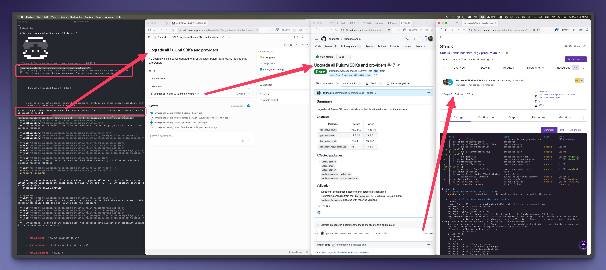
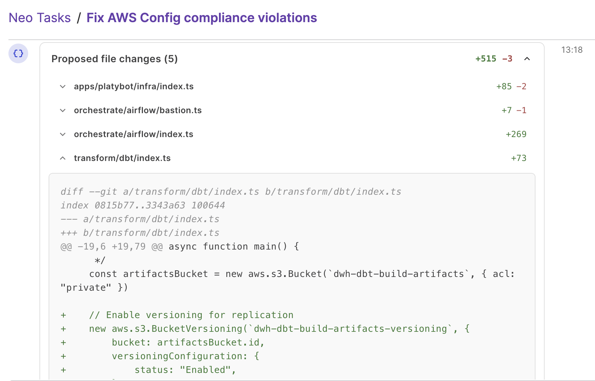
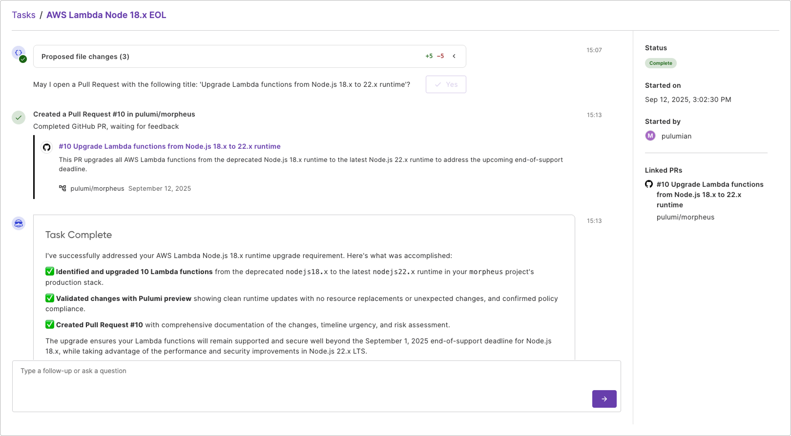

Over the past year, I've watched developers stop treating AI as an assistant and start delegating to it outright. Agents write features, open pull requests, iterate on review feedback. For a lot of teams, that's how software gets shipped now.

Cloud infrastructure, deployments, and operations can be a bit more challenging, though. Coding agents benefit from fast, forgiving feedback loops, but with infrastructure, the stakes are higher. Neo is the infrastructure agent built for that higher bar.

Last fall we wrote up [10 things you could do with Pulumi Neo](/blog/10-things-you-can-do-with-neo/). Since then, Neo has shipped a lot: [AGENTS.md](/blog/pulumi-neo-now-supports-agentsmd/), [plan mode](/blog/neo-plan-mode/), [read-only mode](/blog/neo-read-only-mode/), an [integration catalog](/blog/neo-integration-catalog/), [cross-cloud migration](/blog/neo-migration/), and [task sharing](/blog/neo-task-sharing/).

So here are ten more things you can do with Neo.

<!--more-->

## 1. Deploy your app to AWS without writing IaC

*Hand Neo a repo and a target cloud. Neo picks the right services, wires the networking, runs the deployment, and gives you the URL.*

The cloud infrastructure part of getting a new service running, especially one in a new language, is always a few hours of boilerplate: a VPC and subnets, an IAM role, security groups, a load balancer, DNS and a TLS cert.

With Neo, it collapses to a prompt. Point Neo at a repo with a Dockerfile and ask: *"Deploy this app to AWS as a public service"*. Plan Mode comes back with the resources Neo will create — ECS Fargate, an ALB, the VPC wiring — named and sized. Approve, and Neo writes the Pulumi program, runs a preview, and opens a PR. You merge after review.


Neo deploying an app to AWS — prompt in the Console, Plan Mode shows the resources, PR opens, public URL revealed.



## 2. Burn down the ticket backlog

*Hand Neo a ticket number from Linear, Jira, or GitHub Issues. Neo reads the description and acceptance criteria, plans against your stack, and opens a PR.*

<!-- TODO: validate that GitHub Issues works end-to-end via the integration catalog. As of 2026-05-07: GitHub MCP is in the PRFAQ 13-MCP list but not yet on the public /docs/ai/integrations/ page. Linear + Jira are both publicly documented. If GitHub Issues isn't shipping by May 19, drop it from the value-prop and the body sentence. -->

Sometimes platform or infrastructure tickets pile up not because they're not important, but because they're not urgent. Ongoing maintenance is important work, but it can get away from even the most diligent team. Bumping provider versions, centralizing secret management, working through small policy violations, these all need to get done, but each one never a priority. And the overhead of even explaining a small issue to an agent can be a barrier.

The fix is just letting Neo read the ticket itself. With Linear, Jira, and GitHub Issues connected through the [integration catalog](/blog/neo-integration-catalog/), Neo pulls the ticket the same way an engineer would — grabbing the title, the description, and the acceptance criteria. Just ask Neo: *"Hey, implement CAD-1234 in our payments stack"*. Neo reads the ticket, plans against your existing stack, opens a PR, and drops a comment back on the ticket. The ticket and the PR end up linked, and your backlog of small tickets just got smaller.

<!-- TODO: Image for this -->

Neo pulls a ticket from Linear, Jira, or GitHub Issues, plans against your stack, and opens a PR.

## 3. Diagnose a slow API from metrics, logs, and code

*Slow endpoints live at the seam between runtime metrics and the stack that runs them. Neo reads both, and proposes a fix with the metric evidence as the rationale.*

Production performance debugging can be challenging. When the `/checkout` API's p95 climbs from 200ms to 1.2s, the metric is in Datadog, but the cause probably relates to how AWS is set up — maybe RDS is out of IOPS, maybe the connection pool is too small, maybe the autoscaler isn't keeping up. The link from "this metric looks bad" to "here's what my infrastructure looks like" to "I need to change the connection-pool setting in this Pulumi program" is the jump you have to make, all while juggling tabs.

The integration catalog reaches further than Linear. Datadog and Honeycomb sit alongside it, and Neo reads runtime metrics the same way it read the ticket. Ask Neo: *"Find the scaling bottleneck on /checkout from the last 7 days of metrics and propose a fix"*. Neo pulls the metric history, matches the Datadog tag `db.cluster=checkout-rds` to the RDS instance in your `prod-checkout` Pulumi stack, and opens a PR with a Pulumi diff: bump the storage IOPS, raise the connection-pool ceiling. The PR includes a link back to the metric that flagged the change, so the reviewer can verify the rationale.


Toggle on the Honeycomb integration so Neo can read traces and metrics alongside your Pulumi stacks.

## 4. Triage a PagerDuty alert from Slack

*A page comes in. You paste it into your on-call channel and tag Neo, and Neo replies with the cross-system view you'd otherwise spend the first 20 minutes assembling.*

<!-- TODO: Rule 4 prose needs the same specificity injection that fixed Rule 3. Sam-persona notes (2026-05-12):
  - "Neo can correlate an alert with recent deploys and runtime metrics" → name the mechanism (service tag match, timestamp window) — Sam said "if it's just 'deploy happened 20min before page,' I already have that in the PagerDuty UI"
  - "the deploy it suspects and a proposed rollback PR" → name which layer the rollback hits (app deploy, Pulumi stack, config) — confident PR pointed at the wrong layer is worse than no PR
  - "Neo now lives in Slack." → cut as filler
  - Target shape (from Sam's draft of what he'd want):
    PagerDuty fires `api-p99-latency`. Neo replies in-thread: "Two deploys in the last hour touched services tagged `service:checkout` — `checkout-api@a3f9c2` (12min ago) and Pulumi stack `prod-checkout-rds` (45min ago, increased `max_connections` from 200→100). p99 inflection at 14:03 lines up with the stack change. Draft rollback PR: [link]."
-->

On-call triage is mostly catching up. The dashboard's been red for three hours, and you haven't seen yesterday's deploy.

Neo now lives in Slack. With PagerDuty added to the catalog, Neo can correlate an alert with recent deploys and runtime metrics. When a page comes in, paste it into your on-call channel and mention `@neo`: *"@neo what's going on with this alert?"*. Neo replies in-thread with the deploy it suspects and a proposed rollback PR for you to review.


Authorize PagerDuty (and Datadog or Honeycomb) in Neo's settings — this enables Neo to read alerts in your Slack on-call channel, line them up against recent deploys, and propose a rollback PR.

## 5. Tighten over-privileged IAM roles

*Neo audits each role against what your stack code actually does, and proposes scoped policies that preserve what runs.*

IAM cleanup is the kind of work nobody has a day to pay down. Production has 40 roles. Half of them started with `s3:*` because nobody had time to scope them on day one, and the audit slips quarter to quarter.

Ask Neo: *"Audit IAM permissions across my accounts and propose narrower policies for over-privileged stack-managed roles"*. Neo cross-references each role's policy against what the stack code actually calls, and opens a PR per role. The PR body lists the API calls Neo found in the stack code — `s3:GetObject` on `audit-logs-*`, `s3:PutObject` on `audit-logs-staging` — as the justification for the scoped policy, so you can see the evidence next to the diff.

IAM audits are exactly the kind of task that benefits from [Plan Mode](/blog/neo-plan-mode/): the interesting upfront decision isn't "approve each diff," it's which roles count as in-scope and what your team considers over-privileged. Agree on that with Neo first, then let it run.


Neo auditing an over-privileged IAM role and proposing a narrower policy, with the actually-used permissions as evidence.

## 6. Migrate from CDK or Terraform to Pulumi

*Neo reads your existing IaC, writes equivalent Pulumi, and lands a PR whose `pulumi preview` shows zero infrastructure changes.*

The mechanical part of a Terraform-to-Pulumi migration isn't hard. The calendar is. There are dozens of small differences to work through: resource shapes, default values, naming conventions. And you can't validate the result until you run it.

Ask Neo: *"Migrate this Terraform stack to Pulumi without changing what's deployed"*. Neo reads the source IaC and opens a PR with the equivalent Pulumi program side by side. The verification is built in: a clean `pulumi preview` against the live stack, showing zero changes to the resources that already exist.

A migration like this won't finish in one sitting. Neo runs across sessions, and when you tag in a teammate, [task sharing](/blog/neo-task-sharing/) hands them the running task with full context: the source IaC Neo has read and the resources it has already converted. They pick up where the previous session left off, not at the prompt.

```hcl
# Before (Terraform)
resource "aws_db_instance" "main" {
  identifier           = "production"
  instance_class       = "db.r6i.large"
  parameter_group_name = aws_db_parameter_group.tuned.name
}
```

```typescript
// After (Pulumi)
const main = new aws.rds.Instance("main", {
    identifier: "production",
    instanceClass: "db.r6i.large",
    parameterGroupName: tuned.name,
});
```



## 7. Modernize a VM-based app to run on Kubernetes

*Neo writes the Dockerfile and Kubernetes manifests for an existing service, matching the conventions your platform team has already written down.*

Most platform teams have a runbook for how new apps should run on their Kubernetes — the labels you tag on Deployments, the ingress class you've standardized on, the External Secrets pattern. Most app teams haven't read it. So when a VM-based service finally gets queued up to move, half the work is rediscovering the conventions and the other half is writing manifests that match.

Ask Neo: *"Containerize the `billing-api` service and write its Kubernetes manifests, following our K8s migration runbook"*. Neo reads the source repo, the Pulumi stack that defines the VM, and the K8s runbook in Confluence via the [integration catalog](/blog/neo-integration-catalog/). The output reflects your conventions: the labels you actually use, the ingress class you've standardized on, the External Secrets Operator config your team prefers.

The work shows up as a series of small PRs rather than one giant migration PR. Dockerfile first. ECR config next. Deployment, Service, and Ingress manifests after that. Each PR links the section of the runbook Neo followed, so the reviewer can see whose conventions Neo matched. The cutover itself is still yours to run — but the artifacts that go through it match your standards instead of inventing new ones.

<!-- TODO: screenshot — Neo's plan-mode panel showing the lift-and-shift step list, with Confluence runbook reference in context panel. Capture: launch week. Console fallback acceptable if Neo-in-GitHub isn't ready. -->

PLACEHOLDER — final asset will be a screenshot of Neo's plan-mode panel showing the VM-to-K8s step list (Dockerfile → ECR → manifests → cutover), with the team's Confluence runbook visible in the context panel.

Once you've delegated something a few times, the next move is to stop initiating it. The remaining three aren't tasks Neo waits to be asked for. Drift, deps, compliance: they're operations you put on a schedule.

## 8. Schedule daily drift checks across your cloud infrastructure

*Schedule a fleet-wide drift check. Wake up to PRs that fix what changed overnight.*

The security team rotated an IAM role at 04:47 UTC. A patch script touched a Postgres parameter group on Saturday. Someone changed a security group from the AWS console three weeks ago — and you only just noticed.

Set Neo on a schedule: *"Every morning at 6 AM, check all production infrastructure for drift and create PRs to fix any issues you find."* From then on, the task runs on its own, and you wake up to a PR per drifted resource. The PR description spells out what happened — `iam_role.audit-reader` had inline policy `AllowReadAuditLogs` added at 04:47 UTC — and cites the section of `infra/runbooks/drift.md` Neo followed. The runbook says rotations from the security team are accepted, so the PR encodes the new policy in the Pulumi stack: a four-line diff.

Some drift gets encoded into the stack — the IAM rotation above is one of those. Some gets reverted: a security group rule added from the console gets undone by `pulumi up` against the existing stack. Some gets ignored entirely, like autoscaler-managed Lambda concurrency reservations the runbook tells Neo to skip. Your team writes the runbook once; Neo follows it every morning.

<!-- TODO: VIDEO ~30s — full Operate cycle: schedule the task, time-elapse to morning, PR opens with runbook link, review and merge. Capture blocked on Adam confirming Scheduled Tasks dogfood access. -->

PLACEHOLDER — final asset will be a ~30s video of the full Operate cycle: schedule the drift-check task, time-elapse to morning, PR opens with runbook link, review and merge. Capture blocked on Scheduled Tasks dogfood access.



## 9. Schedule weekly upgrades for outdated providers and runtimes

*Provider packages, language SDKs, and runtime versions all fall behind. Schedule the upgrade pass; review the PRs Neo opens.*

AWS Lambda end-of-life notices come out months ahead. Node 20 stopped receiving runtime updates at the end of April. Python 3.9 ended last December. After the deadline, AWS blocks new deploys and eventually stops invoking the function. Every Lambda pinned to a dying runtime is something you owe yourself before the cutoff.

Schedule the sweep: *"Every Sunday night at 10 PM, check our Lambdas for runtimes nearing end-of-support and open PRs to upgrade them."* Neo reads the AWS Lambda runtime deprecation page, matches the dying runtimes against every Lambda in your stacks, and opens one PR per stack. The PR body lists the functions touched (`payments-webhook`, `email-dispatch`, `image-resizer`), the runtime diff (`python3.9` → `python3.12`), any deprecated calls the new runtime drops — Neo found `datetime.utcnow()` in `payments-webhook` and applied the replacement — and a clean `pulumi preview` against the live functions.

The same sweep catches provider packages and language SDKs falling behind. Pure version bumps with no code changes fly through as one-line diffs. Bumps that touch application code wait for you on Monday.


Neo opening a runtime upgrade PR — same shape as the scheduled dependency-sweep flow.

## 10. Fix CIS Benchmark failures with daily PRs

*Run the Benchmark on a schedule. Wake up to PRs that fix what failed.*

Most AWS shops already have AWS Security Hub turned on with the CIS AWS Foundations Benchmark standard enabled. Every morning, the dashboard fills up with findings: `S3.1 S3 buckets should prohibit public read access`, `IAM.4 IAM root user access keys should not exist`, `CloudTrail.1 CloudTrail should be enabled`. The scan is solved. Closing the findings is not — they pile up between audits because each one is a code change in a different stack and nobody owns the cross-stack sweep.

Schedule the cleanup: *"Every morning, read CIS Benchmark failures from Security Hub. For every failure on an IaC-managed resource, open a PR with the fix."* Neo opens one PR per failure. A bucket failing `S3.1` arrives as a Pulumi diff that adds `blockPublicAccess` to the bucket in your `prod-checkout` stack. The PR body lists the CIS rule number, the resource ID, the diff, and a clean `pulumi preview` against the live infrastructure.

Some failures get encoded into the stack — public-access blocks are one of those. Some get reverted: an IAM role someone widened from the console gets undone by `pulumi up` against the existing stack. Some get ignored by runbook policy — a CloudFront origin bucket that's intentionally readable. The runbook your security team maintains tells Neo which is which; Neo follows it every morning.

<!-- TODO: screenshot — compliance scan task with violation report + accompanying PR, with policy doc reference visible. Capture blocked on Adam confirming Scheduled Tasks dogfood access. -->

PLACEHOLDER — final asset will be a screenshot of the scheduled compliance scan: violation report grouped by policy, with the accompanying PRs and the source policy doc visible. Capture blocked on Scheduled Tasks dogfood access.



## Your newest platform engineer

Across these ten, I see the same arc: a thing platform engineers used to keep in their heads becomes a task you delegate, then becomes work that runs without you. The first seven start in your hands; the last three start on a schedule. Neo isn't generating infrastructure from a template. It's a teammate that knows your code, your providers, your conventions, and your runtime, and writes Pulumi against all of them.

Neo lives in your terminal, in your pull requests, in your team channel, alongside the web console you already use. Pick the surface that fits the work. The governance is the same regardless: every change goes through a PR, your branch protection rules apply, your audit trail is one trail.

Start in Review, where Neo asks before every step. Move to Balanced once you trust the pattern. Land on Auto for the work you've delegated a hundred times. Same governance throughout, different amount of you in the loop.

### And you don't have to use Neo's surfaces at all

The Pulumi CLI now exposes infrastructure operations to any agent: Claude Code, Cursor, or an in-house agent your team built. They all get the same Plan Mode, catalog, and PR-shaped output. The agent on your screen doesn't have to be Neo. The control layer underneath is the same.

<!-- TODO: VIDEO (existing, Adam to locate). Claude Code session calling Pulumi MCP, which hands the work to Neo, which deploys to AWS. Caption: "Claude Code calling Pulumi MCP, which hands the work to Neo. Neo plans, Plan Mode reviews, the PR opens. Same pipeline." -->

PLACEHOLDER — final asset is an existing video (Adam to locate): Claude Code session calling Pulumi MCP, which hands the work to Neo, which deploys to AWS. Same Plan Mode, same PR, different agent on the screen.

[Get started with Pulumi Neo](/docs/pulumi-cloud/neo/). Pick one of these workflows. Start in Plan Mode. Graduate to Auto when you trust it.
