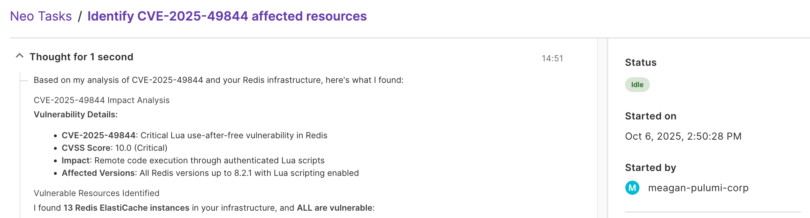

Since launching [Pulumi Neo](/blog/pulumi-neo/) two weeks ago, we've seen platform teams discover creative ways to put their newest AI teammate to work. We have also been using Neo internally for a handful of use cases. Neo shifts the conversation from "what could AI do for infrastructure?" to "what can I actually accomplish with Neo today?"

The answer is quite a bit. Here are 10 concrete workflows that platform teams can use Neo for right now, each one designed to save hours of manual work while keeping humans in the driver seat.

<!--more-->

## 1. Explain infrastructure in plain English

Neo answers questions about your infrastructure instantly, turning complex resource relationships into conversational insights (and diagrams!).

No more digging through AWS consoles or parsing state files to understand what you have deployed. Neo speaks your language about your infrastructure. Ask questions like *"What databases do we have?"*, *"Which S3 buckets aren't encrypted?"*, or *"Show me all resources in us-east-1"* and get immediate, accurate answers.

## 2. Generate infrastructure code from natural language

Neo turns plain English descriptions into production-ready Pulumi code, eliminating the blank-page problem that slows down new projects.

Instead of starting from scratch or hunting through documentation, describe what you need and Neo generates the complete infrastructure. Ask Neo: *"Create a serverless API with PostgreSQL database and Redis cache on AWS"* and it produces fully configured resources with proper networking, security groups, and IAM policies.


## 3. Assist with Terraform to Pulumi migration

Neo analyzes existing Terraform code and state to generate the equivalent Pulumi program, accelerating migration without starting from scratch.

Migrating from Terraform to Pulumi traditionally means rewriting everything. Neo understands both languages and can convert HCL to TypeScript, Python, or Go while preserving your infrastructure patterns. You can also use the Terraform state file. Ask Neo: *"Analyze the provided terraform state. Based on it, generate a python pulumi program that imports the resources without requiring updates."* and it generates equivalent code with proper typing and best practices.

Using this prompt with a Terraform state file containing EC2 instances and supporting resources, Neo generated a complete Pulumi program that imported everything without requiring updates:


## 4. Automate CI/CD pipeline generation

Neo creates complete GitHub Actions workflows configured specifically for Pulumi deployments, with proper preview stages.

Setting up CI/CD for infrastructure projects usually involves copying workflows from other repos and adapting them. Neo generates purpose-built pipelines that understand your stack structure and deployment patterns. Ask Neo: *"Create a GitHub Actions pipeline for this Pulumi project with preview and production stages"* and it produces workflows with proper secrets management, approval gates, and deployment strategies.

Here is what Neo gives us using that prompt on a very basic Pulumi project:

```yaml
name: Simple Pulumi Deploy

on:
  push:
    branches: [main]
  workflow_dispatch:

env:
  PULUMI_ACCESS_TOKEN: ${{ secrets.PULUMI_ACCESS_TOKEN }}
  AWS_ACCESS_KEY_ID: ${{ secrets.AWS_ACCESS_KEY_ID }}
  AWS_SECRET_ACCESS_KEY: ${{ secrets.AWS_SECRET_ACCESS_KEY }}

jobs:
  deploy:
    runs-on: ubuntu-latest
    steps:
      - name: Checkout code
        uses: actions/checkout@v4

      - name: Install Pulumi
        uses: pulumi/actions@v4
        with:
          pulumi-version: latest

      - name: Configure AWS credentials
        uses: aws-actions/configure-aws-credentials@v4
        with:
          aws-access-key-id: ${{ secrets.AWS_ACCESS_KEY_ID }}
          aws-secret-access-key: ${{ secrets.AWS_SECRET_ACCESS_KEY }}
          aws-region: us-west-2

      - name: Deploy infrastructure
        run: |
          pulumi stack select production
          pulumi up --yes
        working-directory: ./infrastructure
```

## 5. Identify inefficient infrastructure patterns

Neo analyzes your infrastructure and spots patterns that create unnecessary management overhead, helping you consolidate and optimize.

When you have 10 identical EC2 instances that should be an auto-scaling group, or multiple Lambda functions doing the same job, Neo spots these patterns. Ask Neo: *"Analyze our infrastructure for inefficient patterns"* and it can identify consolidation opportunities.

**Example analysis:**

```text
Neo identified these optimization opportunities:

1. Duplicate EC2 Instances (High Priority)
   • Found 8 identical t3.medium instances running the same application
   • Recommendation: Consolidate into an Auto Scaling Group
   • Benefits: Simplified management, automatic scaling, reduced configuration drift

2. Scattered Lambda Functions (Medium Priority)  
   • Found 12 Lambda functions with identical runtime and dependencies
   • Recommendation: Combine into a single function with routing logic
   • Benefits: Reduced cold starts, simplified monitoring, easier updates

3. Redundant Security Groups (Low Priority)
   • Found 15 security groups with identical rules
   • Recommendation: Create shared security groups for common patterns
   • Benefits: Easier rule management, reduced complexity
```

## 6. Upgrade EKS/Kubernetes clusters

Neo manages Kubernetes version upgrades across multiple clusters, planning upgrade paths and validating compatibility.

Kubernetes upgrades are complex, especially across multiple clusters with different workloads. Neo analyzes your cluster configurations, identifies upgrade blockers, and creates systematic upgrade plans. Ask Neo: *"Plan an upgrade path for our EKS clusters from 1.27 to 1.28"* and it maps dependencies, checks add-on compatibility, and sequences the upgrades.

## 7. Respond to security vulnerabilities

When CVEs are announced, Neo can help security teams move at machine speed addressing them.

Security vulnerabilities require immediate response across your entire infrastructure. Neo understands your resource inventory and can quickly identify what's affected by new CVEs. When you ask Neo: *"Identify all resources affected by CVE-2025-XXXXX and create remediation PRs"*, it scans your infrastructure, maps vulnerable components, and generates targeted fixes.



## 8. Automatically remediate AWS config violations

Neo detects non-compliant resources and generates pull requests to fix them, turning compliance headaches into automated workflows.

When your AWS Config rules flag violations—unencrypted EBS volumes, overly permissive security groups, or missing resource tags—Neo identifies the issues and proposes specific fixes. Ask Neo: *"Fix all AWS Config violations in our production account"* and it analyzes your compliance dashboard, identifies the problematic resources, and creates PRs with the exact changes needed.


## 9. Update Lambda runtimes across multiple accounts

Neo identifies outdated Lambda runtimes, stages updates, and manages the rollout across your entire AWS organization.

When AWS announces runtime deprecations, Neo scans all your accounts, identifies functions running outdated versions, and creates a systematic upgrade plan. Ask Neo: *"Upgrade all Lambda functions to Python 3.11"* and it maps your functions, checks compatibility, and generates account-by-account PRs.

**Before (outdated runtime):**

```typescript
// Create the process email Lambda function
const lambdaFunction = new aws.lambda.Function("emailProcessor", {
    runtime: aws.lambda.Runtime.Python3d8,  // ❌ Deprecated
    code: new pulumi.asset.AssetArchive({
        ".": new pulumi.asset.FileArchive("./lambda"),
    }),
    // ... other configuration
});
```

**After (Neo's upgrade):**

```typescript
// Create the process email Lambda function
const lambdaFunction = new aws.lambda.Function("emailProcessor", {
    runtime: aws.lambda.Runtime.Python3d11,  // ✅ Upgraded
    code: new pulumi.asset.AssetArchive({
        ".": new pulumi.asset.FileArchive("./lambda"),
    }),
    // ... other configuration
});
```

## 10. Enforce multi-account policy compliance

Neo applies organizational policies across your entire AWS Organizations structure, ensuring governance at scale without creating bottlenecks.

Large organizations struggle to maintain consistent policies across dozens of AWS accounts. Neo understands your organizational structure and can enforce tagging standards, encryption requirements, and security policies uniformly. Ask Neo: *"Ensure all accounts follow our tagging and encryption policies"* and it audits compliance across your organization.

## Your newest platform engineer

These workflows represent just the beginning of what's possible when an AI agent deeply understands infrastructure context.

The outcome is simple: spend less time on operational toil and more time on the architecture and policies that make your organizations successful.

[Get started with Neo](/docs/pulumi-cloud/neo/) and discover what becomes possible when AI truly understands infrastructure.

The future of platform engineering isn't about choosing between speed and safety. It's about having tools that help you with both simultaneously.
