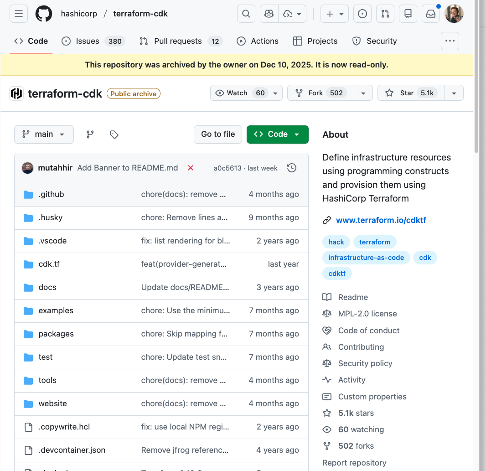

<span style="width: 40%; float: right; margin-left: 20px;">

<figcaption>
<i>The CDKTF GitHub repository, now archived</i>
</figcaption>
</span>

In July 2020, CDK for Terraform (CDKTF) was announced and last week (December 10, 2025) it was officially deprecated. Support has stopped and it won't be updated.

CDKTF still works today, but with the repo archived, you won't get security patches or bug fixes. For most teams, that means picking a migration path. Maintaining a fork isn't realistic unless you have dedicated resources.

Here are the main options.

## Your migration options

## Just use HCL

HashiCorp's official recommendation is to emit HCL and go from there. Once you have the HCL you can use Terraform or OpenTofu.

```cdktf synth --hcl```

But if you're using CDKTF, you probably picked it to avoid HCL in the first place. This path works, but it's unlikely to be anyone's first choice.

## Migrate to AWS CDK

If your team is all-in on AWS, migrating to AWS CDK is an option. It's widely used and well-supported, and the programming model resembles CDKTF. Both transpile to an intermediate language (CloudFormation YAML for CDK, Terraform JSON for CDKTF) that their underlying tools use for deployment.

But the actual code is entirely different. The resource models are incompatible. To migrate, you'd rewrite each resource individually, then import state for each one (or write a program to do it).

For example, here's an S3 bucket in CDKTF:

```typescript
import { S3Bucket } from '@cdktf/provider-aws/lib/s3-bucket';

new S3Bucket(this, 'my-bucket', {
  bucket: 'my-app-bucket',
  versioning: {
    enabled: true
  }
});
```

And here's the same bucket in CDK:

```typescript
import * as s3 from 'aws-cdk-lib/aws-s3';

new s3.Bucket(this, 'my-bucket', {
  bucketName: 'my-app-bucket',
  versioned: true
});
```

The concepts are similar, but the APIs aren't. Different property names, different imports, different configuration patterns. It's a full rewrite.

## Migrating to Pulumi

The workflow: synthesize to Terraform (HCL), convert to Pulumi code, import existing resources.

```bash
# 1) Export CDKTF to HCL
cdktf synth --hcl

# 2) In a new folder, copy in the HCL + the TF state you’ll import from
mkdir my-project && cd my-project
cp ../terraform.dev.tfstate .
cp ../cdktf.out/stacks/dev/cdk.tf .

# 3) Convert HCL to Pulumi program (TypeScript shown)
pulumi convert --from terraform --language typescript

# 4) Create a stack and import the deployed resources from state
pulumi stack init dev
pulumi import --from terraform --out ./imported.ts ./terraform.dev.tfstate
```

After importing, you'll likely need a small pass to align the converted `index.ts` with the imported state, then run `pulumi up` to confirm nothing changed. See the full walkthrough: [CDKTF to Pulumi migration example](https://github.com/pulumi/cdktf-to-pulumi-example).

**Use Neo for AI-assisted migration**: [Pulumi Neo](/blog/pulumi-neo/) is an LLM agent that handles migrations to Pulumi. Customers use it to speed up the process. See [10 things you can do with Neo](/blog/10-things-you-can-do-with-neo/) for examples.

**Use Terraform modules directly in Pulumi**: If most of your infra is modules, rewriting takes time. Pulumi can [use Terraform modules directly](/docs/iac/guides/building-extending/using-existing-tools/use-terraform-module/), even [without conversion](/blog/announcing-direct-tf-modules/):

```bash
pulumi package add terraform-module terraform-aws-modules/vpc/aws 5.19.0 vpc
```

## Closing

CDKTF solved a real problem, and its deprecation is frustrating. But you have options that preserve what you liked about it.
