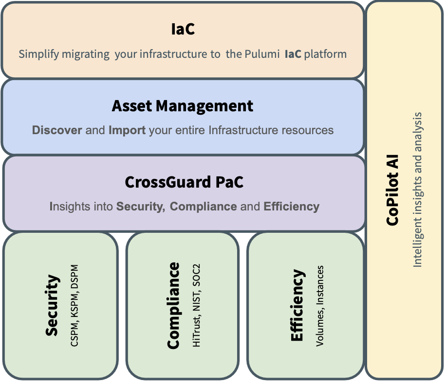
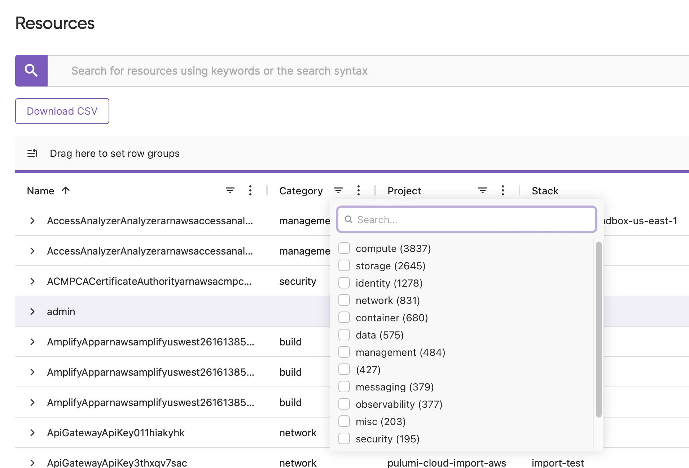
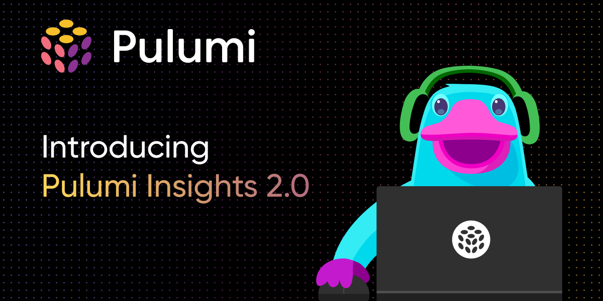

# Introducing Pulumi Insights 2.0

Since the launch of Pulumi Cloud Insights, we have seen significant growth in usage. Customers have used each of the tools to gain valuable insights into their IaC infrastructure through both the flexibility of [Resource Search](https://www.pulumi.com/blog/resource-search/) and the power of [Pulumi CrossGuard](https://www.pulumi.com/crossguard/). With Insights 2.0 we are significantly expanding the set of automation and visualization tools to quickly gain visibility, insight and control and improve the Security, Compliance and Efficiency of your infrastructure.

Insights 2.0 builds on the previous generation of tools to provide a range of new capabilities:

* Expands Pulumi Providers to enable scanning and import of your entire infrastructure state into the Pulumi Data Graph  
* Adds Explorers, Structure Graphs and Dashboards for visualizing, understanding and managing your entire infrastructure  
* Extends CrossGuard PaC to discover and auto remediate insights into Security, Compliance and Efficiency  
* Integrates Pulumi IaC for enterprise class remediation and management  
* Brings CoPilot AI to your entire infrastructure for intelligent insight discovery and analysis



# Resources V2.0

The updated Resources page provides a customizable experience for grouping, sorting, filtering and visualizing your resources to help you manage the scope and find insights about your infrastructure.

**Sorting:** Clicking on the column header enables you to sort the selected column in ascending order. Clicking again switches it to descending order and clicking a third time removes the sorting. Multiple column sorts can be done with the sort precedence being based on the order the columns we last clicked on.  

**Filtering:** Adding filters to each column can be done by selecting the first icon in the column header. A filter dialog will be displayed based on the type of data present in the column. If the data is made up of unique values, like the Name field, then a standard search text box is presented. If it is a date, then the date range selection dialog is presented. Otherwise you are presented with the list of unique values in the column where you can select multiple to filter with. Adding a column filter will add the specific filter to the Resource Search query enabling you to use the grid as a form of query builder.   



**Grouping:** To group by a particular column, drag and drop the column header to the grouping control in the top left of the grid. You can group by multiple columns and can control the order of the grouping by reordering them in the grouping control. Grouping enables you to factor your resources in different ways to help you understand the scope of your infrastructure and find insights for future investments.

**Column Selection:** To add or remove columns from the grid, select the ‘Choose Columns’ menu item from the column menu selector. This presents a pop up to allow you to add, remove or rearrange the order of columns in the grid. 

**Column Resize:** You can resize the width of a column by clicking and dragging on the column boundary line on the right side of the column header. To automatically resize the column to the width of the widest cell contents, double click on the boundary line. 

**Copy Contents:** You can couple the contents of a cell to the clipboard by right clicking on the cell and selecting Copy. This is particularly useful for resource values you need to use in other contexts like the Name or URN.

# Policy Violations

The Policy Violations page provides a comprehensive view of all policy violations across your organization, helping you maintain visibility and control over your infrastructure. See the Policy Violations blog post for more information: [https://www.pulumi.com/blog/centralized-policy-violations/](https://www.pulumi.com/blog/centralized-policy-violations/)

# Resource Structure Graph

The new resource structure graph provides a visual representation of the relationships for a selected resource. This provides the additional context needed to understand the structure around the resource and what actions might need to be taken.

Within this view you can navigate the relationships by clicking on the related resources. When a resource clicked, the Resource Detail view will navigate to the selected resource to give you the details needed to understand that context. 

Policy violations are indicated on the Resource Structure graph to quickly highlight when an insight has been detected and what related nodes are affected.

# User Customizable Dashboard

***Coming Soon***

Pulumi Cloud provides a rich, user customizable dashboard that enables you to define roll up views of any aspect of your infrastructure. This provides a powerful overview of your infrastructure and lets you easily track progress of any project.

The dashboard supports defining multiple pages so you can create separate dashboards for each application, each department, or any configuration that maps to your configuration.

Each dashboard page enables you to add, remove, rearrange and create new cards. Each new card can be customized to show the aggregate results of a resource field or property including related policy violation fields. The card can be configured to use a variety of different chart and graph visualizations that best suit the associated data.

# Infrastructure Account Scanning

***Coming Soon***

We are excited to introduce Infrastructure Account Scanning. IAS fundamentally transforms Pulumi Cloud into a rich Asset Management and Insights platform that brings all of the Pulumi Insights capabilities to your entire infrastructure. With IAS, Pulumi can scan your entire infrastructure, even resources that are not IaC managed, and keep them up to date with any changes. This enables you to leverage all of the Insights 2.0 tools like, the Resource Explorer with Resource Structure Graphs, Pulumi CrossGruard with Auto Remediation and the Policy Violations Explorer, and the User Customizable Dashboard to manage your entire infrastructure. 

IAS leverages the rich ecosystem of Pulumi Platform Providers to discover and read your resources independently of whether they have been moved to IaC. 

With IAS Account management you can quickly configure how Pulumi Cloud is enabled to discover new or changed resources keeping your customized Resources, Policy Violations and Dashboard views up to date with your physical infrastructure. 

# Auto Remediation

***Coming Soon***

* When a policy violation occurs for a given resource and that policy is an auto remediation policy ([https://www.pulumi.com/blog/remediation-policies/](https://www.pulumi.com/blog/remediation-policies/)) a ‘Remediate’ button will be displayed.   
* When selected, the Remediate button will run the remediation and show a diff of the infrastructure changes that will be applied in order to remediate targeted insight.   
* If approved, Pulumi Cloud will apply the changes defined by the diff to your infrastructure using the associated Pulumi Providers  
* Any change made through the Remediation flow will be tracked and auditable using the Pulumi Audit tools  
* Note: The Remediation flow provides a warning if the Resource is IaC managed as this change would cause drift with the underlying IaC code. For IaC managed resources it is recommended that you use the new Goto Definition feature to jump to the IaC code for the resource to apply the necessary remediation in the code.

# Resource Query based Import

pulumi import \-q ‘.volumeType:Standard’

# Goto Definition

***Coming Soon***

For any resource that is Pulumi IaC managed, the Resource Details page contains a link to the file and line of code in your source code provider that defines the given resource. This allows you to quickly see and edit the IaC code for the given resource.
What you put here will appear on the index page. In most cases, you'll also want to add a Read More link after this paragraph (though technically, that's optional. To do that, just add an HTML comment like the one below.

<!--more-->

And then everything _after_ that comment will appear on the post page itself.

Either way, avoid using images or code samples [in the first 70 words](https://gohugo.io/content-management/summaries/#automatic-summary-splitting) of your post, as these may not render properly in summary contexts (e.g., on the blog home page or in social-media previews).

## Writing the Post

For help assembling the content of your post, see [BLOGGING.md](https://github.com/pulumi/docs/blob/master/BLOGGING.md). For general formatting guidelines, see the [Style Guide](https://github.com/pulumi/docs/blob/master/STYLE-GUIDE.md).

## Code Samples

```typescript
let bucket = new aws.s3.Bucket("stuff");
...
```

## Images



## Videos



Note the `?rel=0` param, which tells YouTube to suggest only videos from same channel.
