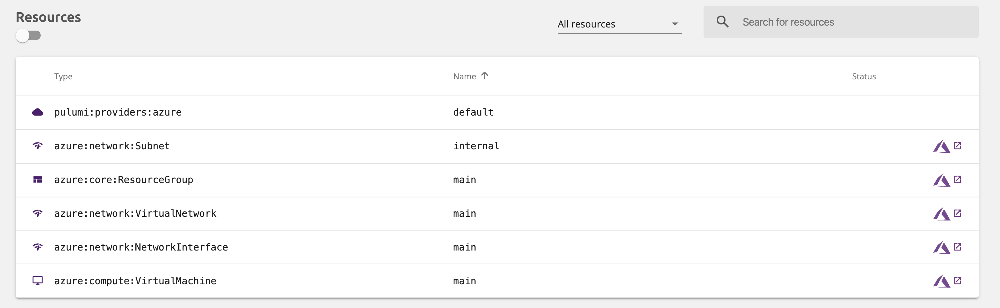
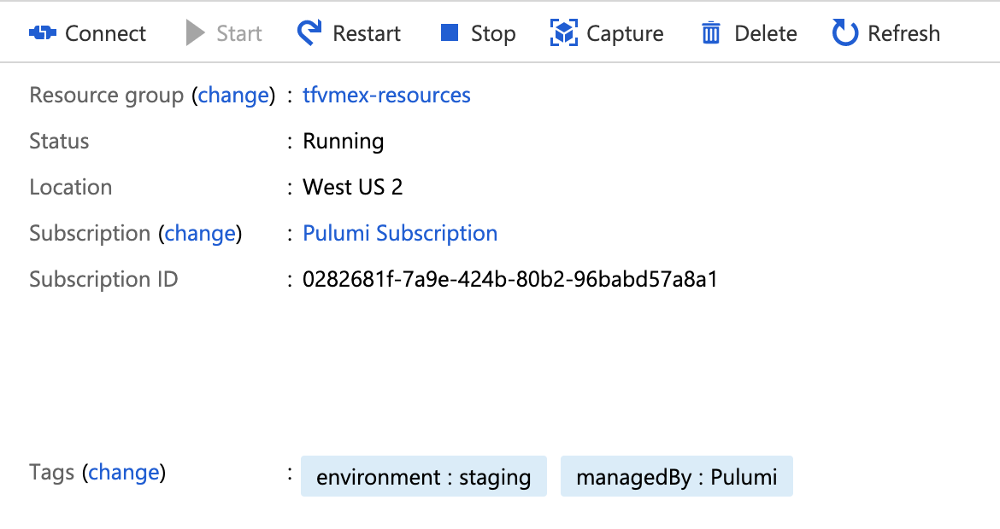

Most cloud infrastrucutre projects involve working with existing cloud resources - either building on top of existing resources or adopting existing resources under management with a new and more robust infrastructure provisioning solution.

Whether you are adopting resources that were deployed manually using your cloud provider's console or CLI - or migrating existing infrastructure from tools like Terraform or CloudFormation - Pulumi makes it easy to adopt and manage your existing resources.

<!--more-->

When working with existing resources, there are typically two scenarios:
1. You need to reference existing resources to use as inputs to new resources in Pulumi
1. You need to adopt existing resources under management so they can be updated/managed in Pulumi

We'll review referencing existing resources, and then dive deeper into how you can adopt existing resources with Pulumi.

## Referencing Existing Resources
For referencing existing resoruces, Pulumi offers several tools.  

* The `.get` methods available on every resource let you [get all the details for a resource](https://www.pulumi.com/docs/reference/pkg/nodejs/pulumi/aws/ec2/#Vpc-get) from the cloud provider based just on it's `id`.
* The `StackReference` resource lets you reference outputs of another stack for use as inputs to another stack, which is very useful for [organizing projects and stack](https://www.pulumi.com/docs/reference/organizing-stacks-projects/). 
* The [`terraform.state.RemoteStateReference()`](https://www.pulumi.com/blog/using-terraform-remote-state-with-pulumi/), [`aws.cloudformation.getStack()`](https://www.pulumi.com/docs/reference/pkg/nodejs/pulumi/aws/cloudformation/#getStack) and [`azure.core.TemplateDeployment.get()`](https://www.pulumi.com/docs/reference/pkg/nodejs/pulumi/azure/core/#TemplateDeployment-get) let you reference outputs from existing Terraform, CloudFormation and ARM deployments respectively.

Together, these make it easy to reference existing infrastructure regardless of how it was provisioned.

## Adopting Existing Resources

For adopting resources, Pulumi offers the [`import`](https://www.pulumi.com/docs/reference/pkg/nodejs/pulumi/azure/core/#TemplateDeployment-get) resource option to request that a resource defined in your Pulumi program adopt an existing resource in the cloud provider instead of creating a new one.  In keeping with it's focus on infrastructure as *code*, Pulumi lets you specify this `import` behaviour inside the Pulumi code for you infrastructure deployment, instead of outside it in some manual workflow.  In it's simplest form looks like this:

```ts
const myVpc = new aws.ec2.Vpc("my-vpc", {
    cidrBlock: "10.11.0.0/16",
}, { import: "vpc-02cd0cd2d807f340c"});
```

When Pulumi first sees a resource (in this case `my-vpc`), if it has an `import` option set, it will adopt the existing resource specified by that `import` ID from the cloud provider under management instead of creating a new resource.

We can see this when we deploy our Pulumi program with `pulumi up`:

```
$ pulumi up
Previewing update (dev):

     Type                 Name               Plan       
     pulumi:pulumi:Stack  importtestaws-dev             
 =   └─ aws:ec2:Vpc       my-vpc             import     
 
Resources:
    = 1 to import
    1 unchanged
```

Because the `import` is provided in code, it can be configured in many different ways.  We've seen users look up import ids from Pulumi config instead of hardcoding into their programs, construct them from predicatable names based on existing program parameters, or even conditionally add the `import: <id>` property depending on whether they want to deploy a stack in "adopt" mode or in "create" mode.

This allows `import` to be used for a wide variety of adoption scenarios - from importing a single resource, to migrating a whole stack from an existing tool like Terraform to Pulumi, and even to automating the migration process across dozens of instances of an infrastructure deployment.

### Walkthrough of Adopting Existing Infrastructure to Pulumi

To see one of these scenarios in action end-to-end, let's walk through the process of deploying some "existing" infrastructure outside of Pulumi, and then adopting it under management of a Pulumi program.  You can also check out the video below which walks through the same scenario.

<iframe width="560" height="315" src="https://www.youtube.com/embed/kX_3Wdft0Ms" frameborder="0" allow="accelerometer; autoplay; encrypted-media; gyroscope; picture-in-picture" allowfullscreen></iframe>

We'll use Terraform to provision our "existing" infrastructure.  These resources could have been provisioned manually in the console, or using platform-native infrastructure-as-code solutions like CloudFormation, ARM or Kubernetes YAML.

We'll also use TypeScript, though the process would work mostly the same in Python as well.

#### 1. Deploy "existing" infrastructure

For our "existing" infrastructure, we'll use a small Azure deployment of a Virtual Machine and corresponding Resource Group and Networking resources.  We'll deploy [this example](https://www.terraform.io/docs/providers/azurerm/r/virtual_machine.html#example-usage-from-an-azure-platform-image-) using `terraform`.  Save the code in that example to `main.tf` and run `terraform init` and then `terraform apply` to deploy it.

#### 2. Create a Pulumi program

Next, we'll create a Pulumi program to describe the same infrastructure that exists in Azure.  We could write this by hand, but since we used Terraform to define the original infrastructure, we also have the option to use [`tf2pulumi`](https://github.com/pulumi/tf2pulumi) to automatically convert our `.tf` files to Pulumi.  

```bash
$ pulumi new azure-typescript --force
$ tf2pulumi < main.tf > index.ts
```

We now have a Pulumi program that describes the same infrastructure:

```ts
import * as pulumi from "@pulumi/pulumi";
import * as azure from "@pulumi/azure";

const config = new pulumi.Config();
const prefix = config.get("prefix") || "tfvmex";

const mainResourceGroup = new azure.core.ResourceGroup("main", {
    location: "West US 2",
    name: `${prefix}-resources`,
});
const mainVirtualNetwork = new azure.network.VirtualNetwork("main", {
    addressSpaces: ["10.0.0.0/16"],
    location: mainResourceGroup.location,
    name: `${prefix}-network`,
    resourceGroupName: mainResourceGroup.name,
});

...

```

If we try to run a `pulumi up` now to deploy this though, we see that as we expect, we will try to deploy a new copy of the infrastructure:

```
$ pulumi up
Previewing update (dev2):

     Type                               Name              Plan
 +   pulumi:pulumi:Stack                importazure-dev2  create
 +   ├─ azure:core:ResourceGroup        main              create
 +   ├─ azure:network:VirtualNetwork    main              create
 +   ├─ azure:network:Subnet            internal          create
 +   ├─ azure:network:NetworkInterface  main              create
 +   └─ azure:compute:VirtualMachine    main              create

Resources:
    + 6 to create
```

Instead of creating new resources though, we want to adopt the existing ones.

#### 3.Add `import` IDs

As we saw earlier, to import existing resources, we simply add `import: <id>` to the resource options of a resource defined in Pulumi.  That resources wil then be imported instead of created.

We can try this for one resource first.  We can look in our `terraform.tfstate` file or in the Azure Portal and see that the id of the Resource Group is `/subscriptions/0282681f-7a9e-424b-80b2-96babd57a8a1/resourceGroups/tfvmex-resources`.  So let's use that:

```ts
const mainResourceGroup = new azure.core.ResourceGroup("main", {
    location: "West US 2",
    name: `${prefix}-resources`,
}, { import: "/subscriptions/0282681f-7a9e-424b-80b2-96babd57a8a1/resourceGroups/tfvmex-resources" });
```

#### 4. Adopt resources

Now our preview shows that it will import the `ResourceGroup` instead:

```
$ pulumi up
Previewing update (dev2):

     Type                         Name              Plan       
 +   pulumi:pulumi:Stack          importazure-dev2  create     
 =   └─ azure:core:ResourceGroup  main              import     
 
Resources:
    + 1 to create
    = 1 to import
    2 changes
```

We can complete this process, adding `import: <id>` to all resources, and then import them all to Pulumi. 

```
Updating (dev2):

     Type                               Name              Status       
 +   pulumi:pulumi:Stack                importazure-dev2  created      
 =   ├─ azure:core:ResourceGroup        main              imported     
 =   ├─ azure:network:VirtualNetwork    main              imported     
 =   ├─ azure:network:Subnet            internal          imported     
 =   ├─ azure:network:NetworkInterface  main              imported     
 =   └─ azure:compute:VirtualMachine    main              imported     
 
Resources:
    + 1 created
    = 5 imported
    6 changes

Duration: 8s
```

#### 5. Managing the resources with Pulumi

Once all the resources are adopted into Pulumi, we can now manage them by making incremental changes in Pulumi, and can discontinue using the existing `.tf` files to manage this set of infrastructure.  For example, if we want to add a new tag to our Virtual Machine, we can add it as below.  We can also now remove the `import` property if we want, or else leave it intact so long as the `id` of the resource remains the same (if in the future we need to make a change that replaces one of these imported resources, Pulumi will require that the `id` proeprty is removed, as it will no longer be correct). 

```diff
const mainVirtualMachine = new azure.compute.VirtualMachine("main", {
    location: mainResourceGroup.location,
    name: `${prefix}-vm`,
    networkInterfaceIds: [mainNetworkInterface.id],
    osProfile: {
        adminPassword: "Password1234!",
        adminUsername: "testadmin",
        computerName: "hostname",
    },
    osProfileLinuxConfig: {
        disablePasswordAuthentication: false,
    },
    resourceGroupName: mainResourceGroup.name,
    storageImageReference: {
        offer: "UbuntuServer",
        publisher: "Canonical",
        sku: "16.04-LTS",
        version: "latest",
    },
    storageOsDisk: {
        caching: "ReadWrite",
        createOption: "FromImage",
        managedDiskType: "Standard_LRS",
        name: "myosdisk1",
    },
    tags: {
        environment: "staging",
+       managedBy: "Pulumi",
    },
    vmSize: "Standard_DS1_v2",
});
```

Deploying this, Pulumi shows we will update the existing resource to add the new tag:

```
       ~ tags: {
          + managedBy: "Pulumi"
        }
```

Since the resources are now under management of Pulumi, we can navigate over to the Pulumi Console to see our resources:



And from there, navigate directly to the Virtual Machine in the Azure Portal, including the newly added `managedBy: Pulumi` tag.




The result is that we have migrated our existing infrastructure into Pulumi and can now use all the rich features of Pulumi infrastructure-as-code to manage it going forward!

## Conclusion

With Pulumi, you can easily work with existing cloud infrastructe, either referencing the existing infrastructure as inputs to new cloud infrastructure defined in Pulumi, or adopting existing infrastructure under management of a Pulumi infrastrcture-as-code.

[Get started](https://www.pulumi.com/docs/quickstart/) with Pulumi today!
