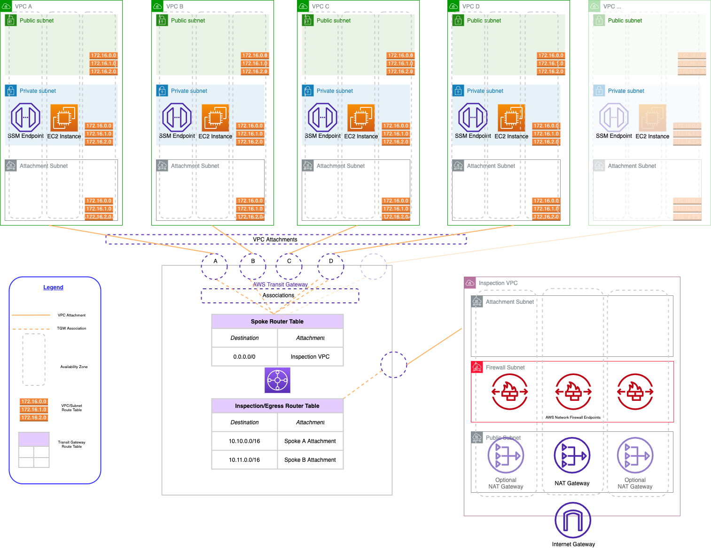

In this blog series you will learn how to create a hub-and-spoke network architecture in AWS with centralized egress and traffic inspection. In this first installment, we'll talk about the benefits of this architecture and begin to lay out some of its parts in Python with Pulumi, the infrastructure as code tool that enables you to manage infrastructure with real programming languages!

<!--more-->

{}
The complete code for this project is available on [GitHub](https://github.com/pulumi/examples/tree/master/aws-py-hub-and-spoke-network), which is a great place to go for full context.
{}

## What is a hub-and-spoke network?

A hub-and-spoke network is a common architecture for creating a network topology that provides isolation and security for your workloads. The hub-and-spoke architecture you'll be creating on AWS has three main components: an inspection VPC, AWS Transit Gateway, and a series of spoke VPCs:

* The **inspection VPC** provides centralized egress. It is the only VPC that has a route to the internet, so all other VPCs in the architecture must route their traffic through the inspection VPC. In part II of this blog post, you'll add AWS Firewall to the inspection VPC to allow all traffic to the internet to be governed by a single set of policies.
* Network connectivity between VPCs is accomplished via **[AWS Transit Gateway](https://aws.amazon.com/transit-gateway/)**. The Transit Gateway maintains a central routing table that is used to route traffic from the spoke VPCs to the internet. We also need to maintain routes so that return traffic from the internet can be routed back to the correct spoke VPC.
* The **spoke VPCs** are where we run our application workloads. They are isolated from each other and cannot communicate with each other unless we explicitly allow a network path. They will be able to communicate with the internet by default, but only through the inspection VPC's NAT gateways.

A fully fleshed-out version of the architecture, with multiple spoke VPCs follows:



{}
We could also enable communication _between_ the spoke VPCs by adding routes to the Transit Gateway routing table. Traffic between spoke VPCs _would not_ be desirable for security reasons if those VPCs represent different environments of the same workload (e.g., QA, UAT, and production). Traffic between spoke VPCs _would_ potentially be desirable if those VPCs represent multiple workloads in the _same_ environment, for example, our production online store and our production ERP software.

For simplicity, we will not be enabling routes between spoke VPCs in this architecture.
{}

For a full discussion of all the considerations of building multi-VPC networks on AWS, see the excellent AWS whitepaper [Building a Scalable and Secure Multi-VPC AWS Network Infrastructure](https://docs.aws.amazon.com/whitepapers/latest/building-scalable-secure-multi-vpc-network-infrastructure/welcome.html).

## Why use a hub-and-spoke network with centralized egress?

There’s several advantages to this architecture:

* **Cost savings:** We save costs by allowing all of our spoke VPCs to share a single set of highly-available NAT gateways in the inspection VPC. There are costs to sending our traffic over AWS Transit Gateway, but in most scenarios Transit Gateway costs are significantly less than the cost of running NAT gateways in each spoke VPC.
* **Stable public IP addresses:** Because all of our egress traffic to the internet originate from the same set of stable, public elastic IP addresses (attached to the NAT gateways in the inspection VPC), we can more easily interface with systems that use high-trust, network-based security models (i.e., IP allowlists). Network administrators for the systems we want to interface with only need allow a limited number of IPs to establish connectivity once and up-front, as opposed to having to allow new IPs for every VPC we create. These high-trust systems are often based in the data center and may have small and infrequent change windows, so only having to go through the change management process once, not for every spoke VPC we add, is a big win.
* **Centralized traffic inspection:** When all traffic to the internet flows through our inspection VPC, we only need to apply a firewall and associated rules in a single place. This way, we can easily ensure that all network traffic to the internet complies with our organization’s security policies. (In the part of this post, we’ll add in AWS Firewall to our inspection VPC to add centralized traffic inspection capabilities to our architecture.)

## Creating the first Transit Gateway resources

After initializing your Pulumi project and adding the necessary references to the [AWS](https://www.pulumi.com/registry/packages/aws/) and [AWSX](https://www.pulumi.com/registry/packages/awsx/), you can add the resources relating to your Transit Gateway.

You'll need to configure a CIDR block for your network's supernet. All spoke VPCs in this codebase must fall under the supernet CIDR block. You will use the supernet CIDR to create a route in the inspection VPC that will route traffic returning from the internet to the Transit Gateway. The Transit Gateway will, in turn, route the traffic back to the specific originating spoke VPC.

You can get the supernet CIDR from the Pulumi configuration. If the configuration value is not set, you can default to a CIDR block of `10.0.0.0/8`:

```python
config = pulumi.Config()
supernet_cidr = config.get("supernet-cidr") or "10.0.0.0/8"
```

Now you can add some of your initial Transit Gateway resources. You'll start with the Transit Gateway itself along with some route tables for your inspection and spoke VPCs, respectively. You will add routes to this route table later to allow traffic from our spoke VPCs to the internet, as well as routes from the internet back to the originating spoke VPC:

```python
tgw = aws.ec2transitgateway.TransitGateway(
    "tgw",
    aws.ec2transitgateway.TransitGatewayArgs(
        description=f"Transit Gateway - {project}",
        default_route_table_association="disable",
        default_route_table_propagation="disable",
        tags={
            "Name": "Pulumi"
        }
    )
)

inspection_tgw_route_table = aws.ec2transitgateway.RouteTable(
    "post-inspection-tgw-route-table",
    aws.ec2transitgateway.RouteTableArgs(
        transit_gateway_id=tgw.id,
        tags={
            "Name": "post-inspection",
        }
    ),
    # Adding the TGW as the parent makes the output of `pulumi up` a little
    # easier to understand as it groups these resources visually under the TGW
    # on which they depend.
    opts=pulumi.ResourceOptions(
        parent=tgw,
    ),
)

spoke_tgw_route_table = aws.ec2transitgateway.RouteTable(
    "spoke-tgw-route-table",
    aws.ec2transitgateway.RouteTableArgs(
        transit_gateway_id=tgw.id,
        tags={
            "Name": "spoke-tgw",
        }
    ),
    opts=pulumi.ResourceOptions(
        parent=tgw,
    ),
)
```

## Creating the inspection VPC

{}
The code samples in this section are not exhaustive. That is, they do not contain every line of code required so that we can focus on the most illustrative portions. See the [GitHub repo](https://github.com/pulumi/examples/tree/master/aws-py-hub-and-spoke-network) for full context.
{}

Now that you've added some foundational Transit Gateway resources, you can create your inspection VPC.

The inspection VPC is implemented as a [Pulumi component resource](https://www.pulumi.com/docs/concepts/resources/components/). While we do not need to create multiple inspection VPCs in this codebase, implementing the inspection VPC as a component resource enhances the readability of both the code and the output by grouping all resources that belong to the inspection VPC in the output of `pulumi up`. You can also improve the component's readability by placing its code in a separate file (in this case, `inspection.py`).

When you create a component resource in Python, it's helpful to create a class that contains the arguments to the component resource. This allows you to pass the arguments to the component resource as a single object, which makes the code easier to read and understand. You can create a terse and easily readable arguments class in Python with the [`@dataclass` decorator](https://docs.python.org/3/library/dataclasses.html):

```python
@dataclass
class InspectionVpcArgs:
    supernet_cidr_block: str
    vpc_cidr_block: str
    tgw_id: pulumi.Input[str]
    spoke_tgw_route_table_id: pulumi.Input[str]
    inspection_tgw_route_table_id: pulumi.Input[str]
    firewall_policy_arn: pulumi.Input[str]
```

Then, you can create the component resource class itself. The component resource class must inherit from `pulumi.ComponentResource`. The constructor for the component resource class must call the constructor of the base class, passing in the resource type (a string that uniquely identifies the component type, in the form of `{project}:{module}:{component_name}`), the resource name, and the resource options:

```python
class InspectionVpc(pulumi.ComponentResource):
    def __init__(self, name: str, args: InspectionVpcArgs, opts: pulumi.ResourceOptions = None) -> None:
        super().__init__("awsAdvancedNetworking:index:InspectionVpc", name, None, opts)
```

You'll start by creating a VPC with the [AWSX VPC component](https://www.pulumi.com/registry/packages/awsx/api-docs/ec2/vpc/). We'll leverage the sensible defaults the component provides to create a VPC across 3 availability zones for high availability. You can either create a single NAT gateway in our inspection VPC to save costs, or create 3 NAT gateways, one in each availability zone, to provide high availability. See the code for details.

After creating the VPC, you'll then need to attach the inspection VPC to the Transit Gateway. This is how the inspection VPC will be able to utilize the Transit Gateway and accept traffic from the spoke VPCs:

```python
self.tgw_attachment = aws.ec2transitgateway.VpcAttachment(
    f"{name}-tgw-vpc-attachment",
    aws.ec2transitgateway.VpcAttachmentArgs(
        transit_gateway_id=self.args.tgw_id,
        subnet_ids=self.vpc.isolated_subnet_ids,
        vpc_id=self.vpc.vpc_id,
        transit_gateway_default_route_table_association=False,
        transit_gateway_default_route_table_propagation=False,
        appliance_mode_support="enable",
        tags={
            "Name": f"{name}",
        },
    ),
    # We can only have one attachment per VPC, so we need to tell Pulumi
    # explicitly to delete the old one before creating a new one:
    pulumi.ResourceOptions(
        delete_before_replace=True,
        depends_on=[self.vpc],
        parent=self,
    )
)
```

Then add a route to the Transit Gateway route table for the _spoke_ VPCs that routes all traffic outside of the VPC to the inspection VPC (or to be precise, the Transit Gateway attachment in the inspection VPC). This route only needs to be added once as it will apply to all spoke VPCs, so we add it here in the inspection VPC since that's where we create the Transit Gateway attachment:

```python
aws.ec2transitgateway.Route(
    f"{name}-default-spoke-to-inspection",
    aws.ec2transitgateway.RouteArgs(
        destination_cidr_block="0.0.0.0/0",
        transit_gateway_attachment_id=self.tgw_attachment.id,
        transit_gateway_route_table_id=args.spoke_tgw_route_table_id,
    ),
    opts=pulumi.ResourceOptions(
        parent=self,
    )
)
```

Next, add routes within the inspection VPC's isolated subnets that route traffic to the internet through the NAT gateway. The Transit Gateway:

```python
for subnet_id in isolated_subnet_ids:
    route_table = aws.ec2.get_route_table(
        subnet_id=subnet_id
    )

    aws.ec2.Route(
        f"{self.name}-route-{subnet_id}-to-tgw",
        aws.ec2.RouteArgs(
            route_table_id=route_table.id,
            destination_cidr_block="0.0.0.0/0",
            nat_gateway_id=self.nat_gateway.id,
        ),
        pulumi.ResourceOptions(
            parent=self,
        ),
    )
```

Finally, you'll need to add routes within the inspection VPC's public subnets (where the NAT gateways live) that route return traffic from the internet back through the Transit Gateway. This is how the inspection VPC will be able to route traffic to the spoke VPCs:

```python
for subnet_id in public_subnet_ids:
    route_table = aws.ec2.get_route_table(
        subnet_id=subnet_id
    )

    aws.ec2.Route(
        f"{self.name}-route-{subnet_id}-to-tgw",
        aws.ec2.RouteArgs(
            route_table_id=route_table.id,
            destination_cidr_block=self.args.supernet_cidr_block,
            transit_gateway_id=self.args.tgw_id,
        ),
        pulumi.ResourceOptions(
            depends_on=[self.tgw_attachment],
            parent=self,
        ),
    )
```

You need to create both sets of these routes within an [apply](https://www.pulumi.com/docs/concepts/inputs-outputs/#apply) because of the need to access the raw values of each of the subnet ids. Apply can be conceptually difficult for beginners in Pulumi to grasp, but it essentially means "once you know all of the values that needed, pass them on to this function".

## Final steps

Now that you've created our inspection VPC component, you can reference it in the main project file:

```python
from inspection import InspectionVpc, InspectionVpcArgs
```

and you can create an instance of the component:

```python
insp_vpc = InspectionVpc(
    "inspection",
    InspectionVpcArgs(
        supernet_cidr_block=supernet_cidr,
        vpc_cidr_block="10.129.0.0/24",
        tgw_id=tgw.id,
        inspection_tgw_route_table_id=inspection_tgw_route_table.id,
        spoke_tgw_route_table_id=spoke_tgw_route_table.id,
        firewall_policy_arn=None, # We will add this in the next post
    )
)
```

At this point, we do not have have a fully functional architecture - we still need to create the spoke VPCs - but if we want to get some feedback on our architecture, we can run `pulumi up` and see what happens. We should see that Pulumi will create the VPC, the Transit Gateway attachment, and the routes.

In the next post, we’ll create our spoke VPCs and verify connectivity, then add centralized inspection of network traffic going to the internet. Stay tuned!
