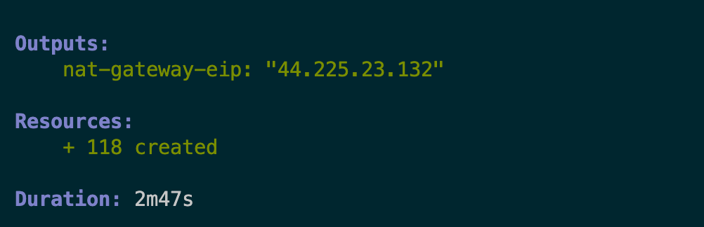
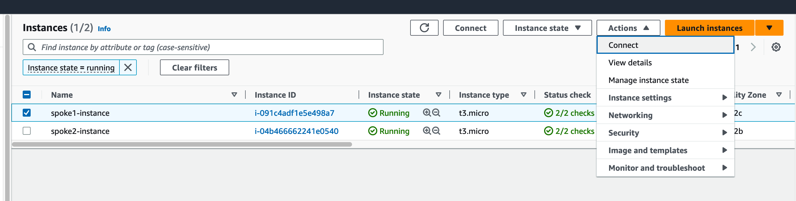
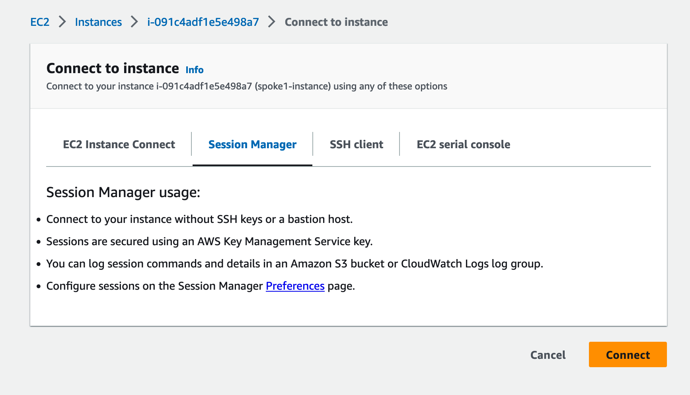
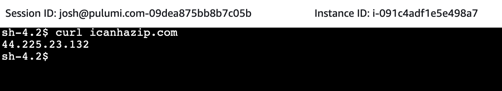
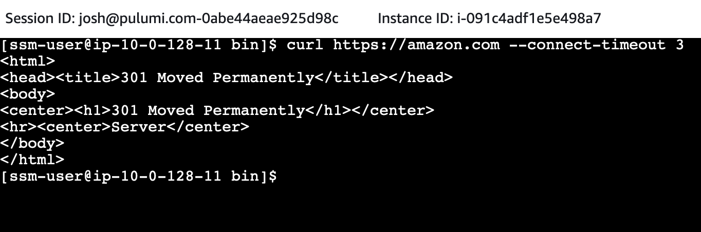
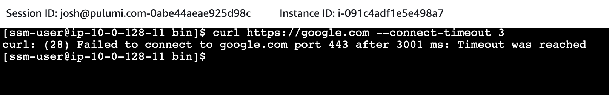

In this blog series, you will learn how to create a hub-and-spoke network architecture in AWS with centralized egress and traffic inspection. In this second installment, we'll show you how to create spoke VPCs to run your workloads, verify centralized egress is working, and then add centralized traffic inspection using Pulumi, the infrastructure as code tool that enables you to manage infrastructure with real programming languages!

<!--more-->

## Introduction

In [AWS Advanced Networking Part 1](https://pulumi.com/blog/advanced-aws-networking-part-1/) you:

1. Learned about the benefits of a hub-and-spoke network architecture with centralized egress.
1. Created the shared [AWS Transit Gateway](https://aws.amazon.com/transit-gateway/) resources to be shared among our spoke VPCs and inspection VPC.
1. Defined your inspection VPC as a Pulumi [component resource](https://www.pulumi.com/docs/concepts/resources/components/).

Now, to finish the architecture, you will need to:

1. Create a spoke VPC as a Pulumi component resource.
1. Test the network architecture by verifying that centralized egress is working.
1. Add traffic inspection with [AWS Network Firewall](https://aws.amazon.com/network-firewall/).

{}
In subsequent sections we will be showing code samples. Because this is a more advanced Pulumi program, we will be focusing on the most important parts of the architecture rather than covering every single line in the codebase. The complete code for this project is available on [GitHub](https://github.com/pulumi/examples/tree/master/aws-py-hub-and-spoke-network), which is a great place to go for full context.
{}

## Spoke VPC

Like your inspection VPC, we will implement the spoke VPC as a Pulumi component resource. Component resources allow you to logically group resources to form reusable components. Because your network will contain multiple spoke VPCs (at least 2, possibly more), and the spoke VPC will contain both the basic VPC and connectivity to Transit Gateway, the spoke VPC is a natural fit for a component resource.

First, add a file `spoke.py` to your Pulumi program. In Python, it's good practice to put each component resource along with its associated arguments class in a separate file from your main program as it makes for intuitive code organization:

```python
@dataclass
class SpokeVpcArgs:
    vpc_cidr_block: str
    tgw_id: pulumi.Input[str]
    tgw_route_table_id: pulumi.Input[str]


class SpokeVpc(pulumi.ComponentResource):
    def __init__(self, name: str, args: SpokeVpcArgs, opts: pulumi.ResourceOptions = None) -> None:
        super().__init__("awsAdvancedNetworking:index:SpokeVpc", name, None, opts)
```

Then, create a VPC with two sets of subnets, both isolated (with no pathway to the internet). One set of subnets will hold our spoke VPC workloads, and the other will hold our Transit Gateway attachment. We enable DNS hostnames and support so that we can later use VPC endpoints to enable [AWS Systems Manager](https://docs.aws.amazon.com/systems-manager/index.html) access to verify that centralized egress is working as expected without requiring direct host access via SSH:

```python
self.vpc = awsx.ec2.Vpc(
    f"{self._name}-vpc",
    awsx.ec2.VpcArgs(
        cidr_block=args.vpc_cidr_block,
        subnet_specs=[
            awsx.ec2.SubnetSpecArgs(
                name="private",
                cidr_mask=28,
                type=awsx.ec2.SubnetType.ISOLATED,
            ),
            awsx.ec2.SubnetSpecArgs(
                name="tgw",
                cidr_mask=28,
                type=awsx.ec2.SubnetType.ISOLATED,
            ),
        ],
        nat_gateways=awsx.ec2.NatGatewayConfigurationArgs(
            strategy=awsx.ec2.NatGatewayStrategy.NONE,
        ),
        enable_dns_hostnames=True,
        enable_dns_support=True,
    )
)
```

Then, attach the Transit Gateway to the appropriate subnets:

```python
self.tgw_attachment = aws.ec2transitgateway.VpcAttachment(
    f"{name}-tgw-vpc-attachment",
    aws.ec2transitgateway.VpcAttachmentArgs(
        transit_gateway_id=args.tgw_id,
        subnet_ids=tgw_subnets.apply(lambda x: x.ids),
        vpc_id=self.vpc.vpc_id,
        transit_gateway_default_route_table_association=False,
        transit_gateway_default_route_table_propagation=False,
        tags={
            "Name": f"{name}",
        },
    ),
    pulumi.ResourceOptions(
        delete_before_replace=True,
        depends_on=[self.vpc],
        parent=self,
    )
)
```

Add [VPC endpoints](https://docs.aws.amazon.com/vpc/latest/privatelink/create-interface-endpoint.html) to allow Systems Manager access to open an SSH connection from the AWS console without having to allow network access to the hosts. Because Pulumi uses real programming languages, you can use a Python `for` loop to create these resources with fewer lines of code using familiar syntax:

```python
for service in ["ec2messages", "ssmmessages", "ssm"]:
    aws.ec2.VpcEndpoint(
        f"{self._name}-endpoint-{service}",
        aws.ec2.VpcEndpointArgs(
            vpc_id=self.vpc.vpc_id,
            service_name=f"com.amazonaws.{aws.config.region}.{service}",
            private_dns_enabled=True,
            security_group_ids=[vpc_endpoint_sg.id],
            vpc_endpoint_type="Interface",
            tags={
                "Name": f"{self._name}-{service}"
            },
            subnet_ids=subnet_ids
        )
    )
```

Add routes to the spoke VPC's Transit Gateway route table that direct all non-local traffic to the Transit Gateway:

```python
for subnet_id in private_subnet_ids:
    route_table = aws.ec2.get_route_table(
        subnet_id=subnet_id,
    )

    aws.ec2.Route(
        f"spoke{self._name}-tgw-route-{subnet_id}",
        aws.ec2.RouteArgs(
            route_table_id=route_table.id,
            destination_cidr_block="0.0.0.0/0",
            transit_gateway_id=self._args.tgw_id,
        ),
        pulumi.ResourceOptions(
            depends_on=[self.tgw_attachment],
            parent=self,
        ),
    )
```

Finally, add some outputs for the component. You'll use these to place workloads in the proper subnets:

```python
self.register_outputs({
    "vpc": self.vpc,
    "workload_subnet_ids": self.workload_subnet_ids
})
```

You can instantiate a spoke VPC like the following in `__main__.py`:

```python
spoke1_vpc = SpokeVpc(
    "spoke1",
    SpokeVpcArgs(
        vpc_cidr_block="10.0.0.0/16",
        tgw_id=tgw.id,
        tgw_route_table_id=spoke_tgw_route_table.id,
    ),
)
```

Subsequent spoke VPCs should use a separate CIDR block:

```python
spoke2_vpc = SpokeVpc(
    "spoke2",
    SpokeVpcArgs(
        vpc_cidr_block="10.1.0.0/16",
        tgw_id=tgw.id,
        tgw_route_table_id=spoke_tgw_route_table.id,
    ),
)
```

Now that you have your spoke VPCs added, it's time to test that the architecture is working as expected. To do this, we'll create a sample workload and deploy it to one of our spoke VPCs.

## Creating a Sample Spoke VPC Workload

To test that internet traffic from your spoke VPC is going over the inspection VPC's NAT gateway, you'll add a workload (i.e., an EC2 instance running Amazon Linux) to your spoke VPC and verify that its public IP is that of the Elastic IP attached to the NAT gateway in the inspection VPC. Like the spoke VPC workload, the spoke VPC itself is a natural fit for a Pulumi component resource.

Your component should go in its own file `spoke_workload.py`, and will begin much like the spoke VPC component:

```python
@dataclass
class SpokeWorkloadArgs:
    spoke_vpc_id: pulumi.Input[str]
    spoke_instance_subnet_id: str


class SpokeWorkload(pulumi.ComponentResource):
    def __init__(self, name: str, args: SpokeWorkloadArgs, opts: pulumi.ResourceOptions = None) -> None:
        super().__init__("awsAdvancedNetworking:index:SpokeWorkload", name, None, opts)
```

Start by creating a security group to allow outbound traffic. Note that this security group's egress rules are overly permissive, but this is ok because the spoke workload is an ephemeral resource that only exists to verify network connectivity. In order for SSM access to work though, you must _at least_ enable port 443:

```python
sg = aws.ec2.SecurityGroup(
    f"{name}-instance-sg",
    aws.ec2.SecurityGroupArgs(
        description="Allow all outbound traffic",
        vpc_id=args.spoke_vpc_id,
        egress=[
            aws.ec2.SecurityGroupEgressArgs(
                cidr_blocks=["0.0.0.0/0"],
                description="Allow everything",
                protocol="-1",
                from_port=0,
                to_port=0
            ),
        ]
    ),
    opts=pulumi.ResourceOptions(
        parent=self
    ),
)
```

In addition to the security group which provides the necessary network access, you will also need to assign an EC2 instance role in order to complete the prerequisites for Systems Manager access to an EC2 instance which you'll create shortly:

```python
ec2_role = aws.iam.Role(
    f"{name}-instance-role",
    aws.iam.RoleArgs(
        assume_role_policy=json.dumps({
            "Version": "2012-10-17",
            "Statement": {
                "Effect": "Allow",
                "Principal": {
                    "Service": "ec2.amazonaws.com",
                },
                "Action": "sts:AssumeRole",
            },
        })
    )
)

aws.iam.RolePolicyAttachment(
    f"{name}-role-policy-attachment",
    aws.iam.RolePolicyAttachmentArgs(
        role=ec2_role.name,
        policy_arn="arn:aws:iam::aws:policy/AmazonSSMManagedInstanceCore"
    )
)

instance_profile = aws.iam.InstanceProfile(
    f"{name}-instance-profile",
    aws.iam.InstanceProfileArgs(
        role=ec2_role.name,
    )
)
```

Finally, create an EC2 instance with the instance profile you created:

```python
aws.ec2.Instance(
    f"{name}-instance",
    aws.ec2.InstanceArgs(
        ami=amazon_linux_2.id,
        instance_type="t3.micro",
        vpc_security_group_ids=[sg.id],
        subnet_id=args.spoke_instance_subnet_id,
        tags={
            "Name": f"{name}-instance",
        },
        iam_instance_profile=instance_profile.name,
    ),
    opts=pulumi.ResourceOptions(
        parent=self
    ),
)
```

Instantiate the workload in `__main__.py`:

```python
spoke1_workload = SpokeWorkload(
    "spoke1",
    SpokeWorkloadArgs(
        spoke_instance_subnet_id=spoke1_vpc.workload_subnet_ids[0],
        spoke_vpc_id=spoke1_vpc.vpc.vpc_id,
    )
)
```

And deploy:

```bash
pulumi up
```

Now you have a workload with which you can verify that centralized egress is working!

## Testing Centralized Egress

You can now test that centralized egress is working as expected. First, log into the AWS console and go the EC2 service homepage. Find your instance in the list of EC2 instances:

First, take note of the NAT gateway IP address which you included as a [Pulumi stack output](https://www.pulumi.com/learn/building-with-pulumi/stack-outputs/):



Then, in the AWS console, locate an instance running in a spoke VPC which you created as part of the workload component resource, and select Connect from the drop-down menu:



Connect to the instance to start an SSH session (note that the IAM principal must have permissions to perform SSM Systems Manager actions in order to connect):



Finally, verify your public IP address from the host in the spoke VPC:



If your public IP address for the instance in the spoke VPC matches the public IP address of the NAT gateway in the inspection VPC, you've successfully verified that centralized egress is working!

## Adding AWS Network Firewall

{}
AWS Network Firewall incurs significant costs (hundreds of USD per month). Be sure to tear down AWS Network Firewall and all other resources in this architecture with the `pulumi destroy` command to avoid incurring unwanted AWS charges.
{}

Now that you've verified centralized egress is working, you can add centralized traffic inspection with AWS Network Firewall. In a new file called `firewall_rules.py`, add a rule to drop all traffic not destined for `amazon.com`:

```python
allow_amazon = aws.networkfirewall.RuleGroup(
    "allow-amazon",
    aws.networkfirewall.RuleGroupArgs(
        capacity=100,
        name="allow-amazon",
        type="STATEFUL",
        rule_group=aws.networkfirewall.RuleGroupRuleGroupArgs(
            rules_source=aws.networkfirewall.RuleGroupRuleGroupRulesSourceArgs(
                rules_string='pass tcp any any <> $EXTERNAL_NET 443 (msg:"Allowing TCP in port 443"; flow:not_established; sid:892123; rev:1;)\n' +
                'pass tls any any -> $EXTERNAL_NET 443 (tls.sni; dotprefix; content:".amazon.com"; endswith; msg:"Allowing .amazon.com HTTPS requests"; sid:892125; rev:1;)'
            ),
            stateful_rule_options={
                "rule_order": "STRICT_ORDER",
            },
        )
    )
)
```

And add the rule to a firewall policy:

```python
policy = aws.networkfirewall.FirewallPolicy(
    "firewall-policy",
    aws.networkfirewall.FirewallPolicyArgs(
        firewall_policy=aws.networkfirewall.FirewallPolicyFirewallPolicyArgs(
            stateless_default_actions=["aws:forward_to_sfe"],
            stateless_fragment_default_actions=["aws:forward_to_sfe"],
            stateful_default_actions=[
                "aws:drop_strict", "aws:alert_strict"],
            stateful_engine_options={
                "rule_order": "STRICT_ORDER"
            },
            stateless_rule_group_references=[{
                "priority": 10,
                "resource_arn": drop_remote.arn
            }],
            stateful_rule_group_references=[
                {
                    "priority": 10,
                    "resource_arn": allow_icmp.arn,
                },
                {
                    "priority": 20,
                    "resource_arn": allow_amazon.arn,
                },
            ]
        )
    )
)
```

Then, in `inspection_vpc.py`, you'll need to add some additional network resources to create the firewall and route your egress traffic through the firewall. First create some subnets to contain AWS Network Firewall:

```python
for i, inspection_subnet in enumerate(inspection_subnets):
    resource_name = f"{self.name}-inspection-{i+1}"
    subnet = aws.ec2.Subnet(
        resource_name,
        aws.ec2.SubnetArgs(
            vpc_id=self.vpc.vpc_id,
            availability_zone=inspection_subnet["az"],
            cidr_block=inspection_subnet["cidr"],
            tags={
                "Name": resource_name
            }
        ),
        opts=pulumi.ResourceOptions(
            parent=self,
            delete_before_replace=True,
        ),
    )
```

After creating route tables and associating with your subnets, create routes that send internal traffic to the TGW and external traffic to the NAT gateway:

```python
aws.ec2.Route(
    f"{self.name}-insp-supernet-to-tgw-{i+1}",
    aws.ec2.RouteArgs(
        route_table_id=route_table.id,
        destination_cidr_block=self.args.supernet_cidr_block,
        transit_gateway_id=self.args.tgw_id
    ),
    opts=pulumi.ResourceOptions(
        parent=route_table,
    ),
)

aws.ec2.Route(
    f"{self.name}-insp-default-to-nat-{i+1}",
    aws.ec2.RouteArgs(
        route_table_id=route_table.id,
        destination_cidr_block="0.0.0.0/0",
        nat_gateway_id=self.nat_gateway.id
    ),
    opts=pulumi.ResourceOptions(
        parent=route_table,
    ),
)
```

Then create the AWS Network Firewall itself and deploy it to the subnets you created. AWS Network Firewall creates a VPC endpoint in each subnet to which it's attached:

```python
self.firewall = aws.networkfirewall.Firewall(
    f"{self.name}-firewall",
    aws.networkfirewall.FirewallArgs(
        vpc_id=self.vpc.vpc_id,
        firewall_policy_arn=self.args.firewall_policy_arn,
        subnet_mappings=subnet_mappings,
    ),
    opts=pulumi.ResourceOptions(
        parent=self,
    ),
)
```

You'll also need to add some routes. In the public subnets of the inspection VPC, you'll need to route all traffic bound for the spoke VPCs (i.e., the return traffic from the internet) through AWS Network Firewall's generated VPC endpoints:

```python
for subnet_id in public_subnet_ids:
    # ...

    aws.ec2.Route(
        f"{self.name}-{subnet_id}-to-firewall",
        aws.ec2.RouteArgs(
            route_table_id=route_table.id,
            destination_cidr_block=self.args.supernet_cidr_block,
            vpc_endpoint_id=subnet_attachments[0]["endpoint_id"],
        ),
        pulumi.ResourceOptions(
            parent=self,
        ),
    )
```

In the inspection VPC subnets with the Transit Gateway attachment, you'll need to route all traffic bound for the internet through AWS Network Firewall. Previously, these routes went directly to the NAT gateway:

```python
for subnet_id in tgw_subnet_ids:
    # ...

    aws.ec2.Route(
        f"{self.name}-{subnet_id}-to-firewall",
        aws.ec2.RouteArgs(
            route_table_id=route_table.id,
            destination_cidr_block="0.0.0.0/0",
            vpc_endpoint_id=subnet_attachments[0]["endpoint_id"],
        ),
        pulumi.ResourceOptions(
            parent=self,
        ),
    )
```

In order to test that our firewall rules are in effect, connect to one of your spoke EC2 instances like before. Traffic to `amazon.com` should be allowed:



But traffic to other domains should be blocked:



## Conclusion

The hub-and-spoke architecture gives us several key advantages when our organization has multiple VPCs: cost savings via centralized egress and the ability to provide traffic inspection and apply network policies in a single place. While this architecture can be difficult to implement due to the resources needed, Pulumi's approach of enabling practitioners to use real programming languages makes it easier to define complex, real-world infrastructure.

If you enjoyed this content, [sign up for an upcoming workshop](https://www.pulumi.com/resources/) to learn more about how Pulumi can help you tame the complexity of the modern cloud, and join our community in the [Pulumi Community Slack](https://slack.pulumi.com/)!
