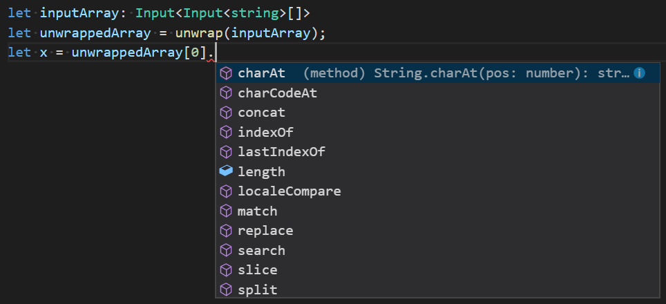

We at Pulumi love TypeScript for cloud apps and infrastructure, because of its rich type system and great ahead-of-time
typechecking – making for a more productive inner loop and helping to find errors sooner. The typesystem magic behind
how this works for infrastructure as code can be fascinating!
<!--more-->

A core part of the Pulumi [programming model]() is that we allow people to express complex
[dependency data]() that may _eventually_ be available.
Traditional JavaScript programming might expose that as a Promise<T>, but we’ve taken that one step further by introducing
    a type we call:

    type Input<T> = T | Promise<T> | Output<T>;

    // Like a Promise<T>, but also keeps track of dependency information so we can figure
    // out what the upstream/downstream impact is whenever any values change in the system
    interface Output<T> { /* ... */ }

This complex type can often show up as inputs to all Pulumi objects like so:

    interface VpcInput {
        ipAddresses: Input<Input<string>[]>;
    }

Breaking that down, it’s basically saying “I’ll take an array of strings. But those actual string values can individually be
strings, promises-of-strings, or strings-carrying-dependency-information.” It even goes one step beyond that, because the
entire array itself could be just an array-of-those-things, or a promise-of-array-of-those-things, or an
array-of-those-things-with-dependency-information. Whew…!

This approach is great for people producing the data. As a producer I can do:

    new Vpc({ ipAddresses: ["an-address"] }); // or even 
    new Vpc({ ipAddresses: ["an-address", computeAddressAsynchronously() ]}); // or even
    new Vpc({ ipAddresses: ["an-address", computeAddressAsynchronously(), someDependency.address ]}); // or even
    new Vpc({ ipAddresses: computeAnArrayAnyOfTheAboveAsynchrousnously() }); // etc. etc.

It’s super flexible, and let’s people naturally produce the values in whatever way they want without having to work too hard to
make it conform to some very narrow type.

However, while easy to produce, this can sometimes be difficult to consume. For example, if you wanted to take in that
`Input<Input<string>[]>` and then check if there was a very specific value in it, you might have to go through and do a bunch of
work. You’d have to first deal with potentially getting a `Input<string>[]` or a `Promise<Input<string>[]>` or even an `Output<Input<string>[]>`.
Then, once you even got to the underlying array, you’d have to deal with each potential element in it being a `string`… or a `Promise<string>`… or a… well… you get the idea. It’s not fun 😃.

Up until now, we’d supplied some simple helpers to make this more managable. Our helpers would effectively ‘unwrap’ one
layer of this sort of structure allowing you take the external value and deal with an internal value of a known shape.
So it effectively worked like this:

    function unwrap<T>(input: Input<T>): T { /* ... */ }

    // so, you could then write:
    const ipAddresses: Input<string>[] = unwrap(vpc.ipAddresses);

This helped things somewhat. But it still meant that as you processed that array you had to then unwrap each and every
element. As our data model has grown, and we’ve tackled more and more complex domains, we started seeing code start to
form the programming [Pyramid of Doom](https://en.wikipedia.org/wiki/Pyramid_of_doom_(programming)), where you just kept
on going deeper and deeper, unwrapping all the way. We started seeing this happen so often that we wanted to see if we
there was anything we could do to make life much nicer for people using our APIs and using these helpers.

Our core goal was to change our ‘unwrap’ function from just peeling away one layer of this onion, to peeling away _all_
layers. So, for example, if you started with an `Input<Input<string>[]>` you would just get back a plain old `string[]`
    that you could use completely naturally in all the ways you’d expect. We were initially uncertain if we could make
    this work, but thanks to the power of JavaScript and the expressivity of TypeScript, we think we found a great solution
    here.

We knew that providing the implementation such a function itself was not going to the true hard part. After all, we
already had the code to peel back one layer. So peeling back all the layers was more a matter of just having the function
call itself recursively when encountering things like arrays (or other objects that themselves contained `Input`s).

The real hard part came in when were trying figure out how would we even express this in a type-safe manner TypeScript.
After all, what’s the type signature when you effectively want to say:

    function unwrap(input: Input<...MaybeHasInputsOrPromisesOrOutputsArbitrarilyDeep...>): ThatThingWithAllTheDeepInputsPromisesAndOutputsErased;

This was a big head scratcher for a while. But after exploring some of the powerful new features that TypeScript has
been bringing about in recent releases, we finally found a great way to manage it. In the end, it ends up looking
something like this:

    type primitive = string | number | boolean | undefined | null;

    type Unwrap<T> =
        T extends Promise<infer U> ? UnwrapSimple<U> :
        T extends Output<infer U> ? UnwrapSimple<U> :
        UnwrapSimple<T>;

    type UnwrapSimple<T> =
        T extends primitive ? T :
        T extends Array<infer U> ? UnwrappedArray<U> :
        T extends object ? UnwrappedObject<T> :
        never;

    interface UnwrappedArray<T> extends Array<Unwrap<T>> {}

    type UnwrappedObject<T> = {
        [P in keyof T]: Unwrap<T[P]>;
    };

    function unwrap<T>(val: T): Unwrap<T>;

It’s a bit of a doozy containing a bunch of type definitions and the final function declaration that uses them. It
makes use of many advanced TypeScript typing features. Including ‘Union Types’ (the ‘primitive’ type), ‘Mapped Types’
(which ‘UnwrappedObject’ is an example of), ‘Conditional Types’ (the types with `?` and `:` in them) and ‘Inferred Types’
(the use of `infer U` in several places). You can read more about these in the
[Advanced Types](https://www.typescriptlang.org/docs/handbook/advanced-types.html) documentation.

Put together, the `Unwrap<T>` itself is effectively a recursively defined structural pattern matching type. You can see
it reference itself once you walk into `UnwrappedArray<T>` and `UnwrappedObject<T>` types. As it recurses, it matches
the type it has and then ‘peels away’ the wrappings that have been caused by `Promise<T>` and `Output<T>`. As it hits
Arrays and Objects, it dives deeper, unwrapping along the way. This is all manageable in TypeScript because it does this
sort of matching and unwrapping in a lazy fashion, allowing us to express what is effectively an infinitely large
pattern-matching type, without it having any trouble understanding it or applying it!

It amazes us how well this works and how expressive TypeScript is here. As you can see here, TypeScript completely
understands what’s going on and will give you all the great type-checking support and tooling that we know and love:

Since adding support for this, we’ve been able to start using this new function across our own codebase and we’ve seen
things get dramatically simpler. The pyramid-of-doom goes away and code becomes much cleaner and easier to read and
maintain. JavaScript helped us write this system easily, but thanks to TypeScript we can express these complex intents
and have the safety and understanding to do this sort of thing with confidence.

A special thanks to [@DanielRosenwasser](https://github.com/danielrosenwasser) over from the TypeScript team for
putting up with my constant pestering on how to work through this and deal with some especially thorny areas!
