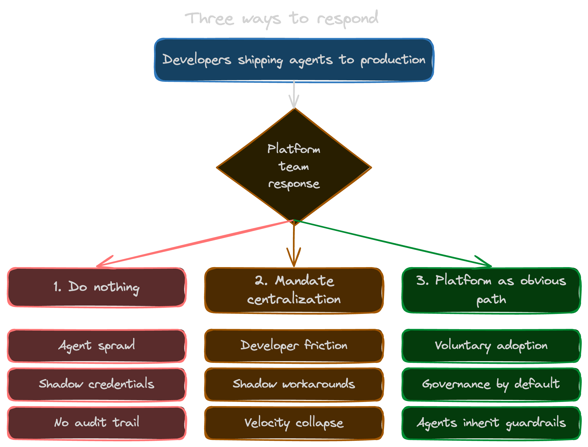

Somewhere in your company right now, a developer is building an AI agent. Maybe it's a release agent that cuts tags when tests pass. Maybe it's a cost agent that shuts down idle EC2 overnight. It's running, it's in production, and there's a decent chance the platform team doesn't know it exists.

This isn't a thought experiment. OutSystems just surveyed 1,900 IT leaders and the numbers are rough: 96% of enterprises run AI agents in production today, 94% say the sprawl is becoming a real security problem, and only 12% have any central way to manage it. Twelve percent. You can [read the full report here](https://www.outsystems.com/news/enterprise-ai-agent-report-2026/).

The real question is where those agents run. Inside the platform you've already built, or somewhere off to the side where nobody on the platform team can see them.
<!--more-->

## The new platform tension

Platform teams have always had two jobs that pull in opposite directions. Let developers ship without waiting on a ticket. Keep the infrastructure coherent while they do. Golden paths, review stacks, a catalog of components that don't fight each other.

Agents break the second half of that deal.

A developer with a sharp prompt can spin up an SRE agent that watches a queue, a release agent that cuts tags when the test suite goes green, or a cost agent that kills idle infra at 2 a.m. That's useful. It's also running on your production cloud account, using credentials you never provisioned, writing to systems you never approved, and the only audit trail is whatever the developer remembered to log. The [Salesforce 2026 Connectivity Benchmark](https://www.salesforce.com/news/stories/connectivity-report-announcement-2026/) pegs the average enterprise at twelve agents today, projected to grow 67% over the next two years. Most teams aren't ready for one, let alone twenty.

This is the same shape as every sprawl problem before it. I wrote about the last one in [*How Secrets Sprawl Is Slowing You Down*](/blog/how-secrets-sprawl-is-slowing-you-down/), and the pattern keeps repeating. When something useful gets cheap, it proliferates. When it proliferates without structure, it becomes a liability.

The clock is also ticking on the compliance side. The [EU AI Act's high-risk obligations kick in on 2 August 2026](https://artificialintelligenceact.eu/implementation-timeline/). [Colorado's AI Act goes live on 30 June 2026](https://leg.colorado.gov/bills/sb25b-004) after last year's delay. A folder of unreviewed agent scripts isn't going to hold up against either of those.

## Three ways to respond (only one of them works)

There are roughly three paths from here.

**Do nothing.** Accept the sprawl and hope nothing catches fire. This is the default, and it's also how you end up explaining to an auditor why some finance agent moved data between three systems last Thursday and nobody remembers which prompt triggered it.

**Mandate centralization.** Tell developers every agent has to be registered and approved before it runs. This sounds responsible on a slide, and it falls apart inside a sprint. Developers route around friction. If the official path takes a week and the unofficial path takes an afternoon, the unofficial path wins, and you've just pushed the sprawl underground where you can't see it anymore.

**Make the platform the obvious path.** Build the thing developers actually want to use. A place where an agent inherits the guardrails, credentials, policies, and audit trail by default, because that's what's on offer. Adoption becomes a side effect of shipping something good.

Option three is the only one that scales. It's also the one where most platform teams look at their existing stack and assume they need to build a pile of new scaffolding. I don't think they do, and the rest of this post is why.

## The seven things an AI agent needs from your platform

An agent needs seven concrete things from the platform it runs on. Each one maps to a Pulumi primitive you already own.

### 1. A trustworthy context lake

Agents are only as good as the context they can reason over. Drop a generic LLM into your cloud account and you'll get plausible-sounding nonsense, because the model has never seen your environment. What you actually need is a grounded source of truth: what resources exist, how they relate, which stack owns what, which version is running where.

[Pulumi state](/docs/iac/concepts/state-and-backends/) is already that. Your program graph, your stack outputs, your resource metadata, all of it adds up to a structured record of what you've actually deployed. [Pulumi Neo reasons directly over that graph](/blog/grounded-ai-why-neo-knows-your-infrastructure/), which is why it can tell you why a deployment drifted instead of guessing. I wrote the long version of that argument there. Short version: you already have the context lake. Point agents at it.

### 2. Pre-cleared integrations

An agent that needs to touch five systems shouldn't need five separate credential dances. That's where credential sprawl starts. Every agent gets a long-lived key, every key ends up in somebody's `.env`, and every rotation turns into an incident.

The Pulumi surface here is the [200+ providers](https://www.pulumi.com/registry/) plus [Pulumi ESC](/product/esc/) handling dynamic credentials through OIDC. An agent doesn't ask for an AWS access key. It asks ESC for a short-lived, scoped token bound to the environment it's allowed to operate in, and the token expires when the task ends. No static keys, no rotation pain, no awkward postmortem about how something got committed to GitHub. [The ESC patterns I walked through in the Claude skills post](/blog/top-8-claude-skills-devops-2026/) work just as well for an autonomous agent as they do for a human developer, which is really the whole point.

### 3. Governed actions

There's a real difference between "an agent can see your infrastructure" and "an agent can change your infrastructure." The second one is where you actually need structure. [Pulumi Deployments](/docs/deployments/) gives you that structure: defined workflows, controlled triggers, running inside your Pulumi Cloud boundary instead of whatever environment the developer happened to spin up. [The Automation API](/docs/iac/automation-api/) lets you build higher-order orchestration on the same primitives your developers already use.

The framing I keep coming back to goes like this. An agent shouldn't call `pulumi up` directly. It should submit an action to a governed pipeline that runs `pulumi up` on its behalf, inside an environment you control, with a log trail and the guardrails already in place. Same effect, very different threat model.

### 4. Deterministic policy

Real governance lives outside the prompt. "Please don't delete production" is a wish written into a system prompt, not an enforced control. And when an agent overrides your intent to do what it thought you meant, it's behaving exactly the way the technology was designed to behave.

[Pulumi Policies](/docs/insights/policy/) is the answer the IaC community landed on years ago: policy as code, written in a real programming language, evaluated deterministically at preview and update time. Disallow production RDS deletions. Require encryption at rest. Block S3 buckets with public ACLs. An agent running through Pulumi hits those gates whether it "wants" to or not, because the gates live in the pipeline and not in the prompt. This is the pillar most teams underweight, and it's the first one most auditors ask about.

### 5. An audit trail

When something goes wrong at 3 a.m. (and with enough agents running, something will), you need answers fast. What changed, who changed it, and why. Not just "which agent," but which version of which agent, triggered by what event, authorized by which policy, touching which resources.

Pulumi Cloud's activity log, the stack update history, and [ESC audit logs](/docs/esc/administration/audit-logs/) already capture all of that. Every update is versioned. Every secret access is logged. Every policy evaluation is recorded. When an agent submits a change through your Pulumi pipeline, it inherits that audit surface for free. The alternative is reconstructing an incident from a mix of Slack messages, container logs, and developer memory, which is roughly the state most teams without a platform are in today.

### 6. A review process

Not every agent action should wait for a human. But agents do need a promotion path, the same way new platform components do. Experimental, then reviewed, then trusted, then autonomous. That's exactly what `pulumi preview`, review stacks, and Deployments PR workflows already model for human contributors. An agent that wants to make a change should have to submit it the same way a junior engineer would. As a diff, with a plan, against a preview environment, until it earns the trust to skip steps.

This connects back to the pattern I laid out in [*Golden Paths: Infrastructure Components and Templates*](/blog/golden-paths-infrastructure-components-and-templates/). Golden paths were never only for humans. They're just paths, and agents can walk them too.

### 7. Human-in-the-loop approval

The last pillar is the one that keeps the other six honest. Some decisions shouldn't be automated, full stop. Production rollbacks outside business hours. Destructive changes above a certain blast-radius threshold. Anything that touches a regulated data boundary. For those cases, you want a forced human checkpoint that the agent can't route around.

Pulumi Deployments approvals already play that role for human changes. [Pulumi Neo's review steps](/product/neo/) add the AI-aware version: a structured plan, a diff, a named approver, and a record of what they decided and why. I walked through what this looks like in practice in [*Self-Verifying AI Agents*](/blog/self-verifying-ai-agents-vercels-agent-browser-in-the-ralph-wiggum-loop/). Short version: an agent that proposes is much safer than an agent that commits.

## Why IaC is the natural substrate for this

Step back from the seven pillars and look at what they have in common. Context, integrations, governed actions, deterministic policy, audit, review, approval. None of those are new problems that AI agents invented. They're the problems infrastructure-as-code has been quietly solving for a decade, for human developers.

Every meaningful agent action ends up being a change, whether that's to infrastructure, configuration, secrets, or state. IaC is the one layer in your stack that already treats change as the unit of work. Plan, preview, apply, record. If you want governance for agents and you don't want to build it twice, the most efficient move is to route agent changes through the same substrate your humans already use.

I made the same point from a different angle in [*Token Efficiency vs Cognitive Efficiency: Choosing IaC for AI Agents*](/blog/token-efficiency-vs-cognitive-efficiency-choosing-iac-for-ai-agents/). An IaC platform that models your world as a graph of typed resources is a much better reasoning surface for an agent than a stack of YAML or a bash script somebody wrote on a Friday. The structure is what makes it work.

## What this means for the platform engineer

There's a narrative floating around that AI is going to make platform engineers less relevant. I haven't seen it hold up against an actual production environment. Every stat I've looked at points the other way. Gartner expects [70% of enterprises to deploy agentic AI as part of IT infrastructure and operations by 2029, up from less than 5% in 2025](https://www.itential.com/resource/analyst-report/gartner-predicts-2026-ai-agents-will-reshape-infrastructure-operations/). LangChain's [State of Agent Engineering report already has 57% of teams running agents in production today](https://www.langchain.com/state-of-agent-engineering). And Gartner projects that [80% of large software engineering orgs will have a platform team by end of 2026, up from 45% in 2022](https://deviniti.com/blog/leadership-teamwork/40-devops-stats-for-2026/). More agents means more changes, more changes means more blast radius, and more blast radius means more need for the thing platform teams are uniquely equipped to provide.

Your classic responsibilities haven't gone anywhere either. Golden paths, service catalogs, CI/CD, on-call rotations, all of that is still yours. Agents are an additional layer that needs the same discipline. The upside is that if your platform already runs on a mature IaC surface, you're extending a muscle you've been building for years instead of growing a new one.

The developer-facing side matters too. A developer building an agent needs to know what's available to them, needs templates that work on the first try, and needs to see what teammates have already built so they don't start from a blank page. That's the territory [the Claude skills post](/blog/top-8-claude-skills-devops-2026/) and [*IDP Strategy: Self-Service Infrastructure That Balances Autonomy With Control*](/blog/idp-strategy-planning-self-service-infrastructure-that-balances-developer-autonomy-with-operational-control/) cover. That's the experience layer that makes developers actually choose your platform instead of routing around it. You need both sides working at once. The governance your security team cares about, and the experience your developers will actually reach for.

## Close the window

The agents your developers are shipping this week are going to outlive the experiment that started them. Some of them will become critical. At least one will cause an incident. At least one will eventually show up in an audit. All of them are going to be easier to govern if they were built on your platform from day one than if you try to wrap policy around them later.

If you want the longer view on where this is going, [*AI Predictions for 2026: A DevOps Engineer's Guide*](/blog/ai-predictions-2026-devops-guide/) is the companion piece. If you want the developer-facing version of the grounding argument, [*Grounded AI*](/blog/grounded-ai-why-neo-knows-your-infrastructure/) is what to read next.

Either way, here's where I land. The substrate for agent governance is already running in your stack. You've been pointing it at human changes for years. Now point it at the agents too.


