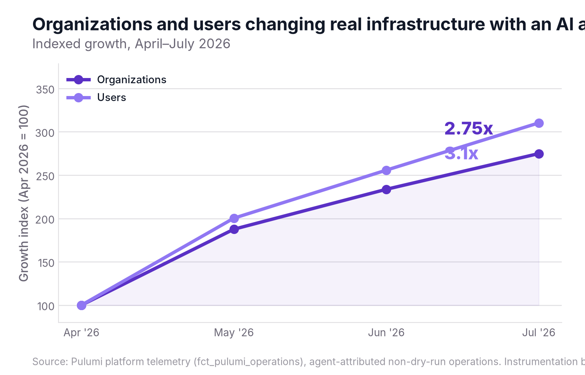
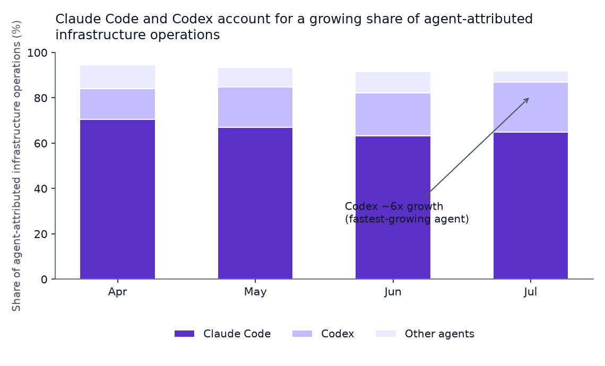
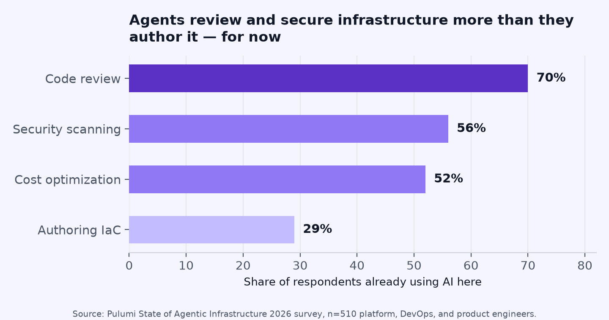
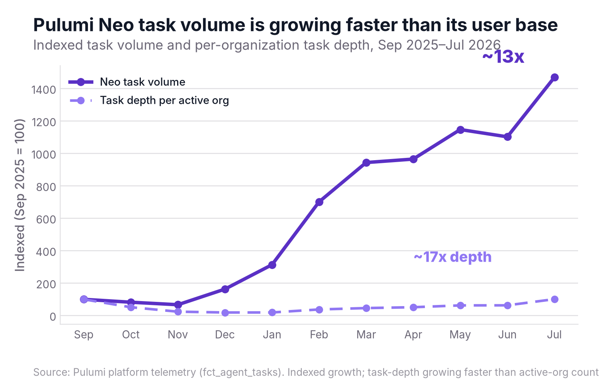

AI agents are changing real, running cloud infrastructure today, at a scale you can measure. The number of organizations using an AI agent to modify real infrastructure grew 2.75x in four months. Pulumi Neo task volume grew roughly 13x in less than a year. And the reach now extends past Pulumi programs into Terraform and HCL estates as well.

<!--more-->

We [made the case in May](/blog/the-agentic-infrastructure-era/) that [agentic infrastructure](/what-is/what-is-agentic-infrastructure/) — infrastructure as code, expressed in real programming languages, changed and verified by AI agents — is the natural substrate for agentic work, and that we expected agentic deployments to cross 20% of all Pulumi operations this year and 50%+ by the end of it. This post lays out the receipts: the platform telemetry, the survey data, and the third-party benchmarks showing agents already doing the infrastructure work, past the experimentation phase, with the frontier now reaching the Terraform and HCL estates most platform teams still run.

## The receipts

Start with the plainest signal we have: how many distinct organizations and users are using an AI coding agent to change real (non-dry-run) infrastructure, month over month.

- **Organizations** using an AI agent to change real infrastructure grew **2.75x** between April and July 2026.
- **Users** doing the same grew **3.1x** over the same window.

That's broad-based growth across real teams letting agents touch production-track infrastructure, well beyond a handful of power users kicking the tires. Breaking that volume down by agent shows the same story from a different angle:

- **Claude Code**-driven infrastructure operations grew roughly **3.4x** in four months.
- **Codex**-driven operations grew roughly **6x** over the same window, the fastest-growing agent in the mix.
- Across all agents, total agent-attributed real infrastructure operations grew several-fold over the same four months.

One caveat, in the interest of transparency: Pulumi only began tagging operations with agent attribution in April 2026, so these charts describe growth from that measurement baseline. The underlying trend was almost certainly building before we had the instrumentation to see it this precisely.

## What the work actually is

Growth curves answer "is this real," but not "what are agents actually doing all day." For that, we combined our own product telemetry with our [State of Agentic Infrastructure 2026 survey](/state-of-agentic-infrastructure/) of 510 platform, DevOps, and product engineers.

The clearest pattern: agents show up earliest and most heavily in *review and verification* work, well ahead of freehand authoring.

- **70%** of respondents already use AI in code review, **56%** in security scanning, and **52%** in cost optimization — but only **29%** say AI already authors their infrastructure code.
- **96%** use some form of AI in their infrastructure workflow today; only 4% use none.
- **45%** say agents already handle half or more of their team's infrastructure work, and that share is expected to rise to **52%** within six months.

That "review before write" pattern matches what we see inside [Pulumi Neo](/neo/), our own infrastructure agent. Neo's automated code review dispatches a rapidly growing volume of completed reviews every month — up roughly 2.5x month over month between June and July 2026 — and more than 99.99% of those reviews trigger automatically the moment a pull request opens. Nobody has to remember to ask Neo to check their work; it already has, before they finish their coffee.

Overall Neo task volume tells a complementary story about depth of use:

Neo's monthly task volume grew roughly **13x** between its first full month (September 2025) and July 2026. Over that same stretch, the number of organizations running Neo each month grew far more slowly than task volume did — meaning existing teams are asking Neo to do more work over time, with task depth per active organization growing roughly **17x**. Depth of use compounding faster than breadth of adoption is exactly the pattern you'd want to see from a tool that earns more trust the more you use it.

Governance hasn't caught up to autonomy yet, and our own survey data says so plainly: **81%** of respondents let agents change production infrastructure, but the overwhelming majority of that is gated — 62% require approval, versus 19% that run autonomously. On the guardrail side, 61% still use manual review gates and 54% use policy as code in CI. That's the honest state of the industry: stated trust in agents (63% trust them with production changes) is outrunning the guardrails teams have actually built, which is precisely the gap Pulumi Cloud, [Pulumi Insights policy packs](/docs/insights/policy/policy-packs/), and organization access tokens with role-based access control exist to close.

## The reach extends past Pulumi programs

Most of the conversation about agentic infrastructure — including our own thesis post — has focused on teams already writing IaC in Python, TypeScript, or Go. But the majority of the world's infrastructure still lives in Terraform and HCL, and [that estate is now catching up too](/blog/bring-your-terraform-estate-into-the-agentic-era/). We [reported in August](/blog/bring-your-terraform-estate-into-the-agentic-era/) that over 40% of our users now manage infrastructure using AI agents; the newer signal is that agentic work is reaching into the Terraform estates those same users haven't migrated yet.

Inside Pulumi Neo, customers have been bringing Terraform work into agent conversations since February 2026, and a broad and growing set of organizations are doing it. Many of these conversations progress well past initial exploration: a meaningful share reach completion, and of those, a good number produce real code changes — with a share of those going all the way to an opened pull request. We're leaning on that completion-to-PR funnel as the load-bearing evidence rather than a single top-line count, since the raw conversation count is a keyword match on an AI-generated summary we have not yet hand-audited end to end. Even on the conservative reading, agents are opening real pull requests against real Terraform estates today. (Terraform's share of overall Neo task volume is actually shrinking as total Neo usage grows elsewhere, so we're not claiming acceleration here — just that the door is open and customers are already walking through it.)

The infrastructure underneath is also filling in. [Pulumi Cloud now speaks the Terraform/OpenTofu remote-state protocol](/docs/iac/get-started/terraform/terraform-state-backend/), so teams can point an existing Terraform workflow at Pulumi Cloud without rewriting anything first: a small but growing set of organizations are already running state through it, with monthly run volume roughly tripling between May and mid-August. And [Pulumi's HCL runtime](/docs/iac/languages-sdks/hcl/) lets you run actual HCL programs on the Pulumi engine, with a similarly early set of organizations already running it in production or testing and usage climbing steadily each month since January 2026. Both are early — we're not going to dress up early-adopter usage as a market shift — but they're real, they're growing, and they mean you don't have to rip out Terraform to get agents working safely on your infrastructure.

## Why code is the substrate

Here's the mechanism behind all of this, and it's the same one we laid out in May: LLMs are trained on billions of lines of real programming languages and comparatively little bespoke infrastructure DSL. That gap shows up directly in benchmark results. A December 2025 study found LLMs succeed only **27.1%** of the time generating correct Terraform HCL from scratch ([arXiv:2512.14792](https://arxiv.org/abs/2512.14792)). A more recent evaluation of AWS CDK infrastructure edits put the best model at **34%** success, with others well below that ([arXiv:2606.05249](https://arxiv.org/abs/2606.05249)). Meanwhile, on general-purpose coding — the thing LLMs actually trained on at scale — frontier models have gone from 33% to 86%+ on SWE-bench Verified in under two years, [as we covered in the original thesis post](/blog/the-agentic-infrastructure-era/).

Joe Duffy made this argument at length this summer, in two talks that dovetail directly with the data above:



In ["The Last Mile Is Code"](https://www.youtube.com/watch?v=SOMEfFNPsew) at CascadiaJS 2026, Joe walks through why the last mile of agentic engineering — the part after the code is generated, where it has to become a real, running, verifiable change to a real system — is itself a coding problem, and why treating it as anything else (a config file, a YAML manifest, a proprietary DSL) throws away exactly the training data and tooling that make agents good in the first place.



At Meta's @Scale conference, in ["The Agentic Infrastructure Gap: In-Distribution Languages Make It a Coding Problem"](https://www.youtube.com/watch?v=P4PpoTH9ADc), he put it plainly: "Frontier models are trained on billions of lines of real languages like Python, TypeScript, and Go, and vanishingly little bespoke DSLs and manual procedures... we just need an oracle that can map code changes back to infrastructure outcomes." That oracle is `pulumi preview` and `pulumi up` — the same engine that has always turned a code diff into an infrastructure diff, now doing that work for an agent instead of, or alongside, a human.

That is the throughline connecting the benchmark scores, the growth charts, and the Terraform data above: the same in-distribution-language advantage that makes Claude Code and Codex good at general software engineering is exactly what makes them capable of infrastructure work when that infrastructure is expressed as code Pulumi's engine can verify. It's also why the gap closes for Terraform and HCL only partially — the engine can verify the outcome either way, but the input language itself is still comparatively out of distribution for the model, which is exactly what the 27.1% and 34% benchmark numbers above show.

## What this means for platform teams

None of this is safe by accident. It's safe because the same infrastructure-as-code engine that makes agentic work possible also makes it verifiable before anything ships:

1. **Preview as the oracle.** Every agent-proposed change runs through `pulumi preview` before it runs through `pulumi up`, giving both the agent and the human reviewer a concrete, line-by-line diff of what will actually happen to real infrastructure.
2. **Policy as code enforced in the loop.** [Pulumi Insights policy packs](/docs/insights/policy/policy-packs/) let you encode the guardrails 54% of survey respondents say they already run in CI, and enforce them automatically against every agent-proposed change, human-authored or otherwise.
3. **Agent identities and human-in-the-loop approval.** Agents work under their own Pulumi Cloud identity rather than borrowing a person's — [agent accounts](/docs/administration/organizations-teams/agent-accounts/) give an agent its own ephemeral account from first use, and organization access tokens with role-based access control scope what an agent can touch and record it in the audit log. So the 62% of teams who require approval before a production change can keep that gate exactly where they want it, whether the proposer is a person or a process.
4. **Automatic PR review as a second set of eyes.** Neo's automated review — dispatched on well over 99.99% of pull requests without anyone asking — catches problems the same way a senior engineer would, before a human reviewer even opens the diff.

If you're running Terraform or HCL today, none of this requires a rewrite first: [Pulumi Cloud's Terraform/OpenTofu state backend support](/docs/iac/get-started/terraform/terraform-state-backend/) and [HCL runtime](/docs/iac/languages-sdks/hcl/) mean you can get the same guardrails and the same agent-ready platform under your existing estate, and [migrate on your own timeline](/blog/bring-your-terraform-estate-into-the-agentic-era/).

## FAQs: agentic infrastructure and AI agents in production

### Can AI agents actually deploy real cloud infrastructure today?

Yes. Pulumi's platform telemetry shows the number of distinct organizations using an AI coding agent to change real, non-dry-run infrastructure grew 2.75x between April and July 2026, and Pulumi Neo's own task volume grew roughly 13x between September 2025 and July 2026 — measured production usage from a live platform.

### How do AI agents deploy cloud infrastructure using MCP?

An agent connected over the [Model Context Protocol (MCP)](/what-is/mcp-for-infrastructure-as-code/) calls infrastructure tools the same way it calls any other tool: it proposes a code change, runs a preview to see the exact diff against real infrastructure state, and — depending on your guardrails — either applies the change directly or opens a pull request for a human to approve first. The infrastructure-as-code engine underneath (in Pulumi's case, the same engine behind `pulumi preview` and `pulumi up`) is what turns the agent's code edit into a verified infrastructure outcome, which is what makes MCP-driven infrastructure changes auditable rather than opaque.

### What makes infrastructure as code agent-ready?

Two things: the language and the verifiability. Infrastructure as code written in a general-purpose language (Python, TypeScript, Go, C#, Java) is in-distribution for the same models that are already good at software engineering, unlike proprietary DSLs or YAML manifests. And a preview step that maps a code change to a concrete, before-and-after infrastructure diff gives both the agent and any human reviewer a verifiable oracle, rather than a change they have to trust blindly.

### Can an AI agent safely modify a Terraform or HCL estate?

Increasingly, yes. Pulumi Neo has already produced code and opened pull requests against real Terraform work, across a broad and growing set of customer organizations, since February 2026. Pulumi Cloud can also serve as a Terraform/OpenTofu-compatible remote state backend and run actual HCL programs through Pulumi's engine, so the same preview-and-policy guardrails apply to a Terraform estate as to a native Pulumi program, without requiring a rewrite first.

### What guardrails stop an AI agent from breaking production infrastructure?

The most common guardrails, per our 510-person survey, are manual review gates (61% of teams) and policy as code enforced in CI (54%). On top of that, most teams (62%) require explicit approval before an agent's change reaches production, versus 19% who let agents act autonomously. Platforms add automated code review that runs before a human ever looks at the diff, and dedicated, auditable agent identities so an agent's actions are never indistinguishable from a person's.

### How is agentic infrastructure different from traditional automation?

Traditional automation (a fixed CI/CD pipeline, a scheduled Terraform apply) executes a script a human wrote in advance. Agentic infrastructure means an AI agent is proposing the change itself — writing or editing the code, reasoning about what needs to happen, and only then handing off to the same preview-and-apply pipeline for verification. The agent takes on the role of author, distinct from the role a trigger plays in a fixed pipeline.

### Do AI agents work better with code-based IaC than with HCL or YAML?

Today, yes, and the benchmark data shows why: one December 2025 study found LLMs correctly generate Terraform HCL from scratch only 27.1% of the time, and a separate evaluation of AWS CDK infrastructure edits put the best-performing model at 34% success. General-purpose languages benefit from vastly more training data, and from tooling (type systems, tests, linters) that make it easier for an agent's proposed change to be checked before it ships. That gap is closing as platforms add verification layers around HCL and YAML, but it hasn't closed yet.

## Get in on the data yourself

The fastest way to see whether your own team fits this pattern is to try it. [Start a free Pulumi Cloud trial](/docs/get-started/) and point Neo at a real stack, or read the [full State of Agentic Infrastructure 2026 report](/state-of-agentic-infrastructure/) to see how 510 of your peers are actually using agents today. If you're still running Terraform, [Pulumi Cloud brings the same agentic platform to the estate you already have](/blog/bring-your-terraform-estate-into-the-agentic-era/) — no rewrite required to get started.
