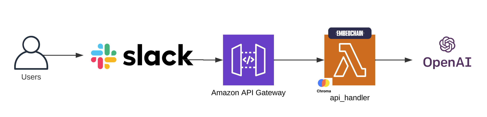

In the introductory blog post, we learned to [Create an AI Slack Bot to Chat with Your Data Using Embedchain, Pulumi on AWS](/blog/ai-slack-bot-to-chat-using-embedchain-and-pulumi-on-aws/).  However, we made a few concessions in the application logic to illustrate the broader picture of what we were able to achieve combining these three technologies.  Now that we have a solid foundation for deploying our Slack bot and querying our data, lets begin moving from proof-of-concept to production-ready, iteratively.

For reference, here's what our architecture looked like at the end of the first iteration.



To follow along, clone the project, `git clone https://github.com/catmeme/arti.git`

## Configuration

In our proof-of-concept, we defined our Embedchain config in our Python code.  Best practices dictate [strict separation of config from code](https://12factor.net/config), so the first thing we must address is getting the embedchain configuration out of our code.

A `config/config.yaml` made from our dict, is much easier to read, maintain and share.

```yaml
app:
  config:
    id: arti
    collect_metrics: False
    log_level: INFO
llm:
  provider: openai
  config:
    model: 'gpt-3.5-turbo-1106'
    temperature: 0.5
    max_tokens: 1000
    top_p: 1
embedder:
  provider: openai
chunker:
  chunk_size: 2000
  chunk_overlap: 0
  length_function: len
vectordb:
  provider: chroma
  config:
    collection_name: arti-ai
    dir: /tmp/db
    allow_reset: True
```

Our goal is to replace our big inline dict, and read a YAML file instead, following [this configuration specification](https://docs.embedchain.ai/api-reference/advanced/configuration).

```python
def ask_ai(question):
    """Ask the AI a question."""
    print(f"Processing question: {question}")

    app_config = {
        # hardcoded configuration we're moving out to YAML
    }

    loader = DirectoryLoader(config={"recursive": True})
    app = App.from_config(config=app_config)
    app.add("assets", loader=loader)

    return app.query(question)
```

To do that, though, we don't want to implement it directly as we already have a config module, `src/arti_ai/config.py`. Let's define a new method to read that YAML file, and pass it to our application at startup.

```python
class Config:
    def __init__(self, config_file="config/config.yaml", secrets_manager_client=None):
        self.secrets_manager_client = secrets_manager_client or boto3.client("secretsmanager")
        self.project_root = Path(__file__).resolve().parents[2]
        self.config_file = self.project_root / config_file
        load_dotenv()

    def get_embedchain_config(self):
        try:
            with open(self.config_file, 'r') as file:
                return yaml.safe_load(file)
        except FileNotFoundError as e:
            raise FileNotFoundError(f"Configuration file not found: {self.config_file}") from e
        except yaml.YAMLError as e:
            raise yaml.YAMLError(f"Error parsing YAML configuration: {self.config_file}") from e
```

Our `app.py` function simplifies, becoming more readable and flexible, we've even fixed a bug, making our application more portable with `config.project_root`, now arti can be run from any directory.

```python
def ask_ai(question: str):
    """Ask the AI a question."""
    print(f"Processing question: {question}")

    from embedchain import App
    from embedchain.loaders.directory_loader import DirectoryLoader

    loader = DirectoryLoader(config={"recursive": True})
    app = App.from_config(config=config.get_embedchain_config())  # inline dict has become this
    app.add(f"{config.project_root}/assets", loader=loader)

    return app.query(question)
```

Now that we've separated out our configuration, we can have multiple scenarios preconfigured.  [In the repository, there are a few examples](https://github.com/catmeme/arti/tree/main/config), including a private ai configuration, so that embedchain can be run 100% locally on your machine using `gpt4all`.  The configuration difference boils down to updating the LLM and Embedder to open-source models.

```yaml
llm:
  provider: gpt4all
  config:
    model: 'orca-mini-3b-gguf2-q4_0.gguf'
    max_tokens: 1000
    top_p: 1
embedder:
  provider: huggingface
  config:
    model: 'sentence-transformers/all-MiniLM-L6-v2'
```

Now that we have a dynamic approach to loading configuration from YAML, lets move on to improving the application architecture, which was not built to scale beyond relatively small data sets.

## Application architecture

### Knowing your limits

The current application architecture uses a single process with the expectation that a response is generated **within 29 seconds**, before the [API Gateway timeout](https://docs.aws.amazon.com/apigateway/latest/developerguide/limits.html#api-gateway-execution-service-limits-table).

[Slack also has an expectation](https://slack.dev/bolt-python/concepts#acknowledge), that we must acknowledge (or ack) a request **within 3 seconds**.

Currently, when the application receives a request, the API Gateway Lambda integration starts the application.  The lifecycle of this single process approach is diagrammed below.


If we break this into two processes, Data Processing, and API Handling, we give our API handler more dedicated time within that 29 seconds.  Simultaneously, we overcome another limitation, large amounts of data being loaded will take more than 29 seconds, by breaking out data processing into its own process, we can now have **up to [15 minutes](https://docs.aws.amazon.com/lambda/latest/dg/configuration-timeout.html) to load data using Lambda**.

We're going use the same docker image for both Lambdas by adding an entrypoint script that can take an argument to select the handler, essentially deploying the same application twice as different Lambda Functions.

Our `entrypoint.sh`

```shell
#!/usr/bin/env sh
set -e

. /app/venv/bin/activate

if [ -n "$LAMBDA_HANDLER" ]; then
    /app/venv/bin/python -m awslambdaric $LAMBDA_HANDLER
else
    arti "$@"
fi
```

Here's what the two process lifecycles look like separated


We have, however, introduced a new issue, and that is persistence.  Our single process approach always loads the data, and warm requests will have the data cached, so it was okay that the Chroma database was ephemeral, it could always be recreated on the fly.

When our corpus is many gigabytes or terabytes, losing and recreating those embeddings for the vector database is a costly endeavor, both in time, and very likely monetarily.

How do we solve for that?

## Multi-tier architecture and data persistence

By putting our vector database into another tier, we don't couple its lifecycle with our application's.  It's pretty cool that we can have an ephemeral vector database in Lambda for demonstration purposes, but it's not an optimal configuration for production.

One option, is to deploy Chroma ourselves using a service such as EC2 or ECS, for example, but that incurs costs.  For the ease of this demonstration, we're going to use Pinecone, which Pulumi conveniently has a provider for.  Though, there are [many alternative options](https://docs.embedchain.ai/components/vector-databases).


Navigate to [Pinecone's homepage](https://www.pinecone.io), and click "Get started."  After confirming your account, login to Pinecone, and click "API Keys" in the sidebar.  Create a new API key for Arti.

After configuring our Pinecone API key in AWS Secrets Manager, we are able to define our Pinecone index in our `__main__.py` Pulumi program.

```python
import pulumi
import pinecone_pulumi as pinecone

pinecone_index = pinecone.PineconeIndex(
    f"{app_name}-pinecone-index",
    name="main-index",
    dimension=1536,
    metric=pinecone.IndexMetric.COSINE,
    spec=pinecone.PineconeSpecArgs(
        pod=pinecone.PineconePodSpecArgs(
            environment="gcp-starter",
            pod_type="starter",
            replicas=1,
        )
    ),
)

pulumi.export("output", {"value": pinecone_index.host})
```

## Handling data load events

In the proof-of-concept, we are abusing docker to distribute our data sources, this isn't optimal for a few reasons, the size of the docker image increases, which also increases build times.  Do our documents really belong in the container, what about privacy, triggering builds, lead time to get new data added, etc.?

The obvious next place to put our documents is [AWS S3 (Simple Storage Service)](https://aws.amazon.com/s3/).  We don't want to regress our existing implementation, which works locally as well as deployed to Lambda, so we abstract the concept of loading a path of assets, whether it's a local path or S3.  In the presence of an S3 bucket name, assume we intend to use that loader, otherwise use the directory loader.

```python
def get_loader_and_asset_root():
    """Select and configures the appropriate loader based on AWS S3 bucket presence."""
    app_bucket_name = os.getenv("APP_BUCKET_NAME")
    root_path = os.getenv("ASSETS_ROOT_PATH", "assets")
    asset_location = root_path

    # pylint: disable=import-outside-toplevel
    if app_bucket_name:
        from arti_ai.s3_loader import S3BucketLoader  # type: ignore

        loader = S3BucketLoader()
        asset_location = f"{app_bucket_name}/{root_path}"
    else:
        from embedchain.loaders.directory_loader import DirectoryLoader  # type: ignore

        loader = DirectoryLoader(config={"recursive": True})

    # pylint: enable=import-outside-toplevel

    return loader, asset_location


def load_data():
    """Load data from data sources."""
    print("Loading data")

    # pylint: disable=import-outside-toplevel
    from embedchain import App

    # pylint: enable=import-outside-toplevel

    app = App.from_config(config=config.get_embedchain_config())

    loader, asset_location = get_loader_and_asset_root()
    response = app.add(asset_location, loader=loader)

    return response
```

With our data loading logic figured out, we'll pass the `APP_BUCKET_NAME` in our Pulumi program to our Lambda Function, so it can retrieve the data.

```python
app_bucket = aws.s3.Bucket(
    f"{app_name}-bucket",
    bucket=f"{app_name}-bucket",
    # ...
)

lambda_environment = pulumi.Output.all(
    app_bucket.id,
).apply(
    lambda args: {
        "variables": {
            # ...
            "APP_BUCKET_NAME": args[0],
            # ...
        }
    }
)

app_event_lambda = aws.lambda_.Function(
    f"{app_name}-lambda",
    architectures=["x86_64"],
    environment=lambda_environment,
    image_uri=docker_image_lambda_event_handler.repo_digest,
    # ...
)
```

If you're new to Pulumi, you might be wondering what's going on with the `lambda_environment`, why isn't `app_bucket.id` referenced directly, and what is [pulumi.Output.all](https://www.pulumi.com/docs/concepts/inputs-outputs/all/)?  Simply put, this tells Pulumi to wait until the bucket is created before trying to use its name in a string we're building.  This is an important core feature of Pulumi that largely happens [by nesting Outputs](https://www.pulumi.com/docs/concepts/inputs-outputs/apply/#accessing-nested-output-values).  To learn more, see [Inputs & Outputs](https://www.pulumi.com/docs/concepts/inputs-outputs/).

## Triggering the data loader

When deployed, we're going to need something that doesn't require a local machine.  One method for loading data is to use a scheduled task.  [AWS EventBridge](https://docs.aws.amazon.com/eventbridge/latest/userguide/eb-what-is.html) makes that task simple, our Pulumi resource declarations are below.  We define a rule/schedule (pulled from stack configuration), add our target (the event handler Lambda), and setup permissions to invoke the Lambda function.

```python
event_rule_schedule = aws.cloudwatch.EventRule(
    f"{app_name}-event-rule-schedule",
    schedule_expression=data_load_event_rule_schedule,
    state=data_load_event_rule_state,
)

event_rule_target = aws.cloudwatch.EventTarget(
    f"{app_name}-event-target-schedule",
    rule=event_rule_schedule.name,
    arn=app_event_lambda.arn,
)

event_rule_target_permission = aws.lambda_.Permission(
    f"{app_name}-lambda-event-target-permissions-schedule",
    action="lambda:InvokeFunction",
    function=app_event_lambda.name,
    principal="events.amazonaws.com",
    source_arn=event_rule_schedule.arn,
)
```

Our event lambda handler looks something like

```python
import json

from arti_ai.app import load_data


def handler(event, context):
    print("Received event: " + json.dumps(event, indent=2))
    print("Context AWS request ID: " + json.dumps(context, indent=2))

    load_data()

    return {"statusCode": 200, "body": json.dumps("Event processed successfully!")}
```

Locally, we can use our command-line interface (CLI), defined in `__main__.py`

```python
if args.command == "ask":
    handle_ask(args.question)
elif args.command == "load":
    load_data()
elif args.command == "reset":
    reset_data()
else:
    parser.print_help()
```

Any of our YAML configuration files should work with the following commands:

```shell
arti ask "what can you tell me about fruits and vegetables?"
arti load
arti reset
arti -h
```

You could manage your live Pinecone data this way, whether you should is highly dependent on the use case.

## Wrapping up

We reflected on the project that was presented in [the original post](/blog/ai-slack-bot-to-chat-using-embedchain-and-pulumi-on-aws/), and reviewed short-comings with the proof-of-concept, working through improvements that touched upon architecture, application design, and infrastructure.  Specifically, we have moved application configuration out of code into YAML, decoupled data-loading from querying, broken out our vector database to another tier, and integrated our application with AWS EventBridge to trigger scheduled tasks.

Our delivery on the concept was expedited by utilizing services that aligned with our improvements, and Pulumi helped us achieve our architecture changes using familiar patterns in just a few lines of code.

In the next post in this series, we'll continue to make iterative improvements to both our applications and infrastructure, and start getting deeper into RAG.

As always, we welcome your feedback and contributions in the [Pulumi Community Slack](https://slack.pulumi.com/), [GitHub repository,](https://github.com/pulumi/pulumi) and [Pulumi Community Discussions](https://github.com/pulumi/pulumi/discussions).

New to Pulumi? Signing up is easy and free. [Get started today](/docs/get-started/)!

Happy AI building!
