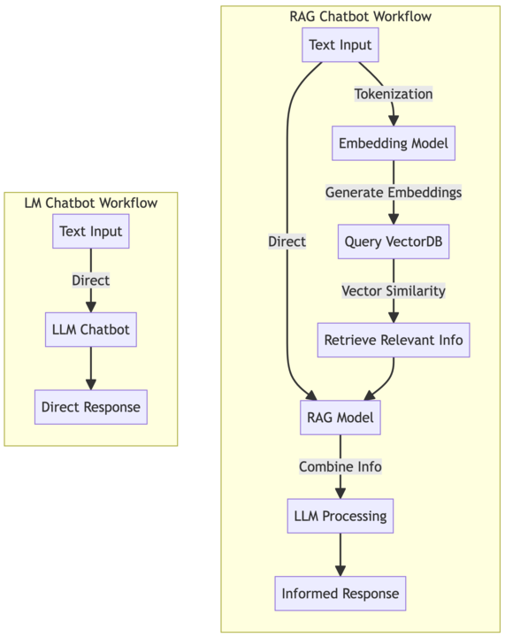

The integration of artificial intelligence (AI) to improve user experiences is gaining popularity in today's world. One fascinating application of AI is the creation of chatbots, which can engage users in conversation and provide helpful information or services.

In this blog post, we'll explore the process of building an AI-powered Slack bot
using [Embedchain](https://docs.embedchain.ai/get-started/quickstart), a Retrieval-Augmented Generation (RAG) framework
powered by [LangChain](https://python.langchain.com/docs/get_started/introduction). Additionally, we'll deploy our bot
on AWS using [Pulumi](https://www.pulumi.com), a modern infrastructure as code (IaC) platform.

## What are LLMs and RAG chatbots?

Large Language Models (LLMs) are sophisticated AI models trained on vast amounts of text data, enabling them to generate human-like text responses.  Retrieval-Augmented Generated (RAG) is a cutting-edge approach to chatbot development that combines the capabilities of LLMs with information retrieval techniques. RAG chatbots can generate responses based on both the input query and relevant information retrieved from a knowledge base, resulting in more contextually relevant and informative interactions.



## Embedchain

Embedchain is an RAG framework powered by LangChain. It simplifies the process of creating RAG applications by providing high-level abstractions that reduce the complexity of AI technologies. With Embedchain, developers can focus on defining conversational flows and configuring the bot's behavior using YAML configuration files, rather than dealing with low-level implementation details.

Embedchain supports configuration for various [data sources](https://docs.embedchain.ai/components/data-sources/overview), [LLMs](https://docs.embedchain.ai/components/llms), [vector databases](https://docs.embedchain.ai/components/vector-databases), [embedding models](https://docs.embedchain.ai/components/embedding-models), and [evaluation](https://docs.embedchain.ai/components/evaluation).

## Creating a Slack bot


Start by cloning the project:

```shell
git clone https://github.com/catmeme/arti.git
cd arti
```

The files within the [`src/arti_ai`](https://github.com/catmeme/arti/tree/main/src/arti_ai) directory can be summarized as:

1. The [AI application](https://github.com/catmeme/arti/blob/main/src/arti_ai/app.py)
2. The [Slack application](https://github.com/catmeme/arti/blob/main/src/arti_ai/slack_app.py)
3. A [configuration module](https://github.com/catmeme/arti/blob/main/src/arti_ai/config.py)
4. A [CLI entrypoint](https://github.com/catmeme/arti/blob/main/src/arti_ai/__main__.py)

The fourth file isn't strictly necessary, but it illustrates a design pattern. The main application, `app.py`, is imported by `slack_app` but also `__main__.py`. This makes it easy to add additional user interfaces, such as APIs, or other chat services with minimal code.

### The AI application

Let's start with "the brain", our Embedchain application. Below is a simple example (using explicit configuration for clarity). This code expects that `OPENAI_API_KEY` is populated in your environment.  `export OPENAI_API_KEY=<your key>` to experiment with the code below.

```python
from embedchain import App

app_config = {
    "app": {
        "config": {
            "collect_metrics": False,
            "log_level": "INFO",
        }
    },
    "llm": {
        "provider": "openai",
        "config": {
            "model": "gpt-3.5-turbo-1106",
            "temperature": 0.5,
            "max_tokens": 1000,
            "top_p": 1,
        },
    },
    "embedder": {"provider": "openai"},
    "chunker": {"chunk_size": 2000, "chunk_overlap": 0, "length_function": "len"},
    "vectordb": {
        "provider": "chroma",  # we're writing to a vectordb in memory in lambda
        "config": {"collection_name": "arti-ai", "dir": "/tmp/db", "allow_reset": True},
    },
}

app = App.from_config(config=app_config)
app.add("https://www.pulumi.com/docs/", data_type="docs_site")
app.query("What is Pulumi?")
```

See how easy it was for us to configure our application, an LLM, an embedding model, chunker and vector database? Then we added a datasource, which is abstracting away more complex logic for us. The simple line `app.add("https://www.pulumi.com/docs/", "docs_site")` ends up crawling the website, chunking the documents, generating embeddings and inserting them into our vector database.

The `app_config` reference is the [Embedchain configuration schema](https://docs.embedchain.ai/api-reference/advanced/configuration).

### The Slack application

Now that our brain is built, we need a way for our users to interact with it. [Slack Bolt](https://slack.dev/bolt-python/tutorial/getting-started) is an official library for building Slack bots.

Follow their instructions to [create a new Slack app](https://api.slack.com/start/quickstart).

#### OAuth & permissions

* `chat:write`
* `channels:read`
* `commands`
* `im:read`
* `im:write`
* `users:read`
* `users:write`

#### Event subscriptions

* `message.channels`
* `message.im`

#### Code breakdown

The example below demonstrates two commands. `knock knock` is a basic ping/pong test that you expect to respond immediately. It's not doing any complex logic, so that's easy. What's going on with this `/arti` command then? Slack requires your bot respond in 3 seconds or less. In our serverless architecture utilizing AWS API Gateway and Lambda, we're operating on thin margins when we have cold starts. This enables us to respond quickly to Slack, but start our longer running process.

It is worth noting that in this architecture we're still operating under 29 seconds for API Gateway's response timeout. This can be overcome in a number of ways, but that's out of scope for this demonstration.

```python
from slack_bolt import App

from arti_ai.app import ask_ai, config

slack_bot_token, slack_bot_signing_secret = config.get_slack_credentials()
app = App(process_before_response=True, token=slack_bot_token, signing_secret=slack_bot_signing_secret)


def process_request(respond, body):
    """Process the request and respond to the user."""
    question = body["text"]
    response = ask_ai(question)
    respond(f"Q: _{question}_ A: {response}")


def respond_to_slack_within_3_seconds(ack):
    """Respond to the user within 3 seconds."""
    ack("Thinking...")


app.command("/arti")(ack=respond_to_slack_within_3_seconds, lazy=[process_request])


@app.message("knock knock")
def ask_who(_message, say):
    """Ask who's there."""
    say("_Who's there?_")
```

### Configuration

The configuration module in this application normalizes retrieval of secrets from environment variables or AWS Secrets Manager. You may have noticed the Embedchain application configuration is hardcoded into the `app.py`. This isn't considered best practice, and may be a fun first step in making this project yours. Otherwise, stay tuned for future posts in this series.

## Deploying on AWS with Pulumi

Once our bot is ready, we'll deploy it on AWS using Pulumi. Pulumi allows us to define our cloud infrastructure using familiar programming languages like TypeScript or Python, making it easy to manage and scale our deployment.


It's important to note that in this selected architecture, we're working within a few limitations. Lambda's only writable directory is `/tmp` and it's limited to 500MB, and we need to use a Docker container to overcome the 250MB filesize limitation of our application, which we'll be bundling our data with.

[The Pulumi program](https://github.com/catmeme/arti/blob/main/deploy/pulumi/__main__.py) is broken up into the following sections:

1. **Config:** Get configuration from stack configuration, environment, and set up resource tagging
2. **Networking:** Set up VPC, VPC endpoints, security groups
3. **S3:** Bucket for later use
4. **Application:** Docker, Lambda, policies
5. **API:** API Gateway
6. **Output:** Stack outputs

Resources are contained within the VPC, policies and security groups exercise principle of least privilege, and logging is enabled. [`lambda_api_handler.py`](https://github.com/catmeme/arti/blob/main/src/arti_ai/lambda_api_handler.py) is responsible for handling API Gateway requests and imports the Slack app.

### Prerequisites

Create the following keys in Secrets Manager. These names are configurable in `deploy/pulumi/Pulumi.<stack>.yaml`. Slack and Pinecone are only necessary if they are configured for use.

| Secret Name                                             | Schema                                  |
|---------------------------------------------------------|-----------------------------------------|
| /catmeme/cloudplatform/sandbox/arti/access-token/openai | `{ "apiKey": "" }`                      |
| /catmeme/cloudplatform/sandbox/arti/access-token/slack  | `{ "apiKey": "", "signingSecret": "" }` |

### Makefile

Makefiles offer a powerful, flexible, and efficient way to manage project tasks, contributing to smoother development processes, better team collaboration, and more reliable product builds. See the project [README.md](https://github.com/catmeme/arti/blob/main/README.md) for more information.

```shell
cp -R /path/to/my/assets ./assets
cp sample.env .env
python3 -m venv venv
. venv/bin/activate
make develop
```

Ensure you have a matching AWS profile name to the one in the stack. The Makefile assumes `<environment>-deployment`. This script will attempt to copy the `deploy/pulumi/Pulumi.catmeme.arti.sandbox.us-east-1.yaml` as a base for configuration of the stack you deploy.

```bash
make deploy DEPLOY_ENVIRONMENT=dev
```

At this point, you should be able to use `/arti` to interact with your data via Slack.

## Conclusion

In this blog post, we've explored the process of building an AI-powered Slack bot using Embedchain and deploying it on AWS with Pulumi. By harnessing the capabilities of LLMs and RAG chatbots, we can create intelligent conversational agents that enhance user interactions and provide valuable insights. With Embedchain's high-level abstractions and Pulumi's infrastructure as code platform, developers can streamline the development and deployment of AI-powered applications, unlocking new possibilities for innovation in the digital space.

As always, we welcome your feedback and contributions in the [Pulumi Community Slack](https://slack.pulumi.com/), [GitHub repository,](https://github.com/pulumi/pulumi) and [Pulumi Community Discussions](https://github.com/pulumi/pulumi/discussions).

New to Pulumi? Signing up is easy and free. [Get started today](/docs/get-started/)!

Happy AI building!
