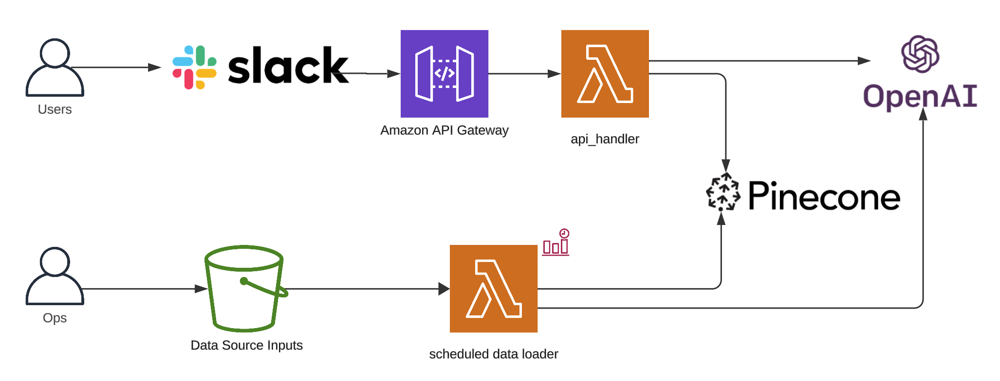
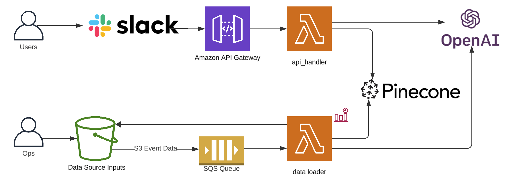
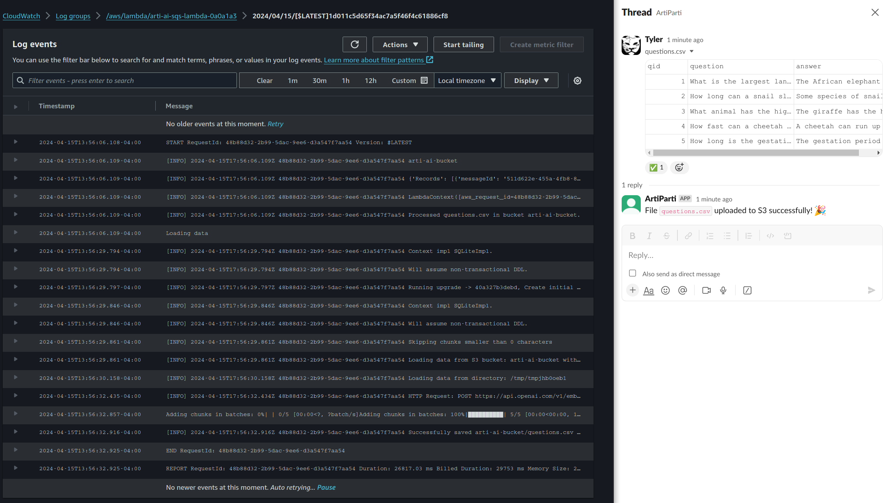
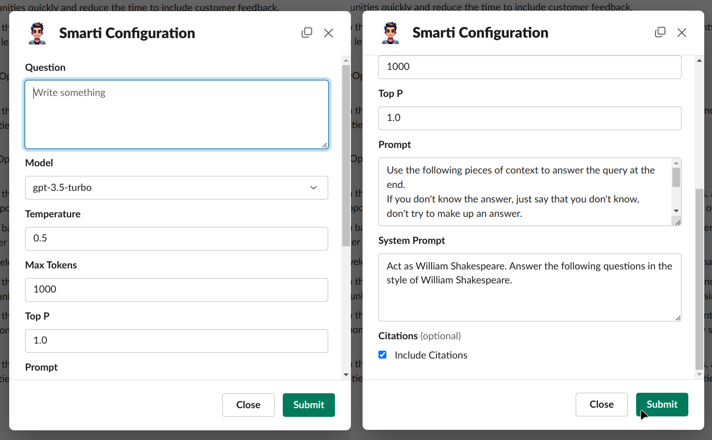
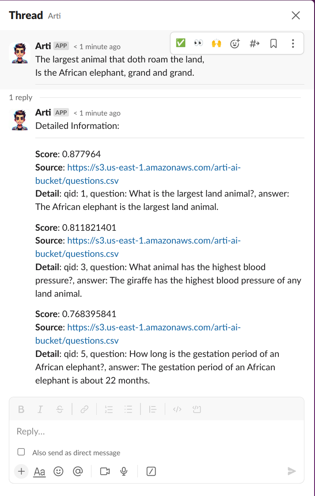
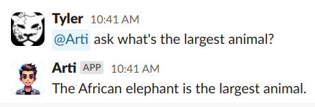
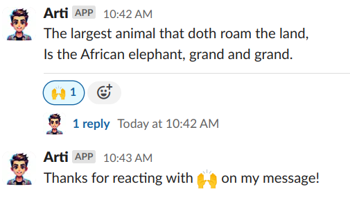

In the introductory blog post, we learned to [Create an AI Slack Bot to Chat with Your Data Using Embedchain, Pulumi on AWS](/blog/ai-slack-bot-to-chat-using-embedchain-and-pulumi-on-aws/), and continued with [Adding data to Pinecone using S3, Embedchain, and Pulumi on AWS for an AI Slack bot](/blog/ai-slack-bot-adding-data-to-pinecone-using-s3-embedchain-and-pulumi-on-aws/).

For reference, here's what our architecture looked like at the end of the second blog post.



To follow along, clone the project, `git clone https://github.com/catmeme/arti.git` or view it on [GitHub](https://github.com/catmeme/arti).

# S3 Events and SQS

AWS provides [a few ways to integrate with AWS S3 Events](https://docs.aws.amazon.com/AmazonS3/latest/userguide/notification-how-to-event-types-and-destinations.html), for this project, we're going to focus on the latest and most straight-forward, [S3 Event Notifications](https://docs.aws.amazon.com/AmazonS3/latest/userguide/EventNotifications.html).  Depending on your use case, integrating with [EventBridge](https://docs.aws.amazon.com/AmazonS3/latest/userguide/EventBridge.html) may make more sense.

While we can integrate S3 events directly with Lambda, what happens when we add 100's of files at the same time? Potentially, hundreds of Lambdas could be invoked simultaneously, which could become an issue depending on other factors. We'll solve for this by [Using Lambda with Amazon SQS](https://docs.aws.amazon.com/lambda/latest/dg/with-sqs.html), and [reserved concurrency](https://docs.aws.amazon.com/lambda/latest/dg/lambda-concurrency.html#reserved-and-provisioned).

Our Pulumi program is updated to add a Queue and integrate it with our new Lambda SQS handler (policies left out for brevity, you can view them in the `deploy/pulumi/__main__.py` in the project).

```python
# Add a queue
sqs_queue = aws.sqs.Queue(...)

# Add a docker image runtime for our Lambda SQS handler
docker_image_lambda_sqs_handler = docker.Image(...)

# Add Lambda SQS handler
app_sqs_lambda = aws.lambda_.Function(
    resource_name=f"{app_name}-sqs-lambda",
    environment=lambda_environment,  # We've added the sqs_queue.url here as well
    image_uri=docker_image_lambda_sqs_handler.repo_digest,
    opts=pulumi.ResourceOptions(depends_on=[docker_image_lambda_sqs_handler]),
    **common_lambda_options,
)

# Add event source mapping
event_source_mapping = aws.lambda_.EventSourceMapping(
    f"{app_name}-lambda-sqs-event-source-mapping",
    event_source_arn=sqs_queue.arn,
    function_name=app_sqs_lambda.name,
    enabled=True,
    batch_size=10,
)
```

Add the application code responsible for processing [S3 events coming from SQS](https://docs.aws.amazon.com/lambda/latest/dg/with-sqs.html#example-standard-queue-message-event).

```python
def handler(event, context):
    for record in event.get("Records", []):
        s3_event = json.loads(record.get("body", "{}"))
        for s3_record in s3_event.get("Records", []):
            object_key = s3_record.get("s3", {}).get("object", {}).get("key")
            if object_key:
                logger.info("Processed %s in bucket %s.", object_key, app_bucket_name)
                load_data(asset_location=f"{app_bucket_name}/{object_key}")

    return {"statusCode": 200, "body": json.dumps("Successfully processed S3 event(s) from SQS messages.")}
```

We also have a scheduled event that we setup for ingestion in the last post, which we're going to disable in favor of real-time events.

That's pretty much it on the infrastructure side, here's the updated diagram.



# Slack to S3 file upload bridge

So what do we do with this new functionality?  How do we expose it to the user?   The most obvious approach is to reuse our existing Slack integration.

We'll start by creating a Slack file upload bridge to S3, the bot watches for `file_shared` events on Slack and re-uploads files to our S3 bucket.

Using Slack Bolt, we add a new function `handle_file_upload` with the `@app.event("file_shared")` decorator, binding it to said event.  When that event occurs, it's processed, and the details of our file are retrieved, a new payload is constructed using `requests`, and the file gets uploaded to S3, this is our bridge.

```python
@app.event("file_shared")
def handle_file_uploads(event, say, client, logger):
    file_id = event['file']['id']
    channel_id = event['channel_id']

    # Fetch file details using the Slack API
    file_info = client.files_info(token=slack_bot_token, file=file_id)['file']
    file_url = file_info['url_private_download']

    # Download file content from Slack
    headers = {'Authorization': f"Bearer {slack_bot_token}"}
    response = requests.get(file_url, headers=headers, stream=True)

    if response.status_code == 200:
        # Upload the file to S3
        s3_client.upload_fileobj(
            Fileobj=response.raw,
            Bucket=os.getenv("APP_BUCKET_NAME"),
            Key=file_info['name']
        )

        # Fetch recent messages to find the correct timestamp
        messages = client.conversations_history(channel=channel_id, limit=10)['messages']
        for msg in messages:
            if msg.get('files') and any(f['id'] == file_id for f in msg.get('files', [])):
                # Found the message with the correct file
                message_ts = msg['ts']
                client.reactions_add(channel=channel_id, name="white_check_mark", timestamp=message_ts)
                # Respond in a thread to the message containing the file
                say(text=f"File `{file_info['name']}` uploaded to S3 successfully! :tada:", thread_ts=message_ts)
                return

        logger.error("No valid message found for reaction.")
```

Keep in mind, we're not doing any validation here yet. We're blindly copying files from Slack to S3 and having our data loader process them.  It's probably not a good idea to deploy this bot to a public Slack channel without more moderation/validation in place.

Here's what it looks like when we drag/drop a file into Slack now.  On the right, a file was shared with the bot in private message.  The bot acknowledged this upload with the checkmark reaction, the job is placed on the queue.  Shortly after, on the left, the SQS Lambda handler has finished processing the uploaded file.  We're now able to use the bot to talk about the uploaded files.



# Slack interactivity

In minutes, we were able to move from a scheduled task for processing files in a bucket, to real-time file processing integrated with Slack.   We have our `/arti` command we can use to interrogate the documents we just uploaded, but we're going to have a little more fun.

Thanks to [Slack Block Kit Builder](https://app.slack.com/block-kit-builder/), we can build a form that exposes all of the configuration options for the query method in Embedchain's app, providing the user with more options for interacting with the RAG model.

Our code to utilize the JSON we've crafted in the builder looks something like (we'll call this `/smarti`):

```python
@app.command("/smarti")
def open_smarti_modal(ack, body, client):
    ack()
    print("Opening SMARTI modal...")
    modal_file_path = Path(config.project_root) / 'config' / 'slack_modals' / 'chat.json'

    with open(modal_file_path, 'r') as json_file:
        modal_view = json.load(json_file)

    client.views_open(
        trigger_id=body["trigger_id"],
        view=modal_view
    )

```

And the code for handling that submission looks something like:

```python
def handle_smarti_submission(client, logger, body, view):
    values = view["state"]["values"]
    question = values["question"]["input"]["value"]
    model = values["model"]["input"]["selected_option"]["value"]
    temperature = float(values["temperature"]["input"]["value"])
    max_tokens = int(values["max_tokens"]["input"]["value"])
    top_p = float(values["top_p"]["input"]["value"])
    prompt = values["prompt"]["input"]["value"]
    system_prompt = values["system_prompt"]["input"]["value"]
    citation_options = values["citations"]["input"].get("selected_options", [])
    citations = any(option['value'] == 'true' for option in citation_options)

    ai_response = ask_ai(
        question=question,
        model=model,
        temperature=temperature,
        max_tokens=max_tokens,
        top_p=top_p,
        prompt=prompt,
        system_prompt=system_prompt,
        citations=citations
    )
    ...
```



Submitting that form results in a response such as below.  The bot honored our prompts, talking like Shakespeare, a thread is created, and citations were noted, showing where the data was retrieved from.



Lastly, if we want interact with the bot more publicly, then we can use the `app_mention` event.

```python
@app.event("app_mention")
def handle_app_mention(event, say, client):
    text = event['text']
    bot_user_id = client.auth_test()["user_id"]

    # Strip the mention of the bot to isolate the command and arguments
    command_text = text.split(f'<@{bot_user_id}>')[1].strip() if f'<@{bot_user_id}>' in text else text

    # Parse the command and arguments
    parts = command_text.split(maxsplit=1)
    if not parts:
        say("I need a command to do something useful!")
        return

    # Get the command and the remainder of the message as arguments
    command = parts[0].lower()
    args = parts[1] if len(parts) > 1 else ""

    if command == "ask":
        if args:
            response = ask_ai(question=args)
            say(response)
        else:
            say("Please provide a question to ask.")
    elif command == "list":
        list_data_sources(say)
    else:
        say(f"Sorry, I don't recognize the command `{command}`.")
```

Resulting in an interaction such as



Of course, this same methodology can be used on any of the events exposed by Slack.



To learn more about extending this bot, see [Slack Bolt's documentation](https://slack.dev/bolt-python/concepts#basic).

# Conclusion

In this blog post, we took our existing Slack bot which has a data loading process that loads documents from an S3 bucket into a vector database on a schedule, and we wired it up to behave in real time.

To expose this functionality to the end user, we created a bridge between file uploads to Slack and S3, allowing drag/drop capabilities of files in conversational chat.

Furthering our interactions with our application, we leveraged [Slack's Block Kit](https://api.slack.com/block-kit) to create a custom modal, and interact with events.

As always, we welcome your feedback and contributions in the [Pulumi Community Slack](https://slack.pulumi.com/), [GitHub repository,](https://github.com/pulumi/pulumi) and [Pulumi Community Discussions](https://github.com/pulumi/pulumi/discussions).

New to Pulumi? Signing up is easy and free. [Get started today](/docs/get-started/)!

Happy AI building!
