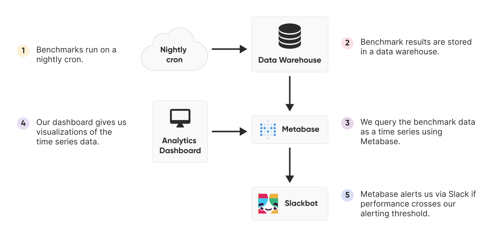
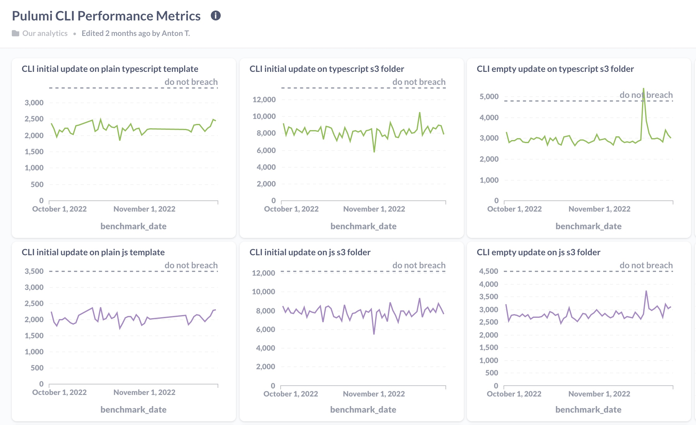
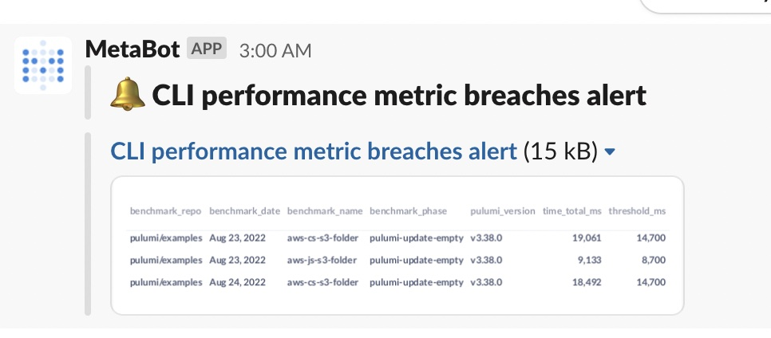
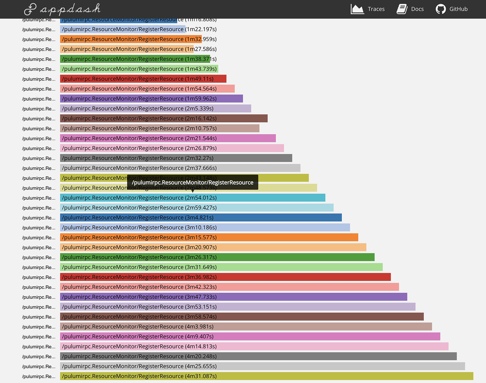

This is the first post in a series about performance optimizations we've made to the Pulumi CLI. Over the last six months at Pulumi, the Platform Team has been working on a project we call "Amazing Performance." Amazing Performance is a new initiative to improve the throughput and latency of the Pulumi CLI not only for power users but for everyone. By the end of June 2022, we assembled a list of issues containing both high-value improvements requiring a sizable investment and low-hanging fruit for quick wins. The full list, including the items we have yet to tackle, is contained in [a tracking issue on GitHub](https://github.com/pulumi/pulumi/issues/11598). This blog series will cover the highlights.

<!--more-->

This post has two sections. First, we'll describe the tools we built previously to track performance. Secondly, we'll recap a few quick wins. Future posts will detail our major wins as part of the Amazing Performance initiative.

## Measuring and Tracking Performance

The Amazing Performance initiative didn't come from a vacuum. We've been working to understand and improve the performance of the Pulumi CLI for years. Much of the earlier effort has focused on gaining performance *insights* – building an understanding of where our performance pains were the sharpest. The two most impactful tools at our disposal for understanding performance pains are our analytics dashboard and our OpenTracing support.

### Analytics Dashboard

We've built an analytics dashboard and monitoring system to let us know when performance dips. This system has three components: a suite of benchmarks, a data warehouse for analytics, and an alerting system.

**Benchmark Suite:** We've written a suite of benchmarks measuring different performance characteristics of the CLI. Each benchmark answers a simple question: "How long does the CLI take to run when the plan has no changes?" or "How long does the CLI take to run an empty plan?" In addition to these simple questions, we also have a few benchmarks to stress test creating many resources. We've implemented these benchmarks in Go, JavaScript, TypeScript, C#, and Python. Each night, we exercise the benchmarks, capturing samples. Once execution is complete, our nightly job uploads the results to a serverless function which stores them in our data warehouse.

**Warehouse Analytics:** We use Metabase to query and analyze data in our data warehouse. Pulumi engineers can log into Metabase and view our performance dashboard, which charts the nightly data as a time series, where each data point is the average of that night's samples.

Plotting the chart as a line graph allows us to identify any performance dips visually. Sometimes the data from our nightly runs are noisy, so it can take a few nights before we can attribute a change in the runtime to a change in the code. In the absence of noise, the line graph allows us to pinpoint the day the regression was introduced so we can leaf through the pull requests merged that day. More often, there's enough noise in the data that we go through a few days of PRs to find the regression.

Shortly after shipping the performance dashboard internally, we used the initial numbers we observed to establish a service-level objective (SLO).

Each language has an SLO for each of the benchmarks implemented in that language. Our goal for the SLO is to ensure that we set a "do not breach" expectation across the Platform Core team. We want everyone on the team to know when performance slips beyond an acceptable level.

**Alerting:** What good is an SLO if it's not observable? Whether the breach comes from a major regression or creeps up over time, any time a benchmark violates an SLO, a Slackbot alerts the Platform Core team that performance has slowed beyond an acceptable level. One objective we had for the Amazing Performance initiative was to ensure there were no alerts by the end of Q3 2022, which we achieved.

Lastly, we established the accuracy of these benchmarks as part of Amazing Performance. We compared the benchmark results we collected in the nightly job with numbers observed on our local laptops and found they were similar. Consequently, we believe our benchmarks are a good predictor of an actual developer's experience.

### Tracing Support

If you ever encounter a particularly sluggish Pulumi program and want to know what is taking so long, you can use [Pulumi's tracing support](/docs/support/troubleshooting/#tracing) to look into the details. When run with the `--tracing` flag, Pulumi will capture an [OpenTracing](https://opentracing.io/) trace of the program's execution, giving you an idea of where time is spent. We regularly trace programs large and small to see how we can shave off time.

Pulumi can send traces to a Zipkin server, or aggregate them to a local file and let you view them offline. If you provide an HTTP URI to the `--tracing` flag, then Pulumi assumes that URI points to a web server that accepts Zipkin-format traces, and it will send all tracing data there. If you provide a file URI instead, Pulumi spins up a local Zipkin server to which child processes send their traces. Once execution is complete, Pulumi aggregates the traces into a single local file and spins down the Zipkin server. You can run `PULUMI_DEBUG_COMMANDS=1 pulumi view-trace ./up.trace` to view the trace in an embedded web UI.

Not all spans are exceptionally well-named, and there are blind spots in our traces. However, traces are typically a reliable way to subdivide the program execution, so hotspots are easily identifiable. In the future, we plan to migrate to OpenTelemetry and improve our trace coverage. (Feel free to get in touch on the [Community Slack](https://slack.pulumi.com/) if you want to help with this effort!)

## Quick Wins for Performance Gains

Some of the work we completed for Amazing Performance targeted simple, isolated changes to make the system a little snappier. The rest of this blog details two quick examples.

### Skipping a Slow Import

We cut 300ms in boot time a class of programs by dynamically importing TypeScript.

When Pulumi evaluates NodeJS programs, it compiles TypeScript into JavaScript using [TS-Node](https://www.npmjs.com/package/ts-node). Consequently, Pulumi bundles the TypeScript compiler into its NodeJS runtime so TS-Node can perform the compilation. However, we noticed JavaScript programs were importing the TypeScript compiler even when unused.

Users typically hit this bug in one of two ways. Some users choose to write Pulumi programs in pure JavaScript. Pulumi was needlessly importing the TypeScript compiler, even when there was nothing to compile.

The second way a user might encounter this bug is in a more advanced deployment pipeline. One common advanced pattern in CI environments or with [Automation API](/docs/using-pulumi/automation-api/) is to typecheck Pulumi programs separately from execution. CI will enforce typechecking during pull requests to guarantee that all code hitting the repository's main branch is valid. Once it's typechecked and merged, the Pulumi program can precompile the TypeScript into JavaScript before execution. Finally, when it comes time to execute the Pulumi program, the deployment pipeline will run the compiled JavaScript, which is known to be well-typed. The motivation for precompiling comes from using your own preprocessor. Some customers want to ditch TS-Node for compilation and prefer to use [SWC](https://swc.rs/), [ESBuild](https://esbuild.github.io/), or other options for increased performance, or for consistency with the rest of their codebase.

In both scenarios, importing TypeScript when it's not used results in a 300ms slowdown. In [a small PR](https://github.com/pulumi/pulumi/pull/10214), we detect cases that don't require TypeScript and dynamically import it only when needed.

### Timely Lease Renewal

Another quick win involved the renewal of a new lease, which resulted in another 120ms shaved off of boot time. When the Pulumi CLI kicks off a preview, projects that use the [Service backend](/docs/iac/concepts/state-and-backends/#pulumi-service-backend) are authenticated with the Service so the CLI can fetch the current state. During authentication, the CLI exchanges user credentials for a short-lived access token. This access token is valid for a fixed amount of time, called a lease, after which they expire. The CLI can renew a lease by making another request to the Service to extend the duration for which the lease is valid.

We noticed that the first time the CLI renewed the lease, it blocked further execution until the renewal was complete, introducing an unnecessary slowdown of 120ms. [The fix](https://github.com/pulumi/pulumi/pull/10462) was to remove this renewal from the critical path by running it in the backend. By starting the HTTP call on a background thread and only blocking if the token is needed but not renewed, we've eliminated the 120ms slowdown.

Since this bug affects anyone using the Pulumi Service backend, most users will benefit from this improvement. It's small, [but it's noticeable](https://link.springer.com/chapter/10.1007/978-3-319-58475-1_4) to most users. Program start-up will feel slightly more snappy.

## Stay Tuned!

This post covered tools we built before Amazing Performance and a few smaller changes we made as part of the initiative. Future posts will describe some of the larger advances we made to drive Pulumi performance ever forward! Keep an eye out for our next post in the series!
