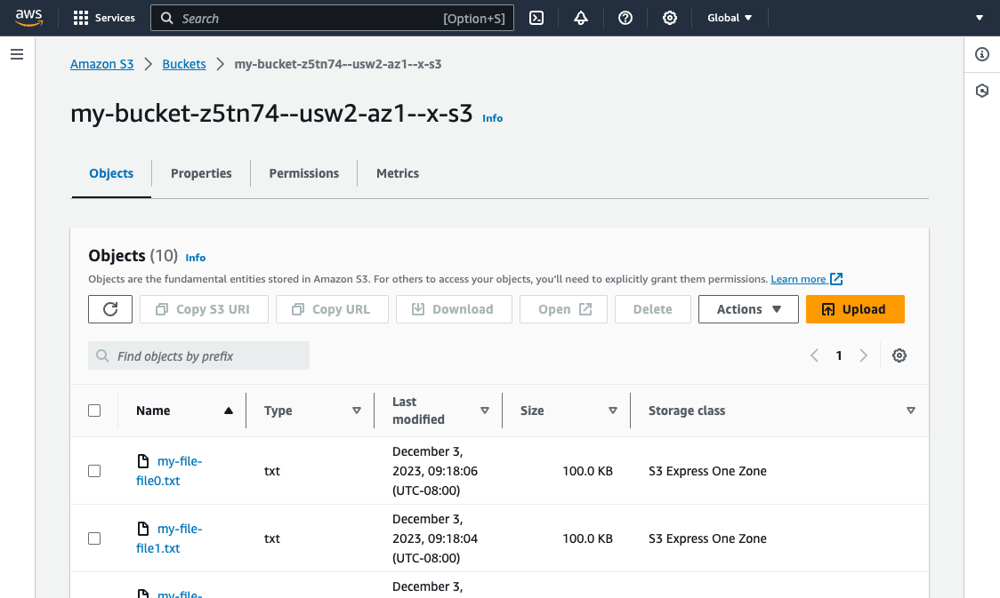
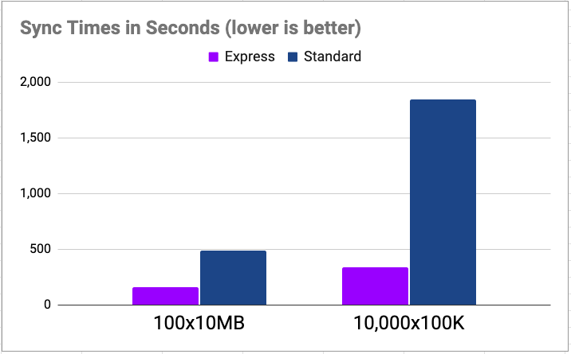

At AWS re:Invent 2023, AWS announced the new [Amazon S3 Express One Zone](https://aws.amazon.com/s3/storage-classes/express-one-zone/) storage class. This new service provides incredible performance by collocating your S3 buckets closer to the workloads that use the data. Compared to the S3 Standard storage class, the Express One Zone storage class is up to 10X faster, handles 100,000s of requests per second, offers single-digit millisecond latency, and can reduce request costs by 50%. This can be extremely beneficial for data-intensive workloads such as AI/ML, media, finance, realtime, and high-performance computing scenarios. This blog post shows how to get started with Amazon S3 Express One Zone using Pulumi infrastructure as code.

<!--more-->

## Introducing Amazon S3 Express One Zone

The new [Amazon S3 Express One Zone](https://aws.amazon.com/s3/storage-classes/express-one-zone/) storage class extends S3 with a new low latency option. This can improve runtime performance by spending less time moving data around. When creating a new bucket, you choose an [Availability Zone (AZ)](https://docs.aws.amazon.com/AmazonRDS/latest/UserGuide/Concepts.RegionsAndAvailabilityZones.html) in which that bucket will be placed, which of course should be collocated with the compute workload that will consume that data.

A bucket must be designated as an Express One Zone bucket at creation time. There are a few things that are unique to these buckets that make them different from ordinary S3 buckets:

* First, they are called "directory buckets" in AWS tools and in your infrastructure as code. This means how you interact with them sometimes differs from general-purpose S3 buckets.

* They have a specific naming convention: `[name]--[az]--x-s3`. The `[name]` part is a bucket name with the usual restrictions. `[az]` is the ID of the AZ in which the bucket will reside. Note that this is an ID (e.g. `usw2-az1`), not the name (e.g. `us-west-1c`); [read more here about the difference](https://docs.aws.amazon.com/ram/latest/userguide/working-with-az-ids.html).

* These buckets use region-specific endpoints, not the region-agnostic `aws-global` S3 endpoint scheme that general-purpose S3 buckets utilize. This means you'll need a new AWS CLI or SDK that understands the new endpoint scheme in order to access these buckets (CLI version 2.14.5 and greater supports them). It also means that sometimes when running `aws s3` and `aws s3api` commands, you will need to specify a `--region` explicitly. Other aspects of accessing these buckets differ, such as authorization, but the AWS SDK generally takes care of these for you.

This new storage class is not universally available in all regions and AZs yet, although Amazon has plans to expand regions over time. At the time of launch, `us-east-1` (US North Virginia), `us-west-2` (US Oregon), `eu-north-1` (Europe Stockholm), and `ap-northeast-1` (Asia Pacific Tokyo) are supported. Finally, because One Zone is explicitly single-AZ, there is always the risk of availability issues or data loss in the event that a single AZ becomes unavailable or is damaged; plan accordingly.

## New BucketDirectory Resource Type

You can create a new Amazon S3 Express One Zone bucket using the `aws s3api create-bucket` CLI command or in the AWS console. For this blog post, however, you'll use infrastructure as code instead, so that provisioning, updating, and managing our buckets is automated, reliable, and easy to scale.

To do this, you will use Pulumi's new [`aws.s3.DirectoryBucket` resource type](/registry/packages/aws/api-docs/s3/directorybucket/) in the AWS Classic package. It takes a few parameters:

* `bucket`, which is the name (conforming to the above-mentioned `[name]--[az]--x-s3` convention)
* `dataRedundancy`, which currently just accepts the sole value `"SingleAvailabilityZone"`
* `location`, which specifies the AZ ID to use
* `forceDestroy`, an optional boolean which, when set to true, allows deleting buckets that still have data in them (by default, only empty buckets can be deleted, to prevent accidental data loss)

> Pulumi's AWS Native package also supports Amazon S3 Express One Zone through the [`aws-native.s3express.DirectoryBucket` type](/registry/packages/aws-native/api-docs/s3express/directorybucket/). Its usage is very similar to the AWS Classic package.

Here is a simple program that declares a new Amazon S3 Express One Zone bucket:



{}

```typescript
import * as aws from "@pulumi/aws";
import * as pulumi from "@pulumi/pulumi";
import * as random from "@pulumi/random";

// Pick a single AZ for our S3 Express bucket.
const azId = aws.getAvailabilityZones().then(azs => azs.zoneIds.sort()[0]);

// Name our bucket according to S3 Express requirements ([name]--[az]--x-s3).
const bucketName = "my-bucket";
const suffix = new random.RandomString("bucket-name", {
    length: 6, upper: false, special: false });
const bucketFullName = pulumi.interpolate
    `${bucketName}-${suffix.result}--${azId}--x-s3`;

// Provision the bucket and export its ID.
const bucket = new aws.s3.DirectoryBucket(bucketName, {
    bucket: bucketFullName,
    dataRedundancy: "SingleAvailabilityZone",
    location: {
        type: "AvailabilityZone",
        name: azId,
    },
});

export const bucketID = bucket.id;
```

{}

{}

```python
import pulumi
import pulumi_aws as aws
import pulumi_random as random

# Pick a single AZ for our S3 Express bucket.
az_ids = aws.get_availability_zones().zone_ids
az_ids.sort()
az_id = az_ids[0]

# Name our bucket according to S3 Express requirements ([name]--[az]--x-s3).
bucket_name = 'my-bucket'
suffix = random.RandomString(
    'bucket-name', length=6, upper=False, special=False)
bucket_full_name = pulumi.Output.format(
    '{0}-{1}--{2}--x-s3', bucket_name, suffix.result, az_id)

# Provision the bucket and export its ID.
bucket = aws.s3.DirectoryBucket(bucket_name,
    bucket = bucket_full_name,
    data_redundancy = 'SingleAvailabilityZone',
    location = {
        'type': 'AvailabilityZone',
        'name': az_id,
    },
)

pulumi.export('bucketID', bucket.id)
```

{}



There are a few things to note here:

* We're picking the first AZ automatically in whatever region we've deployed to. Of course, we could hard-code this, or use a different technique for choosing an AZ. This approach makes it trivial to deploy the same project to multiple regions.

* We use a random string suffix for our bucket name, just to avoid accidental collisions if we were to pick the same bucket name as another user (or even ourselves when deploying multiple stacks for the same project). Normally Pulumi uses auto-naming to avoid this problem by default, but because the bucket name must conform to a very precise format, it does not for this resource type.

Now let's say we actually want to populate our bucket. We can use the standard [`aws.s3.BucketObjectv2` resource](/registry/packages/aws/api-docs/s3/bucketobjectv2/) to do this. This program adds an object for every file in our project's data directory, for example:



{}

```typescript
import * as fs from "fs";
import * as path from "path";

// ...

// Add a bucket object for every data file.
for (const file of fs.readdirSync("data")) {
    new aws.s3.BucketObjectv2(`my-file-${file}`, {
        bucket: bucket.id,
        source: new pulumi.asset.FileAsset(path.join("data", file)),
    }, { parent: bucket });
}
```

{}

{}

```python
import os

# ...

# Add a bucket object for every data file.
for file in os.listdir('data'):
    path = os.path.join('data', file)
    if os.path.isfile(path):
        aws.s3.BucketObjectv2(f'my-file-{file}',
            bucket = bucket.id,
            source = pulumi.asset.FileAsset(path),
        )
```

{}



## Creating and Accessing an Express One Zone Bucket

Let's go ahead and spin up a bucket. Assuming we have the above code in a valid Pulumi project (created with `pulumi new`), let's ensure it is configured to one of the regions that supports Amazon S3 Express One Zone, such as `us-west-2`:

```bash
$ pulumi config set aws:region us-west-2
```

Now let's create some random files in our data directory:

```bash
$ mkdir data
$ for i in {0..9}; do \
    dd if=/dev/urandom of=data/file${i}.txt bs=100K count=1; \
  done
```

Next, we'll run `pulumi up` which will show us a preview of the deployment and ask us to confirm, which we'll do:

```bash
$ pulumi up
     Type                          Name                        Status
 +   pulumi:pulumi:Stack           s3-express-one-zone-py-dev  created (4s)
 +   ├─ random:index:RandomString  bucket-name                 created (0.09s)
 +   ├─ aws:s3:DirectoryBucket     my-bucket                   created (2s)
 +   ├─ aws:s3:BucketObjectv2      my-file-file2.txt           created (1s)
 +   ├─ aws:s3:BucketObjectv2      my-file-file3.txt           created (1s)
 +   ├─ aws:s3:BucketObjectv2      my-file-file1.txt           created (1s)
 +   ├─ aws:s3:BucketObjectv2      my-file-file4.txt           created (1s)
 +   ├─ aws:s3:BucketObjectv2      my-file-file5.txt           created (1s)
 +   ├─ aws:s3:BucketObjectv2      my-file-file7.txt           created (2s)
 +   ├─ aws:s3:BucketObjectv2      my-file-file8.txt           created (2s)
 +   ├─ aws:s3:BucketObjectv2      my-file-file9.txt           created (2s)
 +   ├─ aws:s3:BucketObjectv2      my-file-file0.txt           created (3s)
 +   └─ aws:s3:BucketObjectv2      my-file-file6.txt           created (3s)

Outputs:
    bucketID: "my-bucket-z5tn74--usw2-az1--x-s3"

Resources:
    + 13 created

Duration: 11s
```

And there we go -- our new Amazon S3 Express One Zone bucket is available and its ID has been printed. We can check out its contents:

```bash
$ aws s3api list-objects-v2 \
    --region=us-west-2 \
    --bucket $(pulumi stack output bucketID)
```

Note that the storage class of these objects is listed as `EXPRESS_ONEZONE`:

```
{
    "Contents": [
        {
            "Key": "my-file-file6.txt",
            "LastModified": "2023-12-03T17:18:06+00:00",
            "ETag": "\"1254d05e685245ef9fdcca10f3c547bc\"",
            "ChecksumAlgorithm": [
                "CRC32"
            ],
            "Size": 102400,
            "StorageClass": "EXPRESS_ONEZONE"
        },
        ...
        {
            "Key": "my-file-file2.txt",
            "LastModified": "2023-12-03T17:18:04+00:00",
            "ETag": "\"d5310d3efd394c96bf5bf4379fc81bff\"",
            "ChecksumAlgorithm": [
                "CRC32"
            ],
            "Size": 102400,
            "StorageClass": "EXPRESS_ONEZONE"
        }
    ]
}
```

We can also see our bucket and its contents in the S3 Management Console:



General-purpose buckets and directory buckets have different tabs. There are also utilities available to import data from other buckets and perform batch operations.

## Benchmarking Express One Zone Performance

To demonstrate how much faster Express One Zone buckets are to access, let's run a few benchmarks. To do this, we set up two buckets -- an Express One Zone and another using Standard storage class -- along with an EC2 instance in the same AZ as our One Zone bucket.

For the first test, we'll allocate 100 files, each 10MB in size, for a total of 1GB of data. We'll then run an `aws s3 sync` from our EC2 instance to copy the entirety of the bucket locally. We'll loop this 10 times and simply measure how long it took for the copy to complete. Obviously this only tests read performance, but it will immediately give us a sense of how much faster Express One Zone can be:

* **Standard class**: 8m5s
* **Express One Zone class**: 2m41s
* **Speedup**: 3.0x

This was a nice bump in performance, however, the new storage class really shines for smaller objects. Storage latency typically impacts small files much more than larger files, as storage overheads and latencies become more of a bottleneck than streaming the data over the network. For the second test, we'll try 100,000 files, each 100K in size instead -- still 1GB total, but comprised of many smaller files:

* **Standard class**: 30m45s
* **Express class**: 5m36s
* **Speedup**: 5.5x

From 3x to more than 5x the performance! With more fine tuning of our `sync` parallelism and other factors, we could have eked out even more gains, but these simple tests quickly showed us how much faster Express One Zone can be for some very basic examples.

In summary, here are the results:




## Conclusion

In this post, we learned all about Amazon S3 Express One Zone, how to manage new buckets and their contents with infrastructure as code, and saw the awesome performance gains in action. To be up and running with Amazon S3 Express One Zone and infrastructure as code in minutes, go ahead and [get started with Pulumi for free today](/docs/get-started/). Happy cloud spelunking!
