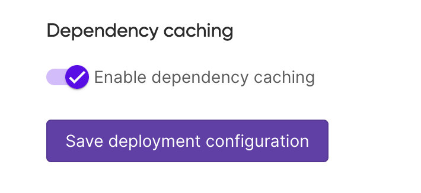

We’re excited to announce dependency caching for [Pulumi Deployments](/docs/pulumi-cloud/deployments/)! This new feature is designed to significantly speed up deployment times by reducing dependency installation time by up to 80%, ensuring faster and more efficient workflows for every Pulumi user.

When using Pulumi Deployments, installing dependencies can be a time-consuming part of a deployment. With dependency caching, Pulumi can reuse previously installed dependencies, allowing your deployments to skip redundant installation steps and focus on the task at hand. This optimization is especially helpful for frequent deployments, reducing both time and compute resources.

<!--more-->

## How dependency caching works

Pulumi Deployments now can automatically cache dependencies for [popular package managers](/docs/pulumi-cloud/deployments/faq/#dependency-caching), such as npm, pip, and go modules. When a deployment is triggered, Pulumi will:

1.	Check for an existing cache of your dependencies.
2.	If a cache already exists, Pulumi will reuse those dependencies, bypassing the need to install them from scratch.
3.	If a cache does not exist, or if dependencies have changed, Pulumi will install fresh dependencies and create an updated cache to be used for subsequent deployments.

The end result? Faster, more efficient deployments to push out infrastructure changes quickly.

## How to enable dependency caching

Dependency caching can be enabled through deployment settings, however you choose to configure them.

### In the Pulumi Console

1. Open the Pulumi Console and navigate to a stack's deployment settings (i.e. Stack page > Settings > Deploy).
2. Under the "Dependency caching" section, toggle the switch to enable dependency caching for your stack.
3. Click "Save deployment configuration" to apply the changes.



### Defined as code with the Pulumi Cloud Service provider

If you prefer to define your deployment settings as code, you can use the Pulumi Cloud Service provider to enable dependency caching. Here’s an example of how to do this in TypeScript:

```typescript
import * as pulumi from "@pulumi/pulumi";
import * as service from "@pulumi/pulumiservice";

const config = new pulumi.Config();

const settings = new service.DeploymentSettings("deployment_settings", {
    organization: "service-provider-test-org",
    project: "test-deployment-settings-project",
    stack: "dev",
    operationContext: {
        environmentVariables: {
            TEST_VAR: "foo",
            SECRET_VAR: config.requireSecret("my_secret"),
        }
    },
    sourceContext: {
        git: {
            repoUrl: "https://github.com/pulumi/deploy-demos.git",
            branch: "refs/heads/main",
            repoDir: "pulumi-programs/simple-resource"
        }
    },
    cacheOptions: {
        enable: true, // <-- enable dependency caching
    }
});
```

### Using the REST API

You can also enable dependency caching using the Pulumi REST API. See the [API documentation](/docs/pulumi-cloud/deployments/api/#cache-options) for more information.

For more information on how dependency caching works with Pulumi Cloud Deployments and the list of supported package managers, check out the [FAQ](/docs/pulumi-cloud/deployments/faq/#dependency-caching) on dependency caching.

## What’s next?

We’re continually working to enhance Pulumi Deployments and optimize the developer experience. Dependency caching is just one of the many ways we’re committed to improving this experience, and we’re excited to hear [your feedback](https://github.com/pulumi/pulumi-cloud-requests/issues/new/choose). Give it a try, and let us know how it improves your deployments!

Ready to get started? [Sign in to Pulumi Cloud](https://app.pulumi.com) and experience faster deployments today!
