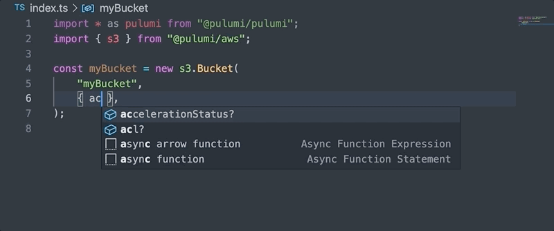

Here at Pulumi, we believe in leveraging the best features of programming languages to create a delightful development experience for our users. Today, we continue our contributions in this area by announcing cross-language support for `enum` types in our provider SDKs.

<!--more-->

## Enum types explained

An enum (short for enumerated) type is a data type consisting of a set of named values. In the Pulumi resource model, a property is an enum type when its value can only be set to a finite number of predetermined values. 

For instance, consider a simple S3 bucket.





```typescript
import * as pulumi from "@pulumi/pulumi";
import { s3 } from "@pulumi/aws";

const myBucket = new s3.Bucket("myBucket", { acl: "private" });
```




```python
import pulumi
from pulumi_aws import s3

my_bucket = s3.Bucket("myBucket", acl="private")
```




```csharp
using Pulumi;
using S3 = Pulumi.Aws.S3;

class MyStack : Stack
{
    public MyStack()
    {
        var myBucket = new S3.Bucket("myBucket", new S3.BucketArgs
        {
            Acl = "private",
        });
    }
}
```




```go
package main

import (
    "github.com/pulumi/pulumi-aws/sdk/v3/go/aws/s3"
    "github.com/pulumi/pulumi/sdk/v2/go/pulumi"
)

func main() {
    pulumi.Run(func(ctx *pulumi.Context) error {
        myBucket, err := s3.NewBucket(ctx, "myBucket", &s3.BucketArgs{
            Acl: pulumi.String("private"),
        })
        if err != nil {
            return err
        }
        return nil
    })
}
```




In the above code, the S3 `Bucket` resource has a property called `acl`, where we pass in the string `private` to indicate that this is a private bucket. 

If we look at the [resource docs](https://www.pulumi.com/docs/reference/pkg/aws/s3/bucket/#acl_nodejs), we can see that the `acl` property can only be set to one of a few different values: `private`, `public-read`, `public-read-write`, `aws-exec-read`, `authenticated-read` and `log-delivery-write`. The `acl` property is the perfect candidate for an enum type and is now emitted as one, so you can use the following code instead.




```typescript
import * as pulumi from "@pulumi/pulumi";
import { s3 } from "@pulumi/aws";

const myBucket = new s3.Bucket("myBucket", { acl: s3.CannedAcl.Private });
```




```python
import pulumi
from pulumi_aws import s3

my_bucket = s3.Bucket("myBucket", acl=s3.CannedAcl.PRIVATE)
```




```csharp
using Pulumi;
using S3 = Pulumi.Aws.S3;

class MyStack : Stack
{
    public MyStack()
    {
        var myBucket = new S3.Bucket("myBucket", new S3.BucketArgs
        {
            Acl = S3.CannedAcl.Private,
        });
    }
}
```




```go
package main

import (
    "github.com/pulumi/pulumi-aws/sdk/v3/go/aws/s3"
    "github.com/pulumi/pulumi/sdk/v2/go/pulumi"
)

func main() {
    pulumi.Run(func(ctx *pulumi.Context) error {
        myBucket, err := s3.NewBucket(ctx, "myBucket", &s3.BucketArgs{
            Acl: s3.CannedAclPrivate,
        })
        if err != nil {
            return err
        }
        return nil
    })
}
```




## IDE Superpowers

Enum properties provide discoverable and normalized constants that can be used in place of raw strings, allowing you to move faster with the added boosts of IDE tooling like type hints and autocomplete.

By using the provided constants, you can avoid having to refer back to documentation to remember the valid values and save precious moments in the development cycle that would be lost to debugging errors caused by typos.





















Enum types are included in the latest releases of the AWS and azure next-gen providers.

Take the new providers for a spin and let us know what you think in the [Community Slack](https://slack.pulumi.com/)!
