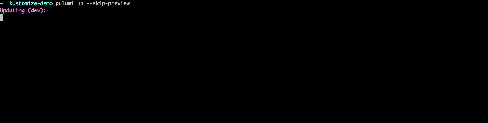

Kubernetes is complex, and there are many ways to manage Kubernetes resources. Pulumi supports many of these options, including native code SDKs, YAML, Helm, and now, Kustomize.

<!--more-->

Over the past year, we've heard from many users that they'd like to manage Kustomize resources directly with Pulumi.
The [v2.4.0 release] of our Kubernetes provider adds support for Kustomize to all of our SDKs (Go, TypeScript, .NET, Python).

## Working with local files

Let's see how to deploy a Kustomization from a local directory.



{}

```typescript
import * as k8s from "@pulumi/kubernetes";

new k8s.kustomize.Directory("helloWorldLocal", {
    directory: "./helloWorld",
});
```

{}

{}

```python
import pulumi_kubernetes as k8s

k8s.kustomize.Directory("helloWorldLocal",
                        directory="helloWorld")
```

{}

{}

```csharp
using System;
using System.Threading.Tasks;
using Pulumi;
using Pulumi.Kubernetes.Kustomize;

class KustomizeStack : Stack
{
    public KustomizeStack()
    {
        var files = new Directory("helloWorldLocal", new DirectoryArgs
        {
            Directory = "./helloWorld"
        });
    }

}

class Program
{
    static Task<int> Main(string[] args) => Deployment.RunAsync<KustomizeStack>();
}
```

{}

{}

```go
import (
	"github.com/pulumi/pulumi-kubernetes/sdk/v2/go/kubernetes/kustomize"
	"github.com/pulumi/pulumi/sdk/v2/go/pulumi"
)

func main() {
	pulumi.Run(func(ctx *pulumi.Context) error {
		_, err := kustomize.NewDirectory(ctx, "helloWorldLocal",
			kustomize.DirectoryArgs{
                Directory: pulumi.String("./helloWorld"),
            },
		)
		if err != nil {
			return err
		}

		return nil
	})
}
```

{}





## Working with git repos

We can also use Kustomizations directly from a git repository, local or remote,
by specifying the path to the directory.



{}

```typescript
import * as k8s from "@pulumi/kubernetes";

new k8s.kustomize.Directory("helloWorldRemote", {
    directory: "https://github.com/kubernetes-sigs/kustomize/tree/v3.3.1/examples/helloWorld",
});
```

{}

{}

```python
import pulumi_kubernetes as k8s

k8s.kustomize.Directory("helloWorldRemote",
                        directory="https://github.com/kubernetes-sigs/kustomize/tree/v3.3.1/examples/helloWorld")
```

{}

{}

```csharp
using System;
using System.Threading.Tasks;
using Pulumi;
using Pulumi.Kubernetes.Kustomize;

class KustomizeStack : Stack
{
    public KustomizeStack()
    {
        var files = new Directory("helloWorldRemote", new DirectoryArgs
        {
            Directory = "https://github.com/kubernetes-sigs/kustomize/tree/v3.3.1/examples/helloWorld"
        });
    }

}

class Program
{
    static Task<int> Main(string[] args) => Deployment.RunAsync<KustomizeStack>();
}
```

{}

{}

```go
import (
	"github.com/pulumi/pulumi-kubernetes/sdk/v2/go/kubernetes/kustomize"
	"github.com/pulumi/pulumi/sdk/v2/go/pulumi"
)

func main() {
	pulumi.Run(func(ctx *pulumi.Context) error {
		_, err := kustomize.NewDirectory(ctx, "helloWorldRemote",
			kustomize.DirectoryArgs{
                Directory: pulumi.String("https://github.com/kubernetes-sigs/kustomize/tree/v3.3.1/examples/helloWorld"),
            },
		)
		if err != nil {
			return err
		}

		return nil
	})
}
```

{}



## Learn More

If you'd like to learn about Pulumi and how to manage your
infrastructure and Kubernetes through code, [get started today](). Pulumi is open
source and free to use.

For further examples on how to use Pulumi to create Kubernetes
clusters, or deploy workloads to a cluster, check out the rest of the
[Kubernetes tutorials]().

As always, you can check out our code on
[GitHub](https://github.com/pulumi), follow us on
[Twitter](https://twitter.com/pulumicorp), subscribe to our [YouTube
channel](https://www.youtube.com/channel/UC2Dhyn4Ev52YSbcpfnfP0Mw), or
join our [Community Slack](https://slack.pulumi.com/) channel if you have
any questions, need support, or just want to say hello.

<!-- markdownlint-disable url -->
[v2.4.0 release]: https://github.com/pulumi/pulumi-kubernetes/releases/tag/v2.4.0
<!-- markdownlint-enable url -->
