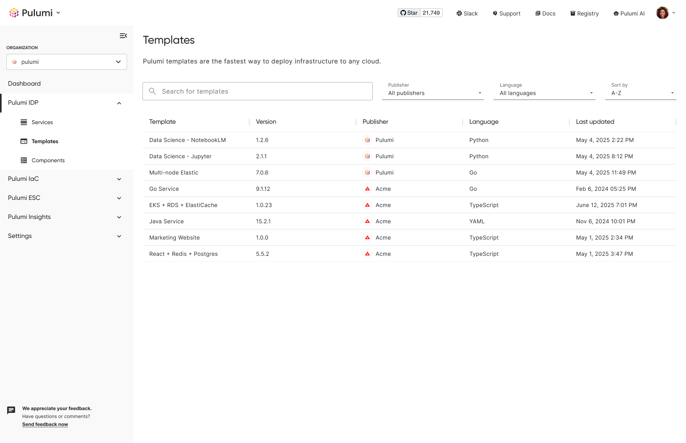
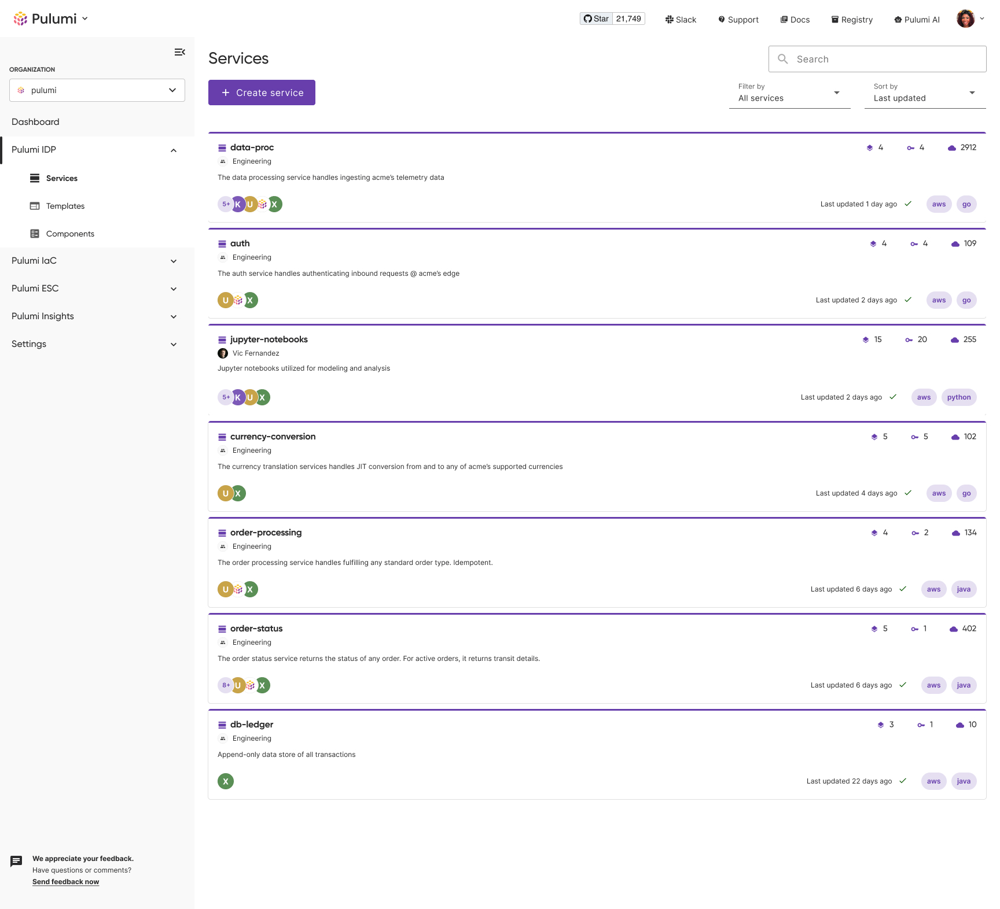

Today, we’re excited to introduce Pulumi IDP, the latest evolution of the Pulumi Cloud Platform, designed to help organizations define, deploy, and manage infrastructure at scale.

<!--more-->

For the past eight years, we’ve helped organizations simplify the deployment and management of their infrastructure. Pulumi launched at the height of DevOps, bringing general-purpose programming languages to infrastructure as code (IaC) at a time when application teams were often manually deploying their own infrastructure. Users were instantly hooked on the ability to leverage familiar programming paradigms to manage their infrastructure.

As we evolved, we introduced additional products to meet the needs of an expanding user base. We launched Pulumi Components to increase standardization and reuse across any programming language. We launched [Pulumi CrossGuard](https://www.pulumi.com/crossguard/) to codify policy as code and ensure compliance at scale. And last fall, we made [Pulumi ESC](https://www.pulumi.com/product/secrets-management/) and [Pulumi Insights](https://www.pulumi.com/product/pulumi-insights/) generally available to help tame secret sprawl and better manage all your cloud infrastructure.

At the same time that Pulumi was evolving, so too was the industry. DevOps ushered in a new way of shipping and maintaining software, but for many organizations, it brought about tool sprawl and Day 2 pain. These learnings, along with others, have led to the emergence of platform engineering and platform teams, which build tools and workflows that enable their internal users to provision infrastructure and deploy software.

## Platform Teams

The goal and promise of platform teams are to understand the needs of their users, creating scalable workflows to provision and maintain secure, compliant, and reliable infrastructure through [Internal Developer Platforms](/what-is/what-is-an-internal-developer-platform) without being blocked by other teams or having to maintain it themselves.

However, Platform teams have faced a harsh reality – offering flexible golden paths that account for security, compliance, and maintainability is inherently difficult. Most platform teams – especially in enterprises – must also build for multiple personas with varying consumption methods, from writing their own IaC code to point-and-click deployments.

Without establishing a foundation of standardized, reusable primitives that can be consumed in multiple ways, platform teams will stay trapped in a cycle of trying to build everything for everyone.

## Pulumi IDP

Pulumi IDP is a bottom-up framework that integrates with the entire Pulumi product suite, enabling platform teams to build and manage self-service workflows based on codified golden paths. We have launched a suite of new features and invested in existing ones to make the Day 0 through Day 2 experience of operating infrastructure seamless.

* Day 0: Establish a source of truth for standardized infrastructure building blocks that can be consumed in any workflow.
* Day 1: Provision infrastructure through flexible workflows based on standardized building blocks.
* Day 2: Establish context, gain insights, and perform operational tasks.

## Private Registry as the Source of Truth

Pulumi IDP is built on the Pulumi Private Registry, the source of truth for private components, templates, providers, and policies.

Pulumi has long focused on enabling organizations to author reusable infrastructure building blocks. Just recently, we introduced the [latest generation](/blog/pulumi-components/) of Pulumi components for encapsulating and reusing resources across programming languages. Reusable packages offer tremendous benefits, but major pain points have also emerged:

* Discoverability: Once a package is authored, it is often stored in git. For most organizations, especially enterprises, it becomes effectively undiscoverable; if a package isn’t discoverable, it won’t be used, and instead, something one-off will be written.

* Lifecycle Management: For organizations that are able to drive discovery and adoption, they encounter Day 2 issues, such as a lack of usage insights, performing updates, and more.

The Pulumi Private Registry was built to solve these issues and more. With a single pulumi publish command, platform engineers can ensure that their standardized building blocks are discoverable from a central location. “End-users can easily discover available packages, explore README files, access automatically generated API documentation, and learn how to install and use each package.

Driving standardized component and template utilization through the registry also affords usage insights for lifecycle management. For any package or template, platform engineers can understand where it is used and at which version. This is invaluable when trying to identify the impact of proposed package changes or when understanding version drift.

## Flexible Self-Service Workflows  

To ensure that users can consume private packages and templates ergonomically, we’re introducing new flexible workflow tools to meet the needs of any persona.

Platform teams can exhaust themselves designing, codifying, and publishing standardized patterns, but if they are not easily consumable, they won’t be used. Platform teams are often tasked with accommodating a spectrum of personas, ranging from users who want to scaffold infrastructure through components to non-technical users who want to point and click to deploy from a template. Each of their needs is valid, but the adage of “designing for everyone means designing for no one” can quickly take effect.

With Pulumi IDP’s bottom-up approach, this isn’t an issue. The same standardized, secure, and compliant packages and templates published in a private registry are the same ones that power self-service workflows.

### No-Code

In no-code workflows, users can instantly create and deploy Pulumi programs without dealing directly with underlying IaC code or stack configuration. The no-code workflow is built on Pulumi organization templates and stores stack config in Pulumi ESC, eliminating the need to write to a VCS like GitHub or GitLab. By storing config in Pulumi ESC, developers can also edit config on-demand and instantly redeploy.

### Low-Code

Users often need to compose their own Pulumi programs, but platform engineering teams want to ensure they are using approved components. With the new Pulumi Private registry and the latest generation of Pulumi components, that’s never been easier.

Platform engineers can author and publish components in any language. Users can then discover the available components through the private registry, add them as dependencies in a Pulumi YAML program, and deploy the infrastructure.

### Full-Code

In some organizations, platform engineers want to offer application teams a starting point without dictating how the infrastructure is deployed. To facilitate a local workflow, organizational templates are now available from the Pulumi CLI as well. Application developers can scaffold infrastructure using the same templates available from the private registry, directly from the convenience of their terminal.

For instances where a Pulumi program is written from scratch, the suite of Pulumi IaC languages is always nearby, with the ability to easily incorporate components to accelerate development.

## Organizational Context through Services

Once infrastructure is shaped and shipped, it must be managed. We know that contextually familiar infrastructure is easier to manage and extend. To help bring organizational context into Pulumi, we’re introducing Pulumi Services.

Services enable teams to logically group stacks, environments, and resources, creating representations that are familiar within their organization. The service entities can exist anywhere in Pulumi—across IaC projects, ESC projects, or different Insights Accounts.

Services also support properties to bring additional context through service properties. Service properties are metadata, including links to observability dashboards, Slack channels, and more.

## A New Era for Platform Teams

The Public Preview of Pulumi IDP is just a small portion of our vision to empower platform engineering teams. In the months ahead, we’ll be rapidly shipping features covering observability, documentation, testing, and more. We hope you’ll join us and provide feedback along the way as we usher in a new era of organizations shipping infrastructure and software at scale.
