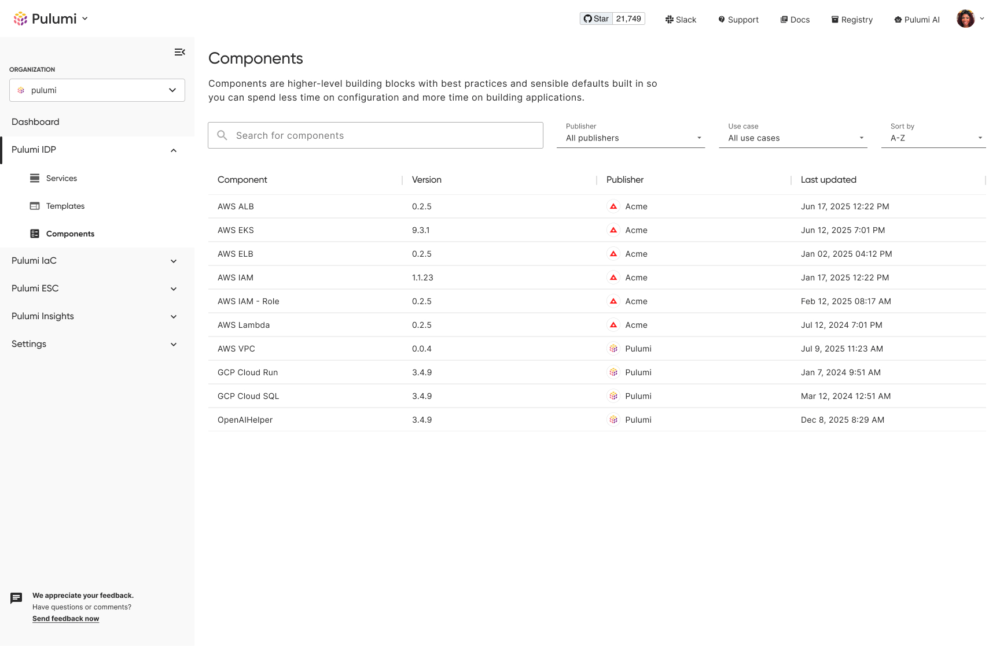
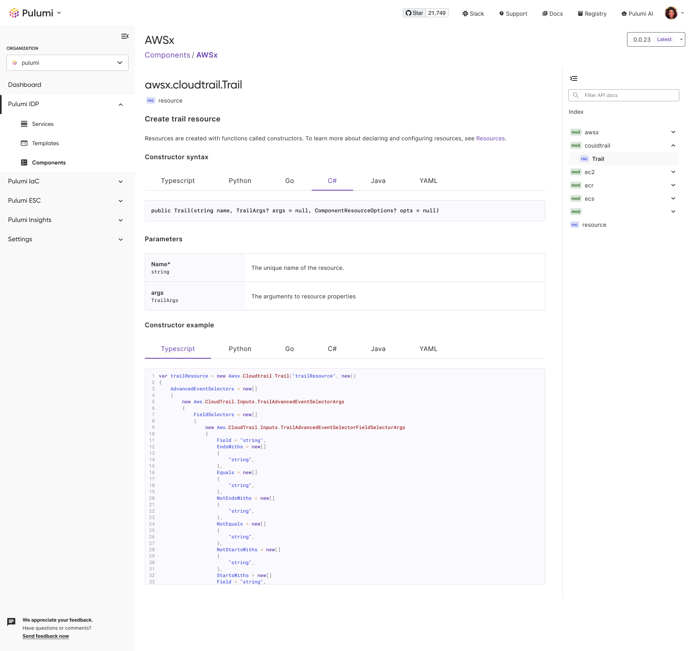
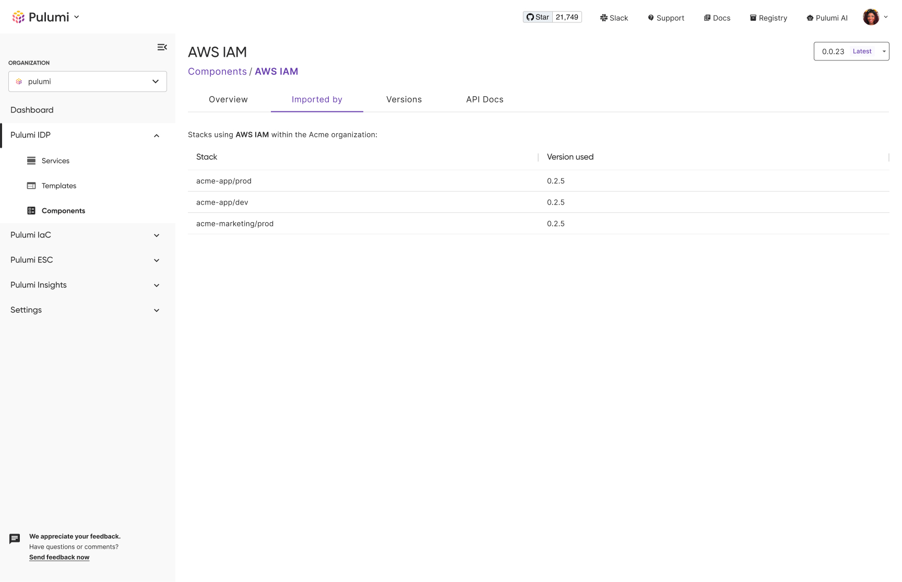

As part of the Pulumi IDP announcement at PulumiUP, we introduced the Pulumi Private Registry. For years, we’ve worked with organizations that have built their own internal developer platforms on top of Pulumi. During that time, we identified what we believe is the best method for creating flexible golden paths – a bottom-up approach that utilizes a central source of truth to drive golden paths. Thanks to Pulumi Private Registry, this approach has never been simpler.

<!--more-->

## Codified Security and Compliance

Platform teams use components and templates to standardize how resources and programs are shaped and provisioned. They use [Pulumi ESC](/docs/esc/) to automatically import secret dependencies and lease short-term credentials. They incorporate [IaC Policies](/docs/insights/get-started/add-policies/) to ensure that provisioned infrastructure remains compliant even when customized by developers. Publishing and consuming packages through the private registry guarantees platform teams can achieve the consistency, security, and compliance they want, without sacrificing the flexibility their developers need.

## Streamlined Publishing

The CLI publishing workflow is built with ergonomics in mind. Publishing a package is as simple as running a single CLI command, ensuring seamless integration in local or automated workflows. The publishing workflow supports publishing packages from public or private git repositories, package versioning, multiple organizations, and custom README paths.

## Simplified Discovery

Once published, developers can discover standardized and compliant building blocks from a developer-friendly, centralized location. Easily discoverable components and templates ensure developers can quickly reach for the necessary tools and eliminate the tendency to provision infrastructure in shadow workflows. Developers also get immediate context thanks to automatically generated API docs and consume READMEs.

## Free Day 2 Context

Day 2 operations comprise most of the effort when managing the infrastructure lifecycle. However, though common, maintaining, extending, and decommissioning infrastructure can feel like flying blind. With the Pulumi IDP’s bottom-up approach, driving building block publishing, discovery, and consumption through the private registry affords usage insights for free. Platform engineers can understand where components are used and at what version, simplifying the process of upgrading and decommissioning packages.

## Get Started Today

Pulumi IDP, including Pulumi Private Registry, is available as a Public Preview to all users. To get started, [sign up](https://app.pulumi.com/signup?utm_source=idp-private-registry) for a free acount, learn more about [Pulumi IDP](/docs/idp/get-started/), or [publish a package](/docs/idp/get-started/private-registry/) to the private registry.
