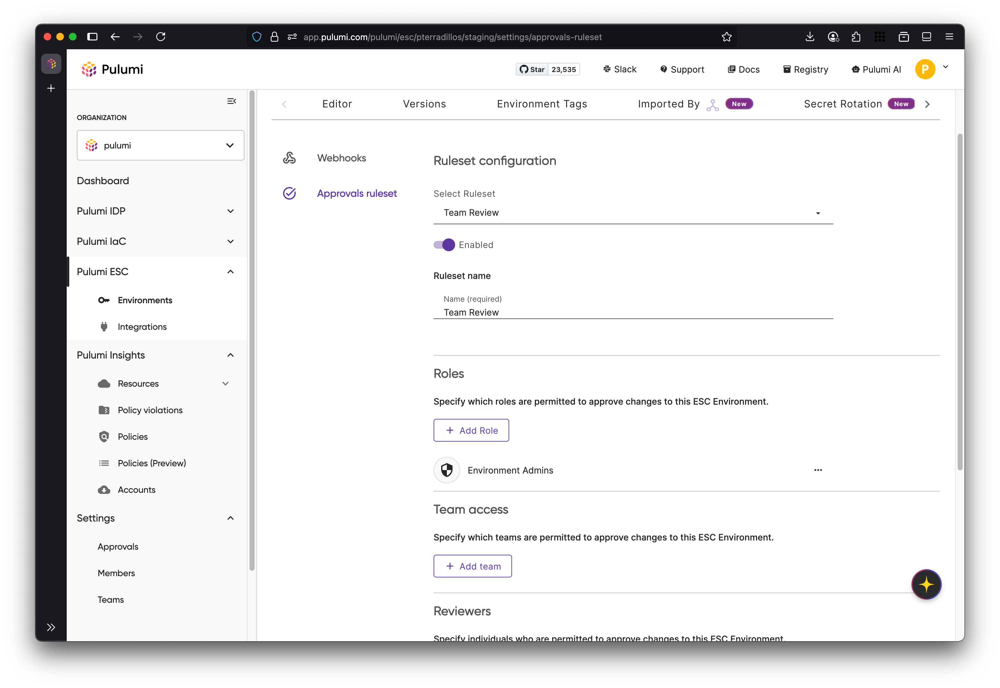
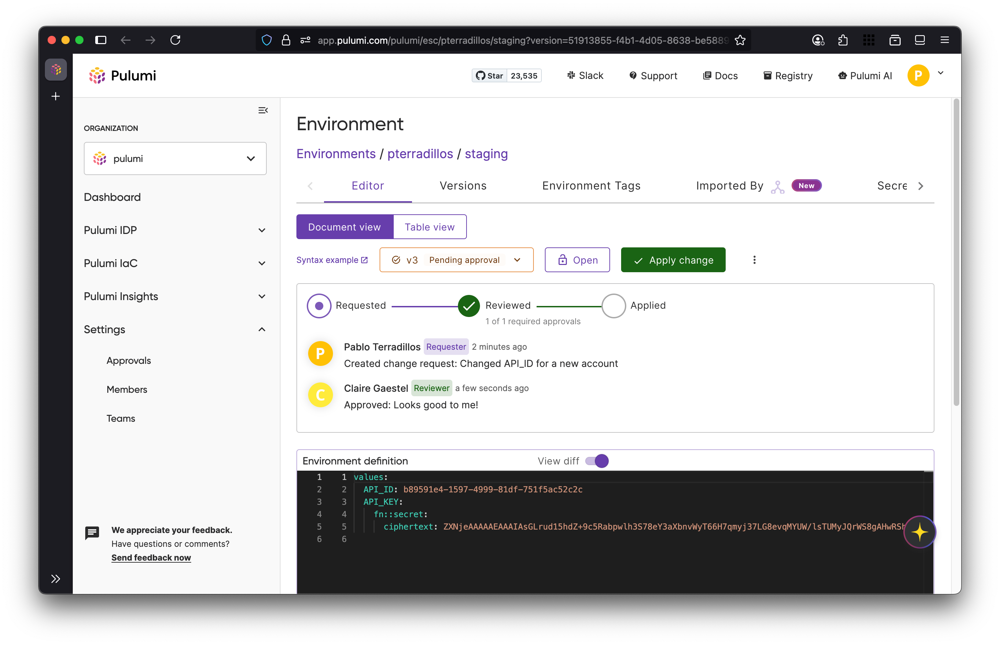

Did you know that **80% of unplanned outages aren’t caused by hardware failures or cyberattacks, but by the very changes we make to improve our systems?**

Pulumi ESC already enables safer change management with [our innovative versioning capability](https://www.youtube.com/watch?v=HQN5KOY4asE) which **allows users to track and roll back environment revisions.**

Building on this foundation, we’re excited to announce the release of [**Approvals** in Pulumi ESC](/docs/esc/administration/approvals/)—a new feature that enables organizations to **bring governance and oversight directly into their environment configuration workflows.**

With Approvals, teams can require explicit review and sign-off before applying changes to ESC-managed environments, bringing the same rigor to configuration as they already have with infrastructure-as-code and application development.

<!--more-->

## Enforce Change Management Without Slowing Teams Down

Pulumi ESC helps teams manage environment configurations—such as secrets and application settings—across services and environments, from development through production.

In fast-moving teams, managing these settings safely and consistently is critical. But as the number of contributors grows, so does the risk of accidental or unreviewed changes making it into critical environments.

That’s where Approvals come in.

With Approvals, any proposed change to an ESC environment—whether through the Pulumi Console or CLI—must go through a structured review process before it’s applied. Similar to submitting a Pull Request, contributors can propose changes that are reviewed and approved by designated team members.

This gives you a native, consistent workflow for gating configuration updates without needing external tools or manual oversight.

## Why use Approvals?

Teams can use Pulumi ESC Approvals to apply the same rigor of code review workflows to environment configurations and secrets management. Approvals help organizations enforce governance policies, meet compliance requirements, and reduce the risk of misconfigurations by requiring explicit review and sign‑off before applying changes. Each request creates a clear, auditable record of who approved what, when, and why, which is especially valuable for regulated industries or teams with strict change‑management processes.

By introducing a controlled review process, Approvals let developers propose updates while ensuring only authorized reviewers can approve and apply them. This balances collaboration with security and accountability, and works seamlessly in both the Pulumi Cloud console and the ESC CLI.

## How It Works

To get started, navigate to your environment’s **Settings → Approval Rulesets**, where you can define approval requirements such as:

- Number of required reviewers  
- Specific teams or individuals allowed to approve  
- Whether self-approval is permitted  
- Whether changes require reapproval if modified



Once a ruleset is enabled, any environment update must go through a **change request** workflow. Instead of directly saving changes, contributors create a draft, which then must be reviewed and approved before being applied.



Changes pending approval are clearly visible to your team, and reviewers can inspect the diff, leave feedback, or revise the request before approving.

Approvals are also fully supported in the [Pulumi ESC CLI](https://github.com/pulumi/esc), using the `--draft` flag:

```sh
$ esc env set --draft org/project/env FEATURE_X_ENABLED true
```

In addition to the CLI, Approvals can be used directly from the [ESC SDK](https://github.com/pulumi/esc-sdk)—making it easy to integrate change‑management workflows into your own applications or automation scripts.

They are also available through the [Pulumi Visual Studio Code Extension]https://marketplace.visualstudio.com/items?itemName=pulumi.pulumi-vscode-tools), allowing developers to review, approve, and apply configuration changes without leaving their editor.

Finally, the Pulumi Service Provider supports managing approval rules as code. For example:

```typescript
import * as service from "@pulumi/pulumiservice";
import * as pulumi from "@pulumi/pulumi";

// ...

var approvalRule = new service.ApprovalRule("rule-test", {
  name: "My rule!",
  enabled: true,
  targetActionTypes: ["update"],
  environmentIdentifier: {
    organization: environment.organization,
    project: environment.project,
    name: environment.name,
  },
  approvalRuleConfig: {
    numApprovalsRequired: 3,
    allowSelfApproval: true,
    requireReapprovalOnChange: true,
    eligibleApprovers: [
      {
        rbacPermission: "environment:write",
      },
      {
        user: "pulumi-bot",
      },
      {
        user: "IaroslavTitov",
      },
    ]
  }
})
```

You can find more examples for different languages at the [Pulumi Service Provider Github repository](https://github.com/pulumi/pulumi-pulumiservice/tree/main/examples).

## Built for Collaboration and Compliance

Whether you’re enforcing separation of duties, complying with industry standards or regulations, or simply want better visibility into changes, Approvals helps bring process to how configuration flows through your systems.

It also integrates seamlessly into existing workflows—no need to reinvent how teams work. Just add governance where it matters most.

## What’s Next

Approvals in ESC is just the beginning. We're exploring how approval workflows can be extended to other areas of the Pulumi ecosystem to provide a consistent, governed experience across the entire software delivery lifecycle.

Our goal is to empower teams to move fast while staying secure and compliant—no matter where or how changes happen. We’re excited about what’s ahead and look forward to building it together with your feedback.

Happy building!
