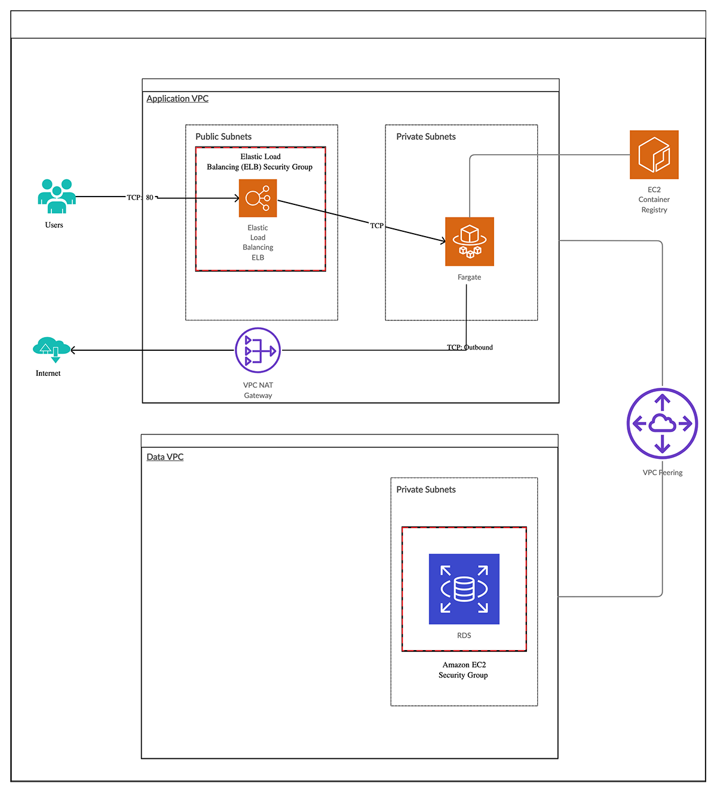

In this post, we will talk about the best way to architect your Pulumi applications. We are going to build out the following
infrastructure in AWS:

* AWS Fargate service that does not serve traffic directly
* AWS ALB as the entry point to the Fargate Service
* AWS RDS Instance that is stored in a separate network from the Application and does not service traffic directly from the internet

To do this, we are going to split the infrastructure into two AWS VPCs. One VPC will be used for the application based resources
(e.g Fargate Service, ALB) and the other VPC will be for the database resources. The VPCs will be peered to allow communication
between them so that the application can communicate with the database securely.



## Layer it up

When we think of infrastructure, we tend to think of layers. A layer is a logical set of components / resources that can be
grouped together. In our case, we can think of the networking as a layer upon which our database and application can be built.
For the purposes of this post, an infrastructure layer will be represented as a project in Pulumi. So let's break our application
into separate Pulumi projects:

```bash
$ tree -d -L 1
.
├── application
├── database
└── networking
```

This means all of the work required for the networking components can be in the network project. We can use
[Stack References]() in Pulumi
to expose any required information from the networking layer, to the database and application layers.

Let's create the networking project.

### Building our Networking Project

```bash
$ cd networking && pulumi new aws-typescript
$ pulumi config set aws:region us-east-2
```

This gives us the shell of our project we need to create our resources.  In thinking of how we build our networking resources,
we will create two copies of each resource due to separate VPCs for application and database. Of course, we can use a loop to do
this, but the more elegant way would be to create a class that we could pass parameters into to make life easy. We want an
API as follows:

```typescript
const availabilityZones = aws.getAvailabilityZones({
    state: "available",
});

const myVpc = new Vpc("my-vpc", {
    description,
    baseTags,

    baseCidr,
    availabilityZoneNames,
    enableFlowLogs,
});
```

We can see the power of Pulumi when we build our infrastructure with TypeScript. We create a TypeScript
class that [extends](https://www.typescriptlang.org/docs/handbook/classes.html) Pulumi ComponentResource. ComponentResource
is a resource that aggregates one or more other child resources into a higher level abstraction. The component resource
itself is a resource, but does not require custom create, read, update and delete operations for provisioning.

The outline of the class will look as follows:

```typescript
export class Vpc extends ComponentResource {
    // ...
}
```

We want to pass a name and some custom parameters to the class, so we create an interface for the parameters:

```typescript
export interface VpcArgs {
    // ...
}
```

We update our class with a constructor that allows us to create a new instance of the VPC class:

```typescript
export class Vpc extends ComponentResource {
   constructor(name: string, args: VpcArgs, opts?: ComponentResourceOptions) {
       super("vpc", name, {}, opts);

       // ... resources here ...
    }
}
```

After we implement all of the resources needed for our VPC, our Pulumi application looks like the following:

```typescript
async function main() {
    const config = new Config();
    const azCount = config.getNumber("azCount") || 2;

    const availabilityZones = aws.getAvailabilityZones({
        state: "available",
    });

    const appVpc = new Vpc("app-vpc", {
        baseCidr: "172.28.0.0/16",
        availabilityZoneNames: availabilityZones.names.slice(0, azCount),
        enableFlowLogs: true,
    });

    const dataVpc = new Vpc("data-vpc", {
        baseCidr: "172.18.0.0/16",
        availabilityZoneNames: availabilityZones.names.slice(0, azCount),
        enableFlowLogs: true,
    });

    return {
        appVpcId: appVpc.vpcId(),
        dataVpcId: dataVpc.vpcId(),
    }
}

module.exports = main();
```

This application will create two instances of the VPC class containing all of the resources needed for a VPC. This
reusable `VPC` class` is a more efficient way of building out infrastructure than to simply loop over the resources. We can
take advantage of relating the resources to the correct parent to build out graph.

We take it one step further, and be able to peer the VPCs. TypeScript, again, gives us the ability to do this in a
concise manner by using a [member function](http://www.typescriptlang.org/docs/handbook/classes.html#public-private-and-protected-modifiers). The member function of the VPC class looks as follows:

```typescript
public configurePeering(args: PeerToArgs) {
    // ...
}
```

This gives us the ability to peer the VPCs:

```typescript
appVpc.configurePeering({
    peerVpc: dataVpc,
    nameTag: `${baseTags.ManagedBy} Peer App to Data`,
    routeSubnets: "private",
});
```

After creating a similar member function for the peering security group, we instruct Pulumi to create the resources
by running the command `pulumi up`. This displays a preview of changes first and the list of AWS resources it will create:

```bash
$ pulumi up
```

After being prompted and selecting "yes", your deployment will begin. After completion, you will see:

```bash
...
 +      │  ├─ aws:ec2:VpcEndpoint                  data-vpc-s3-endpoint                created
 +      │  └─ aws:ec2:VpcEndpoint                  data-vpc-dynamodb-endpoint          created
 +      └─ aws:ec2:SecurityGroup                   data-vpc-app-vpc-sg                 created

Outputs:
    appVpcId               : "vpc-07420f4b22cce694a"
    appVpcPrivateSubnetIds : [
        [0]: "subnet-07ebb7bb1894f76ea"
        [1]: "subnet-0cc6c64ffce7fa74a"
    ]
    appVpcPublicSubnetIds  : [
        [0]: "subnet-07eec9d474411d47c"
        [1]: "subnet-093c9e201b5bb3975"
    ]
    dataVpcId              : "vpc-04d28ded952454899"
    dataVpcPrivateSubnetIds: [
        [0]: "subnet-048e68b5d12d6189d"
        [1]: "subnet-088fbb5acf3d0a58c"
    ]
    dataVpcPublicSubnetIds : [
        [0]: "subnet-0711e414ccc7458a3"
        [1]: "subnet-0b8d54dfec34b286b"
    ]
    peeredSecurityGroupId  : "sg-08b58260a840a971b"

Resources:
    + 61 created

Duration: 3m8s
```

### Building our Database Project

```bash
$ cd database && pulumi new aws-typescript
$ pulumi config set aws:region us-east-2
```

Our database project follows the same principals as the networking project - it has a RDS class that extends the
Pulumi ComponentResource.

```typescript
export interface RdsArgs {
    // ...
}
export class RdsInstance extends ComponentResource {
    constructor(name: string, args: RdsArgs, opts?: ComponentResourceOptions) {
        super("db", name, {}, opts);

        // ... resources here ...
    }
}
```

This project needs other configuration options set:

```bash
pulumi config set database-layer:dbUsername MyDBUser
pulumi config set database-layer:dbName initialDb
pulumi config set database-layer:dbPassword MyDBPassword1234! --secret
```

The database project needs to access the details of the resources creating in the networking layer. To do this, we
use a Pulumi StackReference. We pass the correct stack name that the database project needs to talk to,
so we can pass that as a configuration option. A stack reference in Pulumi will follow the structure `org/project/stack`.
In our case it will be `stack72/networking-layer/dev` and we can pass that as a configuration option to the database project:

```bash
$ pulumi config set networkingStack stack72/networking-layer/dev
```

Inside our database project, we can access any of the exported values from the networking project. The first thing we need
access to is the database private subnet Ids. To access those subnetIds, we would do the following:

```typescript
import {Config, StackReference} from "@pulumi/pulumi";

const config = new Config();
const networkingStack = new StackReference(config.require("networkingStack"))

const subnetIds = networkingStack.getOutput("dataVpcPrivateSubnetIds")
```

**Please Note:** We need to pass the exact name of the output as specified in the networking stack!

Our database project looks like this:

```typescript
const rds = new RdsInstance("db-instance", {
    description: `${baseTags.Project} DB Instance`,
    baseTags: baseTags,

    subnetIds: networkingStack.getOutput("dataVpcPrivateSubnetIds"),

    username: dbUsername,
    password: dbPassword,
    initalDbName: dbName,

    allocatedStorage: 40,
    engineVersion: "11.4",
    instanceClass: aws.rds.InstanceTypes.R3_Large,
    storageType: "gp2",

    finalSnapshotIdentifier: finalSnapshotIdentifier,

    sendEnhancedLogsToCloudwatch: true,
    monitoringInterval: 10,

    securityGroupIds: [networkingStack.getOutput("peeredSecurityGroupId")],
});
```

We can then instruct Pulumi to create our resources with a `pulumi up` command, as before. This will show you a preview
of changes first and the list of AWS resources it will create:

```bash
$ pulumi up
```

After being prompted and selecting "yes", your deployment will begin. After completion, you will see:

```bash
Updating (dev):

     Type                                Name                                  Status
 +   pulumi:pulumi:Stack                 database-layer-dev                    created
 +   ├─ db                               db-instance                           created
 +   │  ├─ aws:rds:SubnetGroup           db-instance-subnet-group              created
 +   │  ├─ aws:iam:Role                  db-instance-enhanced-monitoring-role  created
 +   │  ├─ aws:iam:RolePolicyAttachment  enhanced-policy-attachment            created
 +   │  └─ aws:rds:Instance              db-instance-rds                       created
 +   └─ random:index:RandomString        my-random-string                      created

Outputs:
    dbAddress : "db-instance-rdsd86e208.cep6renxwgtk.us-west-2.rds.amazonaws.com"
    dbEndpoint: "db-instance-rdsd86e208.cep6renxwgtk.us-west-2.rds.amazonaws.com:5432"
    dbName    : "initialDb"
    dbPassword: "[secret]"
    dbPort    : "5432"
    dbUsername: "MyDBUser"

Resources:
    + 7 created

Duration: 7m49s
```

### Building the Application Project

```bash
$ cd application && pulumi new aws-typescript
$ pulumi config set aws:region us-east-2
```

It will come as no surprise to you that we will build our application project in the same manner as that of networking and
database. So we will have an `Application` class that extends Pulumi ComponentResource.

```typescript
export interface ApplicationArgs {
    // ....
}
export class Application extends ComponentResource {
    constructor(name: string, args: ApplicationArgs, opts?: ComponentResourceOptions) {
        super("application", name, {}, opts);

        // ... resources here ...
    }
}
```

The application project differs from the database project in that it needs stack references to the networking *and* database
projects. Let's specify those via configuration as we did in the database project:

```bash
$ pulumi config set networkingStack stack72/networking-layer/dev
$ pulumi config set databaseStack stack72/database-layer/dev
```

We can then access details like, database endpoint, database user, application Vpc Id within our application project:

```typescript
import * as awsx from "@pulumi/awsx";
import { Config, getStack, StackReference } from "@pulumi/pulumi";
import {Application} from "./application";

const config = new Config();

const networkingStack = new StackReference(config.require("networkingStack"));
const databaseStack = new StackReference(config.require("databaseStack"));

const app = new Application("app", {

    vpcId: networkingStack.getOutput("appVpcId"),

    // ALB in public subnets
    albSubnetIds:  networkingStack.getOutput("appVpcPublicSubnetIds"),

    // App resources in private subnets
    appSubnetIds:  networkingStack.getOutput("appVpcPrivateSubnetIds"),

    appImage: awsx.ecs.Image.fromPath("app", "./src/backend"),
    appPort: 80,

    dbName: databaseStack.getOutput("dbName"),
    dbUsername: databaseStack.getOutput("dbUsername"),
    dbPassword: databaseStack.getOutput("dbPassword"),
    dbPort: databaseStack.getOutput("dbPort"),
    dbHost: databaseStack.getOutput("dbAddress"),
});

export const albAddress = app.albAddress();
```

Notice that we are taking advantage of the [Pulumi AWS Extensions](https://github.com/pulumi/pulumi-awsx).
Pulumi AWSX is a set of component wrappers around many AWS operations. In our case, we are taking advantage of being able
to create an AWS ECS container image from a known path to a [dockerfile](https://docs.docker.com/engine/reference/builder/).
This is a concise API that removes us from the need to run `docker build` as a separate process. It will happen as part of
our Pulumi application.

We can, again, instruct Pulumi to create our resources for us by issuing the `pulumi up` command. In the interactive output,
you will see how Pulumi interacts with docker and also see how it reads both of the stack references we told it to read
information from. It will also show you a preview of the changes and the list of AWS resources it will create:

```bash
$ pulumi up
```

### Testing our application

The application in this repository has a number of endpoints that we can use to test that the AWS ECS Fargate service is
working as expected. We can test them either from a browser or from the command line. We can access the service using the
address of the AWS ALB that was created to serve traffic to the application. Let's test the endpoints from the CLI:

```bash
$ curl $(pulumi stack output albAddress)
{
  "hash": "59846138362875439341244157139878939483",
  "message": "hello world",
  "postgres": "please use the /postgres endpoint"
}
```

```bash
$ curl $(pulumi stack output albAddress)/postgres
{
  "hash": "59846138362875439341244157139878939483",
  "postgres": [
    [
      "PostgreSQL 11.4 on x86_64-pc-linux-gnu, compiled by gcc (GCC) 4.8.3 20140911 (Red Hat 4.8.3-9), 64-bit"
    ]
  ]
}
```

```bash
$ curl $(pulumi stack output albAddress)/internet
I CAN connect to google.com%
```

```bash
$ curl $(pulumi stack output albAddress)/public-ip
<p>my external IP is: 52.24.188.63 (source: jsonip.com) </p>%
```

Our application is up and running and we can connect to it!

## Cleaning up

To cleanup the resources we created, we need to go into each project directory and run the command

```bash
$ pulumi destroy --yes && pulumi stack rm
```

Once the resources have been deleted, then we can follow the interactive prompt to delete the stack.

## Wrapping Up

In this post, we have discussed how we would break our infrastructure into logically grouped projects and how we share
information between these projects. You can find a runable version of this infrastructure in our
[examples](https://github.com/pulumi/examples/tree/master/aws-stackreference-architecture) repository.

This demonstrates the suggested way of architecting Pulumi applications both for operability and collaboration.

You can try this code today get started with Pulumi today at [https://www.pulumi.com](/) and
following the [Getting Started]() for managing AWS resources with Pulumi.
