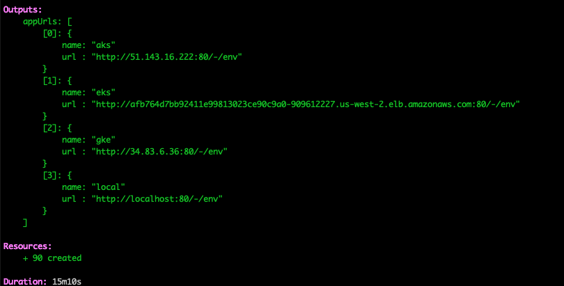

This is the fifth and last installment of the [Architecture as Code]() series. In previous articles, we examined how to create reusable components for the primary architectural patterns for cloud infrastructure. Starting with [virtual machines](), we examined how to create and configure VMs. In the follow-up article, we demonstrated how to create reusable components from resources that comprise a [microservices]() architecture. After microservices, we looked at [serverless]( architecture, which despite its name, also requires additional resources to deploy a function or application. In this article, we’ll look at deployment patterns for Kubernetes with a focus on multi-tenancy issues.

<!--more-->

## Architectural Patterns

Kubernetes is flexible about deploying and running applications. There are several patterns for Kubernetes. They range from a single large cluster consisting of many nodes to many clusters with a single application per cluster. Each pattern has benefits and costs, and which pattern you use is dependent on multiple factors.

A single large cluster made up of many nodes is a typical pattern for deploying Kubernetes. These deployments typically have three master nodes with associated resources such as authentication, logging, controllers, and load balancers shared across all workloads. This makes resource usage more efficient and cost-effective because there’s only a single cluster to administer. However, a single cluster is also a single point of failure. If your cluster runs multiple workloads, all those can be impacted. Another disadvantage is that applications are not isolated; they share cluster-wide resources such as DNS, which can allow the discovery of other services in the cluster.

Running multiple workloads on a single cluster is also referred to as soft multi-tenancy. Since all applications on the cluster share resources, collisions can occur among them. Collisions can be mitigated through resource limits and quotas, but it requires tuning the application deployment to prevent collisions. Kubernetes defines the [upper limits of a cluster](https://kubernetes.io/docs/setup/best-practices/cluster-large/) as 5000 nodes, 150,000 pods, and 300,000 containers based on two service level objectives:

- Return 99% of all API calls in less than 1 second
- Start 99% of pods within less than 5 seconds

Large numbers of nodes, pods, and containers can strain the Kubernetes control, making efficient scheduling and resource allocation more difficult.

At the other end of the spectrum is hard multi-tenancy, which uses multiple small Kubernetes clusters with only a single application deployed on each cluster. The primary advantage of this pattern is isolation; this is beneficial for both system security and operational tasks because it limits the blast radius to the workloads on the affected cluster. Another advantage is that each cluster has fewer users, which reduces the risk of misconfiguration. The most obvious disadvantage to hard multi-tenancy is that it requires more resources in the form of the overhead needed to run Kubernetes. Also, administering multiple clusters is more complicated than managing a single cluster; for example, you will need to configure authentication and set up RBAC for each cluster. Finally, it’s more expensive to run multiple clusters because of the requirement to run master nodes for each cluster, which can impact your total monthly bill.

There are variations between these two distinct patterns. Kubernetes is very flexible and can support deployments where a cluster has only a single application but has three environments: dev, test, prod. Alternatively, we can have an environment per cluster where dev, test, and prod are individual clusters and with multiple applications per cluster.

With Architecture as Code, we can extend these patterns to multi-cloud, where we have one application deployed across many cloud service providers.

## Many Clouds with  Kubernetes

One strategy to ensure an application maintains high availability is to distribute it among multiple cloud service providers. If one provider becomes unavailable, the application remains available on the other providers.

Let’s take a look at an [example](https://github.com/pulumi/examples/tree/master/kubernetes-ts-multicloud) available on the Pulumi Github repository. The project is structured with code to deploy Kubernetes on [AWS EKS](https://github.com/pulumi/examples/blob/master/kubernetes-ts-multicloud/eks.ts), [Azure AKS](https://github.com/pulumi/examples/blob/master/kubernetes-ts-multicloud/aks.ts), and [Google Cloud GKE](https://github.com/pulumi/examples/blob/master/kubernetes-ts-multicloud/gke.ts) as components. Also, we’re deploying the [Kubernetes Up and Running Demo](https://github.com/kubernetes-up-and-running/kuard) as a [component](https://github.com/pulumi/examples/blob/master/kubernetes-ts-multicloud/app.ts).

Putting it all together, deploying our many cloud architecture looks like this:

```ts
import * as k8s from "@pulumi/kubernetes";
import * as pulumi from "@pulumi/pulumi";
import * as aks from "./aks";
import * as app from "./app";
import * as eks from "./eks";
import * as gke from "./gke";
import * as local from "./local";

// Create Kubernetes clusters.
// Note: Comment out lines for any cluster you don't want to deploy.
const aksCluster = new aks.AksCluster("multicloud", {});
const eksCluster = new eks.EksCluster("multicloud", {});
const gkeCluster = new gke.GkeCluster("multicloud", {});

// Create a list of named clusters where the demo app will be deployed.
interface Cluster {
    name: string;
    provider: k8s.Provider;
    staticAppIP?: pulumi.Output<string>;
}
const clusters: Cluster[] = [
    // Note: Comment out lines for any cluster you don't want to deploy.
    {name: "aks", provider: aksCluster.provider, staticAppIP: aksCluster.staticAppIP},
    {name: "eks", provider: eksCluster.provider},
    {name: "gke", provider: gkeCluster.provider},
    {name: "local", provider: local.provider},
];

// Export a list of URLs to access the demo app.
interface AppUrl {
    name: string;
    url: pulumi.Output<string>;
}
export let appUrls: AppUrl[] = [];

const kuardImageTag = "blue";

// Create the application on each of the selected clusters.
for (const cluster of clusters) {
    const instance = new app.DemoApp(cluster.name, {
        provider: cluster.provider,
        imageTag: kuardImageTag,
        staticAppIP: cluster.staticAppIP,
    });

    const instanceUrl: AppUrl = {name: cluster.name, url: instance.appUrl};
    appUrls = appUrls.concat(instanceUrl);
}
```

When Kubernetes and the application is deployed across the three cloud service providers, Pulumi returns the URLs for each instance.



Using this example, you can quickly build any of the Kubernetes architectural patterns that we’ve discussed. Note that there’s a local Kubernetes cluster defined, and you can use that to experiment with different patterns.

## Conclusion

Deploying modern applications is complex. Anyone of the architectures we’ve examined -- virtual machines, microservices, serverless and Kubernetes -- require deploying and configuring multiple resources. For many reasons, including security, compliance, and cost management, we want to reuse resources consistently. In a sense, architecture as code is the logical progression of the DevOps principle of ["cattle not pets"](https://medium.com/@Joachim8675309/devops-concepts-pets-vs-cattle-2380b5aab313). Infrastructure as code is the tool that enables this by bringing standard development practices, such as code review, CI/CD, and testing to infrastructure. Learn how to build reusable infrastructure components with Pulumi’s [programming model](), [API reference for cloud service providers](), and [examples](https://github.com/pulumi/examples).

Want to know more? Listen to the [New Stack Context podcast](https://thenewstack.io/pulumi-program-the-infrastructure-with-an-actual-programming-language/) on the Pulumi 2.0 release and Architecture as Code.