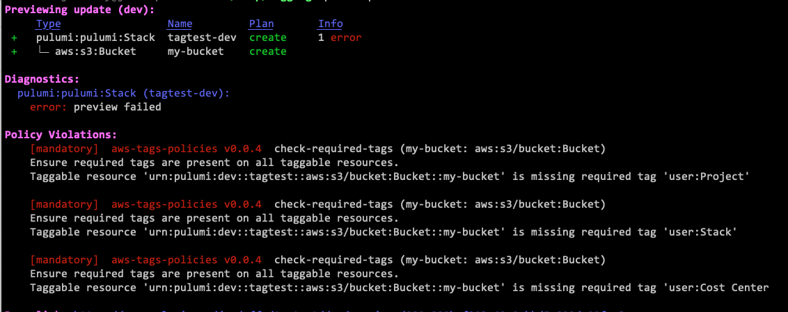
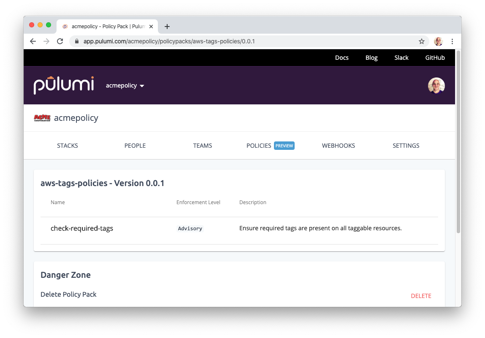
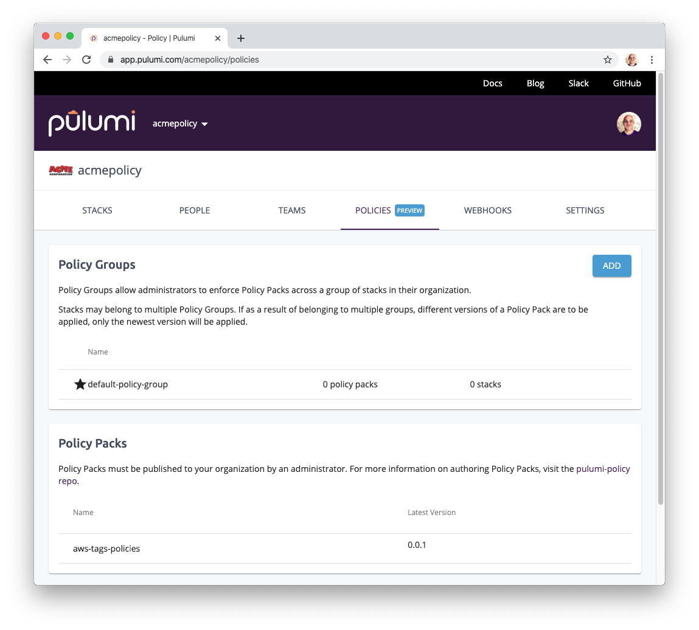
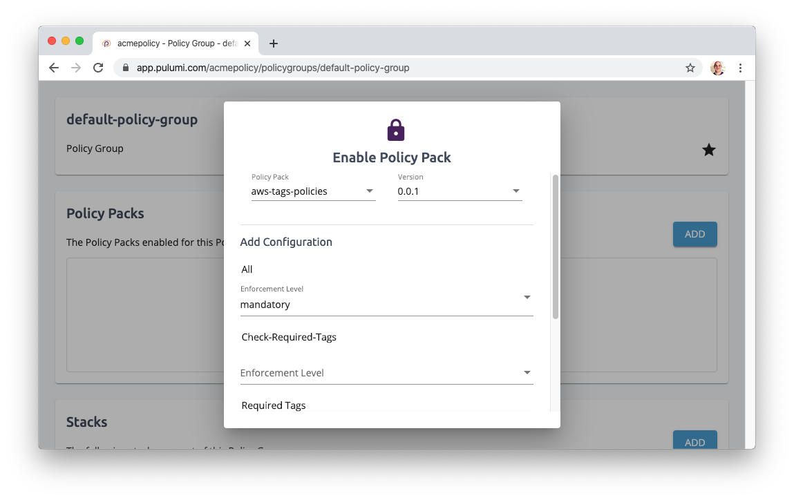
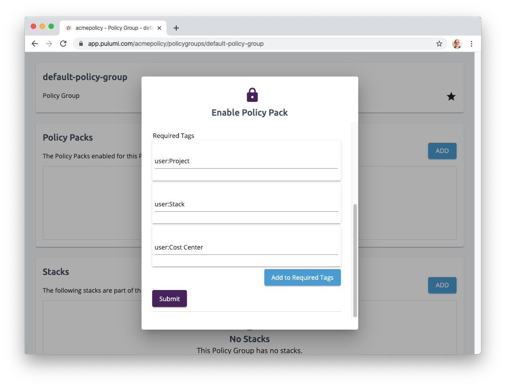
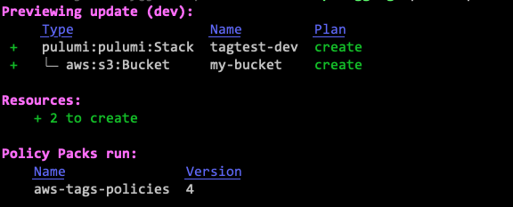
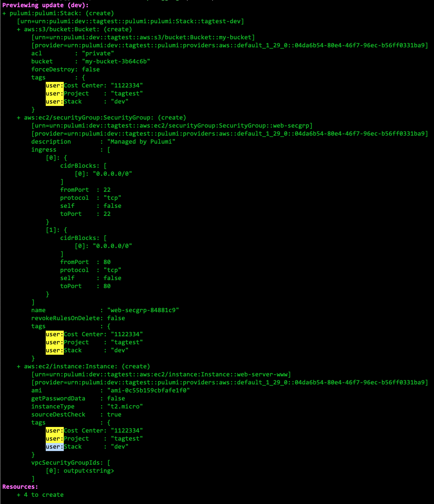
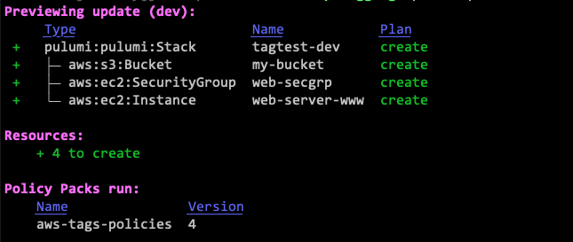

AWS publishes best practices for how to tag your resources for cost tracking, automation, and organization. But how do you enforce that you're doing it correctly across all of your projects? And is it really necessary to manually track down all those places where you missed a tag and manually patch things up? In this article, we'll see how to use Policy as Code to enforce your team's tagging strategies in addition to some powerful Infrastructure as Code techniques to automate applying your tags in a consistent way across all of your projects and resources.

## Why Tag Your Resources?

A tag is simply a key/value label that you can apply to your AWS infrastructure resources. Tags enable you to manage, search for, and filter resources. There aren't any predefined tags &mdash; you can use whatever makes sense for your scenario and business requirements.

[Amazon recommends many tagging strategies](https://aws.amazon.com/answers/account-management/aws-tagging-strategies/), including technical tags like name and environment, automation tags like dates and security requirements, business tags like owner and cost center, and security tags for compliance. Each of these enables you to apply policies.

Specifying a tag in your Infrastructure as Code is easy. Not all resources are taggable (although the most important ones are); to tag a resource, specify a map of key/values using the `tags` property. For example, this code declares an S3 Bucket that carries three tags that enable cost allocation reporting: `"user:Project"`, `"user:Stack"`, and `"user:Cost Center"`:



{}

```javascript
let aws = require("@pulumi/aws");
let pulumi = require("@pulumi/pulumi");

// Create an S3 bucket (with tags).
let config = new pulumi.Config();
let bucket = new aws.s3.Bucket("my-bucket", {
    tags: {
        "user:Project": pulumi.getProject(),
        "user:Stack": pulumi.getStack(),
        "user:Cost Center": config.require("costCenter"),
    },
});
```

{}

{}

```typescript
import * as aws from "@pulumi/aws";
import * as pulumi from "@pulumi/pulumi";

// Create an S3 bucket (with tags).
const config = new pulumi.Config();
const bucket = new aws.s3.Bucket("my-bucket", {
    tags: {
        "user:Project": pulumi.getProject(),
        "user:Stack": pulumi.getStack(),
        "user:Cost Center": config.require("costCenter"),
    },
});
```

{}

{}

```python
import pulumi
import pulumi_aws as aws

# Create an S3 bucket (with tags).
config = pulumi.Config()
bucket = aws.s3.Bucket('my-bucket',
    tags={
        'user:Project': pulumi.get_project(),
        'user:Stack': pulumi.get_stack(),
        'user:Cost Center': config.require('costCenter'),
    },
)
```

{}

{}

```go
package main

import (
    "github.com/pulumi/pulumi-aws/sdk/go/aws/s3"
    "github.com/pulumi/pulumi/sdk/go/pulumi"
    "github.com/pulumi/pulumi/sdk/go/pulumi/config"
)

func main() {
    pulumi.Run(func(ctx *pulumi.Context) error {
        // Create an S3 Bucket (with tags):
        _, err := s3.NewBucket(ctx, "my-bucket", &s3.BucketArgs{
            Tags: pulumi.Map({
                "User:Project": pulumi.String(ctx.Project()),
                "User:Stack": pulumi.String(ctx.Stack()),
                "User:Cost Center": pulumi.String(config.Require(ctx, "costCenter")),
            })
        })
        return err
    }
}
```

{}

{}

```csharp
using Pulumi;
using Pulumi.Aws.S3;
using System.Collections.Generic;
using System.Threading.Tasks;

class Program {
    static Task Main() {
        return Deployment.RunAsync(() => {
            // Create an S3 Bucket (with tags):
            var config = new Config();
            var bucket = new Bucket("my-bucket", new BucketArgs {
                Tags: new Dictionary<string, string> {
                    { "User:Project",     Deployment.Instance.ProjectName },
                    { "User:Stack",       Deployment.Instance.StackName },
                    { "User:Cost Center", config.Get("costCenter") },
                },
            });
        });
    }
}
```

{}



In this example, we're using the project and stack names from the current project, and requiring an explicit cost center configured using `pulumi config set costCenter 11223344`. Of course, this is just for illustration purposes &mdash; we can easily use anything for these keys and values.

Suppose our team requires certain tags, though: How do we ensure we don't forget them?

## Enforcing Tagging Strategies

Policy as Code is a way to enforce infrastructure policies, such as ensuring we're not opening databases to the internet, that we're leveraging strong encryption in all the right places, that we aren't violating cost policies, and so on. And it's a great way to ensure we're tagging everything.

Imagine we forgot to tag our S3 Bucket from earlier:



{}

```javascript
// Oops -- no tags!
let bucket = new aws.s3.Bucket("my-bucket");
```

{}

{}

```typescript
// Oops -- no tags!
const bucket = new aws.s3.Bucket("my-bucket");
```

{}

{}

```python
# Oops -- no tags!
bucket = aws.s3.Bucket('my-bucket')
```

{}

{}

```go
// Oops -- no tags!
_, err := s3.NewBucket(ctx, "my-bucket", nil)
return err
```

{}

{}

```csharp
// Oops -- no tags!
var bucket = new Bucket("my-bucket");
```

{}



By applying the policy defined below, deployments that are missing the required tags will fail:



This approach not only ensures we don't forget, but if you're an infrastructure or security engineer, you can now apply this across your team to make sure your team doesn't forget either.

### Defining our Tags Enforcer Policy

This policy is ultimately defined as a simple policy pack as follows:

<!--
    NOTE: Ideally we'd add the other PaC authoring languages as they become available.
    For now, we limit it to JavaScript and TypeScript only.
-->



{}

```javascript
let policy = require("@pulumi/policy");
let isTaggable = require("../lib/taggable").isTaggable;

new policy.PolicyPack("aws-tags-policies", {
    policies: [{
        name: "check-required-tags",
        description: "Ensure required tags are present on all AWS resources.",
        configSchema: {
            properties: {
                requiredTags: {
                    type: "array",
                    items: { type: "string" },
                },
            },
        },
        validateResource: (args, reportViolation) => {
            const config = args.getConfig();
            const requiredTags = config.requiredTags;
            if (requiredTags && isTaggable(args.type)) {
                const ts = args.props[tags];
                for (const rt of requiredTags) {
                    if (!ts || !ts[rt]) {
                        reportViolation(
                            `Taggable resource '${args.urn}' is missing required tag '${rt}'`);
                    }
                }
            }
        },
    }],
});
```

{}

{}

```typescript
import * as policy from "@pulumi/policy";
import { isTaggable } from "../lib/taggable";

new policy.PolicyPack("aws-tags-policies", {
    policies: [{
        name: "check-required-tags",
        description: "Ensure required tags are present on all AWS resources.",
        configSchema: {
            properties: {
                requiredTags: {
                    type: "array",
                    items: { type: "string" },
                },
            },
        },
        validateResource: (args, reportViolation) => {
            const config = args.getConfig<AwsTagsPolicyConfig>();
            const requiredTags = config.requiredTags;
            if (requiredTags && isTaggable(args.type)) {
                const ts = args.props[tags];
                for (const rt of requiredTags) {
                    if (!ts || !ts[rt]) {
                        reportViolation(
                            `Taggable resource '${args.urn}' is missing required tag '${rt}'`);
                    }
                }
            }
        },
    }],
});

interface AwsTagsPolicyConfig {
    requiredTags?: string[];
}
```

{}



This project defines a _policy pack_ containing a set of _policy rules_, in this case, just one. That rule takes in a configurable set of tags to ensure they exist on every taggable AWS resource. If a tag is missing, a violation is reported and the deployment fails.

> This leverages a library that helps to identify taggable AWS resources (see [this repo for the full example code](https://github.com/joeduffy/aws-tags-example/tree/master/policy-pack-ts)). Although this policy is written in TypeScript, it can be applied to stacks written in any language.

At this point, we can apply our policy pack to our infrastructure project in two ways: at the CLI or in the SaaS web console.

### Applying Tags Enforcement in the CLI

This policy pack is configurable so that you can enforce arbitrary tags without needing to change the pack's code, making it reusable. For the CLI scenario, we will create a `policy-config.json` file that specifies the same three required tags shown above:

```json
{
    "all": "mandatory",
    "check-required-tags": {
        "requiredTags": [
            "user:Project",
            "user:Stack",
            "user:Cost Center"
        ]
    }
}
```

Next, we can manually specify that our policy pack is applied using the CLI's `--policy-pack` flag, along with `--policy-pack-config` to point at our configuration file:

```bash
$ pulumi up \
    --policy-pack=./policy \
    --policy-pack-config=./policy-config.json
```

### Applying Tags Enforcement in the SaaS Console

It's nice to be able to use the CLI for this &mdash; and all of that is available in open source, no matter whether you're using the SaaS or not. However, it requires manually distributing policy packs and remembering to pass `--policy-pack` with the right configuration for every update.

The Pulumi Enterprise SaaS console lets you manage policy packs and apply them to your organization's stacks in a central way &mdash; and then every update that the pack is applied to automatically runs the policy checks. Let's give it a try.

First, let's publish the pack:

```bash
$ pulumi policy publish
Obtaining policy metadata from policy plugin
Compressing policy pack
Uploading Policy Pack to Pulumi service
Publishing "aws-tags-policies" - version 0.0.1 to "acmepolicy"

Permalink: https://app.pulumi.com/acmepolicy/policypacks/aws-tags-policies/0.0.1
```

This stores the policy pack in the Pulumi SaaS:



From there, we can enable it in the UI. First, we go to our organization's "POLICIES" tab:



Every organization gets a default policy group, and that's what we'll use here. However, for sophisticated scenarios, you may want multiple policy groups (for instance, to enforce different tags for your production environments than your development ones).

Let's "ADD" the new pack. This pops a dialog we can use to select the pack, its version, and our desired Enforcement Level (we'll pick "mandatory"):



Finally, further down in the dialog, we can enter the tags we'd like to enforce:



Now that it is configured, all subsequent updates across the organization will run policy checks.

## Automatically Applying Tags

In all cases, after manually fixing our bucket, and adding the correct tags, the policy will pass:



This is great &mdash; we can now rest assured that all taggable AWS resources will be tagged before we provision them. But it sure is tedious to add these tags to every resource and then get policy violations errors anytime we forget. One of the advantages of using Infrastructure as Code is that we can automate the injection of these tags.

To do that, let's write a function that detects taggable resources and merges in automatic tags:



{}

```javascript
let pulumi = require("@pulumi/pulumi");
let isTaggable = require("./taggable").isTaggable;

/**
 * registerAutoTags registers a global stack transformation that merges a set
 * of tags with whatever was also explicitly added to the resource definition.
 */
module.exports = {
    registerAutoTags: function (autoTags) {
        pulumi.runtime.registerStackTransformation((args) => {
            if (isTaggable(args.type)) {
                args.props["tags"] = Object.assign(args.props["tags"], autoTags);
                return { props: args.props, opts: args.opts };
            }
        };
    },
};
```

{}

{}

```typescript
import * as pulumi from "@pulumi/pulumi";
import { isTaggable } from "./taggable";

/**
 * registerAutoTags registers a global stack transformation that merges a set
 * of tags with whatever was also explicitly added to the resource definition.
 */
export function registerAutoTags(autoTags: Record<string, string>): void {
    pulumi.runtime.registerStackTransformation((args) => {
        if (isTaggable(args.type)) {
            args.props["tags"] = { ...args.props["tags"], ...autoTags };
            return { props: args.props, opts: args.opts };
        }
        return undefined;
    });
}
```

{}

{}

```python
import pulumi
from taggable import is_taggable

# registerAutoTags registers a global stack transformation that merges a set
# of tags with whatever was also explicitly added to the resource definition.
def register_auto_tags(auto_tags):
    pulumi.runtime.register_stack_transformation(lambda args: auto_tag(args, auto_tags))

# auto_tag applies the given tags to the resource properties if applicable.
def auto_tag(args, auto_tags):
    if is_taggable(args.type_):
        args.props['tags'] = {**(args.props['tags'] or {}), **auto_tags}
        return pulumi.ResourceTransformationResult(args.props, args.opts)
```

{}

{}

```go
package main

import (
    "reflect"

    "github.com/pulumi/pulumi/sdk/go/pulumi"
)

// registerAutoTags registers a global stack transformation that merges a set
// of tags with whatever was also explicitly added to the resource definition.
func registerAutoTags(ctx *pulumi.Context, autoTags map[string]string) {
    ctx.RegisterStackTransformation(
        func(args *pulumi.ResourceTransformationArgs) *pulumi.ResourceTransformationResult {
            if isTaggable(args.Type) {
                // Use reflection to look up the Tags property and merge the auto-tags.
                ptr := reflect.ValueOf(args.Props)
                val := ptr.Elem()
                tags := val.FieldByName("Tags")

                var tagsMap pulumi.Map
                if !tags.IsZero() {
                    tagsMap = tags.Interface().(pulumi.Map)
                } else {
                    tagsMap = pulumi.Map(map[string]pulumi.Input{})
                }
                for k, v := range autoTags {
                    tagsMap[k] = pulumi.String(v)
                }
                tags.Set(reflect.ValueOf(tagsMap))

                return &pulumi.ResourceTransformationResult{
                    Props: args.Props,
                    Opts:  args.Opts,
                }
            }
            return nil
        },
    )
}
```

{}

{}

```csharp
static ResourceTransformation RegisterAutoTags(Dictionary<string, string> autoTags) {
    return args => {
        if (IsTaggable(args.Resource.GetResourceType())) {
            // Use reflection to look up the Tags property and merge the auto-tags.
            var tagp = args.Args.GetType().GetProperty("Tags");
            var tags = (InputMap<object>)tagp.GetValue(args.Args, null) ?? new InputMap<object>();
            foreach (var tag in autoTags) {
                tags[tag.Key] = tag.Value;
            }
            tagp.SetValue(args.Args, tags, null);
            return new ResourceTransformationResult(args.Args, args.Options);
        }
        return null;
    };
}
```

{}



Now we can go back to our main program, use this new module, remove the explicit tags, and every taggable AWS resource we create will automatically get the tags we've specified:



{}

```javascript
let aws = require("@pulumi/aws");
let pulumi = require("@pulumi/pulumi");
let registerAutoTags = require("./autotag".registerAutoTags);

// Automatically inject tags.
let config = new pulumi.Config();
registerAutoTags({
    "user:Project": pulumi.getProject(),
    "user:Stack": pulumi.getStack(),
    "user:Cost Center": config.require("costCenter"),
});

// Create a bunch of AWS resources -- with auto-tags!

let bucket = new aws.s3.Bucket("my-bucket");

let group = new aws.ec2.SecurityGroup("web-secgrp", {
    ingress: [
        { protocol: "tcp", fromPort: 22, toPort: 22, cidrBlocks: ["0.0.0.0/0"] },
        { protocol: "tcp", fromPort: 80, toPort: 80, cidrBlocks: ["0.0.0.0/0"] },
    ],
});

let server = new aws.ec2.Instance("web-server-www", {
    instanceType: "t2.micro",
    ami: "ami-0c55b159cbfafe1f0",
    vpcSecurityGroupIds: [ group.id ],
});
```

{}

{}

```typescript
import * as aws from "@pulumi/aws";
import * as pulumi from "@pulumi/pulumi";
import { registerAutoTags } from "./autotag";

// Automatically inject tags.
const config = new pulumi.Config();
registerAutoTags({
    "user:Project": pulumi.getProject(),
    "user:Stack": pulumi.getStack(),
    "user:Cost Center": config.require("costCenter"),
});

// Create a bunch of AWS resources -- with auto-tags!

const bucket = new aws.s3.Bucket("my-bucket");

const group = new aws.ec2.SecurityGroup("web-secgrp", {
    ingress: [
        { protocol: "tcp", fromPort: 22, toPort: 22, cidrBlocks: ["0.0.0.0/0"] },
        { protocol: "tcp", fromPort: 80, toPort: 80, cidrBlocks: ["0.0.0.0/0"] },
    ],
});

const server = new aws.ec2.Instance("web-server-www", {
    instanceType: "t2.micro",
    ami: "ami-0c55b159cbfafe1f0",
    vpcSecurityGroupIds: [ group.id ],
});
```

{}

{}

```python
import pulumi
import pulumi_aws as aws
from autotag import register_auto_tags

# Automatically inject tags.
config = pulumi.Config()
register_auto_tags({
    'user:Project': pulumi.get_project(),
    'user:Stack': pulumi.get_stack(),
    'user:Cost Center': config.require('costCenter'),
})

# Create a bunch of AWS resources -- with auto-tags!

bucket = aws.s3.Bucket('my-bucket')

group = aws.ec2.SecurityGroup('web-secgrp',
    ingress=[
        { 'protocol': 'tcp', 'from_port': 22, 'to_port': 22, 'cidr_blocks': ['0.0.0.0/0']},
        { 'protocol': 'tcp', 'from_port': 80, 'to_port': 80, 'cidr_blocks': ['0.0.0.0/0']},
    ],
)

server = aws.ec2.Instance('web-server-www',
    instance_type='t2.micro',
    ami='ami-0c55b159cbfafe1f0',
    vpc_security_group_ids=[ group.id ],
)
```

{}

{}

```go
package main

import (
    "github.com/pulumi/pulumi-aws/sdk/go/aws/ec2"
    "github.com/pulumi/pulumi-aws/sdk/go/aws/s3"
    "github.com/pulumi/pulumi/sdk/go/pulumi"
    "github.com/pulumi/pulumi/sdk/go/pulumi/config"
)

func main() {
    pulumi.Run(func(ctx *pulumi.Context) error {
        // Automatically inject tags.
        RegisterAutoTags(ctx, map[string]string{
            "User:Project":     ctx.Project(),
            "User:Stack":       ctx.Stack(),
            "User:Cost Center": config.Require(ctx, "costCenter"),
        })

        // Create a bunch of AWS resources -- with auto-tags!

        _, err := s3.NewBucket(ctx, "my-bucket", nil)
        if err != nil {
            return err
        }

        grp, err := ec2.NewSecurityGroup(ctx, "web-secgrp", &ec2.SecurityGroupArgs{
            Ingress: ec2.SecurityGroupIngressArray{
                ec2.SecurityGroupIngressArgs{
                    Protocol:   pulumi.String("tcp"),
                    FromPort:   pulumi.Int(80),
                    ToPort:     pulumi.Int(80),
                    CidrBlocks: pulumi.StringArray{pulumi.String("0.0.0.0/0")},
                },
            },
        })
        if err != nil {
            return err
        }

        _, err = ec2.NewInstance(ctx, "web-server-www", &ec2.InstanceArgs{
            InstanceType:        pulumi.String("t2.micro"),
            Ami:                 pulumi.String("ami-0c55b159cbfafe1f0"),
            VpcSecurityGroupIds: pulumi.StringArray{grp.ID()},
        })
        return err
    }
})
```

{}

{}

```csharp
using Pulumi;
using Pulumi.Aws.Ec2;
using Pulumi.Aws.Ec2.Inputs;
using Pulumi.Aws.S3;
using System.Collections.Generic;
using System.Reflection;

class MyStack : Stack {
    static Config config = new Config();

    public MyStack() : base(
            new StackOptions {
                ResourceTransformations = {
                    RegisterAutoTags(new Dictionary<string, string> {
                        { "User:Project", Deployment.Instance.ProjectName },
                        { "User:Stack", Deployment.Instance.StackName },
                        { "User:Cost Center", config.Require("costCenter") },
                    }),
                },
            }
        )
    {
        // Create a bunch of AWS resources -- with auto-tags!

        var bucket = new Bucket("my-bucket", new BucketArgs());

        var grp = new SecurityGroup("web-secgrp", new SecurityGroupArgs {
            Ingress = {
                new SecurityGroupIngressArgs {
                    Protocol = "tcp", FromPort = 80, ToPort = 80, CidrBlocks = {"0.0.0.0/0"},
                },
            }
        });

        var srv = new Instance("web-server-www", new InstanceArgs {
            InstanceType = "t2.micro",
            Ami = "ami-0c55b159cbfafe1f0",
            VpcSecurityGroupIds = { grp.Id },
        });
    }

    // ...
}
```

{}



Notice that we didn't specify any tags by hand for the resource definitions and yet if we run a `pulumi preview --diff`, we see that the correct tags are applied automatically, thanks to the global stack transformation:



And running an ordinary update now passes:



Try adding some resources of your own &mdash; VPCs, EC2 instances, security groups, EKS clusters, anything &mdash; and it will automatically get tagged with these same cost center tags.

## In Conclusion

In this post, we've seen some ways to enforce AWS tagging best practices. This includes manually applying tags using Infrastructure as Code, checking that the desired tags are applied to the relevant resources using Policy as Code, and even using some advanced techniques to automatically tag resources, reducing manual efforts and the chance of human error.

Check out these resources to get started with Pulumi's open source platform:

* [AWS getting started guide]()
* [Policy as Code getting started guide]()
* [Full example code used in this post](https://github.com/joeduffy/aws-tags-example)

Good luck making sure your team's resources are tagged early and often with less manual effort!
