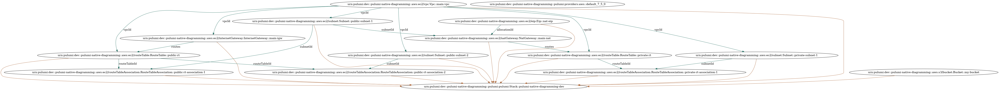
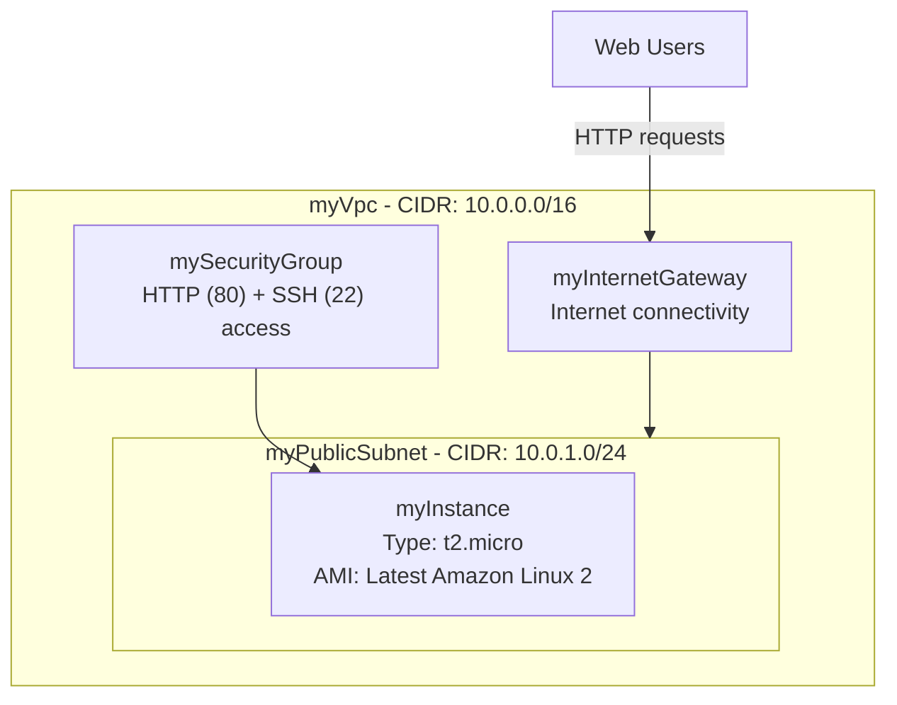

Architecture diagrams are one of the most tedious aspects of infrastructure management. Teams spend countless hours manually creating and updating visual representations of their systems, only to watch them become stale the moment infrastructure changes.

When you manage your infrastructure in code, it's possible to automatically generate accurate, up-to-date diagrams directly from your IaC definitions and state. Pulumi's preview capabilities let you anticipate exactly what changes will result from code modifications before deployment, providing the perfect foundation for automated diagramming workflows.

In this post, we'll explore three practical approaches to automating diagram generation in your CI/CD pipeline:

1. **Native Pulumi diagramming**: Using Pulumi's built-in diagramming capabilities to generate basic architecture diagrams that you can retrieve from GitHub Actions' artifact archive
2. **AI-powered diagramming**: Leveraging the Claude app with Mermaid and Pulumi preview to generate detailed diagrams and automatically add them to pull requests for infrastructure changes
3. **Pulumi Neo for enterprise diagramming**: Using Pulumi's AI-powered platform for organization-wide diagramming patterns, project-level and organization-level views, and intelligent customization for different stakeholders

These approaches eliminate manual diagramming work while ensuring your documentation stays current with your actual infrastructure, from simple automation to enterprise-scale intelligent diagramming.

## Native Pulumi diagramming with GitHub Actions

Pulumi's built-in `pulumi stack graph` command generates architecture diagrams directly from your deployed infrastructure state. This approach provides a reliable foundation for automated diagramming since it reflects your actual deployed resources rather than just the code.

{}
**Complete example**: View the full working example on [GitHub](https://github.com/pulumi-demos/examples/tree/main/diagrams/native-pulumi-diagramming-capabilities).
{}

Here's a complete GitHub Actions workflow that deploys infrastructure and automatically generates diagrams:

```yaml
name: Pulumi Deploy & Diagram

on:
  push:
    branches: [main]

jobs:
  deploy:
    name: Deploy & Generate Diagram
    runs-on: ubuntu-latest
    steps:
      - uses: actions/checkout@v4

      - name: Setup Node.js
        uses: actions/setup-node@v4
        with:
          node-version: "20"
          cache: "npm"

      - name: Install dependencies
        run: npm ci

      - uses: pulumi/actions@v5
        with:
          command: up
          stack-name: dev
        env:
          PULUMI_ACCESS_TOKEN: ${{ secrets.PULUMI_ACCESS_TOKEN }}

      - name: Install Pulumi CLI
        run: |
          curl -fsSL https://get.pulumi.com | sh
          echo "$HOME/.pulumi/bin" >> $GITHUB_PATH

      - name: Generate Architecture Diagram
        run: pulumi stack graph architecture.dot --stack dev
        env:
          PULUMI_ACCESS_TOKEN: ${{ secrets.PULUMI_ACCESS_TOKEN }}

      - name: Install Graphviz
        run: sudo apt-get update && sudo apt-get install -y graphviz

      - name: Generate PNG from DOT file
        run: dot -Tpng architecture.dot -o architecture.png

      - name: Upload Architecture Diagrams
        uses: actions/upload-artifact@v4
        with:
          name: architecture-diagrams
          path: |
            architecture.dot
            architecture.png
```

### How the workflow works

This workflow follows a straightforward pattern that ensures your diagrams always reflect your deployed infrastructure:

1. **Deploy first**: The workflow uses the official `pulumi/actions@v5` action to deploy your infrastructure changes. This ensures the state reflects your latest code.

2. **Generate diagram from state**: The `pulumi stack graph` command reads your deployed stack's state and generates a DOT format file containing the resource relationships and dependencies.

3. **Convert to visual format**: Graphviz converts the DOT file into a PNG image that's easy to view and share.

4. **Archive as artifacts**: Both the raw DOT file and the rendered PNG are uploaded as GitHub Actions artifacts, making them downloadable from the workflow run.

### Key advantages and limitations

**Highest accuracy**: Since diagrams are generated from deployed state rather than code, they reflect your actual infrastructure including any drift or manual changes. This is the biggest advantage of the native approach.

**Zero maintenance**: Once set up, diagrams update automatically with every deployment without any manual intervention.

**Multiple formats**: The DOT format can be converted to various output formats (PNG, SVG, PDF) depending on your needs.

**Audit trail**: Each workflow run preserves the diagram as an artifact, creating a visual history of your infrastructure changes.

However, this approach has some limitations:

**Fixed styling**: You're locked into Pulumi's diagram style and layout algorithms, with limited customization options.

**Basic aesthetics**: The generated diagrams are functional but not always aesthetically polished compared to hand-crafted or AI-generated alternatives.

**Technical focus**: Diagrams show all resources and relationships, which can be overwhelming for non-technical stakeholders who need higher-level architectural views.

### Accessing your diagrams

After each workflow run, you can download the generated diagrams from the Actions tab in your repository. Click on any workflow run, scroll to the "Artifacts" section, and download the `architecture-diagrams` package.

For a more sophisticated setup, you could extend this workflow to automatically commit diagrams back to your repository, post them to Slack, or integrate them with your documentation system.



## AI-powered diagramming with Claude and Mermaid

The second approach leverages Claude's ability to analyze Pulumi preview output and generate aesthetically pleasing, contextually relevant diagrams using Mermaid syntax. This method addresses the styling limitations of native Pulumi diagrams while maintaining accuracy through `pulumi preview` integration.

{}
**Complete example**: View the full working example on [GitHub](https://github.com/pulumi-demos/examples/tree/main/diagrams/claude-and-mermaid-generation).
{}

### The automated workflow

This approach uses two GitHub Actions workflows working together:

**Auto-comment workflow** (`auto-pr-comment.yml`):

```yaml
name: Auto PR Comment

on:
  pull_request:
    types: [opened]
    paths:
      - 'index.ts'
      - 'Pulumi.yaml'
      - 'Pulumi.*.yaml'

jobs:
  comment:
    if: github.actor != 'claude-code[bot]'
    runs-on: ubuntu-latest
    permissions:
      contents: read
      pull-requests: write
    steps:
      - name: Comment on PR
        uses: actions/github-script@v7
        with:
          github-token: ${{ secrets.PERSONAL_ACCESS_TOKEN }}
          script: |
            github.rest.issues.createComment({
              issue_number: context.issue.number,
              owner: context.repo.owner,
              repo: context.repo.repo,
              body: '@claude update the diagrams to reflect any infrastructure changes.'
            })
```

**Claude integration workflow** (`claude.yml`):

```yaml
name: Claude Code

on:
  issue_comment:
    types: [created]
  pull_request_review_comment:
    types: [created]

jobs:
  claude:
    if: contains(github.event.comment.body, '@claude')
    runs-on: ubuntu-latest
    permissions:
      contents: write
      pull-requests: write
      issues: write
    steps:
      - name: Checkout repository
        uses: actions/checkout@v4

      - name: Run Claude Code
        uses: anthropics/claude-code-action@beta
        env:
          PULUMI_ACCESS_TOKEN: ${{ secrets.PULUMI_ACCESS_TOKEN }}
        with:
          anthropic_api_key: ${{ secrets.ANTHROPIC_API_KEY }}
          allowed_tools: "Bash(npm install),Bash(pulumi stack select prod),Bash(pulumi preview --json),Bash(npx mmdc)"
          custom_instructions: |
            ## Pulumi Infrastructure Diagramming Assistant

            ### Step 1: Analyze Infrastructure State
            - Run `npm install` and `pulumi stack select prod`
            - Execute `pulumi preview --json` to get detailed resource plan
            - Parse JSON output to understand resource relationships and changes

            ### Step 2: Generate/Update Diagrams
            Update Mermaid diagram files in `/diagrams/`:
            - aws-infrastructure.mmd: Technical AWS resource diagram
            - c4-context.mmd: System context diagram
            - c4-container.mmd: Container-level view
            - c4-component.mmd: Component-level architecture

            ### Step 3: Generate SVG Files
            Convert .mmd files to .svg using mmdc CLI
```

### How the AI approach works

1. **Automatic triggering**: When a pull request with infrastructure changes is opened, the auto-comment workflow adds a `@claude` mention, triggering Claude's analysis.

2. **Infrastructure analysis**: Claude runs `pulumi preview --json` to get detailed information about planned infrastructure changes, including resource relationships and dependencies.

3. **Intelligent diagram generation**: Claude analyzes the preview output and updates multiple Mermaid diagrams:
   - **AWS infrastructure diagram**: Technical view showing resources, networking, and data flow
   - **C4 diagrams**: Context, container, and component views for different stakeholder needs

4. **Visual rendering**: The `mmdc` CLI converts Mermaid syntax to SVG files for immediate viewing.

5. **PR integration**: Updated diagrams are committed directly to the pull request branch, making them visible in code review.

### Example generated diagram

Here's a sample of the AWS infrastructure diagram that Claude generates:



### Key advantages and limitations

**Intelligent styling**: Claude generates aesthetically pleasing diagrams with consistent formatting, colors, and layout that's much more polished than native Pulumi output.

**Multiple perspectives**: Creates different diagram types (technical infrastructure, C4 architecture views) suitable for different audiences and stakeholder needs.

**Context awareness**: Claude understands the purpose and relationships of resources, creating meaningful groupings and flow representations.

**Automated maintenance**: Diagrams update automatically with infrastructure changes, staying current without manual intervention.

**Integration with code review**: Diagrams appear directly in pull requests, making infrastructure changes visible during review.

However, this approach also has limitations:

**Potential for inaccuracy**: Unlike native Pulumi diagrams that are generated directly from infrastructure state, AI-generated diagrams depend on Claude's interpretation of preview output. While generally reliable, there's inherent risk of misinterpretation or missed details that could lead to diagram inaccuracies.

**AI dependency**: Diagram accuracy is only as good as Claude's understanding of complex infrastructure relationships, which may occasionally miss nuances or make incorrect assumptions.

**Setup complexity**: Requires more configuration including API keys, GitHub app installation, and workflow permissions.

**Cost considerations**: Each diagram update consumes Claude API credits, though costs are typically minimal for most projects.

**Preview limitations**: Diagrams reflect planned changes from `pulumi preview` rather than actual deployed state, which may differ if deployments fail.

This approach works best for teams that value diagram aesthetics and need multiple architectural views for different stakeholders, while accepting slightly more complexity and potential accuracy trade-offs in exchange for significantly better visual presentation.

## Pulumi Neo: Enterprise-scale intelligent diagramming

Pulumi Neo represents the next evolution in infrastructure diagramming, bringing AI-powered intelligence to organization-wide diagram generation. Unlike the previous approaches that focus on individual stacks, Pulumi Neo provides enterprise-scale diagramming capabilities with intelligent customization for different stakeholders.

[Content for Pulumi Neo section to be added here]

### Organization-wide diagramming patterns

[Content about organization-wide patterns to be added here]

### Multi-level views: Project and organization perspectives

[Content about project and organization-level views to be added here]

### Intelligent stakeholder customization

[Content about stakeholder-specific diagram customization to be added here]

## Conclusion

Automating diagram generation transforms one of the most tedious aspects of infrastructure management into a seamless part of your development workflow. Both approaches eliminate the manual overhead of keeping architecture diagrams current while solving the core problem of documentation drift.

**Choose native Pulumi diagramming** when accuracy is paramount and you need diagrams that perfectly reflect your deployed infrastructure. This approach offers the highest reliability with minimal setup complexity.

**Choose AI-powered diagramming** when you need polished, stakeholder-friendly diagrams and can accept slightly more complexity for significantly better aesthetics and multiple architectural perspectives.

**Choose Pulumi Neo** when you need enterprise-scale diagramming with organization-wide consistency, multi-level views across projects and stacks, and intelligent customization for different stakeholders with varying technical backgrounds.

Regardless of which approach you choose, you'll eliminate hours of manual work while ensuring your documentation stays synchronized with your infrastructure changes. With Pulumi Neo's AI capabilities now available, intelligent, context-aware diagramming has moved from possibility to reality, making infrastructure documentation both effortless and incredibly powerful.

The future of infrastructure documentation is here: automated, intelligent, and always accurate. With these examples as your foundation, you're ready to transform how your team approaches architecture visualization at any scale.
