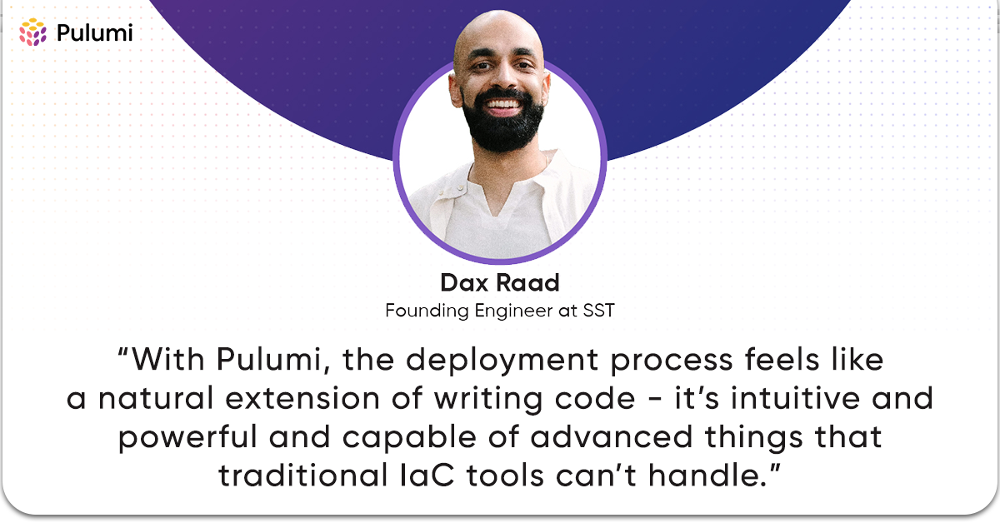

Cloud computing tools evolve, and so must the frameworks developers rely on. For SST (Serverless Stack), AWS CDK was a great starting point—but it had limitations.

- CDK tied infrastructure to AWS.
- Debugging was frustrating due to CloudFormation templates.
- Multi-cloud was nearly impossible.

The solution? Pulumi. In this post, we’ll explore why SST moved to Pulumi, what challenges they overcame, and what this means for developers building modern cloud applications.

TL;DR: Pulumi lets SST offer a faster, more flexible, and provider-agnostic infrastructure experience.

<!--more-->

## In This Article:

- [The Beginnings of SST](/blog/from-cdk-pulumi-evolution-of-sst/#the-beginnings-of-sst)
- [CDK and CloudFormation Limitations](/blog/from-cdk-pulumi-evolution-of-sst/#cdk-and-cloudformation-limitations)
- [A Provider-agnostic Solution: Discovering Pulumi](/blog/from-cdk-pulumi-evolution-of-sst/#a-provider-agnostic-solution-discovering-pulumi)
- [Transitioning to Pulumi](/blog/from-cdk-pulumi-evolution-of-sst/#transitioning-to-pulumi)
- [The Benefits of Pulumi](/blog/from-cdk-pulumi-evolution-of-sst/#the-benefits-of-pulumi)
- [The Future of SST with Pulumi](/blog/from-cdk-pulumi-evolution-of-sst/#the-future-of-sst-with-pulumi)

## The Beginnings of SST

Application developers have witnessed the rapid evolution of cloud computing and the growing need for developers to have direct access to powerful cloud resources. However, the traditional tools and approaches to Infrastructure as Code (IaC) have often been geared more toward DevOps teams, leaving application developers feeling disconnected from the infrastructure side of their projects.

This was the driving force behind the creation of [SST (Serverless Stack)](https://sst.dev/), a framework that aims to bridge the gap between application developers and infrastructure management. In the early days, SST was built on top of AWS's Cloud Development Kit (CDK), which allowed developers to define their infrastructure using TypeScript or Python. While this was a step in the right direction, they soon realized that the limitations of CDK and the underlying AWS CloudFormation were holding them back from truly empowering application developers.

## CDK and CloudFormation Limitations



As the SST's team continued to work with CDK and CloudFormation, they encountered several challenges that led them to reevaluate their approach. One key issue was the disconnect between application developers' thinking and working and traditional IaC tools' operating methods.

With CDK and [CloudFormation](https://www.pulumi.com/docs/iac/concepts/vs/cloud-templates/cloudformation/#what-is-cloudformation), the infrastructure code is essentially a code generator, producing an intermediary format (such as YAML or JSON) that is then executed to deploy the resources. This means that the actual code you write as a developer is not the same as the code running during the deployment process. This can lead to several problems, such as difficulty debugging, lack of visibility into the deployment process, and challenges in extending or customizing the deployment workflow.

Additionally, as the SST's team expanded its focus beyond the AWS ecosystem and started exploring other cloud providers and even on-premises infrastructure, it found that the [AWS-centric nature of CDK](https://www.pulumi.com/docs/iac/concepts/vs/cloud-template-transpilers/aws-cdk/#what-is-aws-cdk) and CloudFormation was becoming a limitation. It needed a more flexible and provider-agnostic solution that would allow it to deploy and manage infrastructure across a wide range of platforms.

| Feature                 | AWS CDK                      | Pulumi                         |
|-------------------------|----------------------------|--------------------------------|
| **Multi-Cloud Support** | ❌ AWS-Only                | ✅ AWS, Azure, GCP, On-Prem   |
| **Debugging**           | ❌ Hard due to CloudFormation | ✅ Real-time debugging       |
| **Language Support**    | ⚠️ TypeScript, Python       | ✅ Any programming language  |
| **Deployment Speed**    | ❌ Slower due to CloudFormation | ✅ Faster direct execution  |
| **Visibility**          | ❌ Hard to trace errors     | ✅ Clear deployment state     |
| **Extensibility**       | ⚠️ Limited to AWS ecosystem | ✅ Custom providers & workflows |
| **State Management**    | ❌ CloudFormation state file | ✅ Pulumi-managed state       |
| **Secrets Management**  | ❌ AWS Secrets Manager only | ✅ Cross-cloud secret support |

## A Provider-agnostic Solution: Discovering Pulumi

It was during this time that the SST team discovered Pulumi, a modern IaC platform that takes a fundamentally different approach to infrastructure management. Instead of generating an intermediary format, Pulumi treats the infrastructure code as a first-class program executed directly during deployment.

This paradigm shift had several important implications for SST and its users:

- **Visibility and Extensibility**: With Pulumi, the infrastructure code is the same code that is running during deployment, which means there is much greater visibility into the deployment process and the ability to extend or customize it as needed.
- **Multi-Cloud Capabilities**: Pulumi's provider-agnostic approach allows SST's team to easily work with a wide range of cloud and on-premises platforms, giving their users the flexibility to deploy their infrastructure wherever it makes the most sense for their application.
- **Simplified Mental Model**: For application developers, the Pulumi model of "your code is the deployment" aligns much more closely with their existing mental models and workflows, making it easier for them to adopt and work with IaC tools.

## Transitioning to Pulumi

Transitioning SST from CDK to Pulumi was not a trivial undertaking. Still, they knew it was a necessary step to truly fulfill their mission of empowering application developers with powerful infrastructure management capabilities.

One key challenge they faced was re-implementing the higher-level components and abstractions they had built on top of CDK. These components were designed to simplify the infrastructure management experience for their users, and they wanted to ensure that they could provide a similar level of abstraction and ease of use with Pulumi.

Additionally, they had to carefully consider how to handle the various edge cases and complex deployment scenarios their users encountered with the CDK-based version of SST. They wanted to ensure that the Pulumi-based version would not only match the functionality of the previous version but also improve upon it and address some of the limitations they had encountered.

## The Benefits of Pulumi

As they worked through the transition to Pulumi, they realized the significant benefits that Pulumi offered to both the SST team as the framework developers and the users.

### Improved Visibility and Debugging

One of Pulumi's most immediate and tangible benefits was the [improved visibility and debugging capabilities](https://www.pulumi.com/product/pulumi-insights/) it provided. With the infrastructure code being the same as the deployment code, they could easily trace issues back to the source and understand exactly what was happening during the deployment process.

This starkly contrasted the CDK/CloudFormation approach, where the intermediary format (CloudFormation templates) often obscured the underlying logic and made it much more difficult to diagnose and resolve problems.

### Extensibility and Customization

Pulumi's design also allowed the SST team to easily extend and customize the deployment process to meet the specific needs of their users. They could leverage Pulumi's built-in extensibility features, such as custom providers and dynamic components, to integrate with a wide range of cloud and on-premises services and implement complex deployment workflows tailored to our users' requirements.

This level of customization was much more challenging with the CDK/CloudFormation approach, where they often had to resort to hacky workarounds or custom Lambda functions to achieve the desired functionality.

### Multi-Cloud Capabilities

As mentioned earlier, one key driver for their transition to Pulumi was the need to support a wider range of cloud and on-premises platforms. With Pulumi's provider-agnostic approach, the SST team was able to easily add support for new providers, allowing their users to deploy and manage infrastructure across a diverse set of environments.

This flexibility has been particularly valuable for their users, who may have workloads or requirements that span multiple cloud providers or even on-premises infrastructure. With SST built on Pulumi, they can now manage all of their infrastructure through a single, consistent interface without having to juggle multiple tools or approaches.

### Simplified Mental Model

One of Pulumi's most significant benefits for SST users is the simplified mental model it provides. By treating the infrastructure code as a first-class program, Pulumi aligns much more closely with how application developers think and work.

Instead of having to navigate the complexities of intermediary formats, deployment pipelines, and the separation between infrastructure code and deployment code, SST users can now focus on writing their infrastructure logic in the same programming languages they use for their application code. This makes it much easier for them to understand, maintain, and extend their infrastructure as their needs evolve.

## The Future of SST with Pulumi

With Pulumi's foundation in place, they can now focus on further enhancing the developer experience and expanding the capabilities of their framework. Some of the key areas they are exploring include:

- **Deeper Integration with Application Frameworks**: By leveraging Pulumi's flexibility, they can create even tighter integrations between SST and the application frameworks and libraries that their users rely on, making managing infrastructure seamless alongside their application code.
- **Expanded Provider Support**: the SST team will continue to add support for a wide range of cloud and on-premises providers, ensuring that their users can deploy and manage their infrastructure wherever it makes the most sense for their needs.
- **Improved Deployment Workflows**: Building on Pulumi's extensibility, they can create [more advanced deployment workflows](https://www.pulumi.com/docs/pulumi-cloud/deployments/) that address the specific needs of application developers, such as faster deployment times, better rollback capabilities, and more granular control over the deployment process.
- **Enhanced Observability and Monitoring**: By treating the infrastructure code as a first-class program, they can provide their users with [better visibility](https://www.pulumi.com/product/pulumi-insights/) into the deployment process and more robust monitoring and observability capabilities, helping them to identify and resolve issues quickly.

As the SST team continues to evolve with Pulumi at its core, they aim to deliver an even more powerful and user-friendly infrastructure management experience for developers. This will empower teams to focus on building great applications while effortlessly managing the underlying infrastructure.

## Conclusion

If you're interested in exploring Pulumi further, here are several ways to get involved:

- Discover how Pulumi Crosswalk for AWS simplifies “day one” tasks in our [AWS guide](https://www.pulumi.com/docs/iac/clouds/aws/guides/)
- Watch our on-demand workshop [Getting Stated with Infrastructure as Code on AWS](https://www.pulumi.com/resources/getting-started-with-iac-pulumi-aws/)
- Register for one of our upcoming [Platform Engineering or DevOps workshops](https://www.pulumi.com/resources/#upcoming)
- But most importantly, [try Pulumi](https://app.pulumi.com/signup) today!

---

## Frequently Asked Questions

### What is SST?

SST is a framework that makes building modern full-stack applications on your infrastructure easy.

### What is SST's Ion?

Ion is the code name for a new engine for deploying SST applications. The constructs (or components) are deployed using Pulumi instead of CDK and CloudFormation (CFN). Once Ion is stable, it will be released as SST v3.

### Does SST use mostly Terraform or Pulumi?

SST leverages Pulumi behind the scenes for its providers and deployment engine while also bridging Terraform providers through Pulumi.

### How does SST make money?

SST (Serverless Stack) makes money primarily through its managed service, called SST Console. The Console is optional and includes a free tier. In short, SST primarily relies on SaaS (Software as a Service) revenue through its managed platform and potentially supplemental income streams like enterprise services and consulting.
