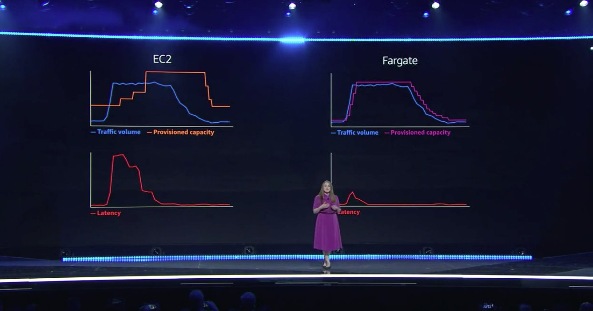

At AWS re:Invent this week, Amazon highlighted two new features that simplify scaling your Elastic Kubernetes Service (EKS) clusters: Managed Node Groups and Fargate. We're happy to announce that we've integrated support for both, making our existing EKS support even easier to use than before. The result is a great spectrum of options for managing your cluster's compute &mdash; offering productivity, flexibility, and control, based on your needs.

<!--more-->

## Managing EKS Workers

You now have three primary options for powering your EKS clusters:

* **Fargate**: Let [AWS Fargate](https://aws.amazon.com/fargate/) intelligently manage and scale nodes automatically
* **Managed Node Groups**: Let EKS manage and scale nodes based on declarative specifications
* **EC2**: Manage nodes by hand using explicit groups, EC2 instances, and Auto Scaling Groups

Each option controls how your cluster's worker nodes are provisioned, managed, and scaled. Worker nodes are what physically run the compute and host the storage used by your Kubernetes pods, and impact the cost and your cluster's ability to meet workload demands. The spectrum of options available provides a range of flexibility, from least control to most control, respectively, over the configuration and provisioning of these worker nodes.

[Abby Fuller](https://twitter.com/abbyfuller) from AWS explained these options visually and succinctly on Twitter:



Let's now see how each of these work. To fully appreciate the new features, we will go in the reverse order &mdash; from most control and most difficult, to the least control and easiest, option.

## Provisioning EKS Clusters

Running a Kubernetes cluster isn't easy, but EKS makes the task of doing so much simpler. It offers out-of-the-box integrations with essential AWS services like IAM, EBS, Route53, and CloudWatch, so that your EKS clusters fit with your existing AWS security, storage, and monitoring practices.

It's great to have all of the building blocks at your fingertips, and the `@pulumi/aws` package [exposes these raw capabilities of EKS to you](). [We also created an EKS package]() to simplify common tasks, however, including creating the Kubernetes data plane, configuring VPC/CNI and subnet networking, and managing node groups. This package has been enlightened with the new features, and is what we'll use in our examples.

Provisioning a new EKS cluster today is already as simple as a dozen lines of code:

```typescript
import * as awsx from "@pulumi/awsx";
import * as eks from "@pulumi/eks";

// Create a VPC for our cluster.
const vpc = new awsx.ec2.Vpc("my-vpc");

// Create the EKS cluster itself, including a "gp2"-backed StorageClass.
const cluster = new eks.Cluster("my-cluster", {
    vpcId: vpc.vpcId,
    publicSubnetIds: vpc.publicSubnetIds,
    privateSubnetIds: vpc.privateSubnetIds,
    instanceType: "t2.medium",
    desiredCapacity: 5,
    minSize: 3,
    maxSize: 7,
    storageClasses: "gp2",
});

// Export the cluster's kubeconfig.
export const kubeconfig = cluster.kubeconfig;
```

[This program](https://github.com/pulumi/examples/tree/master/aws-ts-eks), when deployed with `pulumi up`, will provision an entire EKS cluster, all of its related infrastructure and internal Kubernetes resources, and then print out the `kubeconfig` that can be used to access the cluster afterwards:

```
$ pulumi up
Updating (dev):

     Type                                          Name                                       Status
 +   pulumi:pulumi:Stack                           aws-ts-eks-dev                             created
 +   ├─ awsx:network:Network                       vpc                                        created
 +   │  ├─ aws:ec2:Vpc                             vpc                                        created
 +   │  ├─ aws:ec2:InternetGateway                 vpc                                        created
 +   │  ├─ aws:ec2:Subnet                          vpc-0                                      created
 +   │  ├─ aws:ec2:Subnet                          vpc-1                                      created
 +   │  ├─ aws:ec2:RouteTable                      vpc                                        created
 +   │  ├─ aws:ec2:RouteTableAssociation           vpc-0                                      created
 +   │  └─ aws:ec2:RouteTableAssociation           vpc-1                                      created
 +   └─ eks:index:Cluster                          cluster                                    created
 +      ├─ eks:index:ServiceRole                   cluster-instanceRole                       created
 +      │  ├─ aws:iam:Role                         cluster-instanceRole-role                  created
 +      │  ├─ aws:iam:RolePolicyAttachment         cluster-instanceRole-e1b295bd              created
 +      │  ├─ aws:iam:RolePolicyAttachment         cluster-instanceRole-3eb088f2              created
 +      │  └─ aws:iam:RolePolicyAttachment         cluster-instanceRole-03516f97              created
 +      ├─ eks:index:ServiceRole                   cluster-eksRole                            created
 +      │  ├─ aws:iam:Role                         cluster-eksRole-role                       created
 +      │  ├─ aws:iam:RolePolicyAttachment         cluster-eksRole-90eb1c99                   created
 +      │  └─ aws:iam:RolePolicyAttachment         cluster-eksRole-4b490823                   created
 +      ├─ pulumi-nodejs:dynamic:Resource          cluster-cfnStackName                       created
 +      ├─ aws:ec2:SecurityGroup                   cluster-eksClusterSecurityGroup            created
 +      ├─ aws:iam:InstanceProfile                 cluster-instanceProfile                    created
 +      ├─ aws:ec2:SecurityGroupRule               cluster-eksClusterInternetEgressRule       created
 +      ├─ aws:eks:Cluster                         cluster-eksCluster                         created
 +      ├─ aws:ec2:SecurityGroup                   cluster-nodeSecurityGroup                  created
 +      ├─ aws:ec2:SecurityGroupRule               cluster-eksNodeInternetEgressRule          created
 +      ├─ aws:ec2:SecurityGroupRule               cluster-eksExtApiServerClusterIngressRule  created
 +      ├─ aws:ec2:SecurityGroupRule               cluster-eksClusterIngressRule              created
 +      ├─ aws:ec2:SecurityGroupRule               cluster-eksNodeClusterIngressRule          created
 +      ├─ aws:ec2:SecurityGroupRule               cluster-eksNodeIngressRule                 created
 +      ├─ aws:ec2:LaunchConfiguration             cluster-nodeLaunchConfiguration            created
 +      ├─ pulumi-nodejs:dynamic:Resource          cluster-vpc-cni                            created
 +      ├─ pulumi:providers:kubernetes             cluster-eks-k8s                            created
 +      ├─ kubernetes:core:ConfigMap               cluster-nodeAccess                         created
 +      ├─ kubernetes:storage.k8s.io:StorageClass  cluster-gp2                                created
 +      ├─ aws:cloudformation:Stack                cluster-nodes                              created
 +      └─ pulumi:providers:kubernetes             cluster-provider                           created

Outputs:
    kubeconfig: {
        apiVersion     : "v1"
        clusters       : [
            [0]: {
                cluster: {
                    certificate-authority-data: "..."
                    server                    : "https://312E10705C16E8095B2A79E8E76EA00D.gr7.us-west-2.eks.amazonaws.com"
                }
                name   : "kubernetes"
            }
        ]
        contexts       : [
            [0]: {
                context: {
                    cluster: "kubernetes"
                    user   : "aws"
                }
                name   : "aws"
            }
        ]
        current-context: "aws"
        kind           : "Config"
        users          : [
            [0]: {
                name: "aws"
                user: {
                    exec: {
                        apiVersion: "client.authentication.k8s.io/v1alpha1"
                        args      : [
                            [0]: "token"
                            [1]: "-i"
                            [2]: "cluster-eksCluster-560236b"
                        ]
                        command   : "aws-iam-authenticator"
                    }
                }
            }
        ]
    }

Resources:
    + 37 created

Duration: 12m12s
```

As soon as this cluster is up and running, we can interact with it with `kubectl`, or deploy with Pulumi:

```bash
$ pulumi stack output kubeconfig > kubeconfig.yml
$ KUBECONFIG=kubeconfig.yml kubectl get nodes
NAME                                             STATUS   ROLES    AGE   VERSION
aws-ip-10-0-164-133.us-east-2.compute.internal   Ready    <none>   4m    v1.14.8-eks
aws-ip-10-0-233-6.us-east-2.compute.internal     Ready    <none>   4m    v1.14.8-eks
```

## Manually Managing EC2 Node Groups

A fully functioning production cluster usually requires many other considerations. For those, we've put together [a set of playbooks as part of Pulumi Crosswalk for Kubernetes]() that walk through how to go to production with EKS specifically, in addition to other managed Kubernetes offerings.

Notice, for instance, that we didn't need to even provision any worker nodes. This is thanks to the `eks.Cluster` abstraction creating a default node pool for us, which has an auto-scaling policy that attempts to maintain the `desiredCapacity` while remaining within the bounds of `minSize` and `maxSize`. Often you need more explicit control over the worker nodes, however, for reasons such precise capacity, specializing compute or storage for different workload needs, and so on. This ultimately devolves into managing EC2 instances by hand, which [the `eks.NodeGroup` class supports]().

For example, this code creates a new EKS cluster, disabling the default node group &mdash; using `skipDefaultNodeGroup: true`, since we will create our own &mdash; and creates a single node group with more specific configuration settings: IAM role, desired instance type, scaling parameters, labels, and so on:

```typescript
import * as aws from "@pulumi/aws";
import * as awsx from "@pulumi/awsx";
import * as eks from "@pulumi/eks";

// Create a VPC for our cluster.
const vpc = new awsx.ec2.Vpc("my-vpc");

// IAM roles for the node group.
const role = new aws.iam.Role("my-cluster-ng-role", {
    assumeRolePolicy: aws.iam.assumeRolePolicyForPrincipal({
        Service: "ec2.amazonaws.com",
    }),
});
let counter = 0;
for (const policyArn of [
    "arn:aws:iam::aws:policy/AmazonEKSWorkerNodePolicy",
    "arn:aws:iam::aws:policy/AmazonEKS_CNI_Policy",
    "arn:aws:iam::aws:policy/AmazonEC2ContainerRegistryReadOnly",
]) {
    new aws.iam.RolePolicyAttachment(`my-cluster-ng-role-policy-${counter++}`,
        { policyArn, role },
    );
}
const instanceProfile = new aws.iam.InstanceProfile("my-cluster-ng-ip", { role });

// Create an EKS cluster.
const cluster = new eks.Cluster("my-cluster", {
    skipDefaultNodeGroup: true,
    vpcId: vpc.vpcId,
    publicSubnetIds: vpc.publicSubnetIds,
    privateSubnetIds: vpc.privateSubnetIds,
    instanceRoles: [ role ],
});

// Create an AWS node group using a cluster as input.
const nodeGroup = cluster.createNodeGroup("my-cluster-ng", {
    instanceType: "t2.medium",
    desiredCapacity: 1,
    minSize: 1,
    maxSize: 2,
    labels: { "ondemand": "true" },
    instanceProfile: instanceProfile,
});

// Export the cluster's kubeconfig.
export const kubeconfig = cluster.kubeconfig;
```

There is even more you can do here, including digging deep into the individual EC2 instances and Auto Scaling Groups powering the node group. Needing to manage workers at this level, and connect them to the right IAM and networking services, can be tedious and difficult to get right. That's where the new AWS features come into play.

## Automatically Managed Node Groups

The new EKS feature [Managed Node Groups](https://aws.amazon.com/blogs/containers/eks-managed-node-groups/) simplifies the task of managing explicit pools of worker nodes, at the cost of some amount of control. The `@pulumi/eks` package already had many of these conveniences built-in but this is now an official feature of the AWS platform.

Managed Node Groups will automatically scale the EC2 instances powering your cluster using an Auto Scaling Group managed by EKS. This ASG also runs the latest Amazon EKS-optimized Amazon Linux 2 AMI. This is great on one hand &mdash; because updates will be applied automatically for you &mdash; but if you want control over this you will want to manage your own node groups. Finally, security groups, IAM roles, and connecting them together is handled for you.

To opt-in to using Managed Node Groups, the raw [`aws.eks.NodeGroup` building block]() is available. However, we've enlightened the EKS package with the `eks.Cluster.createManagedNodeGroup` function to make it easier and to integrate with cluster provisioning.

The following example creates an EKS cluster with a single Managed Node Group. It looks similar to our explicitly managed node group earlier, but a bit simpler because we can lean on EKS to configure and scale it:

```typescript
import * as aws from "@pulumi/aws";
import * as awsx from "@pulumi/awsx";
import * as eks from "@pulumi/eks";

// Create a VPC for our cluster.
const vpc = new awsx.ec2.Vpc("my-vpc");

// IAM roles for the node group.
const role = new aws.iam.Role("my-cluster-ng-role", {
    assumeRolePolicy: aws.iam.assumeRolePolicyForPrincipal({
        Service: "ec2.amazonaws.com",
    }),
});
let counter = 0;
for (const policyArn of [
    "arn:aws:iam::aws:policy/AmazonEKSWorkerNodePolicy",
    "arn:aws:iam::aws:policy/AmazonEKS_CNI_Policy",
    "arn:aws:iam::aws:policy/AmazonEC2ContainerRegistryReadOnly",
]) {
    new aws.iam.RolePolicyAttachment(`my-cluster-ng-role-policy-${counter++}`,
        { policyArn, role },
    );
}

// Create an EKS cluster.
const cluster = new eks.Cluster("my-cluster", {
    skipDefaultNodeGroup: true,
    vpcId: vpc.vpcId,
    publicSubnetIds: vpc.publicSubnetIds,
    privateSubnetIds: vpc.privateSubnetIds,
    instanceRoles: [ role ],
});

// Create a simple AWS managed node group using a cluster as input.
const managedNodeGroup = eks.createManagedNodeGroup("my-cluster-ng", {
    cluster: cluster,
    nodeGroupName: "aws-managed-ng1",
    nodeRoleArn: role.arn,
    labels: { "ondemand": "true" },
    tags: { "org": "pulumi" },
}, cluster);

// Export the cluster's kubeconfig.
export const kubeconfig = cluster.kubeconfig;
```

This can be provisioned with a single `pulumi up`, just like before, but instead of the automatically created default node group, our cluster will use a Managed Node Group instead.

Note that it's possible to mix node groups. So, if you need precise control over some groups, but not others, feel free to call `createNodeGroup` and `createManagedNodeGroup` interspersed with one another. The EKS package knows what to do.

For a full list of properties you can configure on your Managed Node Groups, please refer to the [`createManagedNodeGroup` API docs](). There are fewer options available than manually managed node groups, such as inability to supply kubelet arguments, for instance. We are giving up some control in exchange for simplicity. For complete information about EKS Managed Node Groups, [see AWS's own product documentation](https://docs.aws.amazon.com/eks/latest/userguide/managed-node-groups.html).

## Let Fargate Manage It All

Using EKS Managed Node Groups is a great step forward to simplifying how we run our Kubernetes workloads. It still means, however, that we need to declare our compute requirements and think at the level of worker nodes. That's where [AWS Fargate support for EKS](https://aws.amazon.com/blogs/aws/amazon-eks-on-aws-fargate-now-generally-available/) offers a huge step function in simplifying our task of managing and scaling our EKS clusters.

AWS Fargate technology is essentially "serverless compute for containers." Instead of thinking at the level of nodes, we can let Fargate handle provisioning, scaling, and scheduling of our cluster's worker nodes. This means we can just operate at the level of Kubernetes pods abstractions and let AWS do all of the other hard work for us!

Not only is it simpler, but as [Clare Liguori](https://twitter.com/clare_liguori) explained at re:Invent, Fargate can react very quickly to load changes. Amazon has put a ton of great effort into projects like [AWS Nitro](https://aws.amazon.com/ec2/nitro/) and [Firecracker](https://firecracker-microvm.github.io/), ultimately leading to lightning fast startup times and impressive auto-scaling capabilities. Fargate for EKS taps into all of this goodness:



Now let's see how to use it. The key building block that enables Fargate support is something called a [Fargate profile](). Like `eks.NodeGroup`s above, one of these can be allocated explicitly, if you prefer to program at the level of the raw underlying building blocks.

The EKS package, however, has  been enlightened to make allocating a Fargate-powered EKS cluster as simple as saying `fargate: true`. All we need to do is change our original cluster definition to the following:

```typescript
import * as awsx from "@pulumi/awsx";
import * as eks from "@pulumi/eks";

// Create a VPC for our cluster.
const vpc = new awsx.ec2.Vpc("my-vpc");

// Create the EKS cluster itself with Fargate enabled.
const cluster = new eks.Cluster("my-cluster", {
    fargate: true,
    vpcId: vpc.id,
    privateSubnetIds: vpc.privateSubnetIds,
});

// Export the cluster's kubeconfig.
export const kubeconfig = cluster.kubeconfig;
```

If we provision this with `pulumi up`, we've got a fully functioning EKS cluster running on Fargate:

```bash
$ pulumi up
...
$ pulumi stack output kubeconfig > kubeconfig.yml
$ KUBECONFIG=kubeconfig.yml kubectl get nodes
NAME                                                STATUS   ROLES    AGE   VERSION
fargate-ip-10-0-174-4.us-east-2.compute.internal    Ready    <none>   3m    v1.14.8-eks
fargate-ip-10-0-266-133.us-east-2.compute.internal  Ready    <none>   2m    v1.14.8-eks
```

All of the hard work around managing and scaling our cluster is left to AWS Fargate, letting us focus on our workload!

## In Conclusion

In this article, we've seen the full range of EKS cluster management options:

* Fargate, for easy auto-scaling of your cluster's worker compute
* Managed Node Groups, enabling more control, while still leveraging EKS to auto-scale
* EC2, for full control over your cluster's compute pools and nodes

We're excited to offer support for this full range of options the same week of AWS re:Invent, including not just the building block support, but the simpler interface provided by [our open source EKS package](https://github.com/pulumi/pulumi-eks).

To get started with Pulumi and kick the tires with EKS today, check out our [Getting Started guide](). There are both [AWS]() and [Kubernetes]() versions available.

Happy Fargating!
