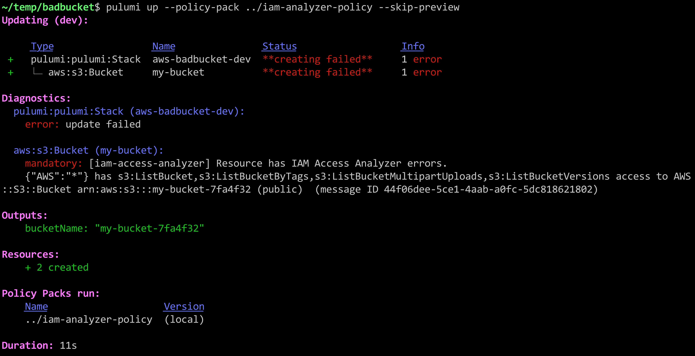

Yesterday AWS announced an exciting new feature &mdash; [the AWS Identity and Access Management (IAM) Access Analyzer](https://aws.amazon.com/blogs/aws/identify-unintended-resource-access-with-aws-identity-and-access-management-iam-access-analyzer/) &mdash; a service powered by automated reasoning that detects potentially-insecure access to your AWS resources, including S3 Buckets, SQS Queues, Lambdas, and more. At the same time, Pulumi announced [a new policy as code solution, CrossGuard](), that validates policies at deployment time. The question is: Can IAM Access Analyzer and Pulumi CrossGuard be combined to get the best of both solutions? The answer is Yes!

## Fast Forward to Security By Default

Before diving into the details of how this all works, let's see what this looks like in action.

By default, the IAM Access Analyzer runs in your account, monitoring for new resources and creating alerts as new problems are identified. This approach does not tell you as part of a deployment that a new problem has been introduced, however. In this post, we'll use Pulumi CrossGuard to flag deployments that have introduced a new problem, so you find out about it right away.

Let's try to create an S3 Bucket with `public-read` access:

```typescript
import * as aws from "@pulumi/aws";
const bucket = new aws.s3.Bucket("my-bucket", {
    acl: "public-read",
});
```

The `acl` here means the S3 Bucket is available to the Internet &mdash; sometimes what you want, but usually not &mdash; and potentially a major security catastrophe waiting to happen! This is a very easy mistake to make. How do we prevent it?

Pulumi CrossGuard can stop such things. In fact, we have [an AWSGuard policy pack](https://github.com/pulumi/pulumi-policy-aws) that will enforce the best practices across all of the AWS services, out of the box, including security, compliance, and cost-based rules. That includes checking for public S3 buckets.

As AWS makes their own platform more secure by default, however, we would love to take advantage of it as soon as new features come out. And IAM Access Analyzer seems to have some very smart smarts behind it, which we would greatly benefit from, [as articulated in this research paper](https://ieeexplore.ieee.org/abstract/document/8602994).

Thanks to CrossGuard's use of full-blown programming languages, we can easily tap into the AWS SDK support for IAM Access Analyzer. The result is that if we try to deploy the above program with our custom policy pack &mdash; `pulumi up --policy-pack ~/iam-analyzer-policy` &mdash; we get an error:



Nice! Security catastrophe averted! Now let's dig into how it all works.

## IAM Access Analyzer, Meet CrossGuard

First thing's first: IAM Access Analyzer is new; and Pulumi CrossGuard is new. Both of them were announced just yesterday! So a lot of what we're going to look at will evolve in the weeks to come. Nevertheless, the result is very exciting &mdash; as soon as we saw the IAM Access Analyzer announcement, we knew there could be magic in combining the two ideas.

The approaches are different but complementary:

* IAM Access Analyzer uses a single analyzer per-region that validates all resources within it. For each problem it identifies, it creates a so-called "finding" which records what policy is responsible for granting wider access to specific resources than you might want.

* CrossGuard, on the other hand, operates by applying individual policy packs to specific stacks of resources. This can be configured to run automatically anytime a deployment occurs in your organization, or explicitly using the `--policy-pack` argument shown above.

To see how they can work in partnership with one another, we will create a new CrossGuard policy pack that uses the new IAM service. We'll walk the code step by step, but the full code is also [available on GitHub](https://gist.github.com/joeduffy/ecb6946d94312f96c22153d659b5dfb4).

First, we created this new policy pack with the following commands:

```bash
mkdir ~/iam-analyzer-policy
cd ~/iam-analyzer-policy
pulumi policy new aws-typescript
```

This populates the `~/iam-analyzer-policy` directory with the scaffolding needed to create a policy pack.

By default, the template will have installed the `@pulumi/pulumi`, `@pulumi/policy`, and `@pulumi/aws` packages. We need some others:

```bash
npm install aws-sdk uuid
```

Now let's import everything we need at the top of our `index.ts` file, which is where we'll build out our policy:

```typescript
import * as AWS from "aws-sdk"
import * as aws from "@pulumi/aws";
import * as pulumi from "@pulumi/pulumi";
import { PolicyPack, ReportViolation, StackValidationArgs } from "@pulumi/policy";
import * as uuid from "uuid";
```

Next we'll allocate our policy pack and its internal policies. We will only have a single rule at this time:

```typescript
new PolicyPack("aws-typescript", {
    policies: [{
        name: "iam-access-analyzer",
        description: "Resource has IAM Access Analyzer errors.",
        enforcementLevel: "mandatory",
        validateStack: async (args: StackValidationArgs, reportViolation: ReportViolation) => {
            // interesting part goes here ...
        },
    }],
});
```

Notice we are using the `validateStack` callback to validate our resources. The alternative is to use `validateResource`, which runs on a single resource at a time. In this case, the stack-wide validation is easier, since we'll be sharing a single IAM analyzer instance.

Let's start filling out the `validateStack` function. First, during previews (indicated by the `pulumi.runtime.isDryRun()` function), we want to skip validation. The reason is that IAM Access Analyzer only runs against _real_ resources already allocated. Perhaps in the future, it will let us query resources _before_ they are created, but for now the best we can do is catch the mistake immediately afterwards. Thankfully, CrossGuard supports running both before provisioning, during previews, in addition to afterwards.

```typescript
// If we're doing a dry-run, we skip this, because IAM Access Analyzer only analyzes actual resources.
// Ideally in the future, they will support scanning them *before* the problem is actually deployed!
if (pulumi.runtime.isDryRun()) {
    return;
}
```

Next, now that we know we're doing an update, we want to create an IAM Access Analyzer SDK object that we can use to call the service:

```typescript
// Create a fresh analyzer for this run.
const svc = new AWS.AccessAnalyzer({ region: aws.config.region || "us-east-1" });
```

Now we can provision the temporary analyzer itself that we'll use for this validation pass:

```typescript
const analyzerName = `iam-analyzer-${uuid.v4().toString()}`;
const resp = await svc.createAnalyzer({ analyzerName, type: "ACCOUNT" }).promise();
const analyzerArn = resp.arn!;
try {
```

Notice we've wrapped the subsequent code in a `try` block; you'll see a `finally` below that deletes the temporary analyzer object.

> Our illustration here creates and uses an IAM Access Analyzer with `"ACCOUNT"` scope, the only currently supported option at the time of this writing. Because of the restriction that there can only be one analyzer per account, per region, this may cause issues if you already have an analyzer pre-created, or need to run deployments in parallel. Depending on how the IAM Access Analyzer feature evolves, you may want to take a different approach than what is shown here.

Next up, we'll look for all resource types supported by IAM Access Analyzer, and kick off a resource scan for each one:

```typescript
    // Now, find all eligible resources, create a map of them, and kick off scans for each one.
    const analyzed: string[] = [];
    const analyzedUrns: {[arn: string]: string} = {};
    for (const res of args.resources) {
        let resourceArn: string | undefined;
        if ([ "aws:iam/role:Role", "aws:kms/key:Key", "aws:lambda/function:Function",
                "aws:lambda/layerFunction:LayerFunction", "aws:s3/bucket:Bucket", "aws:sqs/queue:Queue" ].
                    indexOf(res.type) !== -1) {
            resourceArn = res.props.arn;
        }

        if (resourceArn) {
            await svc.startResourceScan({ analyzerArn, resourceArn }).promise();
            analyzed.push(resourceArn);
            analyzedUrns[resourceArn] = res.urn;
        }
    }
```

The `startResourceScan` function is asynchronous, so we'll now need to wait until all of the requested resources have been analyzed. This requires us to poll the AWS API with appropriate pagination. We will wait up to 30 seconds for the results to converge:

```typescript
    // Wait until all resources have been analyzed.
    const maxRetries = 30;
    for (let i = 0; i < maxRetries; i++) {
        const analyzed: {[arn: string]: boolean} = {};
        let nextToken: string | undefined;
        do {
            const result = await svc.listAnalyzedResources({ analyzerArn }).promise();
            for (const res of result.analyzedResources) {
                analyzed[res.resourceArn] = true;
            }
            nextToken = result.nextToken;
        } while (nextToken);

        let done = true;
        for (const arn of Object.keys(analyzedUrns)) {
            if (!analyzed[arn]) {
                done = false;
                break;
            }
        }
        if (done) {
            break;
        }

        if (i == maxRetries-1) {
            reportViolation(`Timed out waiting for IAM Access Analyzer results; is the region correct?`);
            return;
        } else {
            await new Promise((resolve) => setTimeout(resolve, 1000));
        }
    }
```

Now that we know the results are available, we simply have to list the detailed findings. In this example, our policy pack will only issue an error for every IAM configuration that leads to potentially unwanted _public_ access. [Each finding contains detailed information](https://docs.aws.amazon.com/access-analyzer/latest/APIReference/API_FindingSummary.html) about the IAM resources causing unwanted access, the ARN of the target resource, and remediation information:

```typescript
    // Now that the scan is ready, go ahead and list the findings, triggering errors as appropriate.
    let nextToken: string | undefined;
    do {
        const result = await svc.listFindings({ analyzerArn, nextToken }).promise();
        for (let finding of result.findings) {
            if (finding.isPublic && finding.resource) {
                // Only report violations for resources within this stack.
                const urn = analyzedUrns[finding.resource];
                if (urn) {
                    reportViolation(
                        `${JSON.stringify(finding.principal)} has ${finding.action} access to ` +
                            `${finding.resourceType} ${finding.resource} (public) ${finding.error || ""} ` +
                                `(message ID ${finding.id})`,
                        urn);
                }
            }
        }
        nextToken = result.nextToken;
    } while (nextToken);
```

And finally, now that all of our scanning and results are available, we just need to clean up our temporary analyzer object:

```typescript
} finally {
    // Ensure to delete the analyzer before returning.
    await svc.deleteAnalyzer({ analyzerName }).promise();
}
```

That's it. Now we have a fully functioning policy pack that can be uploaded to our organization using `pulumi policy publish`, or run as shown earlier in the post with the `--policy-pack` flag to `pulumi up` or `pulumi preview`. The result?

```
mandatory: [iam-access-analyzer] Resource has IAM Access Analyzer errors.
    {"AWS":"*"} has s3:ListBucket,s3:ListBucketByTags,s3:ListBucketMultipartUploads,s3:ListBucketVersions access to AWS::S3::Bucket arn:aws:s3:::my-bucket-298b5bc (public)  (message ID ccaec287-92f3-4136-bb1f-f7a731efdf62)
```

## Trying It Out

In this article, we've seen how to enforce AWS's new IAM Access Analyzer policies at deployment time, using Pulumi's new CrossGuard feature. This helps to catch security mistakes when you do a deployment &mdash; instead of later on, when the cost of a mistake is potentially significantly greater. Although both features are early and will evolve in the weeks to come, it's nice to see it so easy to quickly combine two features the day after they were both announced, to advance the security of your infrastructure.

To give it a try, [download and install Pulumi](), [grab the code from GitHub](https://gist.github.com/joeduffy/ecb6946d94312f96c22153d659b5dfb4), and [get started with policy as code](), all using free open source.
