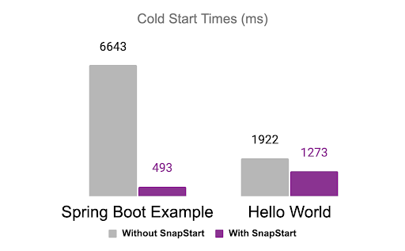

As AWS Lambda has matured as a serverless platform, there are two key ways the service has evolved:

1. New capabilities that extend the platform to support new use cases like [Lambda Container support](https://www.pulumi.com/blog/aws-lambda-container-support), [Lambda URLs](https://www.pulumi.com/blog/lambda-urls-launch/) and [attribute-based access control support](https://www.pulumi.com/blog/applying-attribute-based-access-controls-to-aws-lambda-functions/).
2. Performance enhancements that enable Lambda functions to be more responsive and cost-effective such as [Tiered compilation](https://aws.amazon.com/blogs/compute/optimizing-aws-lambda-function-performance-for-java/), and [Graviton2 support](https://www.pulumi.com/blog/aws-lambda-functions-powered-by-graviton2/) are just a few examples of the investments AWS made in this space.

With each advancement, the reasons to deploy a full VM or cluster to support your application get fewer and the time to deliver value in the cloud gets shorter.

One challenge that many teams have faced when adapting their services to take advantage of AWS Lambda’s simple deployment model and attractive economics is cold starts: the latency incurred when the service prepares a new execution environment for your function. There is good analysis on the source of this latency as well as some available optimizations [here](https://aws.amazon.com/blogs/compute/operating-lambda-performance-optimization-part-1/).

Functions using Java runtimes typically experience significantly longer initialization times than functions using other runtimes.

Lambda creates a fresh execution environment when a function is invoked for the first time or when the function gets scaled to handle a spike in traffic. Initialization requires downloading function code, initializing the runtime, and running any pre-invocation initialization code in your function code. (Examples of pre-invocation code are retrieving secrets from AWS Secrets Manager or initializing database or other network connections.) This initialization process can add seconds of latency to the first invocation of your function.

## Reducing Function Latency with AWS Lambda SnapStart

Today, AWS released a major improvement for Java-based functions that specifically addresses the latency incurred from cold starts in Java functions: [AWS Lambda SnapStart](https://aws.amazon.com/blogs/aws/new-accelerate-your-lambda-functions-with-lambda-snapstart).  SnapStart improves startup performance for latency-sensitive Java applications by up to 10x at no extra cost, and typically with no changes to your function code. With SnapStart, instead of initializing function code on invoke, initialization happens when a function version is published. The way AWS describes this new feature is that the Lambda service will take a [Firecracker MicroVM snapshot](https://github.com/firecracker-microvm/firecracker/blob/main/docs/snapshotting/snapshot-support.md) of the memory and disk state of the function’s fully-initialized execution environment, persist the encrypted snapshot and place it in a cache it for rapid access. On a first invocation or on scaling the function, Lambda resumes new environments using this snapshot.

AWS Lambda further improves invoke times by dividing snapshots into chunks. This means only the chunks required for your function are downloaded from a distributed cache on invoke. In real terms, this process removes several seconds of latency from function execution and scaling times.

The new [Lambda Telemetry API](https://docs.aws.amazon.com/lambda/latest/dg/telemetry-api.html) works with SnapStart so you can easily track platform metrics related to this new capability.

All of the benefits of SnapStart are a great reason to give this feature a try, and there is no additional cost for enabling SnapStart for your functions. However, there are some considerations to keep in mind before you get started:

- SnapStart improvements require the [Amazon Corretto 11](https://docs.aws.amazon.com/corretto/latest/corretto-11-ug/what-is-corretto-11.html) runtime - Amazon’s production-ready distribution of OpenJDK.
- After 14 days without an invocation, your function version becomes inactive and Lambda will delete the snapshot. If you invoke an inactive function version, Lambda will initialize a new snapshot.
- Network connections may not persist when a function is invoked from a snapshot, so, your code should assume connections need to be restored.
- Ephemeral data such as temporary credentials created during initialization may expire between the time the snapshot is created and later resumed.
- Since snapshots are reused many times to resume execution environments, there are additional requirements to ensure random numbers generated by your function remain unique.

Lambda functions that need to persist network connections, rely on ephemeral data created during initialization, or have strict requirements for randomness will require extra attention. The SnapStart documentation and AWS blog are helpful for understanding the code changes required to support these scenarios.  For example, a common mistake is using a Pseudorandom Number Generator (PRNG) such as `java.lang.Math.random()` when a Cryptographically Secure Pseudorandom Number Generator (CPRNG) such as `java.security.SecureRandom()` will ensure your application code generates random values as expected with SnapStart.

## Configuring Lambda Functions to work with SnapStart in Pulumi

To take advantage of faster cold starts, you must create your function resource with the option to use SnapStart. Note that beyond the previously described requirements to make your function code SnapSafe, no changes need to be made to the function code itself to use SnapStart. In the following example, we use the [AWS Native](https://www.pulumi.com/registry/packages/aws-native/) provider to provision our function with SnapStart. The AWS Native provider uses the new [Cloud Control API](https://aws.amazon.com/cloudcontrolapi/) behind the scenes and has same-day support for new resources included in Cloud Control API - like SnapStart. This example also uses the [AWS Classic provider](https://www.pulumi.com/registry/packages/aws/) and the [Pulumi Command Provider](https://www.pulumi.com/registry/packages/command).

First, we add the necessary imports, create a role for our function to assume, and an S3 bucket to hold our Lambda code. Then we add our function’s zipped code as an object in the bucket. For this example, the Lambda function code is the [AWS pet store example](https://github.com/awslabs/aws-serverless-java-container/tree/main/samples/springboot3/pet-store) in Spring Boot:

```typescript
import * as pulumi from "@pulumi/pulumi";
import * as awsNative from "@pulumi/aws-native";
import * as aws from "@pulumi/aws";
import * as command from "@pulumi/command";

const role = new aws.iam.Role("role", {
  assumeRolePolicy: JSON.stringify({
    "Version": "2012-10-17",
    "Statement": [{
      "Effect": "Allow",
      "Principal": {
        "Service": "lambda.amazonaws.com",
      },
      "Action": "sts:AssumeRole",
    }],
  }),
});

new aws.iam.RolePolicyAttachment("role-policy-attachment", {
  role: role.name,
  policyArn: "arn:aws:iam::aws:policy/service-role/AWSLambdaBasicExecutionRole",
});

const bucket = new aws.s3.Bucket("snapstart-bucket", {
  versioning: {
    enabled: true,
  }
});

const functionCode = new aws.s3.BucketObject("function-code", {
  bucket: bucket.bucket,
  source: new pulumi.asset.FileArchive("../petstore.zip"),
});
```

Next, we create our function with SnapStart enabled using the AWS Native provider, publish a version of our function (a requirement to use SnapStart) via the AWS CLI, and create a function alias for the version we created:

```typescript
const func = new awsNative.lambda.Function("snapstart-func", {
  code: {
    s3Bucket: functionCode.bucket,
    s3Key: functionCode.key,
    s3ObjectVersion: functionCode.versionId,
  },
  role: role.arn,
  runtime: "java11",

  handler: "com.amazonaws.serverless.sample.springboot2.StreamLambdaHandler::handleRequest",
  memorySize: 1512,
  timeout: 60,
  snapStart: {
    applyOn: "PublishedVersions",
  },
});

const publishVersion = new command.local.Command("publish-version", {
  create: func.arn.apply(arn => `aws lambda publish-version --function-name ${arn}`),
  triggers: [func],
}, {
  dependsOn: func,
});

const aliasName = "v1";

const alias = new aws.lambda.Alias("alias", {
  functionName: func.arn,
  functionVersion: "1",
  name: aliasName,
}, {
  dependsOn: publishVersion,
});
```

Finally, we create the necessary resources to integrate our function with API Gateway and add our test URL as a [stack output](https://www.pulumi.com/learn/building-with-pulumi/stack-outputs/). This allows us to access it from outside of our Pulumi program:

```typescript
const api = new aws.apigatewayv2.Api("snapstart-api", {
  protocolType: "HTTP",
});

const integration = new aws.apigatewayv2.Integration("lambdaIntegration", {
  apiId: api.id,
  integrationType: "AWS_PROXY",
  integrationUri: alias.arn,
  integrationMethod: "GET",
  payloadFormatVersion: "1.0",
  passthroughBehavior: "WHEN_NO_MATCH",
  connectionType: "INTERNET"
});

const route = new aws.apigatewayv2.Route("apiRoute", {
  apiId: api.id,
  routeKey: "$default",
  target: pulumi.interpolate`integrations/${integration.id}`,
});

new aws.apigatewayv2.Stage("apiStage", {
  apiId: api.id,
  name: "$default",
  routeSettings: [
    {
      routeKey: route.routeKey,
      throttlingBurstLimit: 5000,
      throttlingRateLimit: 10000,
    },
  ],
  autoDeploy: true,
}, { dependsOn: [route] });

new aws.lambda.Permission("permission", {
  action: "lambda:InvokeFunction",
  principal: "apigateway.amazonaws.com",
  function: alias.arn,
  sourceArn: api.executionArn.apply(x => `${x}/*/*`),
});

export const apiUrl = pulumi.concat(api.apiEndpoint, "/pets");
```

## Deployment and Performance Testing

To deploy our function, we simply run the `pulumi up` command:

```bash
pulumi up -y
```

As the command completes, you’ll see output like the following:

```text
Updating (dev)

View Live: https://app.pulumi.com/jkodroff/blog-lambda-snapshots-springboot-snapstart/dev/updates/9

 	Type                         	Name                                        	Status          	Info
 +   pulumi:pulumi:Stack          	blog-lambda-snapshots-springboot-snapstart-dev  created (4s)    	1 warning
 +   ├─ aws:iam:Role              	role                                        	created (0.82s)
 +   ├─ aws:s3:Bucket             	snapstart-bucket                            	created (2s)
 +   ├─ aws:apigatewayv2:Api      	snapstart-api                               	created (1s)
 +   ├─ aws:iam:RolePolicyAttachment  role-policy-attachment                      	created (0.24s)
 +   ├─ aws:s3:BucketObject       	function-code                               	created (13s)
 +   ├─ aws-native:lambda:Function	snapstart-func                              	created (22s)
 +   ├─ command:local:Command     	publish-version                             	created (3s)
 +   ├─ aws:lambda:Alias          	alias                                       	created (0.66s)
 +   ├─ aws:lambda:Permission     	permission                                  	created (0.40s)
 +   ├─ aws:apigatewayv2:Integration  lambdaIntegration                           	created (0.74s)
 +   ├─ aws:apigatewayv2:Route    	apiRoute                                    	created (0.54s)
 +   └─ aws:apigatewayv2:Stage    	apiStage                                    	created (1s)


Outputs:
	apiUrl: "https://56r9255ey4.execute-api.us-west-2.amazonaws.com/pets"

Resources:
	+ 13 created

Duration: 52s
```

We invoke our function by issuing an HTTP GET request against our stack output:

```bash
$ curl $(pulumi stack output apiUrl)
[{"id":"24ecd2bc-5106-46f8-95f2-af7de19cba57","breed":"Bloodhound","name":"Cooper","dateOfBirth":1639148877751},{"id":"caf6e8fa-fc97-4b9c-bfe7-996f14dc7995","breed":"Bloodhound","name":"Zoe","dateOfBirth":1438614477751},{"id":"b3d28309-8c92-4ae8-b7bd-7b656a5ea0bf","breed":"Beagle","name":"Murphy","dateOfBirth":1282489677751},{"id":"3c572757-298a-4343-9ca7-5c0865f9fce1","breed":"Beagle","name":"Winston","dateOfBirth":1410188877751},{"id":"4f8ab29a-760d-4b29-801d-6e35a98c538b","breed":"Dalmatian","name":"Max","dateOfBirth":1619968077751},{"id":"31fe978f-5eb6-4116-9933-ba8d9edc89a8","breed":"Dalmatian","name":"Sasha","dateOfBirth":1615475277751},{"id":"772218c3-cc56-44b7-87be-1db1b46730a3","breed":"Afghan Hound","name":"Lucky","dateOfBirth":1579187277751},{"id":"e994816e-8a6a-448a-bc48-ed404b463e46","breed":"Dalmatian","name":"Roxy","dateOfBirth":1408806477752},{"id":"3987cae6-6db2-48f9-96cb-dcb9812b1ab1","breed":"Bernese Mountain Dog","name":"Bailey","dateOfBirth":1329059277752},{"id":"514c8db6-225e-4fab-8c5b-63acdc88da56","breed":"Bloodhound","name":"Maggie","dateOfBirth":1218812877752}]%
```

To benchmark performance, use the [Apache ab](https://httpd.apache.org/docs/2.4/programs/ab.html) utility which is installed by default on macOS. The following command will run 1000 GET requests against our function:

```bash
ab -n 1000 -c 50 $(pulumi stack output apiUrl)
```

## Comparing performance before and after SnapStart

During extensive benchmarking, the Pulumi team tried both a simple “Hello World” function as well as the more complex Spring Boot example above. Invoking this example Lambda function with and without SnapStart over many iterations, the Pulumi team found cold start times for a simple “Hello World” were 40% faster with SnapStart. The team found a much larger performance improvement when deploying the SpringBoot example. Cold starts were more than 10x faster. In real-world usage, this will translate into more responsive applications and services.



## Conclusion

Addressing the challenges of cold starts for AWS Lambda functions is a major performance improvement that will enable Lambda functions to be useful in more scenarios that were previously the domain of dedicated VMs and container services. A 10x improvement in latency with common frameworks is a generational leap that we expect many teams to find valuable as they seek to modernize their infrastructure while keeping services responsive for end users.

Check out our [GitHub repo](https://github.com/pulumi/blog-lambda-snapshots) with examples to try out Java-based functions with and without SnapStart enabled and see for yourself how these improvements can improve performance.

Happy coding!
