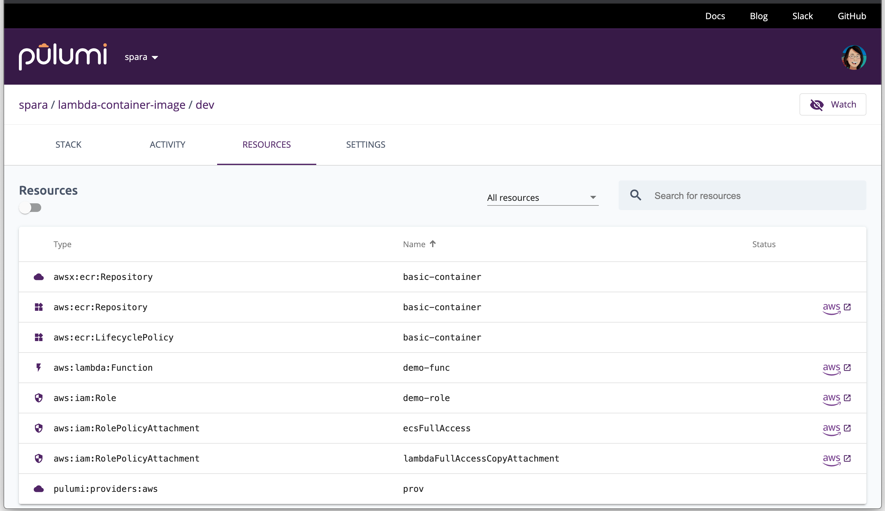
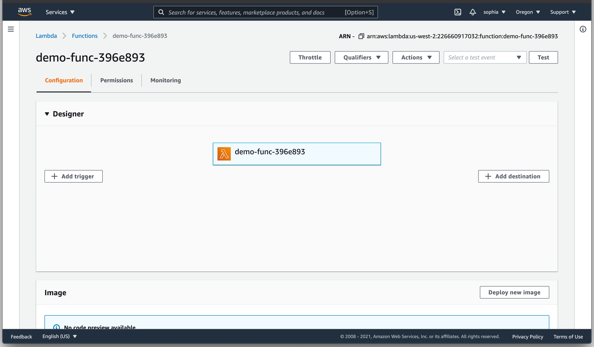
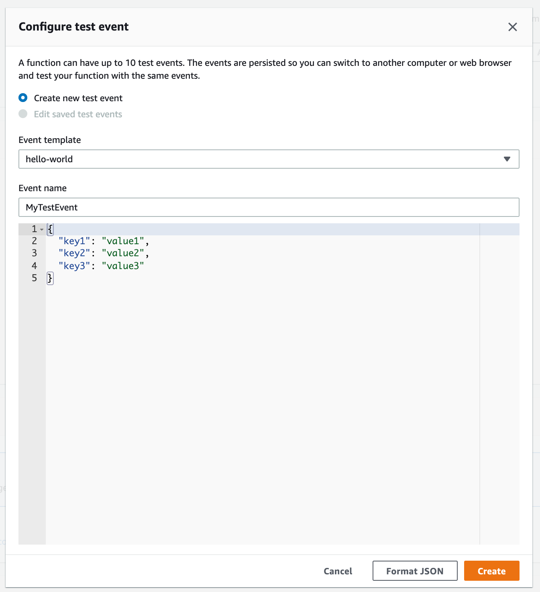
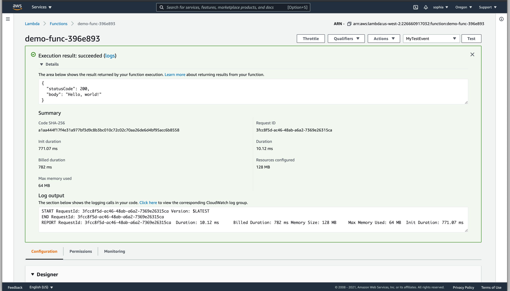

Containers are the foundation of modern distributed architecture. Whether it's microservices, Kubernetes, or serverless, your application is likely containerized. A benefit of container applications is building and testing locally before deploying to a cloud provider. Not only does this reduce development costs, but it also accelerates the development cycle because the time spent waiting for a cloud resource to deploy can be spent testing the application locally.

In this article, we'll take an AWS Lambda function in a container and refactor it so that it either runs in the cloud or on your machine locally.

## Setting up the Project

To start with, we'll create a new project directory and clone the repository with pulumi in the project directory.

```bash
$ mkdir lambda-container-image && cd ambda-container-image
$ pulumi new https://github.com/pulumi/pulumi-aws/tree/master/examples/lambda-container-image
```

Follow the prompts to set up your Stack.

Info: set permissions: chmod +r ./app/index.js

Let's take a look at the project files. The directory contains the `app` directory, which holds the Dockerfile to create the container, and `index.js`, our function. Creating lambda container images is not the focus of this article, and AWS provides [documentation](https://docs.aws.amazon.com/lambda/latest/dg/lambda-images.html) on creating and testing images.

The Pulumi program, `index.ts`, sets up the roles and permissions to run the container. The program uses [Crosswalk for AWS](), which provides an abstraction layer over the AWS provider. Crosswalk lets us create a container registry, build an image, and push that image to our registry.

```typescript
const image = awsx.ecr.buildAndPushImage("basic-container", {
    context: "./app",
}, {}, providerOpts);
```

Before we begin to refactor the application, let's first run it as is by setting the AWS region and running `pulumi up`.

```bash
$ pulumi config set aws:envRegion us-west-2
$ pulumi up
```

We can use the [Pulumi console](https://app.pulumi.com) to see the resources created. In the Dashboard, click on the Project `lambda-container-image`. The page for the stack will open, then click on `RESOURCES`.



You can see the resources created, including the `aws:lambda:Function`. Click on the AWS icon to see the function in the AWS console. You can see the function name, which we can use to test the function with the aws CLI.



To test if the function is working, we can use the aws CLI.

```bash
$ aws lambda invoke --function-name demo-func-396e893 response.json
{
    "StatusCode": 200,
    "ExecutedVersion": "$LATEST"
}
```

The function returns a "StatusCode": 200, indicating that the container function works.

Alternatively, you can use the AWS Console to create a new test event.





The test returns the "statusCode: 200" and the "Hello, world!" as the body.

## Refactoring with Component Resources

The project creates a Stack with a container lambda deployed to AWS, but what if you wanted to test the function locally but still be able to deploy to AWS? The naive way to do this is to copy the code for a local deploy. However, because we are using Typescript, we can reuse the code by creating a Component Resource that supports both deploy to AWS and locally.

A `ComponentResource` is a Pulumi-managed resource that aggregates other resources into a higher-level abstraction. Pulumi still creates and updates the underlying resources you will see updates in the resource tree. A `ComponentResource` logically groups the resources into a new container type.

To make our new `ComponentResource` create a new file called `containerFunction.ts` and copy the following code. We'll go through the code and explain each part.

This section creates a class called `ContainerFunction` that is a ComponentResource that contains the code for creating all our application resources such as the container registry, the policies for running it in AWS, and the container. In addition to the previous imports, we added the Pulumi Docker provider, which we will use later.

```typescript
import * as aws from "@pulumi/aws";
import * as awsx from "@pulumi/awsx";
import * as pulumi from "@pulumi/pulumi";
import * as docker from "@pulumi/docker";

const opts = { };

export class ContainerFunction extends pulumi.ComponentResource {
```

This section should look familiar. These are the AWS policies for our application.

```typescript
    public CreateAwsResources(name: string, image: awsx.ecr.RepositoryImage) {
        const role = new aws.iam.Role(name, {
            assumeRolePolicy: aws.iam.assumeRolePolicyForPrincipal({
                Service: "lambda.amazonaws.com"
            })
        }, opts);

        const lambdaFullAccessCopyAttachment = new aws.iam.RolePolicyAttachment(`{name}-lambdaFullAccessCopyAttachment`, {
            role: role,
            policyArn: aws.iam.ManagedPolicy.AWSLambdaExecute,
        }, opts)

        const ecsFullAccess = new aws.iam.RolePolicyAttachment("ecsFullAccess", {
            role: role.name,
            policyArn: aws.iam.ManagedPolicy.AmazonECSFullAccess,
        }, opts);

        const func = new aws.lambda.Function(`${name}-function`, {
            role: role.arn,
            imageUri: image.imageValue,
            packageType: "Image"
        }, opts);

    }
```

In the next section we'll make a constructor to initialize our class but we'll do it with a twist.

## Developing Lambdas With Docker

In the previous section, we created a component resource that will build the lambda as a function. When writing lambdas you may want to test it before deploying it in AWS. Because the function is deployed using a container we can test it [locally](https://docs.aws.amazon.com/lambda/latest/dg/images-test.html).

We'll create a constructor that will build the container and either push it to a AWS ECR registry or write it locally where you can use it for testing. The constructor initializes the class.

```typescript
    constructor(name: string, local: boolean, opts?: pulumi.ComponentResourceOptions) {
        super("myapp:index:ContainerImage", name, {}, opts)
```

To build and store the container locally, we pass a `local` option to the constructor and run the container locally. Otherwise, we create an AWS container registry and push the image.

```typescript
    constructor(name: string, local: boolean, opts?: pulumi.ComponentResourceOptions) {
        super("myapp:index:ContainerImage", name, {}, opts)

        if (local) {
            const image = new docker.Image(name, {
                imageName: `${name}-container`,
                build: {
                    context: "./app",
                },
                skipPush: true,
            });
            const localContainer = new docker.Container(`${name}-container`, {
                image: image.imageName,
                ports: [{
                    internal: 8080,
                    external: 8000,
                }],
            }, opts)
        } else {
            // this.CreateAwsResources(name, image);
            const image = awsx.ecr.buildAndPushImage(name, {
                context: "./app",
            }, {}, opts);
        }
    }
}
```

To summarize, we refactored the `index.ts` into a class that creates the lambda container and either pushes the image to a repository or writes the image locally for testing. The [complete example](https://gist.github.com/pulumipus/304782eede89637b17b191b71b5427ae) is available as a gist.

## Calling and Testing the Lambda

Now that we have a class to create the lambda, we can refactor the `index.ts` to call it. We import `ContainerFunction`. In this scenario we're going to create a new Stack called **local** for local builds of the container lambda. The `isLocal` option is set if the Stack is called local. In the constructor, we defined `name` and `local` which is a boolean. To call the function we pass in the name and local.

```typescript
import * as pulumi from "@pulumi/pulumi";
import { ContainerFunction } from "./containerFunction";

const isLocal = pulumi.getStack() === "local";

const fn = new ContainerFunction("demo", isLocal);
```

### Prerequisites

To run the refactored code, we'll have a couple prerequisites.

First create a new Stack called `local`.

```bash
$ pulumi stack init local
Created stack 'local'
```

Next we set the AWS region for the application if it isn't set in your [AWS config file](https://docs.aws.amazon.com/cli/latest/userguide/cli-configure-files.html).

```bash
$ pulumi config set aws:region us-west-2
```

Finally, the ContainerFunction imports the Pulumi docker module, we need to add it to the project.

```bash
$ npm i @pulumi/docker
```

### Build and test the container

To build the container run `pulumi up`.

```bash
$ pulumi up
...
Updating (local)

View Live: https://app.pulumi.com/spara/lambda-container-image/local/updates/15

     Type                           Name                          Status
 +   pulumi:pulumi:Stack            lambda-container-image-local  created
 +   ├─ myapp:index:ContainerImage  demo                          created
 +   ├─ docker:image:Image          demo                          created
 +   └─ docker:index:Container      demo-container                created

Resources:
    + 4 created

Duration: 8s
```

Check if the container is running.

```bash
$ docker ps -a
CONTAINER ID   IMAGE          COMMAND                  CREATED          STATUS          PORTS                    NAMES
3b0aa02be352   f31258a7d233   "/lambda-entrypoint.…"   13 seconds ago   Up 12 seconds   0.0.0.0:8000->8080/tcp   demo-container-803b218
```

To test the function, we can trigger it with an [event](https://docs.aws.amazon.com/lambda/latest/dg/images-test.html).

```bash
$ curl -XPOST "http://localhost:8000/2015-03-31/functions/function/invocations" -d '{}'
{"statusCode":200,"body":"Hello, world!"}
```

## Wrapping up

Infrastructure as code enables building lambdas with reusable components. In this example, we refactored the container lambda code to either build and push to AWS or build and run the container locally so that it can be tested. We run the container with Docker and can trigger the function to test it.

This is a simple example, but it can be extended to other situations. For example, if you have an application that uses [Step Functions](https://docs.aws.amazon.com/step-functions/latest/dg/tutorial-creating-lambda-state-machine.html) with several lambdas. You can iterate through a list of contexts and pass them to the ContainerFunction. To learn more about AWS container Lambdas, Docker, and Pulumi, check out these resources.

- [AWS Lambda](https://docs.aws.amazon.com/lambda/latest/dg/lambda-images.html)
- [Docker](https://docker.com)
- [Pulumi Getting Started with AWS]()
- [Pulumi's Docker provider]()
