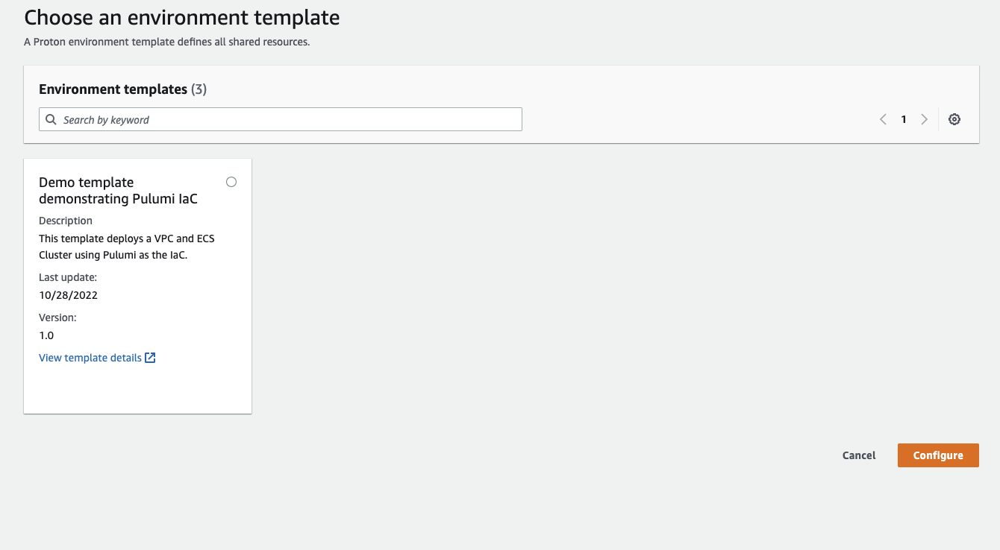
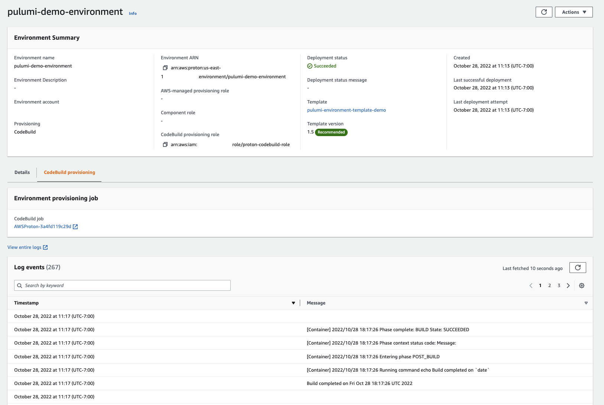
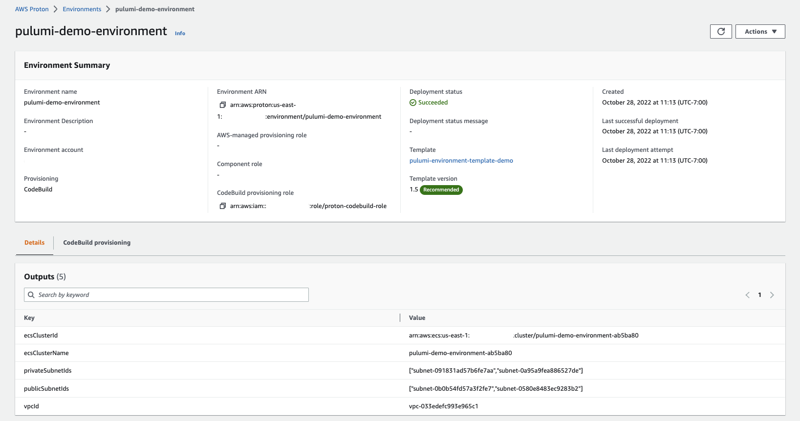

Self-service infrastructure is the holy grail of DevOps. When platform engineering teams can empower application teams to provision their own infrastructure without needing to understand the details of configuring networking, storage, and compute resources, IT organizations can drastically increase their ability to deliver on organizational goals.  The first step in this process is to codify infrastructure best practices using platforms like Pulumi and the next step is to make these best practices available in a workflow that fits into the application team’s software development tools and process.

Today, AWS [announced support](https://aws.amazon.com/blogs/containers/announcing-aws-cdk-support-and-codebuild-provisioning-for-aws-proton/) for [AWS CodeBuild](https://aws.amazon.com/codebuild/) as a provisioner in [AWS Proton](https://aws.amazon.com/proton/). Using CodeBuild as a provisioner allows Proton to integrate with the most popular Infrastructure as Code platforms, including Pulumi. With Codebuild provisioning, Proton enables platform teams to define the steps to provision resources based on their own custom workflow and IaC tool of choice.

## What are AWS Proton and AWS CodeBuild?

AWS Proton is a service that enables platform engineers to define, vend, and maintain self-service infrastructure templates for deploying cloud resources in an automated workflow. Development and operations teams can leverage these templates to deploy well-architected, modern infrastructure  with confidence. Platform teams can create Proton templates for [environments](https://docs.aws.amazon.com/proton/latest/userguide/ag-environments.html) (which typically include shared resources like VPCs and container scheduler clusters) and application [services](https://docs.aws.amazon.com/proton/latest/userguide/ag-services.html) which utilize the resources in the environment. Templates may be stored in git repositories for easy version control and automatic syncing with the Proton service.

AWS CodeBuild is a managed continuous integration (CI) service. Using CodeBuild, engineers can specify a Docker build container image, either [pre-built](https://docs.aws.amazon.com/codebuild/latest/userguide/build-env-ref-available.html) or [custom](https://docs.aws.amazon.com/codebuild/latest/userguide/sample-docker-custom-image.html), and a list of commands to execute in the container to perform the build. AWS handles concerns like creating and destroying the container, logging, and metrics. When using CodeBuild as a provisioner for AWS Proton, teams specify the steps to both provision and tear down our infrastructure templates.

## Using AWS Proton with CodeBuild and Pulumi

Since CodeBuild provisioning in Proton allows us to execute arbitrary commands, we can script our template builds using the [Pulumi CLI](https://www.pulumi.com/docs/cli/). AWS has built a complete, end-to-end example that can be found [at GitHub](https://github.com/aws-containers/proton-codebuild-provisioning-examples/tree/main/pulumi), and  for this post we are going to focus on the specific steps required to use CodeBuild provisioning in AWS Proton with Pulumi. Note that in this example we are still using the Pulumi Service as our backend, so we can still enjoy all the benefits the service provides like state file management, secure secrets handling, a shared history of changes to our stacks, and [advanced features available in Enterprise and Business Critical editions](https://www.pulumi.com/enterprise/).

### Manifest File

When using Pulumi with CodeBuild provisioning in AWS Proton, our main interface between Proton and Pulumi occurs in the [manifest file](https://docs.aws.amazon.com/proton/latest/userguide/ag-infrastructure-tmp-files-codebuild.html) where we define the steps to provision and deprovision our infrastructure. Our manifest file also contains mappings for Pulumi configuration. We define our manifest file in YAML and include it in the root of our Pulumi program.

The following is an example of a manifest file that uses CodeBuild provisioning with Proton and Pulumi:

```yaml
infrastructure:
 templates:
   - rendering_engine: codebuild
     settings:
       image: aws/codebuild/amazonlinux2-x86_64-standard:4.0
       runtimes:
         nodejs: 16
       env:
         variables:
           PULUMI_ORG: <PULUMI-ORG-HERE>
           PULUMI_NAMESPACE: proton-service
         secrets_manager:
           PULUMI_ACCESS_TOKEN: "proton/pulumi-access-token:Secret"
       provision:
         - cat proton-inputs.json
         - curl -fsSL https://get.pulumi.com | sh
         - export PATH=$PATH:$HOME/.pulumi/bin
         - npm install
         - pulumi stack select $PULUMI_ORG/$PULUMI_NAMESPACE/$STACK_NAME || pulumi stack init $PULUMI_ORG/$PULUMI_NAMESPACE/$STACK_NAME
         - pulumi config set aws:region $AWS_DEFAULT_REGION
         - pulumi config set org $PULUMI_ORG
         - pulumi up --yes --stack $PULUMI_ORG/$PULUMI_NAMESPACE/$STACK_NAME
         - chmod +x ./pulumi-to-proton-outputs.sh
         - pulumi stack output --json | ./pulumi-to-proton-outputs.sh > outputs.json
         - aws proton notify-resource-deployment-status-change --resource-arn $RESOURCE_ARN --status IN_PROGRESS --outputs file://./outputs.json
       deprovision:
         - curl -fsSL https://get.pulumi.com | sh
         - export PATH=$PATH:$HOME/.pulumi/bin
         - npm install
         - pulumi stack select $PULUMI_ORG/$PULUMI_NAMESPACE/$STACK_NAME
         - pulumi config set aws:region $AWS_DEFAULT_REGION
         - pulumi config set org $PULUMI_ORG
         - pulumi destroy --yes -s $PULUMI_ORG/$STACK_NAME
```

The provisioning steps in the manifest are as follows:

1. Download and install any necessary dependencies not already present in the CodeBuild container, like the Pulumi CLI.
2. Run the Pulumi commands to provision our infrastructure.
3. Map our Pulumi outputs to the necessary JSON format required by AWS Proton.

The deprovisioning steps are fairly similar to the provisioning steps:

1. Download and install any dependencies.
2. Run the Pulumi commands to tear down our infrastructure.

### Schema File

Proton allows application teams to provision infrastructure via a self-service UI. In order to inform the UI’s controls, platform engineering teams must supply Proton with a [template schema file](https://docs.aws.amazon.com/proton/latest/userguide/ag-schema.html) that defines the configurable parameters of the template.

The following is an example of a simple template schema file which allows us to configure the VPC CIDR block in our Proton environment:

```yaml
schema:
 format:
   openapi: "3.0.0"
 environment_input_type: "EnvironmentInputs"
 types:
   EnvironmentInputs:
     type: object
     description: "Environment inputs"
     properties:
       vpcCidrBlock:
         title: "VPC CIDR block"
         type: string
         default: "10.0.0.0/16"
```

### Template Packaging

Finally, we need to package our template in a suitable format for Proton. Proton templates can be sourced from either S3 bucket objects or synced via git repositories. Using git as the source of truth for Proton templates is fully automated out of the box and thus is recommended over sourcing templates from S3 objects for production scenarios. For more information on git configuration with Proton, see [Template sync configurations](https://docs.aws.amazon.com/proton/latest/userguide/ag-template-sync-configs.html) in the AWS docs.

A sample directory structure for an AWS Proton template that uses Pulumi follows:

```
.
├── infrastructure
│   ├── Pulumi.yaml
│   ├── index.ts
│   ├── manifest.yaml
│   ├── package-lock.json
│   ├── package.json
│   ├── proton-inputs.json
│   └── tsconfig.json
└── schema
	└── schema.yaml
```

Our sample package contains 2 points of interest:

1. The `infrastructure` directory, which contains our Pulumi program plus the Proton manifest file.
2. The `schema` directory, which contains our template schema file.

For full details on Proton template packaging, see [Wrap up template files for AWS Proton](https://docs.aws.amazon.com/proton/latest/userguide/ag-wrap-up.html) in the AWS docs.

## Tying it all together

So what does this all look like from a user’s perspective when provisioning a self-service template? Let’s look at some screenshots.

First, the user is presented with a list of the templates published by the platform team:



After selecting the template to deploy and filling in any configurable input parameters, the user can view the CodeBuild logs and is presented with a link to the CodeBuild job:



Finally, the user can view the fully provisioned template and reference any generated outputs:



## Conclusion

Using Proton with CodeBuild and Pulumi, we can enjoy all the benefits of self-service infrastructure along with the benefits of the Pulumi service like secrets management and stack history, while using real programming languages to allow us to ship infrastructure faster. Give it a try today!
