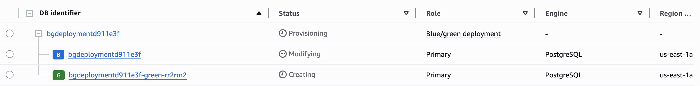
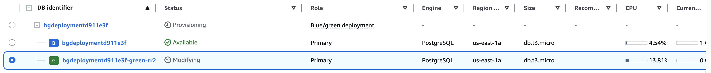

{}
Looking for more information on Blue/Green Deployments for RDS? Check out [Using Amazon RDS Blue/Green Deployments for database updates](https://docs.aws.amazon.com/AmazonRDS/latest/UserGuide/blue-green-deployments.html) from AWS.
{}

AWS RDS supports blue/green deployments to support database maintainence. In a blue/green deployment, you have one production (blue) and one staging (green) database. You can safely make changes to the green instance without affecting production and promote it to be the main instance. When you enable blue/green updates, Pulumi will temporarily set up a blue/green deployment for the duration of the update to minimize downtime. 

There are many [benefits](https://docs.aws.amazon.com/AmazonRDS/latest/UserGuide/blue-green-deployments-overview.html#blue-green-deployments-benefits) to using blue/green deployments for updates, especially for critical databases that need to be kept available and safe from untested changes. 

## How it works

By default, updates to a database will be applied in-place, meaning there may be service interruptions while a database is modified especially when making long-running updates like changing the engine version, parameter groups, or storage settings. 

`blueGreenUpdate` can be enabled for [Low-Downtime Updates](https://www.pulumi.com/registry/packages/aws/api-docs/rds/instance/#low-downtime-updates). When this setting is on and an update is performed, the program starts the update by creating a blue/green deployment to maintain availability. Then, it performs the requested update on the green instance, performs a guardrail check, promotes the green instance, and finally deletes the old instance and removes the blue/green deployment. This leaves just the updated database running with minimal downtime during the update while minimizing the downtime.

Though this strategy typically increases the amount of time that updates need to run, it minimizes downtime for the application by keeping a current version of the database available during the update process. 

## How to use

To use [blue/green deployments for your database updates](https://github.com/pulumi-demos/examples/tree/main/typescript/aws-rds-blue-green-updates), start by creating a database and corresponding parameter group.

```typescript
const parameterGroup = new aws.rds.ParameterGroup(
  `${baseName}logicalreplicationgroup`,
  {
    family: `postgres${dbVersion.split(".")[0]}`,
    parameters: [
      {
        name: "rds.logical_replication",
        value: "1",
        applyMethod: "pending-reboot",
      },
    ],
  },
  { deleteBeforeReplace: false }
);

const database = new aws.rds.Instance(
  baseName,
  {
    allocatedStorage: storageAllocation,
    engine: "postgres",
    engineVersion: dbVersion,
    instanceClass: aws.rds.InstanceType.T3_Micro,
    username: dbUsername,
    password: dbPW,
    storageEncrypted: true,
    backupRetentionPeriod: 7,
    blueGreenUpdate: { enabled: true },
    skipFinalSnapshot: true,
    parameterGroupName: parameterGroup.name,
  },
  { dependsOn: [parameterGroup] }
);
```

After running `pulumi up` with the above code, you'll have a database deployed and attached to your custom parameter group. It's important to create and attach a custom parameter group so that you can keep it up to date with any engine version upgrades. If you use the default parameter group, updates to the database version may fail when the green deployment is created since it's parameter group family won't match the new version. You can avoid a failure by ensuring that the parameter group's `family` and `engineVersion` are always changed in the same update.

You won't see the effects of having `blueGreenUpdate` enabled until you run your first update. Change any part of the database configuration and run `pulumi up` again to start the update. 

Once the update kicks off, you can watch on AWS as the blue/green deployment is created and the original settings are copied to the green instance.


Then, the green instance will be updated with the new settings


and the program will switch over to the green instance and clean up.


After that, your update has been completed with minimal disruption!

## Additional Considerations

General [limitations and considerations for Amazon RDS blue/green deployments](https://docs.aws.amazon.com/AmazonRDS/latest/UserGuide/blue-green-deployments-considerations.html#blue-green-deployments-limitations) are listed in the AWS documentation, but there are a few other considerations that should be taken into account when using them for updates with infrastructure as code (IaC).
* **No Custom Checks**: Because IaC will automatically perform the switchover when the update is complete, you will not have the opportunity to perform custom checks on the green instance before promoting it. RDS will run some basic [guardrails](https://docs.aws.amazon.com/AmazonRDS/latest/UserGuide/blue-green-deployments-switching.html#blue-green-deployments-switching-guardrails) checks before performing the switchover, but you will not be able to perform any additional checks.
* **Long Update Times**: Because the IaC program will deploy temporary resources before performing the update and destroy them after, blue/green updates will take considerably longer than their in-place counterparts. 
* **Manual Cleanup**: Because the green instance and blue/green deployment are temporary resources designed to decrease downtime during the update, they are not tracked in the IaC state. If the update fails partway through, these temporary resources may have to be cleaned up manually. If the update is interrupted, you can delete the blue/green deployment and green database to get back into a manageable state.
* **Resource ID Change**: On an update, the resource ID of the database might change since a new instance has been created. The endpoint and other details about the database will be maintained by AWS during switchover, but the resource ID should be dynamically retreived from the stack outputs whenever it is used to ensure it stays up to date.