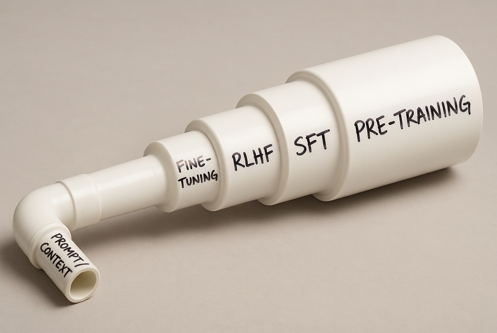
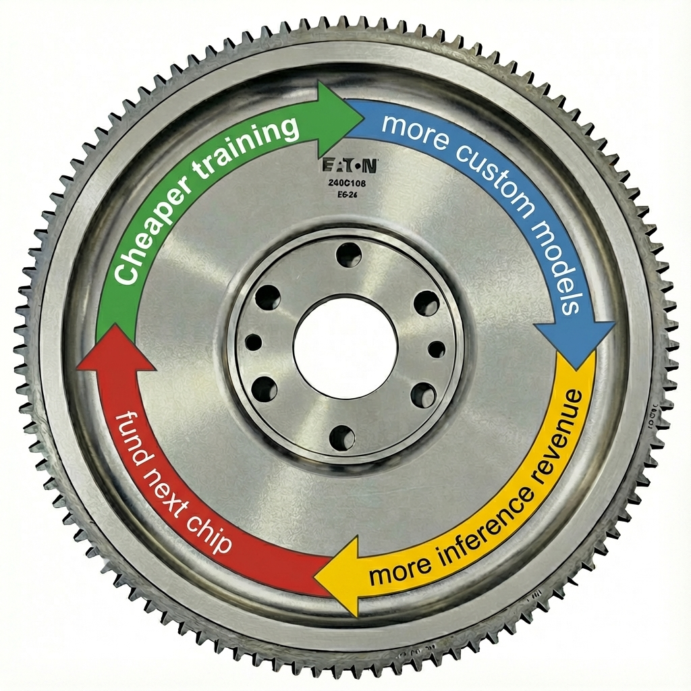
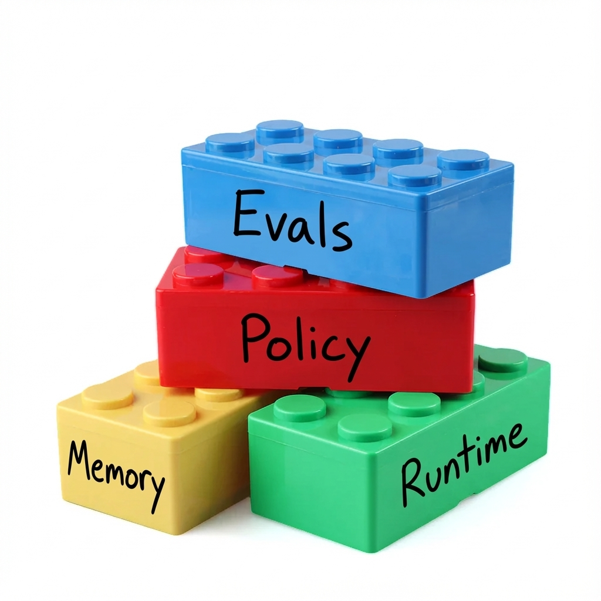

AWS re:Invent 2025 delivered a myriad of announcements across AI, silicon, and cloud infrastructure. AWS unveiled the expanded Nova model family, introduced Nova Forge for custom model training, launched Trainium3 UltraServers, and added major production features to AgentCore. It was a lot, and taken at face value, it looks like another scattershot year of big releases.

But if you look past the firehose, a pattern emerges. These announcements fit together into a single bet about how enterprise AI will be built.

**AWS built a vertically integrated agent-training pipeline; it’s expensive, ambitious, and not for everyone.**

The clearest place to see that pattern is in how AWS talked about the Nova models. AWS dropped four new foundation models (Lite, Pro, Sonic, Omni) spanning text, multimodal, and speech. And AWS downplayed benchmarks entirely. A hint that the models aren’t the real story.

What AWS was really foregrounding wasn’t the models themselves, but the system used to shape them: Nova Forge.

**Try it with Neo:** [Set up Nova 2 with Pulumi](https://app.pulumi.com/neo?prefer_signup=true&prompt=Show%20me%20how%20to%20use%20Pulumi%20in%20Python%20to%20set%20up%20AWS%20Bedrock%20permissions%20and%20call%20the%20Nova%202%20Pro%20model)

## Rent the lab: Nova Forge



[Nova Forge](https://aws.amazon.com/nova/forge/) is a managed way to run continued pretraining, fine-tuning, and reward-based alignment on Amazon's [Nova](https://aws.amazon.com/nova/) models using your data and your reinforcement loops. Instead of a finished, frozen model plus a thin fine-tuning API, you feed your data into earlier training stages while AWS handles the ugly parts: large-scale training runs, cluster management, and hosting. Access is $100,000 per year[^3], plus compute costs!

If you can afford that, you bring big proprietary datasets (code, tickets, logs, documents) and they keep doing next-token pretraining on a mix of their data and yours, then instruction tuning (SFT), then "RL-style" preference optimization, but with your data and your reward signals mixed in.

Why does this exist? Because the kind of training this enables is usually out of reach. Training a GPT-4-class frontier model from scratch runs tens of millions to $100M+ in compute alone[^1]. You don't own the weights and you're locked into their stack, but you get frontier-level capabilities with your data baked in, without building datacenters or staffing ML teams.

Think of it as frontier-lab-as-a-service. No one else offers anything this close to a public, end-to-end training pipeline. And the only reason AWS can offer it is the next announcement.

## The margin weapon: Trainium

<figure style="width: 40%; float: right; margin-left: 20px; margin-bottom: 10px;">

<figcaption><i>The idealized Trainium flywheel: each generation should decrease training costs.</i></figcaption>
</figure>

AWS built its own AI accelerator so it doesn't have to live entirely on NVIDIA. Trainium is that chip. You don't buy it; you rent it as a cloud box. This year: their third-gen chip (Trainium3) and new rack-scale `Trn3 UltraServers` are out, with 4× the performance and big energy/cost gains over the previous gen, positioned as a serious alternative to high-end GPUs for training and serving big models.

I'm sure one reason for Trainium's is that AWS wants to stop handing NVIDIA half its AI training revenue. But the real story is bigger than cost-cutting. Trainium is the quiet machinery that makes AWS's model-factory ambitions economically viable. You can only rent a frontier training pipeline if you can afford it, and Trainium makes it cheaper (if that word applies to six-figure entry costs).

Trainium is what turns Forge from a one-off experiment into an actual development pipeline. By compressing the marginal cost of each training cycle, AWS is trying to make iterative specialization economically viable. You can tune, test, and retrain until you converge on something useful.

AWS is clearly positioning Trainium3 to anchor a fully vertical stack

<div class="note note-info" style="display: block;">
<p><b>Spinning up a Trainium instance with Pulumi (where available):</b></p>

```python
import pulumi_aws as aws

# Assumes: ami, subnet, security_group already configured
trn1_instance = aws.ec2.Instance("trn1-instance",
    instance_type="trn1.2xlarge",
    ami=ami.id,
    subnet_id=subnet.id,
    vpc_security_group_ids=[security_group.id],
    associate_public_ip_address=True,
    tags={"Name": "trn1-training-instance"},
)
```

<p><a href="https://app.pulumi.com/neo?prefer_signup=true&prompt=Show%20me%20how%20to%20use%20Pulumi%20in%20Python%20to%20provision%20AWS%20Trn1%20EC2%20instances%20for%20ML%20training">Try it with Neo: Provision Trainium instances</a></p>
</div>

## The data moat play

For most companies, this whole stack is overkill. If your AI roadmap is “add a chatbot and maybe summarize some tickets,” you don’t need Nova Forge, and you definitely don’t need Trainium. Hosted models plus RAG and an Agentic loop will get you 90% of the way there.

But this type of training is powerful, and it's never been in reach to so many. If LLMs behave like the distributions they're trained on, then getting your proprietary mess (logs, incident reports, claims histories, deal flows, call transcripts) into the core training loop means the model doesn't just know your docs; it behaves like someone who's lived inside your systems. That’s qualitatively different from “we stuffed a PDF into the context window.”

Latency and cost at scale matter too. For high-volume workflows like support triage, routing, code review, and fraud checks, "generic frontier model + giant prompt + RAG + tools" is slow and expensive. A smaller model that has your world baked into the weights can run with smaller contexts, simpler prompts, and fewer tool calls. And then there is reinforcement learning, which I'll get to shortly.

But even if you get that far, a custom Nova model sitting in Bedrock is only half the story. You still need somewhere for it to act: a runtime, tools, policies, and an audit trail. That’s the gap AgentCore is meant to fill.

## Where the models work: AgentCore

<figure style="width: 40%; float: right; margin-left: 20px; margin-bottom: 10px;">

<figcaption><i>AgentCore: building blocks so you don't have to wire agents from scratch.</i></figcaption>
</figure>

If Nova is the brain and Trainium is the muscle to build it, AgentCore is the nervous system.

[AgentCore](https://aws.amazon.com/bedrock/agentcore/) is a managed runtime for AI agents: instead of you wiring LLMs, tools, memory, auth, and logging together on Lambda or Fargate, AWS gives you a sticky per-session microVM, a standard way to call tools (Gateway), built-in long- and short-term memory, identity/permissions, and observability/evals. You package your agent, deploy it as an AgentCore runtime, and AWS handles the ugly parts: session isolation, scaling, policy guardrails, and tracing. You pay Fargate-ish per-vCPU/GB-hour pricing for the runtime plus normal Bedrock token and tool-call costs.

At re:Invent 2025, [AgentCore](https://aws.amazon.com/bedrock/agentcore/) picked up the missing "production" pieces: **Policy**, **Evaluations**, and **episodic Memory**. These handle guardrails, quality checks, and per-session state, so you don't have to build them yourself.

<div class="note note-info" style="display: block;">
<p><b>Deploying an AgentCore runtime with Pulumi:</b></p>

```python
import pulumi_aws as aws

# Assumes: role, ecr_repo already configured
agent_runtime = aws.bedrock.AgentcoreAgentRuntime("my-agent",
    agent_runtime_name="my-agent-runtime",
    role_arn=role.arn,
    agent_runtime_artifact={
        "container_configuration": {
            "container_uri": f"{ecr_repo.repository_url}:latest",
        },
    },
    network_configuration={
        "network_mode": "PUBLIC",
    })
```

<p><a href="https://app.pulumi.com/neo?prefer_signup=true&prompt=Show%20me%20how%20to%20use%20Pulumi%20in%20Python%20to%20deploy%20an%20AWS%20Bedrock%20AgentCore%20runtime%20with%20IAM%20roles%20and%20ECR">Try it with Neo: Deploy an AgentCore runtime</a> — <i>Requires a container image in ECR.</i></p>
</div>

How does this come together? AWS shipped a use case.

## The proof of concept: Nova Act

<figure style="width: 40%; float: left; margin-right: 20px; margin-bottom: 10px;">

<figcaption><i>The AWS AI stack: vertically integrated from silicon to agent runtime. Nova Act uses the full stack.</i></figcaption>
</figure>

Nova Act is the concrete example of this whole thing coming together. It handles browser-based UI automation: form filling, search-and-extract, QA testing. Amazon claims ~90% reliability. It deploys directly to AgentCore Runtime.

It's not "an LLM plus Playwright." Nova Act uses a specialized Nova 2 Lite variant trained on synthetic "web gym" environments: browser simulations that mirror enterprise UIs and provide an automatic reward signal when tasks are completed correctly. Instead of judging output quality, this model was trained on an RL loop that asks: Did the workflow succeed?

That specialized model is wrapped in AgentCore. The platform handles isolation, scaling, logging, and guardrails, so Nova Act behaves like a production automation system rather than a brittle demo.

Seen this way, Nova Act is Amazon’s reference implementation for a certain class of enterprise agents: start with a strong general model, specialize it through domain-specific RL in a controlled environment, and run it on AgentCore with tools and policies around it. It’s the pattern AWS expects customers to adopt.

## One stack to rule them all

So Nova Forge, Trainium, AgentCore, and Nova Act connect. Trainium lowers the cost of big training runs. Nova Forge lets enterprises plug their own data and rewards into those runs. AgentCore is where the resulting models act, with tools, memory, and policy guardrails. Nova Act shows the pattern in action: a domain-specialized Nova model, trained in a controlled loop, running as a production agent.

Most enterprises still won’t choose this path. They don’t have the data, the reward loops, or the operational maturity to make early-stage training worthwhile.

But AWS’s bet is that [enterprise AI is moving past stock foundation models and generic chatbots](https://www.pulumi.com/aws/#video). AWS is expecting a world of **agents shaped by proprietary data and domain feedback**. Most companies won't build the infrastructure to train and operate those agents, and so AWS is offering to rent them the whole pipeline.

**Try it with Neo:** [Deploy a Bedrock-powered API with Pulumi](https://app.pulumi.com/neo?prefer_signup=true&prompt=Create%20a%20Python%20Pulumi%20program%20that%20deploys%20an%20AWS%20Lambda%20function%20calling%20Bedrock%20Nova%20Pro%20and%20exposes%20it%20via%20API%20Gateway)

[^1]: Sam Altman stated GPT-4 cost "more than $100 million" to train. [Source](https://news.ycombinator.com/item?id=35971363)
[^2]: Amazon Nova Technical Report. [Source](https://assets.amazon.science/96/7d/0d3e59514abf8fdcfafcdc574300/nova-tech-report-20250317-0810.pdf)
[^3]: CNBC reporting on Nova Forge pricing. [Source](https://www.cnbc.com/2025/12/02/amazon-nova-forge-lets-clients-customize-ai-models-for-100000-a-year.html)
[^4]: SiliconANGLE on AWS "Novella" terminology. [Source](https://siliconangle.com/2025/12/02/aws-introduces-nova-forge-training-bespoke-novella-frontier-models/)
[^5]: Full-weight SFT on a 70B model generally costs tens of thousands of dollars; RLHF data + compute for large models typically lands in the $100K–$1M+ range. [Source 1](https://www.cudocompute.com/blog/what-is-the-cost-of-training-large-language-models), [Source 2](https://arxiv.org/abs/2403.14101)
