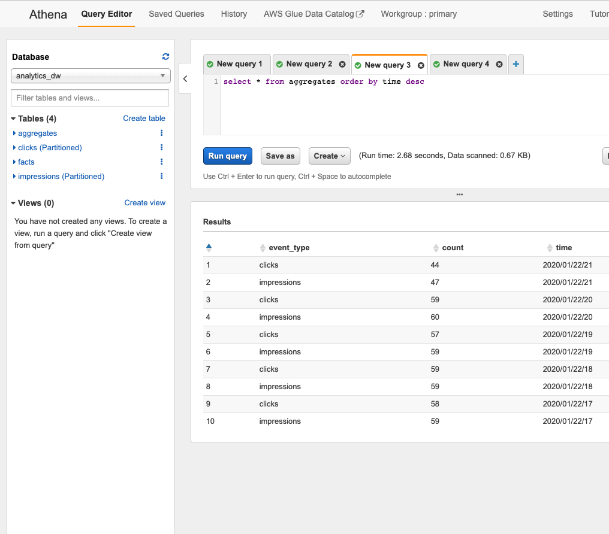

Whether it’s an IoT installation, a website, or a mobile app, modern software systems generate a trove of usage and performance data. While it can be daunting to collect and manage, surfacing data empowers the business to make informed product investments. In this article, we’ll explore the following:

1. An overview of the traditional Redshift analytics stack on AWS, the use cases it excels at, and where it falls apart.
2. An alternative architecture utilizing serverless and streaming.
3. How to implement this architecture as code in a reusable library with Pulumi.
4. How to automate the development loop when writing Pulumi libraries.

If you’d like to follow along, you can clone and run [the reference implementation](https://github.com/pulumi/examples/tree/master/aws-ts-serverless-datawarehouse). If you’re new to Pulumi, you can follow [this guide to get started]().

## ACME E-Commerce

ACME is a burgeoning online retailer. They ship goods around the world to millions of happy customers. ACME has recently started an incubation project to test out running ads on its website. They are unsure of how customers will react or whether their merchants will be interested in participating, so they staff a small team of 5 tasked with launching an MVP.

ACME wants to track the performance of its ads, understand how its customers are interacting with them, and look for patterns that can inform business decisions and further investment. With such a small team, they look for the path of least resistance as analytics is just a small slice of the overall work to be done to launch on their aggressive timeline.

## The Traditional Analytics Stack

A familiar SQL interface and the ease of loading data through built-in features like [S3 COPY](https://docs.aws.amazon.com/redshift/latest/dg/r_COPY.html) have made Redshift the goto choice for bootstrapping an analytics stack on new projects. It’s low friction to get from zero to something, and Redshift scales to petabytes.


Like all tools, Redshift has targeted use cases that it excels at. Broadly speaking, it’s niche is heavy BI and analytics workloads, reading more than you write. Redshift can serve millisecond-level queries on massive datasets through a horizontally scalable, distributed processing architecture. At the core of this is a reliance on sorting and data distribution mechanisms. Schemas are configured by administrators to distribute the data across the cluster in a variety of methods that optimize for different use cases, such as highly denormalized tables, or tables making heavy use of joins. Distributed data is stored in a specified sort order on disk, allowing the query planner to make optimizations.

New data is sorted locally when a COPY command is run, but this doesn’t mean that the global sort order is maintained. A [VACUUM](https://docs.aws.amazon.com/redshift/latest/dg/r_VACUUM_command.html) and [ANALYZE](https://docs.aws.amazon.com/redshift/latest/dg/r_ANALYZE.html) command must be run to re-sort the data, rebuild indexes, and update metadata used by the query planner. It can be a resource-intensive process relative to how much data you’ve loaded, and how it’s distributed amongst your existing sort key range. This limits the effective use of Redshift.

## ACME Ads MVP

The team defines its initial product. They’ll begin with testing ads in the search results of ACME’s North American website. When customers search for “Soap”, advertisers can bid to have their product show up first. They’ve picked a cost per click (CPC) billing model, where advertisers pay a small sum whenever a user clicks on their ad. To support this, they’ve designed an initial architecture:


They’ve defined the following key events to track:

1. __Impression__: Emitted when the ad is rendered on a customer device.
2. __Click__: Emitted when the customer clicks on the product shown in the ad.

The shopping web app has a mechanism to deliver these events into an S3 bucket. On an as-needed basis, engineers on the team can manually run a [COPY](https://docs.aws.amazon.com/redshift/latest/dg/r_COPY.html) command to refresh the data in the cluster. They do this on a monthly cadence to generate invoices to send to advertisers, and sometimes more frequently to generate ad-hoc reports on ad performance.

## Scaling a Real Business

The team is delighted to find that the ads are performing well. Advertisers see a return on their investment, and data shows that the impact on the consumer experience is minimal. The ACME team has scaled the number of advertisers from five in the beta program, to over a thousand. The team struggled with the ad-hoc nature of its MVP analytics stack and has invested heavily in automation:

- Loading of event data (pre-impression, clicks, etc.) into Redshift has been automated into an hourly cron that runs an incremental COPY.
- Billing is automated to run on an hourly basis, to limit the amount of time an advertiser can be allowed to serve ads after exceeding their allocated budget.

The automated load, in addition to the data generated by the recently hired Product Manager, Business Intelligence Analyst, and Data Scientist, strained the Redshift deployment. It has quickly become the most expensive part of their system, not just in terms of dollars spent, but operator time as well. An overloaded cluster leads to a variety of operational issues that the team must learn to detect and mitigate:

1. __Data delivery is regularly delayed__: COPY commands that used to take minutes are taking over an hour when the cluster is under load. Dependant cron jobs over the data need to be updated to handle delays.
2. __The cluster must be resized regularly to keep up with growth__: The team often uses [Elastic Resize](https://aws.amazon.com/blogs/big-data/scale-your-amazon-redshift-clusters-up-and-down-in-minutes-to-get-the-performance-you-need-when-you-need-it/) operations, which require a few minutes of downtime and only allow the cluster to increase in size by factors of two. Upgrading node types to better match the workload requires downtime as a new cluster is stood up, and data is copied over.
3. __Ad-hoc workloads interfere with production__: Business users write sophisticated queries that accidentally bring the cluster to a standstill. The team puts a complicated [WLM policy](https://docs.aws.amazon.com/redshift/latest/dg/tutorial-wlm-routing-queries-to-queues.html) in place to try and isolate ad-hoc from production, but this is more of an art than a science.

## Designing the V2 Analytics Stack

The team understands how to keep the analytics stack limping along at this point, but the cost in both hardware and developer time is too high. They decide to pursue a redesign with the following goals in mind:

1. Little to no operator intervention required. Developer time is their most valuable asset, and going forward, they want to focus engineering on delivering new features to advertisers, and new experiences to customers.
2. Scale the analytics stack to 1B events per day and beyond as the program grows in terms of advertisers, and geography.
3. Enable workload isolation between production services and ad-hoc business intelligence users.


JSON events are queued in [Kinesis](https://aws.amazon.com/kinesis/data-streams/), consumed by a [Firehose](https://aws.amazon.com/kinesis/data-firehose/) that validates their schema against the definition in [Glue](https://aws.amazon.com/glue/), then converted into [parquet](https://parquet.apache.org/), and finally stored in S3 in hourly folders based on arrival time. Structured data in S3 and a Glue metastore are flexible primitives that end-users and production systems can build on. Both production systems and ad-hoc users can bring their own compute or take advantage of serverless solutions like Athena (the AWS serverless version of [Presto](https://prestodb.io/)) to query over the data with isolation. The operator overhead is low because it relies almost entirely on serverless offerings. This architecture brings some additional benefits:

1. Scale the read and write workloads independently. Redshift was overprovisioned to handle the mismatch of a continuous write workload at peak hours. A decrease in operating cost was the result of adopting this architecture.
2. Pay as you go. Firehose, S3, Lambda, and Athena are all billed based on usage. Kinesis is the exception charging per shard hour, which for most deployments would be provisioned for peak load.
3. Configurable latency. Firehose can dump batches of data in intervals of 1-15 minutes. If low latency is a concern, you can achieve it (see the end for caveats on compaction). We don’t have to worry about an increased write workload impacting reads.
4. Malformed records won’t block the data ingestion pipeline. Redshift COPY has a [maxerror](https://docs.aws.amazon.com/redshift/latest/dg/copy-parameters-data-load.html#copy-maxerror) that allows skipping over bad records, but there isn’t any automation to isolate and alert on those records. Firehose writes unsuccessful events to a separate directory and allows processing to continue.

While our new serverless streaming architecture brings a slew of benefits that enable ease of operation and the next level of scale, there are some drawbacks. For one, there is substantially more infrastructure to configure than the single Redshift cluster. How do we implement this in a repeatable fashion?

## Architecture as Code with Pulumi

We want repeatable infrastructure that we can reliably develop, test, and deploy. Creating a single Redshift instance through the console was manageable, but our serverless architecture utilizes multiple instances of five AWS services. Serverless solutions frequently require many more granular resources, and thus the complexity of the infrastructure as code increases, and we need more robust tools to manage this complexity - just like we manage software complexity.

Pulumi takes care of the complexity by bringing software development best practices like abstraction, encapsulation, and modularity to infrastructure. You can use design patterns in your favorite programming language to provision modern cloud infrastructure. [Component Resources]() are our tools for encapsulating low-level cloud infrastructure into Architecture as Code that is shareable across teams.

With Pulumi the code we write looks very similar to our architecture diagram:

```typescript
import { ServerlessDataWarehouse, StreamingInputTableArgs }
    from "./datawarehouse";

// declare our shared schema for clicks and impressions
const columns = [
    {
        name: "id",
        type: "string",
    },
    {
        name: "session_id",
        type: "string",
    },
    {
        name: "event_time",
        type: "string",
    },
];

const impressionsTableName = "impressions";
const clicksTableName = "clicks";

const tableArgs: StreamingInputTableArgs = {
    columns,
    inputStreamShardCount: 1,
    region: "us-west-2",
};

// create two tables with kinesis input streams,
// writing data into hourly partitions in S3.
const dataWarehouse = new ServerlessDataWarehouse("analytics_dw", { isDev })
    .withStreamingInputTable(impressionsTableName, genericTableArgs)
    .withStreamingInputTable(clicksTableName, genericTableArgs);

// Make input streams available to external programs as stack outputs
export const impressionInputStream = impressionsInputStream.name;
export const clickInputStream = clicksInputStream.name;
```

In a dozen lines of code, we’ve provisioned two of our desired tables, “clicks” and “impressions”, using our serverless streaming input architecture. It takes care of everything, including implicitly creating an arrival time [partition scheme](https://docs.aws.amazon.com/athena/latest/ug/partitions.html) with the key “inserted_at”. We export our Kinesis input streams as [stack outputs]() that can be referenced in other projects, such as the instrumentation within our ad server or consumer-facing web app.

While on the surface this Pulumi component is described imperatively, it produces a declarative output in the form of a [state file]() that can be managed locally, in an object store like S3, or by the Pulumi Service backend. Running a ‘pulumi up’ shows that we’ve created 45 AWS resources, and lists our stack outputs to the console.


After putting some sample events into Kinesis, we can use Athena to query our impressions table:


What does ServerlessDataWarehouse look like under the hood? Just like any other typescript class:

```typescript
export class ServerlessDataWarehouse extends pulumi.ComponentResource {

    public dataWarehouseBucket: aws.s3.Bucket;
    public queryResultsBucket: aws.s3.Bucket;
    public database: aws.glue.CatalogDatabase;
    private tables: { [key: string]: aws.glue.CatalogTable } = {};
    private inputStreams: { [key: string]: aws.kinesis.Stream } = {};

    constructor(name: string,
        args: DataWarehouseArgs = {},
        opts: pulumi.ComponentResourceOptions = {}
    ) {
        super("serverless:data_warehouse", name, opts);

        const bucketArgs: BucketArgs | undefined = args.isDev ?
            { forceDestroy: true } : undefined;

        const dataWarehouseBucket = new aws.s3.Bucket("datawarehouse-bucket",
            bucketArgs, { parent: this });
        const queryResultsBucket = new aws.s3.Bucket("query-results-bucket",
            bucketArgs, { parent: this });

        const database = args.database || new aws.glue.CatalogDatabase(name, {
            name,
        }, { parent: this });


        this.dataWarehouseBucket = dataWarehouseBucket;
        this.queryResultsBucket = queryResultsBucket;
        this.database = database;
    }
}
```

The `ServerlessDataWarehouse` class creates a shared S3 data bucket, Athena query results bucket, and Glue database. We’ve exposed a fluent method, `.withStreamingInputTable()`, that creates the Glue table, Kinesis input stream, Firehose destination stream, and the Lambda cron that registers the hourly partitions. Many of these pieces themselves are also encapsulated into higher-order components.

```typescript
public withStreamingInputTable(name: string, args: StreamingInputTableArgs):
ServerlessDataWarehouse {
    const {
        partitionKeyName, columns,
        inputStreamShardCount, fileFlushIntervalSeconds
    } = args;
    const partitionKey = partitionKeyName || "inserted_at";

    const partitionKeys: input.glue.CatalogTablePartitionKey[] = [{
        name: partitionKey,
        type: "string",
    }];

    const tableArgs: TableArgs = {
        columns,
        partitionKeys,
    };

    this.withTable(name, tableArgs);

    const streamArgs: InputStreamArgs = {
        destinationBucket: this.dataWarehouseBucket,
        shardCount: inputStreamShardCount,
        databaseName: this.database.name,
        tableName: name,
        fileFlushIntervalSeconds,
    };

    const { inputStream } = new InputStream(`inputstream-${name}`,
        streamArgs, { parent: this });
    this.inputStreams[name] = inputStream;

    const registrarArgs: PartitionRegistrarArgs = {
        database: this.database,
        partitionKey,
        region: args.region,
        dataWarehouseBucket: this.dataWarehouseBucket,
        athenaResultsBucket: this.queryResultsBucket,
        table: name,
        scheduleExpression: args.partitionScheduleExpression,
    };
    const partitionRegistrar = new HourlyPartitionRegistrar(
        `${name}-partitionregistrar`, registrarArgs, { parent: this });

    return this;
}
```

Our `withStreamingInputTable` call makes use of another fluent API, `.withTable()`, that encapsulates the logic around various storage and SerDe details required for storing different formats in glue (Parquet vs. JSON) in a way that Athena can understand:

```typescript
public withTable(name: string, args: TableArgs): ServerlessDataWarehouse {
    if (this.tables[name]) {
        throw new Error(`Duplicate table! Name: ${name}`);
    }

    const dataFormat = this.validateFormatAndGetDefault(args.dataFormat);

    const table = this.createTable(name, args.columns,
        dataFormat, args.partitionKeys);
    this.tables[name] = table;

    return this;
}

private createTable(name: string,
    columns: input.glue.CatalogTableStorageDescriptorColumn[],
    dataFormat: DataFormat,
    partitionKeys?: input.glue.CatalogTablePartitionKey[]):
    aws.glue.CatalogTable {
    const location = getS3Location(this.dataWarehouseBucket, name);

    const parquetStorageDescriptor = {
        location,
        inputFormat:
            "org.apache.hadoop.hive.ql.io.parquet.MapredParquetInputFormat",
        outputFormat:
            "org.apache.hadoop.hive.ql.io.parquet.MapredParquetOutputFormat",
        serDeInfo: {
            parameters: { "serialization.format": "1" },
            name: "ParquetHiveSerDe",
            serializationLibrary:
                "org.apache.hadoop.hive.ql.io.parquet.serde.ParquetHiveSerDe",
        },
        columns,
    };

    const jsonStorageDescriptor = {
        location,
        inputFormat:
            "org.apache.hadoop.mapred.TextInputFormat",
        outputFormat:
            "org.apache.hadoop.hive.ql.io.HiveIgnoreKeyTextOutputFormat",
        serDeInfo: {
            name: "OpenXJSONSerDe",
            serializationLibrary: "org.openx.data.jsonserde.JsonSerDe",
        },
        columns,
    };

    const storageDescriptor = dataFormat === "JSON" ?
        jsonStorageDescriptor : parquetStorageDescriptor;
    return new aws.glue.CatalogTable(name, {
        name: name,
        databaseName: this.database.name,
        tableType: "EXTERNAL_TABLE",
        storageDescriptor,
        partitionKeys,
    }, { parent: this });
}
```

Encapsulating core functionality like this enables other analytics use cases, and can act as an escape hatch for more complex ones. Users can create a data warehouse with component owned and managed streaming tables, use `.withTable()` to enable the same database to own the table, and then write custom external logic to populate that table.

```typescript
// create a static fact table
const factTableName = "facts";
const factColumns = [
    {
        name: "thing",
        type: "string",
    },
    {
        name: "color",
        type: "string",
    },
];

const factTableArgs: TableArgs = {
    columns: factColumns,
    dataFormat: "JSON",
};

dataWarehouse.withTable("facts", factTableArgs);

// Load a static facts file into the facts table.
const data = `{"thing": "sky", "color": "blue"}\n` +
    `{ "thing": "seattle sky", "color": "grey"}\n` +
    `{ "thing": "oranges", "color": "orange"}`;

const factJSON = new aws.s3.BucketObject("factsFile", {
    bucket: dataWarehouse.dataWarehouseBucket,
    content: data,
    key: `${factTableName}/facts.json`,
});
```


Here we create a static fact table that never changes. While this population mechanism is simple, you could imagine something much more sophisticated, like a sequence of EMR jobs instead.

## Creating a Batch Table API

We now have a very opinionated streaming table API (`withStreamingInputTable`), and an escape hatch (`withTable`). Can we provide something for the general batch use case? It is quite a significant problem, but we can come up with a useful API if we constrain it a bit:

1. Execute user-specified code on a user-specified interval.
2. The runtime platform is AWS Lambda. Job must execute within [Lambda resource constraints for time, memory, CPU, and disk](https://docs.aws.amazon.com/lambda/latest/dg/limits.html) (15 mins, 3 GB, and 500 MB at the time of writing).
3. The user must specify policies to attach to the lambda execution role for access to resources needed during the job (S3, Athena, and others).

```typescript
public withBatchInputTable(name: string, args: BatchInputTableArgs):
ServerlessDataWarehouse {
    const {
        columns, partitionKeys, jobFn, scheduleExpression,
        policyARNsToAttach, dataFormat
    } = args;

    const tableArgs: TableArgs = {
        columns,
        partitionKeys,
        dataFormat,
    };

    // create a table
    this.withTable(name, tableArgs);

    const lambdaCronArgs: LambdaCronJobArgs = {
        jobFn,
        scheduleExpression,
        policyARNsToAttach,
    };

    // configure a lambda to execute on a schedule and
    // run the function to write records to the table
    const batchInputJob = new LambdaCronJob(name, lambdaCronArgs,
        { parent: this });

    return this;
}
```

Our `.withBatchInputTable()` API creates a table and schedules a lambda that writes data into the table in batches. In our example below, we create a function that queries our clicks and impressions streaming tables over a given hour and writes a JSON file with aggregations. In fifty lines of code, we can publish higher-level statistics about our streaming tables that can be consumed by business users:

```typescript
// Configure batch input table 'aggregates'
const aggregateTableName = "aggregates";

const aggregateTableColumns = [
    {
        name: "event_type",
        type: "string",
    },
    {
        name: "count",
        type: "int",
    },
    {
        name: "time",
        type: "string",
    },
];

// function that lambda runs.
// writes records to table that summarize clicks and impressions
const aggregationFunction = async (event: EventRuleEvent) => {
    // configure an athena client for our DW
    const athena = require("athena-client");
    const bucketUri = `s3://${athenaResultsBucket.get()}`;
    const clientConfig = {
        bucketUri,
    };
    const awsConfig = {
        region,
    };
    const athenaClient = athena.createClient(clientConfig, awsConfig);
    const date = moment(event.time);
    // query impressions and clicks tables for hourly event counts
    const partitionKey = date.utc().format("YYYY/MM/DD/HH");
    const getAggregateQuery = (table: string) =>
        `select count(*) from ${databaseName.get()}.${table} ` +
        `where inserted_at='${partitionKey}'`;
    const clicksPromise =
        athenaClient.execute(getAggregateQuery(clicksTableName))
        .toPromise();
    const impressionsPromise =
        athenaClient.execute(getAggregateQuery(impressionsTableName))
        .toPromise();

    const clickRows = await clicksPromise;
    const impressionRows = await impressionsPromise;
    // write the event counts to our table in S3 in JSON format
    const clickCount = clickRows.records[0]["_col0"];
    const impressionsCount = impressionRows.records[0]["_col0"];
    const data = `{ "event_type": "${clicksTableName}", `+
        `"count": ${clickCount}, "time": "${partitionKey}" }\n` +
        `{ "event_type": "${impressionsTableName}", ` +
        `"count": ${impressionsCount}, "time": "${partitionKey}"}`;
    const s3Client = new S3();
    await s3Client.putObject({
        Bucket: dwBucket.get(),
        Key: `${aggregateTableName}/${partitionKey}/results.json`,
        Body: data,
    }).promise();
};

//configure resource access policies required by the function
const policyARNsToAttach: pulumi.Input<ARN>[] = [
    aws.iam.ManagedPolicies.AmazonAthenaFullAccess,
    aws.iam.ManagedPolicies.AmazonS3FullAccess,
];

const aggregateTableArgs: BatchInputTableArgs = {
    columns: aggregateTableColumns,
    jobFn: aggregationFunction,
    scheduleExpression,
    policyARNsToAttach,
    dataFormat: "JSON",
};

dataWarehouse.withBatchInputTable(aggregateTableName, aggregateTableArgs);
```



While Lambda’s limits restrict the utility of this method, the concept is powerful. Pulumi gives you the building blocks to define your abstractions. Instead of Lambda, the execution plane could be ECS, Kubernetes, or EMR.

## Automating the Dev Environment

Developing software is an activity in seeking a specific state. For functions with simple inputs and outputs, this is a matter of well-factored code and unit test coverage. You can and should write this sort of test in your Pulumi applications. But often, the state that you’re seeking can’t be validated in unit tests. It raises many questions such as, “Am I stitching these cloud services together in a valid way? Will data flow from input service through to output destination? If I try to tighten down this IAM role, will everything still work?”

Our workflow is to make a change, run a pulumi up, and then verify that data ingested into Kinesis is read out the other end by Athena. A simple shell script using [stack outputs]() and a query in the AWS console are enough to get started here:

```bash
#/bin/sh

aws kinesis put-record \
--stream-name $(pulumi stack output impressionInputStream) \
--region $(pulumi config get aws:region) \
--data '{"session_id": "1", "id": "2", "event_time": "2020-01-23T20:38:42.151Z"}' \
--partition-key '1'
```

This workflow works well enough, but it has a few problems. First of all, it requires a bunch of manual work. We have to run a pulumi up, wait for it to complete, execute this script, logon to the AWS console, execute an Athena query, and wait for the results to come back. We can automate the data ingestion with more Pulumi in our dev stack.

```typescript

export class EventGenerator extends pulumi.ComponentResource {
    constructor(name: string,
        args: EventGeneratorArgs,
        opts?: pulumi.CustomResourceOptions
    ) {
        super("serverless:event_generator", name, opts);

        const { eventType, inputStreamName } = args;

        // puts a sample record into our input stream
        const eventGenCallback = (event: EventRuleEvent) => {
            const AWS = require("aws-sdk");
            const uuid = require("uuid/v4");
            const kinesis = new AWS.Kinesis();
            const records: any = [];

            const sessionId = uuid();
            const eventId = uuid();
            const record = {
                Data: JSON.stringify({
                    id: eventId,
                    session_id: sessionId,
                    event_time: event.time,
                }),
                PartitionKey: sessionId,
            };
            records.push(record);

            kinesis.putRecords({
                Records: records,
                StreamName: inputStreamName.get(),
            }, (err: any) => {
                if (err) {
                    console.error(err);
                }
            });
        };

        const lambdaCronArgs: LambdaCronJobArgs = {
            jobFn: eventGenCallback,
            scheduleExpression: "rate(1 minute)",
            policyARNsToAttach: [
                aws.iam.ManagedPolicies.AmazonKinesisFullAccess,
            ],
        };

        // schedule a lambda to run our function once a minute.
        const eventGenerator = new LambdaCronJob(`${eventType}-eventGenerator`,
             lambdaCronArgs, { parent: this });
    }
}
```

This helper creates a Lambda that publishes sample events to Kinesis on a minutely cron. It doesn’t completely automate our validation, but it’s certainly a step closer. Now when we run an incremental update, data automatically propagates through the system. We can use the AWS console to execute Athena queries and observe the output.

Incremental updates in our dev loop are fast, but when dealing with AWS services, entities like IAM roles and Glue schemas can be cached by services like Firehose. It’s entirely possible to make an update that appears to work for a few minutes, just to have it fail minutes later when some implementation detail clears its cache.

To bring 100% automation and certainty, we can write an isolated integration test that stands up new infrastructure, executes our tests, and then tears everything down.

```typescript
jest.setTimeout(360000);

let runner: PulumiRunner;
const region = "us-west-2";

beforeAll(async () => {
    const config: { [key: string]: string } = {
        "aws:region": region,
        "aws-ts-serverless-datawarehouse:dev": "true",
    };

    const pulumiProjDir = resolve("./");
    runner = new PulumiRunner(config, pulumiProjDir);
    const setupResult = await runner.setup();
    if (!setupResult.success) {
        throw new Error(`Pulumi setup failed, aborting: ${setupResult.error}`);
    }
});

afterAll(async () => {
    const teardownResult = await runner.teardown();
    if (!teardownResult.success) {
        throw new Error(
            `Teardown failed. Test stack has leaked: ${teardownResult.error}`
        );
    }
});

test("WithStreamingInput integrtion test", async () => {
    // assert we see the expected stack outputs
    expect(runner.getStackOutputKeys().length).toBe(6);
    const db = runner.getStackOutput("databaseName");
    const clickTable = runner.getStackOutput("clickTableName");
    const impressionTable = runner.getStackOutput("impressionTableName");
    const bucket = runner.getStackOutput("athenaResultsBucket");

    // query our tables on a retry loop until we find records or timeout and fail
    const clickPromise = verifyRecordsInTable(db, clickTable, bucket);
    const impressionPromise = verifyRecordsInTable(db, impressionTable, bucket);

    const [clickTableHasRecords, impressionTableHasRecords] = await  
        Promise.all([clickPromise, impressionPromise]);

    expect(clickTableHasRecords).toBe(true);
    expect(impressionTableHasRecords).toBe(true);
});
```


This test gives us a great deal of confidence that our changes are valid. While it certainly does a lot, it's a little slow. We can run this suite with `npm run test:int & tput bel` to notify us upon completion while we work in the background, but four minutes might not meet the latency bar for core inner dev loop.

Here we’ve seen three different ways to use Pulumi to automate and improve the inner dev loop. Simple scripting with stack outputs to get started, automation of that script using Pulumi, and full blow integration testing to bring 100% confidence in tricky changes. All three are tools in our arsenal to be applied appropriately.

## Wrapping Up

ACME re-evaluated their analytics architecture and shipped the next-generation serverless streaming solution that can take them to the next click-stop, and well through the next order of magnitude. Along the way, they learned how to reason about streaming data and examined the underlying assumptions about time and completeness of data in their existing system. ACME developed its streaming architecture using Pulumi and learned how to automate and create reproducible developer environments along the way. The outcome isn’t just an instance of the serverless streaming architecture, but a component library that implements best practices. That investment in time is bundled up and shipped in a format that the next generation of incubators at ACME can pick up and run with.

If you’d like to get started delivering best practices in infrastructure across your organization, [get started with Pulumi free today](). Clone and run [the reference implementation](https://github.com/pulumi/examples/tree/master/aws-ts-serverless-datawarehouse) of the Serverless Data Warehouse to build your own serverless analytics stack.

## Architectural Caveats

Like every architecture, the serverless streaming model has limitations and pitfalls.

1. __Processing Time vs. Event Time__: Our data is now ordered and indexed by when it’s processed as opposed to when the events occur. We need to reason about data arriving late and make sure that our queries and dependent systems account for spikes in latency. For a detailed primer, see [Streaming 101](https://www.oreilly.com/ideas/the-world-beyond-batch-streaming-101).
2. __Data Freshness & Compaction__: While it is possible to emit files by the minute to achieve low latency, it can lead to performance issues. In practice, this sort of setup can cause an explosion of tiny files that degrade the performance of query engines. See this [article on optimizing file sizes](https://aws.amazon.com/blogs/big-data/top-10-performance-tuning-tips-for-amazon-athena/) for Athena for more details. A standard solution is to run an hourly compaction job that rewrites data into optimally sized chunks, leaving only the most recent hour or two of data in smaller files.
3. __Cross Account Athena__: Due to [Glue’s limitations](https://docs.aws.amazon.com/glue/latest/dg/cross-account-access.html#cross-account-limitations), you cannot grant cross-account access for Athena directly. There are workarounds like temporary credentials and using assume role.
4. __Service Limits__: Just as with Redshift, nothing is truly a black box. Athena has a maximum number of concurrent queries, and S3 has default limits on the rate at which you can list and get objects. As you scale, make sure you understand your service limits and reach out to AWS support to proactively increase limits where appropriate.
5. __Query Translation__: If you’re migrating an existing system from Redshift to Athena, the queries won’t quite map 1:1. For one, there’s the need to restructure queries to limit first on arrival time, and then narrow down on specific event time. And some of the traditional SQL operations like ORDER BY and GROUP BY will perform differently. See the section on [query optimization](https://aws.amazon.com/blogs/big-data/top-10-performance-tuning-tips-for-amazon-athena/) for more details.
6. __Unbounded Athena Queries__: Athena charges $5 per TB scanned during a query. Most business users aren’t used to the concept of pay per query. It’s quite easy to issue a ‘select *’ query that can cost a great deal of money. Guard rails like a middleware that [parses queries](https://www.npmjs.com/package/node-sql-parser) and ensures usage of a partition key may be necessary to control cost if exposing Athena as an interface to a broader audience.
