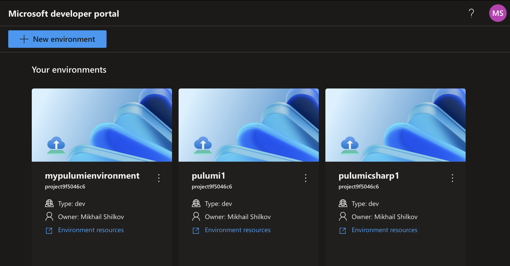

We are excited to announce the support for authoring [Azure Deployment Environments (ADE)](https://learn.microsoft.com/en-us/azure/deployment-environments/) environment definitions in Pulumi Infrastructure as Code (IaC) empowering developers to self-serve app infrastructure required to deploy and test cloud-based applications. With Pulumi support, you can now manage your Azure resources in these environments using the same familiar programming model and the full power of our IaC platform.

<!--more-->

Azure Deployment Environments is a service that enables developers to quickly spin up app infrastructure with project-based templates, all while maintaining centralized management and governance. Azure Deployment Environments also provides developers with an intuitive self-service portal where they can choose a curated, project-specific template to deploy new environments with just a few clicks. Thanks to the [ADE extensibility model](https://learn.microsoft.com/en-us/azure/deployment-environments/how-to-configure-extensibility-generic-container-image), you can now turn any Pulumi program into an environment definition and use it directly to securely provision application infrastructure in Azure. This post will guide you through creating ADE templates and deploying resources from the Microsoft developer portal.



## How It Works

Azure Deployment Environments natively supports the Azure Resource Manager (ARM) and Bicep IaC frameworks. In addition, ADE provides an extensibility model that enables customers to create custom container images to author environment definitions.

The Azure Deployment Environments and Pulumi teams collaborated to publish a standard container image that our joint customers can use directly to run Pulumi programs in ADE: [`pulumi/azure-deployment-environments`](https://hub.docker.com/r/pulumi/azure-deployment-environments). The image leverages ADE’s extensibility model to run Pulumi programs in the container.

When used with Pulumi, each environment definition consists of two components:

1. An `environment.yaml` file that describes the environment by referencing the Pulumi Docker image and pointing to a Pulumi program. Here is an example of such a file:

    ```yaml
    name: MyPulumiEnvironment
    version: 1.0.0
    summary: My First Pulumi-Enabled Environment
    description: Deploys a Pulumi stack into ADE
    runner: pulumi/azure-deployment-environments:latest
    templatePath: Pulumi.yaml
    ```

2. A Pulumi program that defines the resources to deploy. This program can use any of the [Pulumi Azure providers](https://www.pulumi.com/docs/clouds/azure/) to define resources in the environment. Here is a very simple Pulumi program defined in YAML:

    ```yaml
    name: ade-pulumi
    runtime: yaml
    description: My first Pulumi program in ADE
    config:
    resource-group-name:
        type: string
    resources:
    sa:
        type: azure-native:storage:StorageAccount
        properties:
        kind: Storage
        resourceGroupName: ${resource-group-name}
        sku:
            name: Standard_LRS
    ```

This is all you need to define a Pulumi environment in ADE. If you prefer to use a programming language like C#, TypeScript, Python, or Go, you will also need to add the code next to the `Pulumi.yaml` file.

Once the environment definition is added to the catalog, a user simply chooses an applicable environment in their developer portal. After accepting parameter values, ADE will run the Pulumi program in the container to provision Azure resources. In the case of the above program, it will create a new Storage Account in the environment, and the user will be able to use the resources once they are provisioned by Pulumi.

## Getting Started

To get started, you must have the **Azure Deployment Environments** service configured. You can manually create one in the Azure Portal by following the [instructions](https://learn.microsoft.com/en-us/azure/deployment-environments/quickstart-create-and-configure-devcenter) or using our [sample Pulumi program](https://github.com/pulumi/azure-deployment-environments/tree/main/Provisioning/ade) to provision all the required resources.

Once you have an ADE instance, you can start authoring your **environment definitions**. You can use the [Pulumi Azure Deployment Environments samples](https://github.com/pulumi/azure-deployment-environments/tree/main/Environments) as a starting point. The folder contains four simple Pulumi programs in four different languages, each creating a Storage Account in the environment. The programs also show how to use parameters to integrate with ADE’s configuration system.

Once you have the definitions, you will **publish them to a GitHub or Azure DevOps repository** and [**attach the repository as a Catalog in Azure Deployment Environments**](https://learn.microsoft.com/en-us/azure/deployment-environments/how-to-configure-catalog?tabs=DevOpsRepoMSI). You can do so manually using the Azure Portal or configure it within your Pulumi project, as illustrated in [our sample](https://github.com/pulumi/azure-deployment-environments/blob/1a9633cd31977be2b78cd727b21225ff7b48913d/Provisioning/ade/index.ts#L132-L141).

Finally, **navigate to the [Microsoft developer portal](https://devportal.microsoft.com)** to create a new environment. You will see the list of available templates, including the ones you just published.

## Bring a Custom Container Image

The Pulumi container image [`pulumi/azure-deployment-environments`](https://hub.docker.com/r/pulumi/azure-deployment-environments) is a great starting point for your environment definitions. However, if you want to customize the behavior to your needs, you can also bring your own container image to run Pulumi programs in ADE. To do so, refer to the [Configure a container image to execute deployments with Pulumi](https://aka.ms/ade/pulumi-docs) article on Microsoft Learn.

One benefit of using a custom image is the ability to provide a Pulumi Cloud access token to the image via the `PULUMI_ACCESS_TOKEN` environment variable. This allows the image to authenticate with the Pulumi Cloud backend without requiring additional configuration. Pulumi Cloud securely encrypts and stores your infrastructure state, manages secrets, provides search and clear visibility across all your cloud resources, runs remote deployments, integrates with CI/CD pipelines, detects configuration drift, and enables centralized policy enforcement. Additional features such as RBAC and audit logging enable your team to collaborate easily, ship faster, more securely and with confidence for every deployment.

If you have a suggestion for improving the standard Pulumi container image, please [open an issue](https://github.com/pulumi/azure-deployment-environments/issues/new) on our GitHub repository. We are always looking for ways to improve the experience for our Azure users.

## Conclusion

Together with the Azure Deployment Environments team, Pulumi is excited to enable our shared customers to take advantage of the ADE extensibility model, Pulumi IaC platform, and empower developers with self-service of Azure App infrastructure, within enterprise guardrails. We hope that this new capability will help you streamline your development processes and make it easier for your teams to provision new environments in Azure quickly.

If you want to learn more:
- Attend our workshop [Platform Engineering with Microsoft Azure and Pulumi](https://www.pulumi.com/resources/platform-engineering-with-azure-pulumi/) that takes place on June 20
- Read the [announcement on the Azure blog](https://aka.ms/build24/ade-blog)
- Explore the code at [`pulumi/azure-deployment-environments`](https://github.com/pulumi/azure-deployment-environments)
