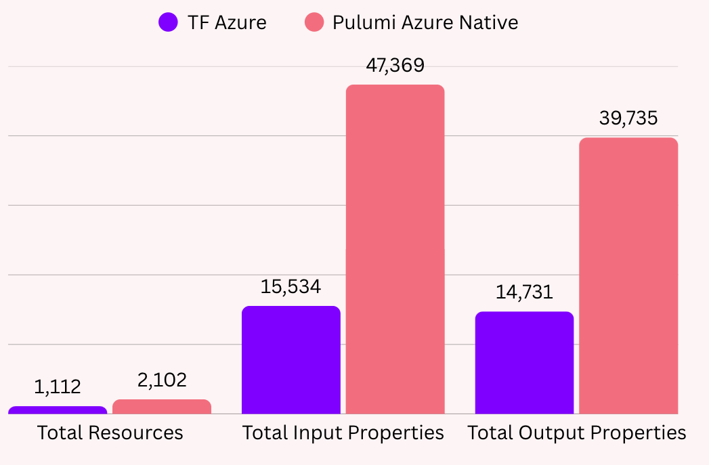

Pulumi Azure Native V3 is the most comprehensive infrastructure as code (IaC) solution for Microsoft Azure, combining full resource coverage with dramatic improvements in performance and developer experience.

With V3, the Pulumi Azure Native SDK is **75% smaller** while maintaining **100% coverage of the Azure Resource Manager (ARM) API**. This makes it the most efficient and complete way to define and manage Azure infrastructure with real programming languages.

<!--more-->

Pulumi Azure Native provides direct access to the [Azure Resource Manager API](https://learn.microsoft.com/en-us/rest/api/resources/), making it hands-down the best infrastructure as code solution for Microsoft Azure. Unlike traditional providers that abstract away cloud APIs, Azure Native gives you more resource and property coverage compared to Terraform by directly mapping to Azure's native REST API. This means:

- **Complete API coverage**: Access every Azure resource available in ARM
- **Same-day updates**: New Azure services and properties are available immediately
- **Advanced property support**: Work with every resource property, not just a subset
- **Latest API versions**: Always up to date with the newest stable Azure APIs

And with V3’s slimmer SDK footprint, developers benefit from faster IDE performance, reduced memory usage, quicker installs, and improved CI/CD pipeline efficiency.



These improvements came about through our [RFC process](https://github.com/pulumi/pulumi-azure-native/issues/4004), where we explored various options to balance SDK size with the flexibility needed by advanced users.

## A Slimmer, More Efficient SDK

The most significant improvement in Azure Native V3 is the dramatic 75% reduction in SDK size across all languages. By optimizing the SDK to include only the default API versions, we've solved one of the main pain points reported by our users, the size of the package:

| Language | Before | After | Reduction |
|----------|--------|-------|-----------|
| .NET     | 77 MB | 15 MB | 80.5% |
| JS/TS    | 494 MB | 87 MB | 82.4% |
| Python   | 104.6 MB | 25 MB | 76.3% |
| Go (source) | 910 MB | 167 MB | 81.6% |
| Java (explicit versions were not supported in v2) | 68 MB | 71 MB | +4.4%  |
| YAML | no SDK | no SDK | - |

This transformation delivers immediate benefits that every developer will notice: faster IDE performance with reduced load times, more responsive language servers for better autocompletion, reduced memory consumption, significantly quicker package installation, and improved CI/CD pipeline performance.

## Additional Enhancements in Azure Native V3

Azure Native V3 introduces more than just SDK size optimization. Other improvements include:

- **Reorganized module structure** better aligned with Azure SDK conventions
- **Improved resource naming** for clearer distinction between similar resources
- **Enhanced handling of nested properties** to avoid accidental overwriting
- **Better state management** with the removal of unnecessary `__inputs` fields (most noticeable with large stacks)

## Understanding Azure Versioning

The Pulumi Azure Native provider needs to manage two different versioning systems:

1. **Pulumi's Semantic Versioning**: Our SDKs follow the traditional major.minor.patch format (e.g., 3.0.0)
   - Patch versions (3.0.1) contain bug fixes only
   - Minor versions (3.1.0) add new resources and non-breaking features
   - Major versions (3.0.0) may contain breaking changes

2. **Azure's Date-based API Versions**: Azure resources use date-based versions like "2024-01-01" or "2023-05-15-preview"
   - Each Azure service (resource provider) has its own set of API versions
   - Breaking changes can occur between different API versions
   - Preview versions (with "-preview" suffix) contain newer features that may not be stable yet

## Default API Versions

Azure Native V3 includes refreshed default API versions across nearly all resources, ensuring you're automatically working with the latest stable Azure features and capabilities without any extra configuration. The new default versions unlock powerful new Azure functionality out of the box, such as:

- EventGrid (now 2025-02-15): Support for advanced filtering, dead-lettering, and custom event schemas
- MachineLearningServices (now 2024-10-01): Enhanced compute instance capabilities and new model deployment options
- Storage (now 2024-01-01): Improved performance tiers and expanded security features
- KeyVault (now 2024-03-01): Enhanced certificate management and expanded access policy options

## Using Non-Default API Versions

Most users (approximately 95% based on our Pulumi Cloud data) will be perfectly served by these default API versions. However, there are situations where you might need to use a specific API version.

For these cases, Azure Native V3 provides two flexible approaches:

### Option 1: Accessing Explicit API Versions via Local Packages

The most type-safe way to use explicit API versions is through local packages. This approach gives you the full SDK experience with strong typing, auto-completion, and documentation.

Add the specific API version package

Use the Pulumi CLI to add just the packages and versions you need:

```bash
pulumi package add azure-native storage v20240101
```

For more details on the `package add` command, see the [CLI documentation](/docs/cli/commands/pulumi_package_add/).

Step 2: Import and use the versioned package

Once added, you can import and use the specific API version in your code:



{}

```typescript
import * as resources from "@pulumi/azure-native/resources";
import * as storage_v20240101 from "@pulumi/azure-native_storage_v20240101";

const resourceGroup = new resources.ResourceGroup("resourceGroup");

const storageAccount = new storage_v20240101.storage.StorageAccount("sa", {
    resourceGroupName: resourceGroup.name,
    sku: {
        name: storage_v20240101.storage.SkuName.Standard_LRS,
    },
    kind: storage_v20240101.storage.Kind.StorageV2,
});
```

{}

{}

```python
import pulumi
from pulumi_azure_native import resources
import pulumi_azure_native_storage_v20240101 as storage_v20240101

resource_group = resources.ResourceGroup("resource_group")

storage_account = storage_v20240101.storage.StorageAccount("sa",
    resource_group_name=resource_group.name,
    sku=storage_v20240101.storage.SkuArgs(
        name=storage_v20240101.storage.SkuName.STANDARD_LRS,
    ),
    kind=storage_v20240101.storage.Kind.STORAGE_V2)
```

{}

{}

```csharp
using Pulumi;
using Pulumi.AzureNative.Resources;
using Storage_v20240101 = Pulumi.AzureNative_Storage_v20240101;

class MyStack : Stack
{
    public MyStack()
    {
        var resourceGroup = new ResourceGroup("resourceGroup");

        var storageAccount = new Storage_v20240101.Storage.StorageAccount("sa", new()
        {
            ResourceGroupName = resourceGroup.Name,
            Sku = new Storage_v20240101.Storage.SkuArgs
            {
                Name = Storage_v20240101.Storage.SkuName.Standard_LRS,
            },
            Kind = Storage_v20240101.Storage.Kind.StorageV2,
        });
    }
}
```

{}

{}

```go
package main

import (
	"github.com/pulumi/pulumi/sdk/v3/go/pulumi"
	"github.com/pulumi/pulumi-azure-native/sdk/go/azure/resources"
	storage_v20240101 "github.com/pulumi-azure-native-storage-v20240101/sdk/go/azure/storage"
)

func main() {
	pulumi.Run(func(ctx *pulumi.Context) error {
		resourceGroup, err := resources.NewResourceGroup(ctx, "resourceGroup", nil)
		if err != nil {
			return err
		}

		storageAccount, err := storage_v20240101.NewStorageAccount(ctx, "sa", &storage_v20240101.StorageAccountArgs{
			ResourceGroupName: resourceGroup.Name,
			Sku: &storage_v20240101.SkuArgs{
				Name: storage_v20240101.SkuNameStandard_LRS,
			},
			Kind: storage_v20240101.KindStorageV2,
		})
		if err != nil {
			return err
		}

		return nil
	})
}
```

{}

{}

```yaml
name: azure-native-example
runtime: yaml
description: A minimal Azure Native Pulumi YAML program
resources:
  resourceGroup:
    type: azure-native:resources:ResourceGroup
    properties:
      location: westus2
  
  # Using specific API version package
  storageAccount:
    type: azure-native_storage_v20240101:storage:StorageAccount
    properties:
      resourceGroupName: ${resourceGroup.name}
      sku:
        name: Standard_LRS
      kind: StorageV2
```

{}

{}

```java
package myproject;

import com.pulumi.Context;
import com.pulumi.Pulumi;
import com.pulumi.azurenative.resources.ResourceGroup;
import com.pulumi.azurenative.resources.ResourceGroupArgs;
import com.pulumi.azurenative_storage_v20240101.storage.StorageAccount;
import com.pulumi.azurenative_storage_v20240101.storage.StorageAccountArgs;
import com.pulumi.azurenative_storage_v20240101.storage.enums.Kind;
import com.pulumi.azurenative_storage_v20240101.storage.enums.SkuName;
import com.pulumi.azurenative_storage_v20240101.storage.inputs.SkuArgs;

public class App {
    public static void main(String[] args) {
        Pulumi.run(App::stack);
    }

    private static void stack(Context ctx) {
        var resourceGroup = new ResourceGroup("resourceGroup");

        var storageAccount = new StorageAccount("sa", StorageAccountArgs.builder()
            .resourceGroupName(resourceGroup.name())
            .sku(SkuArgs.builder()
                .name(SkuName.Standard_LRS)
                .build())
            .kind(Kind.StorageV2)
            .build());
    }
}
```

{}



### Option 2: Using the Generic Resource {#using-the-generic-resource}

An alternative approach is to use the generic `azure-native.resources.Resource`. This special resource allows you to access any Azure resource at any API version, including older versions that might not be available through local packages.

While not as type-safe as the local package approach, the generic resource offers maximum flexibility and is useful when you need to access a resource that is not yet supported by the Pulumi provider or when an issue prevents you from using a specific resource.

In most cases, we recommend using the local packages approach when you need a specific API version, and only falling back to the generic resource for special cases or resources not yet supported by the Pulumi provider.

For more details, see the [Azure Native version guide](/registry/packages/azure-native/version-guide/#using-the-generic-resource).

## Getting Started with Azure Native V3

### If You’re Already Using Pulumi Azure Native

Upgrading ensures you benefit from the smaller SDK, refreshed defaults, and the best performance when managing Azure at scale.

- **Upgrading from v2**: Follow the [v2 to v3 migration guide](/registry/packages/azure-native/from-v2-to-v3/).
- **Upgrading from v1**: First move to v2 using our [v1 to v2 upgrade guide](/registry/packages/azure-native/from-v1-to-v2/), the follow the [v2 to v3 migration guide](/registry/packages/azure-native/from-v2-to-v3/). This two-step process resolves deprecation warnings and ensures a smoother migration.

For language-specific installation instructions, see our [Azure Native setup guide](/registry/packages/azure-native/installation-configuration/).

### If You’re New to Pulumi

Pulumi makes it easy to define, deploy, and manage Azure infrastructure using your favorite programming languages. To get started:

- [Sign up for Pulumi Cloud](https://app.pulumi.com/signup) - free for individuals and teams.
- Explore the [Azure Native installation guide](https://www.pulumi.com/registry/packages/azure-native/installation-configuration/).
- Try a [quickstart project](https://www.pulumi.com/tutorials/azure/) to provision real Azure resources in minutes.

## Conclusion

Pulumi Azure Native V3 is the most complete and efficient solution for managing Azure infrastructure as code. With a dramatically smaller SDK, updated defaults, flexible API versioning, and enhanced developer experience, it offers the best combination of performance, coverage, and control for Microsoft Azure users.

We'd like to thank our community for their valuable feedback throughout the development of V3. Your input helped shape this release, and we're excited to see what you'll build with it.

Have questions or suggestions? [Open an issue on GitHub](https://github.com/pulumi/pulumi-azure-native/issues), join our [Community Slack](https://slack.pulumi.com/).
