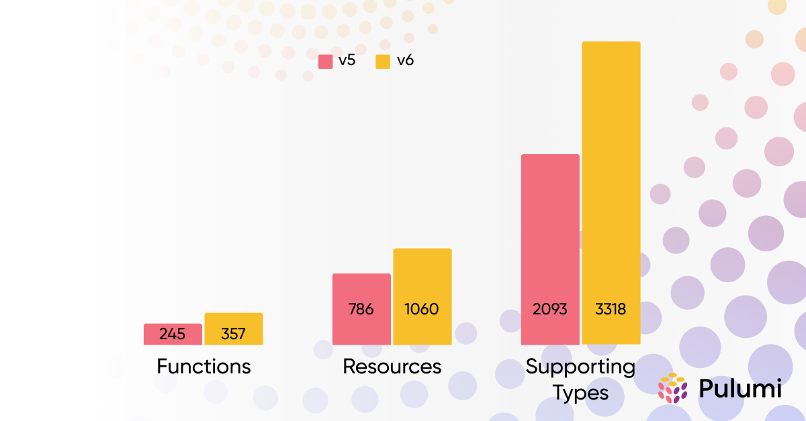

The latest major release of the Azure Classic Pulumi Provider is available now!
Our 6.0 release contains the [latest upstream changes](https://github.com/hashicorp/terraform-provider-azurerm/releases/tag/v4.0.1) to keep you up-to-date along with the latest features and improvements from Pulumi.

The Azure Classic provider is derived from the upstream Terraform AzureRM provider and can be used to provision most resources on Azure. The Azure Classic provider can be used to complement the [Pulumi Azure Native provider](https://www.pulumi.com/registry/packages/azure-native/), our recommended provider, which has amazing resource coverage due to being derived directly from the official specifications.
The provider is open source and available on GitHub so you can always follow along with current issues and developments, or even open your first pull request.

<!--more-->

Here are a few links to help you get started if you are new to Pulumi:

- [Getting Started](https://www.pulumi.com/docs/iac/get-started/azure/) - A guided walkthrough for creating your first project
- [Setup & Install](https://www.pulumi.com/registry/packages/azure/installation-configuration/) - Instructions on installing the Azure Classic provider
- [How-to guides](https://www.pulumi.com/registry/packages/azure/how-to-guides/) - Learn how to use the Azure Classic provider to provision specific resources
- [Pulumi AI](https://www.pulumi.com/ai) - Ask Pulumi AI to create a new project

## Looking Back

Since the last major release of this provider, we have continuously shipped improvements to our ecosystem, bringing the latest Pulumi features to your production stack.
We have rolled out an [improved diffing strategy](https://github.com/pulumi/pulumi-terraform-bridge/issues/1785) and [fixed state upgrades](https://github.com/pulumi/pulumi-terraform-bridge/pull/2081) in the Pulumi Terraform Bridge, removing spurious diffs on preview and increasing confidence when deploying. Additionally we have improved accuracy and coverage for registry documentation, via better example conversion and [general docs improvements](https://github.com/pulumi/pulumi-terraform-bridge/issues/1794) for bridged providers.

### New Modules

Over the last two years, we have added support for several new modules. Among these are:

- [Arc](https://www.pulumi.com/registry/packages/azure/api-docs/arc/) & [Arc Kubernetes](https://www.pulumi.com/registry/packages/azure/api-docs/arckubernetes/)
- [Chaos Studio](https://www.pulumi.com/registry/packages/azure/api-docs/chaosstudio/)
- [Confidential Ledger](https://www.pulumi.com/registry/packages/azure/api-docs/confidentialledger/)
- [Container App](https://www.pulumi.com/registry/packages/azure/api-docs/containerapp/)
- [Cost Management](https://www.pulumi.com/registry/packages/azure/api-docs/costmanagement/)
- [Custom IP](https://www.pulumi.com/registry/packages/azure/api-docs/customip/)
- [Datadoc](https://www.pulumi.com/registry/packages/azure/api-docs/datadog/)
- [Elastic Cloud](https://www.pulumi.com/registry/packages/azure/api-docs/elasticcloud/)
- [Elastic SAN](https://www.pulumi.com/registry/packages/azure/api-docs/elasticsan/)
- [Fluid Relay](https://www.pulumi.com/registry/packages/azure/api-docs/fluidrelay/)
- [Managed Lustre](https://www.pulumi.com/registry/packages/azure/api-docs/managedlustre/)
- [Private 5G Core](https://www.pulumi.com/registry/packages/azure/api-docs/mobile/)
- [New Relic](https://www.pulumi.com/registry/packages/azure/api-docs/newrelic/)
- [NGINXaaS](https://www.pulumi.com/registry/packages/azure/api-docs/nginx/)
- [Orbital Ground Station](https://www.pulumi.com/registry/packages/azure/api-docs/orbital/)
- [Palo Alto](https://www.pulumi.com/registry/packages/azure/api-docs/paloalto/)
- [Privileged Identity Management](https://www.pulumi.com/registry/packages/azure/api-docs/pim/)
- [Red Hat OpenShift](https://www.pulumi.com/registry/packages/azure/api-docs/redhatopenshift/)
- [Voice (AI Services)](https://www.pulumi.com/registry/packages/azure/api-docs/voice/)
- [SAP Workloads](https://www.pulumi.com/registry/packages/azure/api-docs/workloadssap/)

### API Coverage Growth

The below chart shows the growth of this provider by resource, function, and supporting types since Version 5.

## Upgrading

You can find our v5 to v6 Migration Guide [on the Pulumi Registry](https://www.pulumi.com/registry/packages/azure/v6-migration/).
