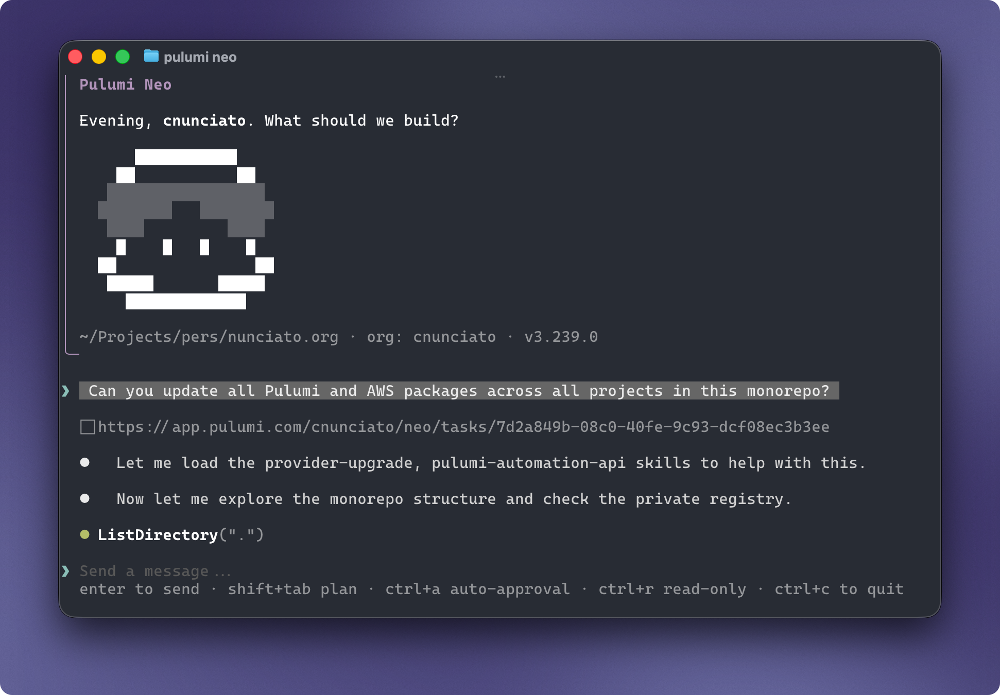

AI agents do a lot of their work through CLIs. They're easier to call than HTTP APIs and they produce predictable output. Over the last few months our own CLI traffic has shifted from mostly people typing commands to people and agents running commands together, often in the same session.

Today we're shipping a release built for both. The [Pulumi CLI](/docs/iac/cli/) is reorganized around three ideas: the right command should be the one you can guess, anything you can do in [Pulumi Cloud](/product/pulumi-cloud/) should also be doable from the terminal, and what comes back should be just as readable to an agent as it is to a person.

<!--more-->

## Designing for guessability

The bar we set was that both developers and coding agents should be able to guess at the right command for a particular task: `pulumi env edit` to modify an environment, `pulumi stack get` to see what's going on with a stack, `pulumi org member list` to see who's on the team. If we had to explain which command did what, the usability bar hadn't been met.

Branches in the tree are now singular nouns like `stack`, `env`, `org`, and `deployment`. Leaves are now verbs from a canonical vocabulary — `list`, `get`, `set`, `new`, `edit`, `remove` — and they mean the same thing wherever they're used. `edit` always means _modify an existing thing_. Wherever the old vocabulary differed, though, the old name still works: `ls`, `rm`, `update`, and `open` are all aliased to preserve backward compatibility.

For the most part, product names have also been replaced with familiar nouns. Users (human or otherwise) don't think in product names; they think in terms of resources, stacks, environments. For example, take [Pulumi ESC](/esc/): the product may be named ESC (and for a while the command was too), but nobody thinks _I need to initialize a new ESC_ — they think _I need to create a new environment_. The command is therefore `pulumi env new`, with `esc init` preserved as an alias to avoid disrupting anyone's existing workflows.

```bash
$ pulumi env new my-project my-env
Environment created.
```

## All of Pulumi Cloud in the terminal

Up to now, most of what you could do with Pulumi Cloud had to be done either in the browser or through direct API calls. Things like reviewing deployments, setting up webhooks, finding non-compliant resources, or managing deployment settings all required you to break out `curl` and hit the API docs or open a browser and navigate the Pulumi Cloud console.

That changes today. Pulumi Cloud is now fully accessible from the command line through the `pulumi` CLI, with consistently named nouns and verbs aligned to what you'd expect:

- `pulumi stack get` returns a complete stack overview, metadata, resource list, and more:

    ```bash
    $ pulumi stack get \
        --stack cnunciato/chris.nunciato.org/production \
        --output json | jq -r ".resources[].type" | grep "aws:s3"

    aws:s3:BucketEventSubscription
    aws:s3/bucket:Bucket
    aws:s3/bucket:Bucket
    aws:s3/bucketPublicAccessBlock:BucketPublicAccessBlock
    aws:s3/bucketWebsiteConfiguration:BucketWebsiteConfiguration
    aws:s3/bucketOwnershipControls:BucketOwnershipControls
    aws:s3/bucketNotification:BucketNotification
    ```

    ... with other stack-related commands like `pulumi stack history get events`, `pulumi stack drift list`, `pulumi stack schedule new`, and `pulumi stack webhook new` alongside it.

- Organizational commands like `pulumi org member list`, `pulumi org role list`, `pulumi org usage get`, and `pulumi org audit-log export` can help you dig into the details when you need to as well.

- Deployment-related commands like `pulumi deployment list`, `get`, `log`, and `cancel` let you see what's running, dive into what happened, and take action without having to leave the terminal.

    ```bash
    $ pulumi deployment list \
        --stack cnunciato/chris.nunciato.org/production \
        --output table

    ┌──────────────────────────────────────┬───────────┬─────────┬───────────┬──────────────┬─────────────────────────┐
    │ ID                                   │ OPERATION │ VERSION │ STATUS    │ INITIATED BY │ MODIFIED                │
    ├──────────────────────────────────────┼───────────┼─────────┼───────────┼──────────────┼─────────────────────────┤
    │ 83e44b8c-643c-4e9f-9f36-0c6a81d9db2e │ update    │     140 │ running   │ cnunciato    │ 2026-05-17 21:26:37.340 │
    │ 52a37cbe-b7fd-4027-8e0f-7b4785ab12e8 │ update    │     139 │ succeeded │ cnunciato    │ 2026-05-16 23:36:07.999 │
    │ 94e04525-b3a4-42b5-9987-e344018a3324 │ preview   │     138 │ succeeded │ cnunciato    │ 2026-05-16 23:29:19.709 │
    └──────────────────────────────────────┴───────────┴─────────┴───────────┴──────────────┴─────────────────────────┘
    ```

- And when you need to query across managed (and even unmanaged) resources, `pulumi insights resource search` and `get` can help you find what you're looking for quickly:

    ```bash
    $ pulumi insights resource search \
        --query 'type:aws:s3/bucket:Bucket org:cnunciato project:photomap stack:dev' \
        --output table

    ┌──────────────────────────────────────────────────────────────────────────┬──────────────────────┬───────┬──────────────────────────┐
    │ URN                                                                      │ TYPE                 │ STACK │ MODIFIED                 │
    ├──────────────────────────────────────────────────────────────────────────┼──────────────────────┼───────┼──────────────────────────┤
    │ urn:pulumi:dev::photomap::aws:apigateway:x:API$aws:s3/bucket:Bucket::api │ aws:s3/bucket:Bucket │ dev   │ 2020-10-31T00:39:47.926Z │
    │ urn:pulumi:dev::photomap::aws:s3/bucket:Bucket::images                   │ aws:s3/bucket:Bucket │ dev   │ 2020-10-31T00:39:47.926Z │
    └──────────────────────────────────────────────────────────────────────────┴──────────────────────┴───────┴──────────────────────────┘

    Showing 2 of 2 resources.
    ```

Flags and output formats are consistent across commands (`--output table`, `json`), as are the shapes of cross-cutting features like webhooks. If you've used `pulumi stack webhook`, for example, you already know how to use `pulumi env webhook` and `pulumi org webhook`, and so on.

## Direct access to the Pulumi Cloud API

For any features of Pulumi Cloud that don't yet have their own commands, you've also got [`pulumi api`](/docs/iac/cli/api/). It's a `gh api`-inspired command designed to give you direct access to the full REST API, without having to manage separate access tokens, auth settings, or request/response payloads. Everything is handled for you through your authenticated `pulumi` CLI.

There's even `pulumi api list`, which enumerates every single endpoint that's exposed:

```bash
$ pulumi api list

┌───────────────┬────────┬───────────────────────────────────────┬──────────────────────────────┐
│ TAG           │ METHOD │ PATH                                  │ SUMMARY                      │
├───────────────┼────────┼───────────────────────────────────────┼──────────────────────────────┤
│ AccessTokens  │ GET    │ /api/orgs/{orgName}/tokens            │ ListOrgTokens                │
│ AccessTokens  │ POST   │ /api/orgs/{orgName}/tokens            │ CreateOrgToken               │
│ AccessTokens  │ DELETE │ /api/orgs/{orgName}/tokens/{tokenId}  │ DeleteOrgToken               │
│ AccessTokens  │ GET    │ /api/user/tokens                      │ ListPersonalTokens           │
│ AccessTokens  │ POST   │ /api/user/tokens                      │ CreatePersonalToken          │
│ AccessTokens  │ DELETE │ /api/user/tokens/{tokenId}            │ DeletePersonalToken          │
...

537 operations. Pass --output=json for a stable, scriptable contract.
```

To get the details about a particular API, use `pulumi api describe`:

```bash
$ pulumi api describe 'DELETE /api/user/tokens/{tokenId}'  # or DeletePersonalToken

DELETE /api/user/tokens/{tokenId}
Tag: AccessTokens
Operation: DeletePersonalToken

DeletePersonalToken

Permanently deletes a personal access token by its identifier. The token is immediately
invalidated and can no longer be used for authentication. Returns 204 on success or 404
if the token does not exist.

Parameters:
  [path] tokenId* (string) — The access token identifier
```

All requests are made through your authenticated `pulumi` CLI:

```bash
$ pulumi login
Logged in to pulumi.com as cnunciato.

$ pulumi whoami
cnunciato

$ pulumi api /api/user/tokens/2cf15c7d-afad-458f-ace0-fc7ff0512b10 \
    --method DELETE && echo "Token deleted."
Token deleted.
```

Newly published endpoints are available through `pulumi api` immediately, so you don't have to wait for a new CLI release before you can start using them. See the [Pulumi Cloud REST API documentation](/docs/reference/cloud-rest-api/) to learn more.

## Finding templates in the Pulumi Cloud Registry

Finding out which templates are available to you through your Pulumi organization used to mean having to navigate to the [Pulumi Cloud Registry](/registry/) and start searching. The new `pulumi template` commands make this easier by letting you ask for what's available right from the shell, either by fetching the full list or filtering with the `--name` or `--search` params:

```bash
$ pulumi template list --search "container typescript" --org cnunciato

┌─────────────────────────────────────────────┬────────┬────────────┬────────────┐
│ Name                                        │ Source │ Language   │ Visibility │
├─────────────────────────────────────────────┼────────┼────────────┼────────────┤
│ pulumi/templates/container-aws-typescript   │ github │ typescript │ public     │
│ pulumi/templates/container-azure-typescript │ github │ typescript │ public     │
│ pulumi/templates/container-gcp-typescript   │ github │ typescript │ public     │
└─────────────────────────────────────────────┴────────┴────────────┴────────────┘
```

This is especially useful when you're working with an agent because it helps the agent discover your org's approved templates without having to name them. Start with a prompt that tells the agent what you want to build, and let the agent find the right template for you.

## Agent-friendly Markdown docs for providers and components

Both humans and agents need to be able to understand what's inside a Pulumi package before they can use it. And while the [Registry](/registry/) is an excellent resource for that, it was mainly designed to deliver HTML — a human-friendly format that agents can certainly use, but that's much more verbose than they actually need.

With `pulumi api`, agents can fetch the details about a package from the Registry directly and get back those details either in `markdown` or `json`, whichever works best, filtering on properties like language where applicable:

```bash
$ pulumi api "/api/registry/packages/pulumi/pulumi/random/versions/4.19.1"

{
    "name": "random",
    "publisher": "pulumi",
    "publisherDisplayName": "Pulumi",
    "source": "pulumi",
    "version": "4.19.1",
    "description": "A Pulumi package to safely use randomness in Pulumi programs.",
    "repoUrl": "https://github.com/pulumi/pulumi-random",
    ...
}
```

```bash
$ pulumi api "/api/registry/packages/pulumi/pulumi/random/versions/4.19.1/docs/random%3Aindex%2FrandomPassword%3ARandomPassword" \
    --output markdown

# RandomPassword

resource `random:index/randomPassword:RandomPassword`

## Example Usage

package main
...
```

Resources are individually addressable using their URL-encoded Pulumi type tokens — e.g., `random:index/randomPassword:RandomPassword` — and API endpoints are configured to deliver Markdown when agents ask for it:

```bash
$ curl "https://api.pulumi.com/api/registry/packages/pulumi/pulumi/random/versions/latest/readme?lang=python" \
    -H "Accept: text/markdown"

# Installation

The Random provider is available as a package in all Pulumi languages:
...
```

Even compared to JSON (which is itself a significant improvement over HTML), Markdown is a much more token-efficient format for agents to work with:

| Package      | Endpoint                      | JSON     | Markdown | Tokens saved |
| ------------ | ----------------------------- | -------- | -------- | ------------ |
| random       | `/readme`                     | 10.68 KB | 6.04 KB  | 43%          |
| aws          | `/readme`                     | 4.22 KB  | 2.54 KB  | 40%          |
| aws          | `/nav?depth=full`             | 204 KB   | 170 KB   | 17%          |
| aws          | `/docs/{resource type token}` | 15.24 KB | 11.28 KB | 26%          |
| azure-native | `/docs/{resource type token}` | 48.13 KB | 30.37 KB | 37%          |
| aws          | `/docs/{function type token}` | 2.40 KB  | 1.46 KB  | 39%          |

Learn more about our Registry endpoints in the [REST API docs](/docs/reference/cloud-rest-api/registry-preview/). (Or just ask your agent!)

## New to the CLI: Pulumi Neo

When we launched [Pulumi Neo](/neo/) last year, the only way to use it was in the Pulumi Cloud Console. But while there's a ton you can do with Neo in the browser, if you're an engineer already living in the terminal, chances are that eventually you're going to wish you had Neo right in the CLI along with you.

Now you do. Running `pulumi neo` with or without a prompt launches a Pulumi Cloud-connected session that gives Neo access to your local environment just like any other coding agent. Use it on its own to scaffold a new project, understand an existing codebase, or debug a failing deployment — or pull it into an active session with the coding agent you're already using. Either way, it stays in the shell you're already working in.

We'll cover Neo in the CLI in more detail later this week. In the meantime, here's a peek:



## Smaller changes that add up

A long list of smaller changes also runs through this release:

- The core loop now speaks JSON end to end, with `pulumi up`, `pulumi destroy`, and `pulumi import` all emitting structured JSON output when called with `--output json`.

- Streams now behave the way scripts expect them to, with data on stdout, progress and diagnostics on stderr.

- Exit codes are more consistent across the board. Every failure mode — auth, resource, policy, missing stack, cancellation, timeout, and others — has its own exit code, so agents can branch on the actual cause instead of having to interpret output. The [full table](/docs/iac/cli/exit-codes/) is in the docs.

- Help text explains _why_ a command exists, not just what it does, and includes at least one concrete example. Examples in `--help` are one of the most effective ways to improve LLM accuracy on first-try invocations — and it turns out they're pretty handy for humans, too.

## A sneak peek at a new command

Later this week, you'll get a closer look at `pulumi do`, a new top-level command that enables direct resource operations like create, read, update, delete, and list across every Pulumi-supported cloud provider and resource, all in one command. A simple example:

```bash
$ pulumi do aws getAvailabilityZones

{
    "groupNames": [
        "us-west-2-zg-1"
    ],
    "id": "us-west-2",
    "names": [
        "us-west-2a",
        "us-west-2b",
        "us-west-2c",
        "us-west-2d"
    ],
    "region": "us-west-2",
    "zoneIds": [
        "usw2-az2",
        "usw2-az1",
        "usw2-az3",
        "usw2-az4"
    ]
}
```

It might look like that's calling the AWS CLI, but it's not — it's using [the same AWS provider function](/registry/packages/aws/api-docs/getavailabilityzones/) a full Pulumi program would use, only without the program, and invoked directly from the CLI.

More on how it works, and what you can do with it, in the days ahead.

## Try it yourself

A lot of what makes a developer tool worth using is in the details, and most of what's in this release is exactly that, across the whole CLI, with humans and agents in mind.

We'd love for you to [grab the latest release](/docs/get-started/download-install/) and give it a try. Tell us what's now easy, what's still hard, and what to fix next on [GitHub](https://github.com/pulumi/pulumi/issues) or in the [community Slack](https://slack.pulumi.com/). The fastest way the CLI gets better is feedback from the humans and agents who live in it.
