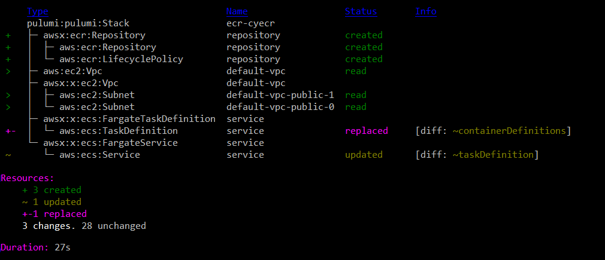

Amazon Elastic Container Registry ([ECR](https://aws.amazon.com/ecr/))
is a fully-managed Docker container registry that makes it easy for
developers to store, manage, and deploy Docker container images. ECR is
integrated with Amazon Elastic Container Service
([ECS](https://aws.amazon.com/ecs/)), including for Kubernetes
([EKS](https://aws.amazon.com/eks)), simplifying your development to
production workflow, securing access through IAM, and eliminating the
need to operate your own container repositories or worry about scaling
the underlying infrastructure. ECR hosts your images in a highly
available and scalable architecture, allowing you to reliably deploy
containers for your applications. In this article, we'll see how
[Pulumi Crosswalk for AWS]() lets you use
infrastructure as code to easily build, publish, and pull from private
ECR repositories.
<!--more-->

## A Simple ECS Fargate Service

Let's see how using Pulumi you can provision an ECR repository, and
build and publish to it, in just a few lines of code. Additional
features such as lifecycle management make it easy to declare policies
specifying how and when stale images should be dropped. Built images can
then be referenced from your ECS services (whether
[EC2,](https://aws.amazon.com/ec2/) [Fargate](https://aws.amazon.com/fargate/),
or [EKS](https://aws.amazon.com/eks)), allowing you to easily version
both your images and your infrastructure with one simple, auditable,
system.

Let's take a look at this in action. First, we'll just start with a
simple Pulumi program that creates a load balanced Fargate Service that
accessible to the internet, but uses the *public* `nginx` container
image from the Docker Hub:

```typescript
// A simple NGINX service, scaled out over two containers.
const nginx = new awsx.ecs.FargateService("nginx", {
    cluster,
    desiredCount: 2,
    taskDefinitionArgs: {
        containers: {
            nginx: {
                image: "nginx",
                memory: 128,
                portMappings: [new awsx.elasticloadbalancingv2.ApplicationListener("nginx", { port: 80 })],
            },
        },
    },
});

export const nginxEndpoint = nginxListener.endpoint;
```

Running this give us:

    Updating (teststack):
         Type                                                        Name                      Status
     +   pulumi:pulumi:Stack                                         teststack                 created
     +   ├─ awsx:x:elasticloadbalancingv2:ApplicationLoadBalancer    nginx                     created
     +   │  ├─ awsx:x:elasticloadbalancingv2:ApplicationTargetGroup  nginx                     created
     +   │  │  └─ aws:elasticloadbalancingv2:TargetGroup             nginx                     created
     +   │  ├─ awsx:x:elasticloadbalancingv2:ApplicationListener     nginx                     created
    ... more output trimmed ***

    Outputs:
        nginxEndpoint: { hostname: "********", port: 80 }

    Resources:
        + 36 created

    Duration: 3m19s

We have trimmed the output, since this simple program provisioned 36 AWS
resources, connected them accordingly, and stood up a load balanced ECS
Fargate service that automatically uses cloud deployment best practices.

Here, through the use of `image: "nginx"` we are letting ECS know that
we want to use [this](https://hub.docker.com/_/nginx/) publicly
available Docker Hub image. ECS supports pulling these images for you by
default and making them available to your services. If you're using a
public image, this works great and no further work is necessary on your
part.

## Using a Private ECR Repository

There are many times, however, when you or your organization may not
want to use public images, such as private applications that aren't
meant to be shared with the Internet. The Docker Hub supports private
images, however, if you're already building on AWS, Amazon ECR is a
valuable service that allows you to host those images in your AWS
account, leveraging IAM for secure authentication, and ensuring easy,
fast and secure access from your containers.

Let's see what that looks like with Pulumi. First, we'll create a simple
`Dockerfile` that starts with the base
[nginx](https://hub.docker.com/_/nginx/) image and slightly modifies it
to contain our own custom `index.html` file:

The `Dockerfile`:

    FROM nginx
    COPY content/index.html /usr/share/nginx/html 

The `index.html` file:

    <h1> Hi from Pulumi! </h1>

Now, let's see how we'd update our Pulumi app to build this custom
Docker image, push it to ECR, get the resulting image name, and
reference it from our ECS service (it works the same in both ECS and
EKS):

```typescript
// common code from before trimmed out
const repository = new awsx.ecr.Repository("repo");

// Invoke 'docker' to actually build the DockerFile that is in the 'app' folder relative to
// this program. Once built, push that image up to our personal ECR repo.
const image = repository.buildAndPushImage("./app")

const service = new awsx.ecs.FargateService("service", {
    // ... common code from before trimmed out
    taskDefinitionArgs: {
        containers: {
            service: {
                image: image,
    ...
```

So let's see what happens when we actually try to run this:


As you can see Pulumi is actually launching the real `docker` executable
locally to use the `Dockerfile` to build the image. As `docker` runs,
the output is captured and automatically shown in the real-time Pulumi
update display. When the image is finished building, it is pushed by
`docker` itself to the ECR repo. Pulumi safely passes temporary repo
credentials to the `docker` executable so it can login and push the
image up. Finally, once available in ECR, the task-definition and
service are appropriately updated to now reference this new image. ECS
will then ensure that the old services are spun down and the new
services are spun up.

TL;DR, just run `pulumi up`, and it takes care of all the heavy lifting.
In the end we see:



In less than 30 seconds, Pulumi and Docker built the private image, made
it available on ECR, and properly moved the Service over to using it.
This was all done with a single command, with Pulumi smartly figuring
out at the end of the day exactly what changes needed to be made. From
the above we can see just the creation of the Repository components, and
the updates of the Service to now use it. A nice minimal change that
exactly matches our intuition around what would happen. If necessary,
the `.buildAndPushImage` operation can also take many more options to
control what's happening with `docker`. Options around tagging and
caching can be configured, and the `docker` command line can also just
be augmented if necessary to handle advanced scenarios.

## Managing ECR Lifecycle Policies

In practice, an organization may be producing and uploading many images
to their private ECR repositories. This can add up in costs as time goes
on, especially when old images are stored that will never be used again.
To aid with this, Pulumi makes it easy to set up [ECR Lifecycle Policies](https://docs.aws.amazon.com/AmazonECR/latest/userguide/LifecyclePolicies.html)
to control the lifetime of your images and to easily purge unneeded
images based on flexible criteria to meet your needs.

As a simple example, here's a way to just remove any untagged images
that are older than one week old:

```typescript
// common code from before trimmed out
const repository = new awsx.ecr.Repository("repo", {
    lifeCyclePolicyArgs: {
        rules: [{
            selection: "untagged",
            maximumAgeLimit: 7,
        }],
    },
});
```

Now, you can keep your last two weeks of images around if you want them
with all tagged images (like `'latest'`) being preserved. You can
continue pushing rapidly to your repo without having to worry about
manually going and cleaning up the stale garbage in the future.

## Next Steps

We've shown how [Pulumi Crosswalk for AWS]()
can create a tight developer inner
loop for building, publishing, and consuming Docker images, using
private ECR repositories, while keeping all your ECS or EKS services and
tasks updated properly and securely. This can be done with flexible
policies to ensure that your repos contain the images you care about and
don't keep holding onto images you no longer need, and is all possible
from a single Pulumi app with simple commands to keep everything in
sync.

Pulumi is open source and free to use. For more information on Getting
Started, check out:

1.  [AWS QuickStart]()
2.  [Pulumi Crosswalk for AWS Announcement]()
3.  [Mapbox IOT-as-Code with Pulumi Crosswalk for AWS]()
4.  [Pulumi Crosswalk for AWS Documentation for ECS, EKS, ELB, and more]()

We think there's no easier way to do containers in a tight inner
development loop, and we hope you agree!
