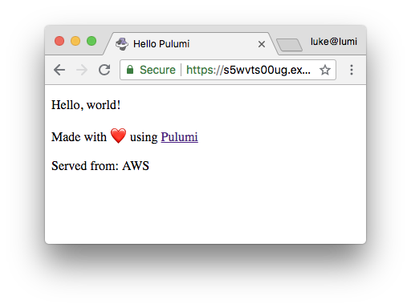

In this tutorial, we'll use Pulumi, to build a
complete serverless application using JavaScript. When we say 'using
only JavaScript', we're not kidding:

- write code just like an Express app... but end up with a fully
  deployable serverless app
- lambdas are... just lambdas
- no YAML required... freedom from indentation
- all the features of the V8 runtime... async await ahoy
- all the behaviors of immutable infrastructure as code tools... but
  we really mean 'as code'

Pulumi also supports containers (including Kubernetes), managed
services, infrastructure and everything else in between that you might
need for building cloud applications. Better than that, you can even
[combine them all in the same program]().
<!--more-->

## Our first serverless app in 5 lines of JavaScript

After [installing the Pulumi CLI](), just run
the following to create a new app:

    mkdir firstapp && cd firstapp
    pulumi new hello-aws-javascript

This template creates a small `index.js` file (the main Pulumi code)
that is a simple but complete serverless application:

```javascript
// Add the required package
const cloud = require("@pulumi/cloud-aws");

// Declare an HTTP endpoint
const endpoint = new cloud.API("hello");

// Serve up some static content on that endpoint
endpoint.static("/", "www");

// Create a simple serverless function responding to GET
endpoint.get("/source", (req, res) => res.json({name: "AWS"}));

// Publish the URL so we can easily access our app
exports.url = endpoint.publish().url;
```

So what's happening here? This code creates a `cloud.API` which exposes
an HTTP endpoint to the internet. It serves static content at the root
of the API from what's in the `www` folder on your local machine. And it
serves a REST API on `GET /source` which runs the JavaScript callback to
return the JSON object `{name: “AWS”}` (our serverless function).
Finally, it exports the URL where the HTTP API is exposed.

Now just run `pulumi update` to deploy the application. Before the app
deploys, you'll get a preview of what will be deployed and you can
choose to go ahead with the full deployment. Pulumi figures out all of
the cloud resources needed to run the code above and prepares that for
deployment.


Once deployed, your application will run in the cloud. Use
`pulumi stack output url` to get the URL where your app is running, and
open it up in your browser:



With Pulumi, we've built a serverless app in just a few lines of code.
This approach avoided significant amounts of configuration (YAML, or
point-and-click). Pulumi also supports containers (including
Kubernetes), managed services, infrastructure and everything else in
between that you might need for building cloud applications.
[Get started with Pulumi]().

## Why JavaScript for serverless programming?

There are many great reasons to use JavaScript for serverless
programming (and cloud programming generally). Pulumi also supports
TypeScript, Python, and Go with more languages on the way. 

Pulumi uses NPM, Express, and supports modern JavaScript features like
async await, module etc. and so you can bring your JavaScript skills
directly to cloud programming. 

### Code is the best Config

Serverless platforms such as AWS Lambda offer an easy and cost-effective
way to run your code in the cloud. But using these serverless platforms
often requires learning lots of finicky details of the cloud platform,
and using esoteric YAML configuration files to tell the cloud platform
how to run your app. Often, the work needed to configure the app can
outweigh the work needed to code the app.

Pulumi changes that, and lets you build serverless
cloud applications using **only** JavaScript (or TypeScript). These
applications can use all the features of cloud platforms like AWS, Azure
or GCP - but exposed as simple JavaScript APIs on NPM.

This means that you can write code that contains logic alongside code
that defines the services and infrastructure needed to run it and Pulumi
can then deployed the app in seconds and run as a managed, scalable and
- in the case of serverless apps such as this one - extremely low cost
service on your chosen cloud.

### Code is more productive, expressive, and... fun

One of the biggest advantages of a pure code approach is the automatic
gains from better tooling support. In particular:

- **Code completion.** There are a lot of services in each cloud.
  Wouldn't it be great to be able to autocomplete?
- **Error checking.** Less worry about correctly indented YAML, more
  real error checking.
- **Versioning and Packaging.** Much improved versioning and packaging
  scenarios through Github and NPM workflows. 
- **Reusable components.** Build on top of base classes, and share for
  easy reuse, standard configurations and so on.


## Want more?

To learn more take a look at more tutorials and example code:

- Our origin story: [Hello, Pulumi!](http://joeduffyblog.com/2018/06/18/hello-pulumi/)
- Tutorial: [Deploying Containers with Pulumi]()
- Tutorial: [Build a video thumbnailer using AWS Lambda, Fargate, and S3 in JavaScript]()
- [Pulumi Quickstart]()
- [Pulumi Community Slack](https://slack.pulumi.io)
- [Pulumi Examples on GitHub](https://github.com/pulumi/examples)

 

 

