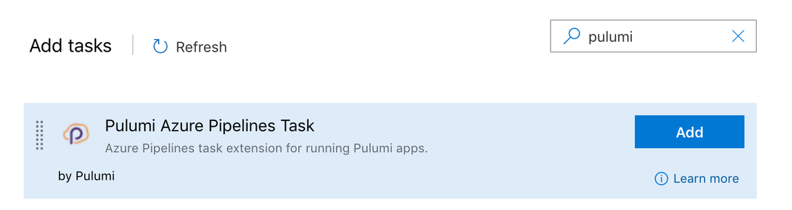

Azure DevOps is very popular among teams that want a single place to
manage their development pipelines, Git repositories, builds, releases,
and test plans. Pulumi's open-source tools are a great choice for
developers and operators deploying infrastructure as code on Azure. With
these two tools at hand, adopting CI and CD for your Azure
infrastructure is just a few steps away for you and your teams. 

To make it easy to use Pulumi with Azure, we are announcing an
open-source task extension for Azure Pipelines! The task extension will
manage the installation of the Pulumi CLI, and run the [Pulumi
commands]() you specify against
your stack.

You can install the task extension directly from the [Visual Studio
Marketplace](https://marketplace.visualstudio.com/items?itemName=pulumi.build-and-release-task).
Click the **"Get It Free"** button to install the extension into your
Azure DevOps organization. If you do not have the permissions to add it
to your organization, please contact your org admin to have the
extension installed. The source code for the open source task extension
can be found on
[GitHub](https://github.com/pulumi/pulumi-az-pipelines-task).

To use the Pulumi task extension in Azure Pipelines, there are two
options. The
full [example](https://github.com/pulumi/pulumi-az-pipelines-task/tree/master/examples) is
in the source repo. For contrast, without this task extension,
[here's]() how
you would achieve the same, but with scripts.

## OPTION 1: Using the Classic Editor Console

Pasted below is a typical view of the Editor User Interface. Click on
the **"+"** button next to the job. As visible in the screenshot, the
job is called **"Agent job 1"**. The agent pool you choose does not
matter. The Pulumi task can run on both Linux as well as Windows
images.


Search for the **Pulumi** task by typing in the filter input on the right. Click the **Add** button.



Fill in the required information. You can learn about creating service connections for Azure
[here](https://docs.microsoft.com/en-us/azure/devops/pipelines/library/service-endpoints?view=azure-devops).


If you want to understand all the commands available with the Pulumi CLI, click on the information icon (**i**)
next to **Pulumi Command**, and click on the help link to go to our quick reference page.


## Option 2: Using a YAML File

Here's an example of the Pulumi task extension defined in YAML configuration.

```yaml
- task: Pulumi@0
    inputs:
      azureSubscription: '<your-service-connection-name>'
      command: "up"
      args: "--yes --skip-preview"
      cwd: "./"
      # Replace this with your org's name.
      stack: "<org-name>/pulumi-az-pipelines-task-example/dev"
```

## Moving to Production 

Once you've configured your Pulumi task extensions for your Azure Pipelines, you can now more
easily integrate Pulumi into your CI/CD pipeline, and take advantage of previews to infrastructure
changes in pull requests, push-to-deploy, and ultimately removing the friction for your DevOps. 

As always, we'd love to hear what you think. Say 👋 in the [Pulumi Community Slack](https://slack.pulumi.io)
or [drop us a line]().

Want to learn more? Check out [this post from Mikhail Shilkov]()
for a detailed look at deploying applications on Azure with Pulumi.
Also, keep an eye on our blog posts this week for more posts about Azure.
