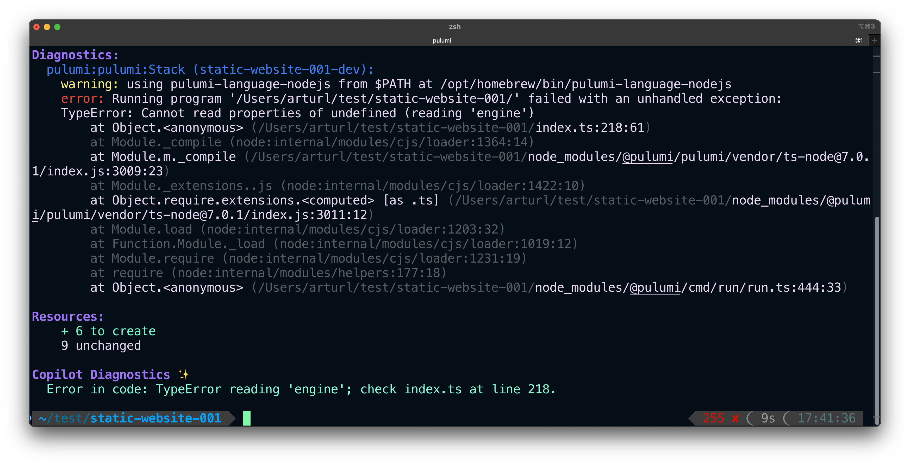
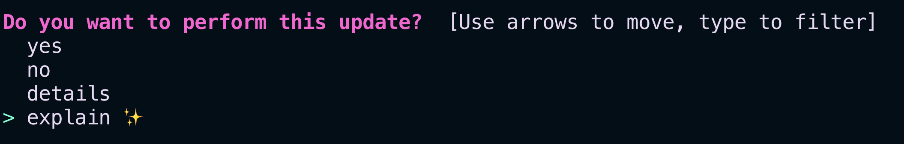

## Introducing AI-Powered insights in Pulumi CLI

At Pulumi, we're committed to helping you deploy infrastructure efficiently and with minimal friction. Infrastructure updates often present two key challenges: deciphering complex error diagnostics and understanding exactly what changes will occur during deployment.

Traditional error messages, while comprehensive, often bury the core issue within extensive diagnostics, requiring specialized expertise to interpret and address. Similarly, understanding the full scope of pending infrastructure changes can be difficult when reviewing raw update previews.
Our latest CLI update introduces AI capabilities that tackle both issues. The AI error analysis identifies root causes and provides clear, actionable guidance, transforming dense technical output into concise explanations.

Additionally, our new AI-powered update explanation feature serves as a valuable sanity check before deployment. It presents a plain-language summary of exactly what changes will occur, helping you verify that the planned modifications align with your intentions. This visibility is particularly valuable when managing complex infrastructure, as it helps identify unexpected changes or potential drift between your code and deployed resources. The system also proactively flags potential issues such as security vulnerabilities or destructive updates that might impact your production environment.

## Diagnostics summarization

Consider the following scenario where a program fails at runtime. While the standard diagnostics provide precise and detailed information, they can be time-consuming to analyze. Our AI-powered summary identifies the problem and its location in your source code, reducing time to resolution and helping you address issues efficiently:

<div style="text-align: center; width: 100%; margin: 0 auto;">
    
    <figcaption>
        <i>Auto-summarization of pulumi preview</i>
    </figcaption>
</div>

## Update explanation

We've introduced a new "explain" menu item in the CLI. When selected, this tool analyzes and provides a clear summary of all changes in your pending infrastructure update:

<div style="text-align: left; width: 80%; margin: 0; padding: 0;">
    
</div>

The image below shows an example of the tool's output. The explanation provides a concise summary of the pending changes and highlights any potential concerns related to your update, giving you greater visibility before deployment:

<div style="text-align: center; width: 100%; margin: 0 auto;">
    
    <figcaption>
        <i>Auto-summarization of pulumi preview</i>
    </figcaption>
</div>

## What's next

The feature is currently in preview. You will need to add the --copilot flag to your pulumi CLI command to enable it:

```bash
pulumi up --copilot
```

We will continue to monitor usage patterns and incorporate your feedback before enabling this feature by default. We're excited to see how these AI-powered insights enhance your infrastructure deployment workflow and welcome your thoughts on how we can further improve the experience.
