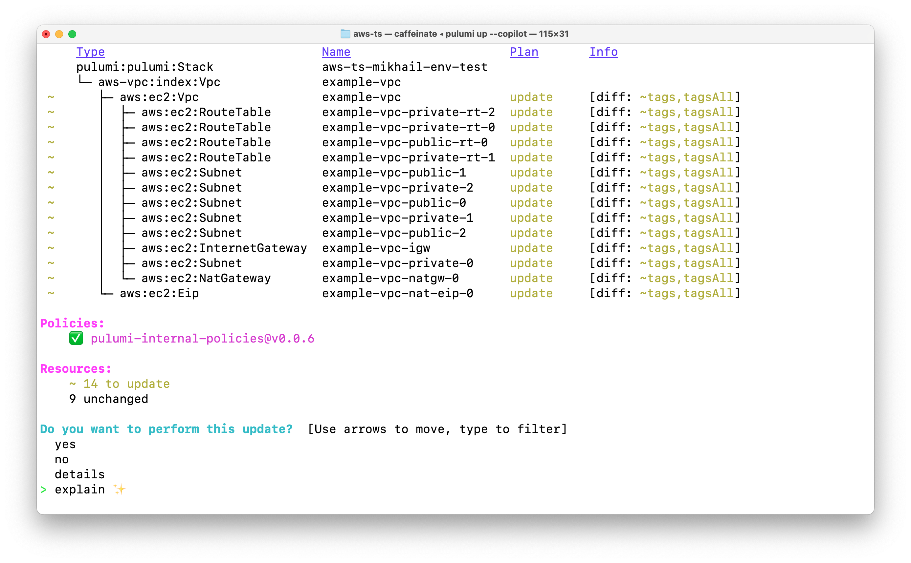
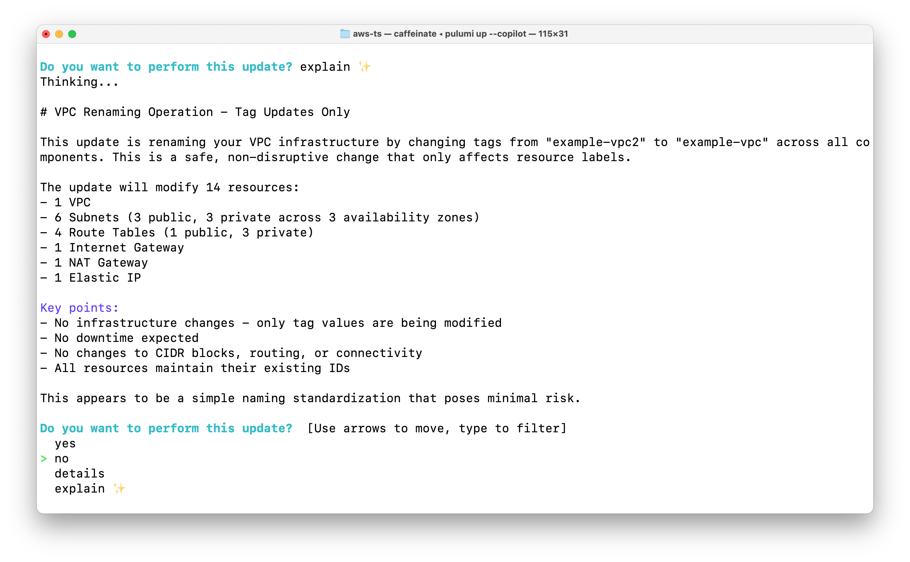
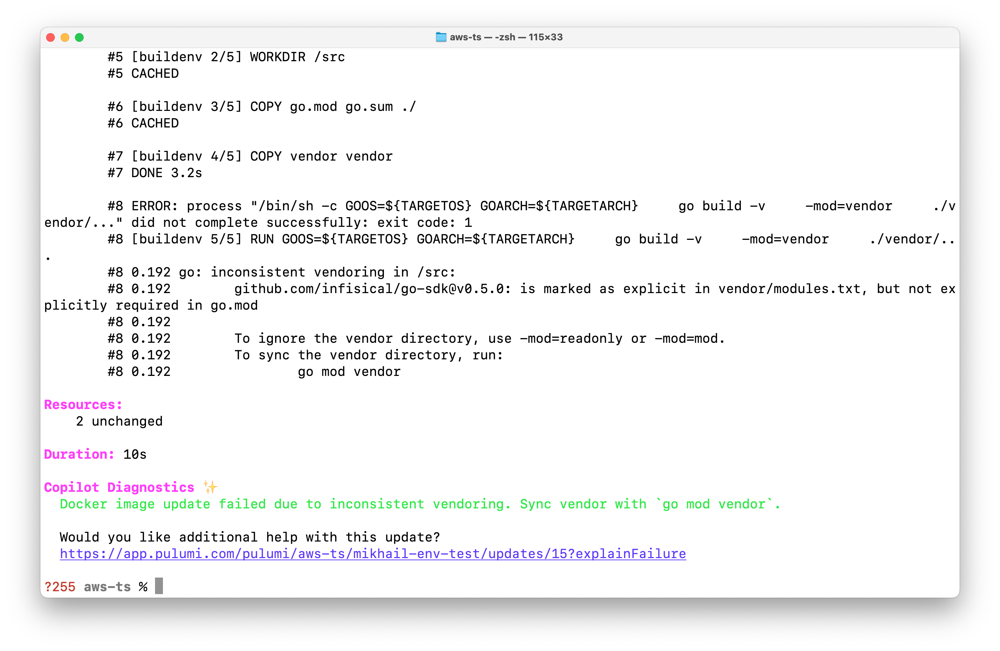

Pulumi CLI now features AI capabilities powered by Pulumi Copilot that translate complex infrastructure changes into clear, human-readable explanations and help resolve deployment errors with actionable guidance. Enable these preview features with the `--copilot` flag.

<!--more-->

At Pulumi, we're committed to helping you deploy infrastructure efficiently and with minimal friction. Anyone who has worked with cloud infrastructure knows the frustration of sifting through large previews with numerous changes and the difficulty of interpreting cryptic error messages from cloud provider APIs when deployments fail.

There are two key challenges we've identified:

1. **Understanding Preview Changes**: Reviewing raw update previews can be overwhelming, especially for complex deployments with many resources. It's difficult to quickly grasp the full scope and impact of pending infrastructure changes.

2. **Interpreting Error Messages**: When deployments fail, cloud providers often return error messages that, while comprehensive, bury the core issue within extensive diagnostics, requiring specialized expertise to interpret and address.

Our latest CLI update introduces AI capabilities that tackle both issues. Let's explore how these new features improve your infrastructure management workflow.

## Update Explanation

To address the first challenge above, we've introduced a new "explain" menu item in the CLI. When running pulumi preview or `pulumi up` with the `--copilot` flag, you'll see this option in the interactive menu:



In this screenshot, you can see the standard Pulumi update preview showing an AWS VPC with multiple subnets, route tables, and gateways that need to be updated. The interactive menu at the bottom shows the new "explain" option with a sparkle emoji, indicating the AI-powered feature.
When selected, this tool analyzes and provides a clear summary of all changes in your pending infrastructure update:



In this example, the AI explanation immediately identifies that this is a "VPC Renaming Operation - Tag Updates Only" and explains that the update is simply changing tags across all components. It clearly states this is a "safe, non-disruptive change that only affects resource labels."

This explanation serves as a valuable sanity check before deployment. It presents a plain-language summary of exactly what changes will occur, helping you verify that the planned modifications align with your intentions. This visibility is particularly valuable when managing complex infrastructure with many resources, as it helps identify unexpected changes or potential drift between your code and deployed resources. The system also proactively flags potential issues such as security vulnerabilities or destructive updates that might impact your production environment.

## Diagnostics Summarization

For the second challenge, when infrastructure deployments fail, cloud providers often return error messages that are technically accurate but difficult to decipher without specialized knowledge. Consider the following scenario where a Go-based Docker image build fails with vendoring issues:



In this example, the standard Go build process failed with a cryptic error about inconsistent vendoring. While the raw output does contain the necessary information, it's buried within extensive build logs. Our AI-powered Copilot diagnostics immediately identifies the problem and provides a clear, actionable solution: "Docker image update failed due to inconsistent vendoring. Sync vendor with 'go mod vendor'."

This clear explanation identifies root causes and provides actionable guidance, transforming dense technical output into concise explanations. It reduces time to resolution by pinpointing both the problem and the exact command needed to fix it, eliminating the need to search through documentation or guess.

## What's next

The AI-powered features are currently in preview. You can enable them by adding the `--copilot` flag to your Pulumi CLI commands:

```bash
pulumi preview --copilot
pulumi up --copilot
```

During this preview period, we're focused on:

- Refining explanations based on user feedback
- Adding new capabilities like suggesting fixes for common errors
- Improving performance to ensure minimal impact on command execution time

We will continue to monitor usage patterns and incorporate your feedback before enabling these features by default.

## Share your feedback

We're excited to see how these AI-powered insights enhance your infrastructure deployment workflow! Please share your experiences with us:

- Connect with us in the [Pulumi Community Slack](https://slack.pulumi.com)
- Open an issue on [GitHub](https://github.com/pulumi/pulumi)
- Learn more about [Pulumi Copilot](http://pulumi.com/copilot)

Try this today, [Get Started with Pulumi for free](https://pulumi.com/start)

Your input will directly influence how we evolve these features from preview to general availability.
