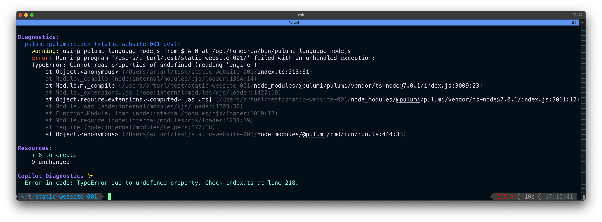

## Introduction

<!--
Explain the problem, why do we need it
Summary: the errors are very detailed and it's hard to zero in on what's really going on
Update explanation: want to validate that what you expect to happen is what is actually happening
-->

## Examples

Here the original error is precise and detailed, but the Copilot Diagnostics points directly to the problem, with the exact location of the issue in the source code.

    
    <figcaption>
        <i>Auto-summarization of pulumi preview</i>
    </figcaption>

<!--
Show examples of usage
-->

## What's next

<!--
We're looking for more ways to help developers be productive and reduce time to resolution. AI is only a tool and we will continue to lean into it to help developers.
-->
