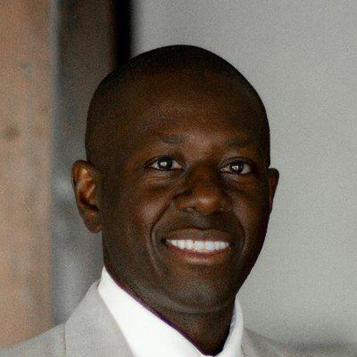
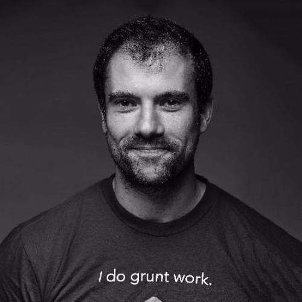

The cloud offers fundamentally new capabilities and ways of developing software. In the mid-2000s, the cloud was focused on increasing compute through providing Infrastructure as a service. By the early to mid 2010's, the major cloud providers were established and migration to containers changed the landscape yet again. The initial efforts to migrate workloads to the cloud used “lift and shift” and virtual machine techniques did not take full advantage of the emerging cloud architecture.

<!--more-->

As we enter the third decade of cloud, we’re seeing a sea change as teams reorganize and reimagine the way value is delivered through software to take advantage of the infinite scale at their fingertips:

Modern cloud engineering looks like this:

- Cloud native architectures that can transcend individual providers
- Microservices replacing monolithic applications
- Continuous Delivery
- 100% uptime
- Automatic scale
- Secure by default.

## All the Ops

Today, teams must ship software where the complexity is far greater -- thanks to many FOSS tools and cloud native platforms that form the building blocks of modern applications and services. They’re shipping at orders-of-magnitude faster than their predecessors with continuous deliver – often many times per day. Add to this dozens or even hundreds of microservices being updated with each deployment. This has led to a multiplicity of *Ops; DevOps, DevSecOps, FinOps, GitOps, TestOps, NetOps, CoudOps, just to name a few. Every *Ops addresses a technical and cultural facet that attempts to address "how do we ship at this scale, complexity and speed with high availability and security?"

Despite these challenges, the opportunity is far greater. Teams don’t have to build a load balancer or automatic failover or even global availability -- these hard problems were solved by cloud providers and the open source efforts to define cloud native architectures and tooling. The challenge is how to stitch these capabilities together and leverage them effectively for your applications and services. This is where innovation is happening and this is the green field of cloud engineering.

To make the most of these opportunities, cloud engineering teams are emerging with four key capabilities for team members that now work shoulder to shoulder (virtually) to deliver new services and software capabilities:

**Development**
Software engineers bring test-driven techniques and rapid iteration to cloud infrastructure. This is driven by the need for infrastructure to keep pace with rapid application development.

**Operations**
Operators need to tackle everything from service architecture to operating costs to ensure that new services are scalable and can do so efficiently and cost-effectively.  On top of that, there are probably still physical servers on prem that need to be integrated with this growing constellation of cloud services.

**Reliability**
SREs implement robust release processes and observability to ensure that production never goes down, ever. The complexity of processes necessitates greater automation, as SRE's have an ever increasing number of resources under management.

**Security**
It’s no longer enough to do a security review before a release -- rather, security best practices have to be baked into app and infrastructure design from the beginning and verified across many deployments per day in a secure software supply chain.

It's time, as an industry, that we come to a consensus of how these complementary cloud Ops integrate and address the challenges of cloud engineering. This effort is much more than playbooks and best practices, cloud engineering attempts to bring all facets of the cloud into an ongoing collaborative framework.

## Cloud Engineering Summit

This month, Pulumi is launching the first-ever Cloud Engineering Summit, in partnership with industry and community experts. Our focus will be on  ways  modern teams are leveraging the cloud to innovate faster than ever before during a period of unprecedented disruption. We’ll also highlight the modern architectures and modern workflows that cloud engineering teams are using to collaborate better, manage complexity and achieve unprecedented scale

The summit brings together cloud engineering leaders and practitioners to share best practices and end-user stories on a broad range of topics with over 23 sessions and 40+ speakers This summit will equip you and your organization to achieve the next level of cloud velocity, innovating faster than ever before, informed and inspired by real-world expertise.

Here is just a sample of the sessions that you don't want to miss:

    

        

            

                
            

            

                
            

        

        

            

                
            

            

                
            

        

    

    

        <b>Future of Cloud Engineering: Architectures and Platforms</b>
        <ul style="list-style-type:none;">
            <li><b>Joe Beda</b>, Principal Engineer, VMWare</li>
            <li><b>Al Sene</b>, VP of Engineering, Digital Ocean</li>
            <li><b>Corey Scobie</b>, CTO, Chef</li>
            <li><b>Jason Warner</b>, CTO, GitHub</li>
            <li>Moderator: Luke Hoban</li>
        </ul>
    

    

        

            

                
            

            

                
            

        

        

            

                
            

            

                
            

        

    

    

        <b>Future of Cloud Engineering: Security and Policy</b>
        <ul style="list-style-type:none;">
            <li><b>Maya Kaczorowski</b>, Senior Director, Product Management, Software Supply Chain Security, GitHub</li>
            <li><b>Amit Gupta</b>, VP Business Development and Product Management, Tigera</li>
            <li><b>Johnathon Hunt</b>, VP of Security, GitHub</li>
            <li>Moderator: Eric Rudder</li>
        </ul>
    

    

        

            

                
            

            

                
            

        

        

            

                
            

            

                
            

        

    

    

        <b>Future of Cloud Engineering: Culture, Process, Tools</b>
        <ul style="list-style-type:none;">
            <li><b>Abby Kearns</b>, CTO, Puppet/li>
            <li><b>Amanda Silver</b>, CVP of Product for Developer Tools, Microsoft</li>
            <li><b>Johnathon Sullivan</b>, Co-founder and CTO, NS1</li>
            <li><b>Avi Cavale</b>, VP of Engineering, JFrog</li>
            <li>Moderator: Lee Zen</li>
        </ul>
    

    
        
        

            <b>Managing Your Cloud Application and Infrastructure Deployments in One CI/CD Pipeline</b>
            <ul style="list-style-type:none;">
                <li>Nenne Adaora (Adora) Nwodo, Software Engineer, Microsoft</li>
            </ul>
        

    

    
        
        

            <b>Testing Configuration with Open Policy Agent</b>
            <ul style="list-style-type:none;">
                <li>Gareth Rushgrove, Director of Product, Snyk</li>
            </ul>
        

    

    
        
        

            <b>Agility Requires Safety</b>
            <ul style="list-style-type:none;">
                <li>Jim Brikman, Co-founder of Gruntwork</li>
            </ul>
        

    

And many more …

This event would not have been possible without the participation and support of our top sponsors:

    

        

            

                
            

            

                
            

        

        

            

                
            

            

                
            

        

        

            

                
            

            

                
            

        

    

Reserve your spot at the [Cloud Engineering Summit](https://cloudengineering.heysummit.com/) today!
