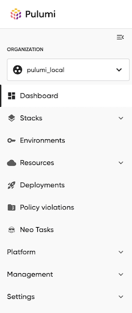

We’re excited to share a new update to Pulumi Cloud: a redesigned left-hand navigation that makes it faster and easier to find what you need. With this update, the most common workflows are now front and center, while related features are grouped in a way that better reflects how teams actually use Pulumi Cloud every day.

This change is all about helping you spend less time clicking around and more time building, deploying, and managing your cloud infrastructure.

<!--more-->

## Faster Access to What You Use Most

We’ve moved the most commonly used sections of Pulumi Cloud like **Stacks, Environments, and Resources** into the top-level navigation. That means the things you use most are always just one click away.

The redesigned navigation groups related features into four clear categories, each designed around the way infrastructure teams work:

- **Platform** includes all the IDP services that help you set up your infrastructure: defining services, configuring components and managing templates.
- **Management** groups together all the tools you use to configure the tools you use daily like: accounts, policies and deployments. It also includes the tools used to monitor the interactions with the Pulumi platform like: approvals and audit logs.
- **Settings** lists the tools you use to configure how the Pulumi platform needs to work for your organization including: billing and usage, access management and integrations.

These categories help to reduce clutter and give each section a clear purpose, so you always know where to go.

## What’s Changed and Where to Find It

Several important updates make the new navigation cleaner and more intuitive:

- **Deployment Runners merged into Deployments**: Deployment Runners are now integrated into the Deployments section. This unifies deployment tasks and their configuration in one place.
- **New Project integrated into Projects/Stacks**: Instead of a separate menu entry, creating a new project is now handled by using the New Project button within the main Stacks page, reducing clutter and consolidating related actions.
- **Import integrated into Projects/Stacks**: Importing unmanaged resources into stacks can now be initiated directly from the main Stacks page by selecting the Import button, better aligning aligning it with the overall stack management.
- **Customer Managed Keys integrated into Organization**: As an organization-wide setting, Customer Managed Keys are now located under the Organization tab.

These changes reduce redundant items, consolidate related tasks, and surface the most important workflows where you expect them.

## Cleaner Organization, Less Clutter

By consolidating related features, the left navigation UI is easier to scan and navigate. Infrastructure management tools like Stacks, Resources, Deployments and Policy Findings are grouped together, while IDP, platform configuration and organizational settings are streamlined under their own sections. The result is a navigation that mirrors how infrastructure teams actually work.

## Built for Teams at Scale

Pulumi Cloud is used by teams managing everything from a handful of resources to thousands across multiple clouds and environments. This navigation update scales with you, helping teams quickly navigate between the services they need without slowing down as usage grows.

At Pulumi, we believe infrastructure as code should accelerate, not slow down, how teams deliver in the cloud. By simplifying navigation and surfacing the most important actions, Pulumi Cloud becomes an even faster, more reliable place to manage your infrastructure.  

This update is another step toward our mission: enabling teams everywhere to build, deploy, and manage cloud infrastructure with greater speed, confidence, and joy.

## Try It Out

The new navigation is available today for all Pulumi Cloud users. Sign in to [Pulumi Cloud](https://app.pulumi.com) and experience the streamlined workflow for yourself. For more details, check out the [docs](https://www.pulumi.com/docs/).  

We’d love your feedback as we continue to make Pulumi Cloud the best platform for modern infrastructure as code.
