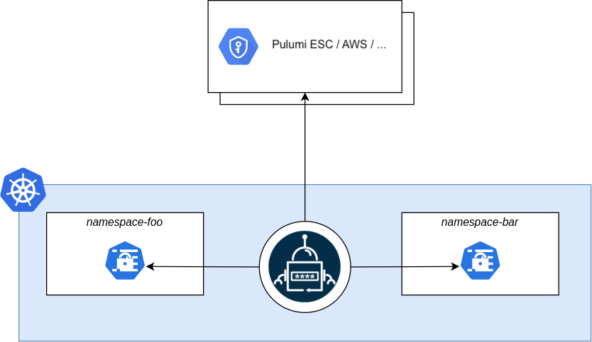
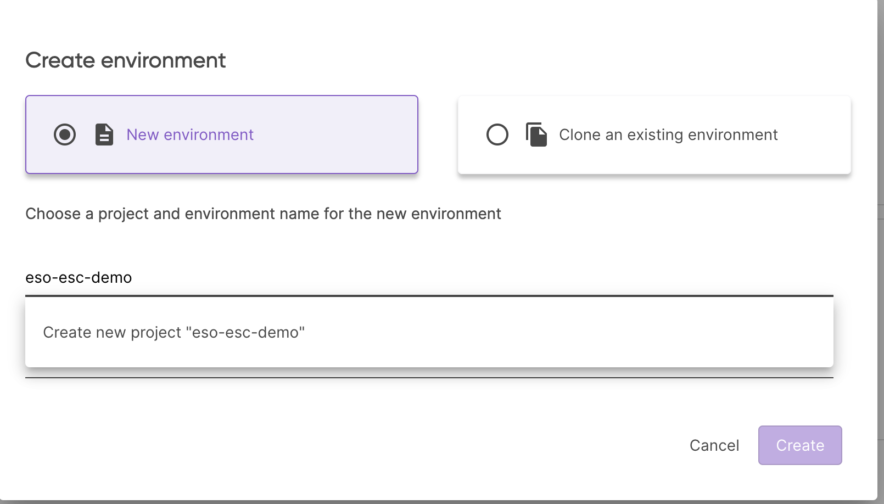
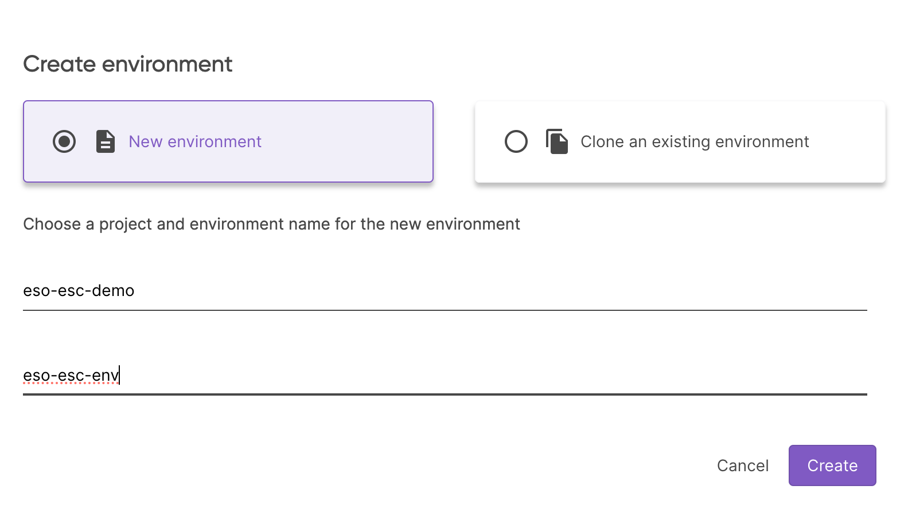
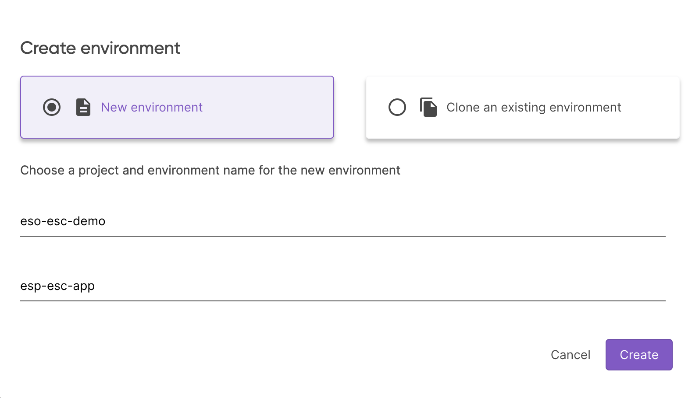
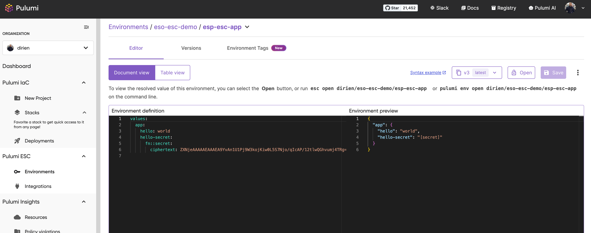

Managing secrets in a cloud-native environment can be challenging, but it is crucial for ensuring the security and integrity of any application or infrastructure. We encounter a lot of different types of secrets, from API keys, database passwords, and certificates to tokens and passwords. These secrets need to be stored securely and accessed by different services in a secure way without exposing any sensitive information to unauthorized users.

Here is where [Pulumi ESC](/product/secrets-management/) and External Secrets Operator come into play [by providing a secure and efficient solution](/docs/esc/integrations/kubernetes/external-secrets-operator/) for cloud-native secret management.

## Pulumi ESC (Environments, Secrets, and Configuration)

Pulumi ESC is our new secrets management & orchestration service for environments, secrets, and configurations. It can be used as part of your Pulumi IaC (Infrastructure as Code) projects using `pulumiConfig` to expose the stored values to your Pulumi stacks.

But it can also be used as a standalone service to manage secrets and configurations. Pulumi ESC provides support for applications through its dedicated SDKs built for different programming languages. It also provides a dedicated CLI, which can be used to manage secrets and configurations from the command line to provide a context for your CLI tools (e.g. `terraform`).

For more information on Pulumi ESC, you can check out the official [documentation](/docs/esc/).

## External Secrets Operator (ESO)

The Open Source project [External Secrets Operator](https://external-secrets.io/latest/) (ESO) is a Kubernetes operator that helps manage secrets in a highly secure and scalable way. ESO synchronizes secrets stored in external secret management systems like Pulumi ESC, HashiCorp Vault, AWS Secrets Manager, Azure Key Vault, and more into Kubernetes secrets. This approach allows us to control secret sprawl and centralize the management of secrets in a single place while providing a secure and controlled way to access them.

## Why Kubernetes secrets are not enough?

Kubernetes secrets are a great way to store sensitive information in a Kubernetes cluster. Kubernetes secrets are created and stored as a Kubernetes resource object and then used by pods or other resources inside the cluster.

Here is an example of a Kubernetes secret manifest file:

```yaml
apiVersion: v1
kind: Secret
metadata:
  name: mysecret
type: Opaque
data:
  username: YWRtaW4= # admin
  password: YWRtaW4= # admin
```

or using `kubectl`:

```bash
kubectl create secret generic mysecret --from-literal=username=admin --from-literal=password=admin
```

[Kubernetes secrets](https://kubernetes.io/docs/concepts/configuration/secret/) have several limitations. Here are the top ones:

- They are stored by default in `etcd` in base64 encoded format, which is not secure.
- They are created either manually by using `kubectl` commands or by using a manifest file, making them hard to manage at scale.
- Hard to manage and synchronize secrets across different environments and clusters.
- There is no default way to rotate secrets automatically.

ESO shines by tackling all the challenges listed and providing a way to manage secrets in a more secure and efficient manner. Benefits include:

- Mitigate security risks as secrets are stored in a secure external secret management system like Pulumi ESC, which provides more robust security features like encryption, access control, and auditing.

- Eliminate manual management of secrets by synchronizing them from external secret management systems into the Kubernetes cluster, reducing the need for manual intervention and minimizing the risk of human error.

- ESO provides a unified interface, making it easy to manage secrets across clusters and multi-cloud environments.

- ESO integrates with external secret management systems which ensure that access to secrets is tracked and an audit trail is maintained. This is crucial for security compliance and adhering to regulatory standards.

- Automate secrets rotation when the external secret management system has support it.

## External Secrets Operator architecture

The central part of the [ESO architecture](https://external-secrets.io/latest/introduction/overview/) is the extension of the Kubernetes API with a new [Custom Resource Definition (CRD)](https://kubernetes.io/docs/tasks/extend-kubernetes/custom-resources/custom-resource-definitions/), which defines where the secrets are stored and how they are synchronized into Kubernetes secrets. The ESO controller then retrieves the secrets from the external secret management system and creates or updates the Kubernetes secrets. Every time a secret is updated in the external secret management system, the ESO controller will synchronize the secret in the Kubernetes cluster and update the secret accordingly.



### Core resources of ESO

- `(Cluster)SecretStore`: Defines the external secret management system where the secrets are stored. It contains the necessary information to connect to the external secret management system, such as the endpoint, authentication credentials, and other configuration options. The `SecretStore` is namespaced while the `ClusterSecretStore` is cluster wide, which allows you cross-namespaced access to the secrets.

- `(Cluster)ExternalSecret`: Defines the secret that needs to be synchronized into the Kubernetes cluster. It contains the reference to the `SecretStore` and the secret key and how the data should be transformed and saved as a Kubernetes secret.

- `PushSecret`: With the PushSecret resource, you can push secrets from the Kubernetes cluster to the external secret management system. The Pulumi ESC provider for ESO supports this feature, which allows you to push secrets from the cluster into Pulumi ESC. This feature is useful when you create secrets through other means and want to synchronize them into Pulumi ESC to manage them centrally.

## How to Use Pulumi ESC and ESO Together

To demonstrate how to use Pulumi ESC and ESO together, we will store some secrets and configuration values in Pulumi ESC, then synchronize them into a Kubernetes cluster using ESO.

To follow along, you'll need the following prerequisites:

- A Kubernetes cluster (I will be using a local [KinD](https://kind.sigs.k8s.io/) cluster, but you can use any
  Kubernetes cluster)
- [Pulumi CLI](/docs/iac/download-install/) installed. You can also use the standalone [ESC CLI](/docs/esc/download-install/) to manage secrets and configurations.
- `kubectl` [CLI installed](https://kubernetes.io/docs/tasks/tools/) for some debugging

### Step 1: Install ESO and Link to Pulumi ESC

We will use Pulumi with the `pulumi-kubernetes` provider to deploy ESO into the Kubernetes cluster. The power of Pulumi ESC integration comes in two ways: First, to supply the Pulumi access token to ESO via Pulumi IaC, allowing the new ESO instance to access Pulumi ESC later. Second, to provide configuration and secrets from Pulumi ESC, via ESO, to the `PodInfo` application within the Kubernetes cluster.

```bash
pulumi new kubernetes-typescript --name eso-pulumi-esc
```

You should see the following output:

```bash
This command will walk you through creating a new Pulumi project.

Enter a value or leave blank to accept the (default), and press <ENTER>.
Press ^C at any time to quit.

Project description (A minimal Kubernetes TypeScript Pulumi program):
Created project 'eso-pulumi-esc'

Please enter your desired stack name.
To create a stack in an organization, use the format <org-name>/<stack-name> (e.g. `acmecorp/dev`).
Stack name (dev):
Created stack 'dev'

The package manager to use for installing dependencies npm
Installing dependencies...


added 310 packages, and audited 311 packages in 12s

44 packages are looking for funding
  run `npm fund` for details

found 0 vulnerabilities
Finished installing dependencies

Your new project is ready to go! ✨

To perform an initial deployment, run `pulumi up`
```

Head to Pulumi Cloud Console and create a new Pulumi ESC project with the name `eso-esc-demo`:



And the environment `eso-esc-dev`:



In the editor add the following yaml into the `Environment definition`:

```yaml
values:
  pulumiConfig:
    pulumi-pat:
      fn::secret: <your-pulumi-pat>
```

{}

Don't know how to create a PAT? Check out the official Pulumi [documentation](https://www.pulumi.com/docs/pulumi-cloud/access-management/access-tokens/).

{}

If you prefer to use the Pulumi CLI, you can create the environment by running:

```bash
pulumi env init <your-org>/eso-esc-demo/eso-esc-dev
``` 

And set the configuration by running the `env edit` command and copy the above YAML into the editor:

```bash
pulumi env edit <your-org>/eso-esc-demo/eso-esc-dev
```

Now, we need to link the Pulumi ESC project to the Pulumi IaC project. To do this, we need to add the following to your `Pulumi.dev.yaml`:

```yaml
environment:
- eso-esc-demo/eso-esc-dev
```

Now that all the wiring is done, we can deploy the ESO instance into the Kubernetes cluster. Open the `index.ts` file and add the following code:

```typescript
import * as k8s from "@pulumi/kubernetes";
import * as pulumi from "@pulumi/pulumi";

const config = new pulumi.Config();

// Create a Kubernetes namespace
const ns = new k8s.core.v1.Namespace("external-secrets", {
    metadata: {
        name: "external-secrets",
    },
});

// Deploy a Helm release into the namespace
const externalSecrets = new k8s.helm.v3.Release("external-secrets", {
    chart: "external-secrets",
    version: "0.10.4", // Specify the version of the chart
    namespace: ns.metadata.name,
    repositoryOpts: {
        repo: "https://charts.external-secrets.io",
    },
});

// Deploy a secret into the namespace
const mySecret = new k8s.core.v1.Secret("my-secret", {
    metadata: {
        namespace: ns.metadata.name,
        name: "pulumi-access-token",
    },
    stringData: {
        "PULUMI_ACCESS_TOKEN": config.require("pulumi-pat"),
    },
    type: "Opaque",
});

// Export the namespace name
export const namespaceName = ns.metadata.name;

// Export the Helm release name
export const helmReleaseName = externalSecrets.name;
```

Deploy the stack by running:

```bash
pulumi up
```

And you should see that the secret was created in the Kubernetes cluster and the ESO instance was deployed successfully.

```bash
kubectl get secret -n external-secrets pulumi-access-token -o jsonpath='{.data.PULUMI_ACCESS_TOKEN}' | base64 -d
```

### Step 2: Create an External Secret

Now, we will create a secret in the Pulumi ESC project and synchronize it into the Kubernetes cluster by creating an ESO reference to the external secret.

Create a new ESC environment called `esp-esc-app` in the `eso-esc-demo` ESC project.



Add the following YAML into the `Environment definition`:

```yaml
values:
  app:
    hello: world
    hello-secret:
      fn::secret: world
```

If you prefer to use the Pulumi CLI, you can create the environment by running:

```bash
pulumi env init <your-org>/eso-esc-demo/esp-esc-app
```

And set the configuration by running the `env edit` command and copy the above YAML into the editor:

```bash
pulumi env edit <your-org>/eso-esc-demo/esp-esc-app
```

Either way, you should see following environment configuration in the Pulumi Cloud Console:



We can now create `ClusterExternalSecret` in the `index.ts` and reference the ESC secret.

```typescript
import * as k8s from "@pulumi/kubernetes";
import * as pulumi from "@pulumi/pulumi";

// cut for brevity

const crd = new k8s.apiextensions.CustomResource("cluster-secret-store", {
    apiVersion: "external-secrets.io/v1beta1",
    kind: "ClusterSecretStore",
    metadata: {
        name: "secret-store",
    },
    spec: {
        provider: {
            pulumi: {
                organization: pulumi.getOrganization(),
                project: "eso-esc-demo",
                environment: "esp-esc-app",
                accessToken: {
                    secretRef: {
                        name: mySecret.metadata.name,
                        key: "PULUMI_ACCESS_TOKEN",
                        namespace: mySecret.metadata.namespace,
                    },
                },
            },
        },
    },
});
```

We can check that the secret was successfully synchronized by running:

```bash
kubectl get clustersecretstore secret-store -o jsonpath='{.status.conditions[?(@.type=="Ready")].status}'
```

### Step 3: Deploy an Application and Reference the Secret

Now, we can deploy an application that references the secret from the Kubernetes cluster. I am going to deploy the app called `PodInfo`, which is an application that exposes the pod information as an API. Add the following code to the `index.ts`:

```typescript
import * as k8s from "@pulumi/kubernetes";
import * as pulumi from "@pulumi/pulumi";

// cut for brevity
const podInfo = new k8s.helm.v3.Release("podinfo", {
    chart: "podinfo",
    version: "6.7.0",
    namespace: "podinfo",
    createNamespace: true,
    repositoryOpts: {
        repo: "https://stefanprodan.github.io/podinfo",
    },
    values: {
        extraEnvs: [
            {
                name: "FROM_ESC_VIA_ESO",
                valueFrom: {
                    secretKeyRef: {
                        name: "esc-secret-store",
                        key: "hello-secret",
                    }
                }
            },
            {
                name: "FROM_ESC_VIA_ESO_2",
                valueFrom: {
                    secretKeyRef: {
                        name: "esc-secret-store",
                        key: "hello",
                    }
                }
            }
        ]
    },
});

const externalSecretPodInfo = new k8s.apiextensions.CustomResource("external-secret-podinfo", {
    apiVersion: "external-secrets.io/v1beta1",
    kind: "ExternalSecret",
    metadata: {
        name: "esc-secret-store",
        namespace: podInfo.namespace,
    },
    spec: {
        dataFrom: [
            {
                extract: {
                    conversionStrategy: "Default",
                    key: "app",
                }
            }
        ],
        refreshInterval: "10s",
        secretStoreRef: {
            kind: clusterSecretStore.kind,
            name: clusterSecretStore.metadata.name,
        }
    },
});
```

This will deploy the `PodInfo` application and create an `ExternalSecret` resource that references the secret from the Pulumi ESC project. We mount the secret into the pod as an environment variable by using the `extraEnvs` field in the Helm chart.

{}

In a real-world application, you might use alternate ways to reference the secret, like mounting it as a volume or using `fromEnv` field in the Helm chart. It depends on your application and how you want to consume the secret.

{}

After deploying the stack, you should see that the `PodInfo` application is running. To access the application, we can `port-forward` the service by running:

```bash
kubectl port-forward svc/podinfo 9898:9898 -n podinfo
```

Our `PodInfo` demo application provides a large selection of different [endpoints](https://github.com/stefanprodan/podinfo) to interact with. We are interested in the `/env` endpoint to check if the secret was successfully mounted into the pod. Let's try that:

```bash
curl -s  localhost:9898/env | grep FROM
  "FROM_ESC_VIA_ESO=world",
  "FROM_ESC_VIA_ESO_2=world",
```

And here we see secret values from the ESC project, proxied by ESO, and passed to the PodInfo application as environment variables. That means the secret was successfully mounted into the pod and the application is running as expected.

### Step 4: Clean Up

After you are done with the demo, you can clean up the resources by running:

```bash
pulumi destroy
```

## Conclusion

The combination of Pulumi ESC and External Secrets Operator provides a secure and efficient way to manage secrets in a cloud-native environment, improving security, efficiency, and compliance when consuming secrets in your Kubernetes cluster. By using Pulumi ESC, you can manage secrets and configurations in a centralized way, and with ESO, you now have a streamlined process to synchronize secrets into your Kubernetes cluster.

Start using Pulumi ESC and ESO today by creating an account on the Pulumi Cloud Console and begin managing your secrets in a secure and efficient way.

<a class="btn btn-secondary" href="https://app.pulumi.com/signup" target="_blank">Create an Account</a>
